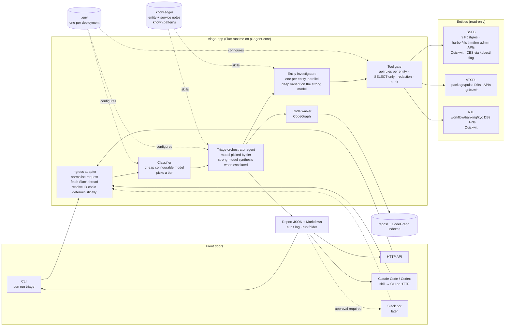

# 01. HLD: bird's-eye view

One sentence: a **Flue agent service** takes a triage request from any of several front doors, classifies it to pick a model tier, resolves identities across entities, fans out read-only investigation per entity, and returns a structured report to the caller, with every external touch going through gated tools that are configured only from `.env`.

## What each box is responsible for

| Box | Responsibility | Not responsible for |
|---|---|---|
| Front doors | Accept a request (free text, Slack thread URL, or structured JSON), show the result, optionally post it back to Slack **after explicit human approval** | Investigating anything |
| Ingress adapter | Turn any input into one `TriageRequest`; fetch the Slack thread and attachments with a bot token (or accept a thread file); **resolve the ID chain and basic state deterministically** so the classifier sees facts, not just the Slack tag; write the redacted input to the run folder | Reasoning about the problem |
| Classifier | Small, code-driven model call on a configurable model (Ollama, OpenAI, Anthropic, OpenRouter). Emits category, entities likely involved, the current ask, money-moved flags, and a **tier** (cheap / mid / strong). A deterministic policy finalises the tier and fails upward on doubt | Choosing tools |
| Triage orchestrator | One Flue agent. Its model is chosen from the tier. Plans from the ID chain, delegates to entity investigators and the code walker, drafts the report. When escalation triggers fire, the report is re-synthesised on the strong model | Free-form I/O to entities (it only has identity resolution and delegation) |
| Entity investigators | One subagent per **enabled** entity, bound to that entity in code so the model cannot switch entity, plus a deep variant on the strong model. Uses logs, SQL, admin-API and (SSFB) reversal-detection tools for that entity | Cross-entity reasoning (the orchestrator does that) |
| Code walker | Subagent on the strong model with CodeGraph and read-only repo tools | Any runtime data |
| Tool gate | Shared, unit-tested guard module that every I/O tool calls before touching the network: HTTP method decided by the ordered rules in `resources/{entity}.api.rules.json` (default: GET allowed, everything else blocked), SELECT-only via a SQL parser, host bound to `.env`, redaction of results, one audit line per call with `run_id` | Deciding *what* to look at |
| `.env` | Every host, credential, model id, feature flag. One file per deployment. **No variable name encodes prod or stage** | Structure (which services exist per entity lives in a small registry file) |
| `knowledge/` | The entity and service notes ported from triage-shivalik, fixed for contradictions, exposed to agents as Flue skills | Runtime config |

## Design rules that fall out of the survey

1. **No shell to the host for the model.** The current hook stack exists because Claude Code gives the model a host shell. The new agent mounts typed tools for every entity touch, plus a sandbox shell that has no host filesystem, no host environment and no network (Flue's virtual sandbox by default, E2B or Daytona by config, D45). There is nothing to hook because the shell cannot reach anything the tools do not hand it.
2. **Entity is a closure, not an argument.** An investigator for SSFB physically cannot query ATSPL. The orchestrator's only data access is a fixed identity-resolution tool.
3. **Mutations do not exist as capabilities.** A non-GET call happens only where a rule in the per-entity `api.rules.json` allows it, and that file is data reviewed in a PR, not a prompt instruction. The files ship empty, so v1 is GET-only everywhere; every known mutating endpoint is a POST or PUT and is denied by that default.
11. **One deployment-mode switch, nowhere else.** `TRIAGE_DEPLOY_MODE=local|server` is the only env var code branches on, and only in pre-flight (tunnel up, kube login, probes). Pre-flight warns, it never blocks a run.
4. **Logs first, never replay the call.** For the trigger endpoints we know about, the registry enforces it (rule 3). For everything else the gate cannot judge intent, so the orchestrator instruction carries the rule from the current `CLAUDE.md`.
10. **Investigation is scoped to the ticket's customer.** Id-shaped parameters must belong to the resolved ID chain unless the call is an explicit aggregate-only systemic check. Instructions smuggled in the Slack text cannot widen that.
5. **Point-in-time reads are labelled** with the time they were taken. The eval case that was graded "partial" failed on exactly this.
6. **Quickwit is fragile.** Concurrency per entity is capped in config (default 1) because a 10-worker fan-out took the SSFB instance down once.
7. **Everything is mockable, and mock is the default.** `TRIAGE_MOCK_MODE=true` makes every I/O tool return recorded fixtures; an operator turns it off deliberately for a real run.
8. **Redaction has two profiles.** The model sees the identifiers it needs to search with (account numbers, UTRs, phones); anything persisted or sent out is fully masked.
9. **Escalation is deterministic.** Low confidence, conflicting findings or money movement on a cheap run trigger a strong-model pass; the cheap model does not get to decide it did fine.

## What is explicitly out of scope for v1

- Any write or remediation action (trigger-delivery, sync-address, force-sign, DB updates). The report may *recommend* them.
- Batch/cohort and incident-impact modes (v2 candidates, see decisions D17).
- Grafana via Playwright, Serena, code-review-graph, headroom, ClickUp.
- Slack bot ingress (designed for, not built).
- Screenshot OCR beyond passing images to a multimodal model (open question Q12).
