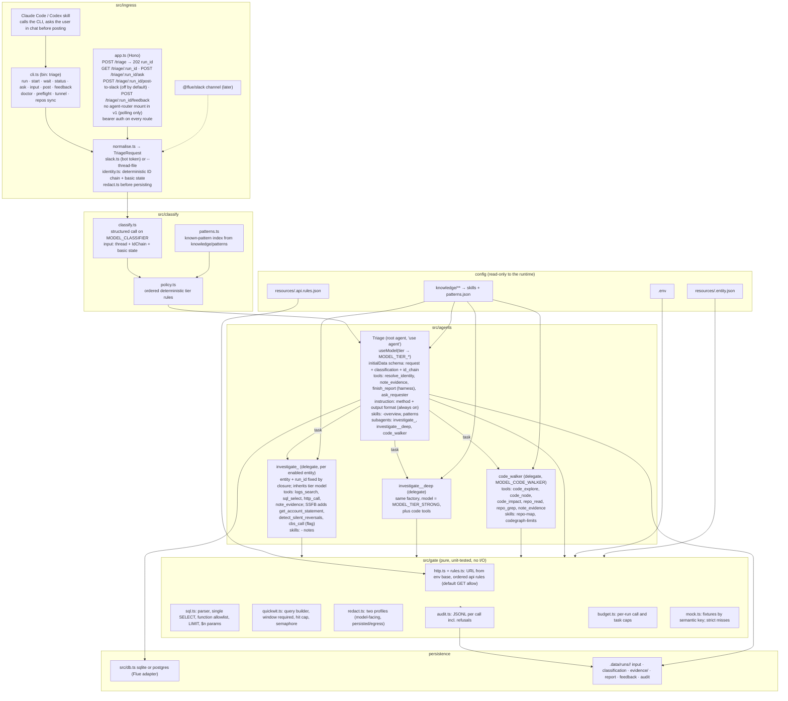

# 02. HLD: detailed components (agents, subagents, tools, skills, gates)

Framework: **Flue 2.x** (`@flue/runtime`) on Node ≥ 22.19, package management and scripts with Bun. Rationale and rejected options in [05-decisions.md](05-decisions.md) D1, D2. Revision 2 after the reviews in [07-review.md](07-review.md).



## 1. Agents

### 1.1 `Triage` (root agent, the only one with an HTTP surface)

- **Model**: `useModel(modelForTier(init.classification.tier_final))` with the tier's thinking level. `init` comes from `useInitialData()`, which Flue records once at instance creation and serves on every render, so this works on the first render and on follow-ups. `Triage.initialData` carries a Valibot schema so a create without data, or a raw HTTP create that skips the classifier, is rejected. `useModel` is submission-scoped, so the model is fixed for the run; escalation is by delegation and by the harness synthesis step (D10).
- **Instructions**: the triage method (evidence ladder, confidence rubric, "logs first, never replay the call", "label every point-in-time read with `taken_at`", "the current ask is the latest message", "a brief must contain ids, window, services, question, expected return") and the report format. Delivered via `useInstruction()` because it is always needed; skills are for on-demand knowledge only.
- **Tools**: `resolve_identity` (deterministic, fixed statements; the orchestrator re-runs it when a new id surfaces mid-run), `note_evidence`, `finish_report` (a `harness: true` tool, see §2) and `ask_requester` (one question at a time to the person who started the run, only when nothing else can unblock it; the run parks in `needs_input` until the answer arrives as a new submission, D53). The orchestrator has no free-form entity I/O.
- **Subagents**: for each enabled entity: `investigate_<entity>` (tier model) and `investigate_<entity>_deep` (`MODEL_TIER_STRONG`); plus `code_walker`. Names are unique per render, as Flue requires. The enabled set is every entity in `TRIAGE_ENTITIES` that the registry enables. `request.hints.entities` does not change what is mounted: the entities it names are listed in the instruction as where to start, because a case that starts in one entity often continues in another (onboarding crosses the RTL and SSFB copies of workflow-op; deposits and welcome letters reach ATSPL package-svc).
- **Skills**: `<entity>-overview` for each enabled entity (ID chain, service ownership, join keys) and `patterns`. Skill directory names are globally unique (`knowledge/ssfb-overview/`, `knowledge/rtl-workflow/`), because Flue names a skill after its directory and a duplicate name in one render throws. Skills are built at runtime with `defineSkill()` from `knowledge/**/SKILL.md` under `TRIAGE_HOME` (D42), not by static `SKILL.md` imports: Flue's build-resolved imports do not load in in-process test runners, and runtime loading lets `bun`, Vitest and promptfoo all boot the same agent. A unit test validates frontmatter, which is what the build step used to do.
- **Sandbox**: `useSandbox(sandboxFactory())` where the factory is picked from `TRIAGE_SANDBOX_PROVIDER` (D45, §2). Inherited by every delegate.
- **Persistent state**: `plan`, `evidence_index`, `escalation: {triggered, reasons[]}`, `finish_retries`, and `id_chain` (the run's chain as the last response left it, so ids added mid-run survive the next submission and a new process, D53).
- **Lifecycle**:
  - `useAgentStart`: writes `input.json` if absent (first submission) and stamps `run_id` into the tools' closure.
  - `useAgentFinish`: if `ctx.response.toolCalls` has no successful `finish_report` and no successful `ask_requester` (which parks the run, D53), append `{kind:'signal', type:'triage.finish_required', body:…}` once; on the second miss, throw, which settles the submission `failed` with the evidence folder intact.
  - Cost and per-model token usage are metered from `observe()` `turn` events, not from `useResponseFinish` (which only gives one aggregate).
- **Durability**: `Triage.durability = { timeoutMs: TRIAGE_RUN_TIMEOUT_MS, maxAttempts: TRIAGE_RUN_MAX_ATTEMPTS }`. Every tool honours `signal`.

### 1.2 `investigate_<entity>` (delegate, one per enabled entity)

- Built by `investigatorFor(entity, runId)` in a plain (non-`'use agent'`) module, so it is never registered as a top-level agent and never re-entered. Tools come from `toolsFor(entity, runId)`; the model never sees an `entity` or `run_id` parameter.
- **Model**: inherits the run's tier model (`model: undefined`).
- **Brief** (the `task` prompt) must be complete: delegates inherit nothing from the parent. The instruction text gives the orchestrator the brief template.
- **Tools**: `logs_search`, `sql_select`, `http_call`, `note_evidence`. SSFB adds the deterministic ports of today's scripts: `get_account_statement`, `detect_silent_reversals`, `encrypt_lookup_value` and `decrypt_fields` when a service's field key is set, `SSFB_HARBOR_FIELD_ENC_KEY` or `SSFB_RHYTHM_FIELD_ENC_KEY` (D34, D48), and `cbs_call` when `SSFB_CBS_VIA_KUBECTL_ENABLED=true`. A tool whose backing env var is blank is still mounted but answers "not configured for <entity>:<service>" so the investigator can record the gap instead of guessing.
- **Skills**: `<entity>-<service>` notes for the services in the registry (unique names such as `ssfb-harbor`, `rtl-workflow`).
- **Returns**: `EntityFindings` written via `note_evidence` to `evidence/<entity>.json`; the return text is a short summary. Fields: `evidence[] {source, at, query_or_path, summary, raw_ref}`, `timeline[]`, `hypotheses[]`, `confidence: high|medium|low`, `gaps[]`, `suggested_next_entity?`.

### 1.3 `investigate_<entity>_deep` (delegate)

Same factory with `model: MODEL_TIER_STRONG`, thinking `high`, plus the code tools. Used when the deterministic escalation rule fires (§4.3) or when the orchestrator judges an investigator's result insufficient. Replaces the earlier entity-less `deep_investigator`, which violated D3 and would have hit Flue's duplicate tool-name error.

### 1.4 `code_walker` (delegate)

- **Model**: `MODEL_CODE_WALKER` (blank = strong).
- **Tools**: `code_explore`, `code_node`, `code_impact` (CodeGraph CLI via `execFile`; no `code_callers`, D49), `repo_read`, `repo_grep` (path-jailed), `note_evidence`.
- **Skills**: `repo-map` (entity → repos, languages, shared libs, cbs-go is a library), `codegraph-limits` ("graph output is not evidence; no cross-repo edges; YAML and docs not indexed").
- **Returns**: `CodeFindings {claims: [{repo, file, lines, what_it_shows}], matches_known_pattern?, confidence}`.

### 1.5 Ingress identity step and classifier (not Flue agents)

Order in ingress: normalise → **resolve identity deterministically** (same code as the `resolve_identity` tool) → fetch basic state (harbor customer state, form status, account freeze; three fixed reads) → classify → policy → dispatch. Classifying after the id chain and state are known is what stops the Slack `Tag`/`Summary` from mis-tiering the run; the survey showed they are wrong often. In mock mode the identity step answers from fixtures like everything else.

- `classify.ts`: one structured-output call on `MODEL_CLASSIFIER` through pi-ai with schema validation. Invalid or unparseable output → `category: unknown`, `tier_final: strong`, `classifier_error` recorded. Images are attached when the classifier model is multimodal; otherwise `images_seen: false` is recorded and the report says screenshots were not analysed.
- `policy.ts`: ordered rules (§4.3). Both proposed and final tiers are saved.
- `patterns.ts`: loads `knowledge/patterns/patterns.json` and does a cheap signature match (regex on error text, service, category) to set `matched_pattern_id`.

Rejected alternative: a separate Flue `Classifier` agent (D9).

## 2. Tools

All `defineTool` with a Valibot object input and envelope output. Every I/O tool: honours `signal`, calls `budget.ts` first, then its gate, then `audit.ts`, then the model-facing redaction profile.

| Tool | Mounted on | Model-visible input | Gate | Output |
|---|---|---|---|---|
| `resolve_identity` | Triage | `{ids: Partial<KnownIds>, entity_hint?}` | fixed parameterised statements only; hop table in the LLD; also tries "UserId is actually a customer_id" and the guardian `device_id` branch | `IdChain` with per-hop status |
| `logs_search` | investigators, deep | `{service, message?, error?, terms?, fields?, from?, to?, level?, max_hits?, group_by?, normalize?, count?}` | `quickwit.ts`: builds one Quickwit query string from the typed input, then sends it over the entity's **transport** (D44): `http` → REST call to `<ENTITY>_QUICKWIT_URL` with the configured auth; `qw` → `execFile(QW_BIN, ['search', index, query, '--since', …, '-o', 'json', '--fields', …, '--context', <ENTITY>_QW_CONTEXT])`, fixed argv, no shell, query charset-checked (`count`/`group_by` map to `qw count`/`qw histogram`). The model cannot see or choose the transport. Window defaults to the request window and is always applied; `max_hits ≤ <ENTITY>_QUICKWIT_MAX_HITS`; per-entity semaphore; per-word AND on `error`; UUID first-segment rule; `normalize` ports the sim-binding message normalisation | hits or grouped counts, `taken_at` |
| `sql_select` | investigators, deep | `{service, sql, params?}` | `sql.ts` (§3) | rows, `row_count`, `taken_at` |
| `http_call` | investigators, deep | `{service, path, method?: 'GET', query?, body?}` | `http.ts` (§3): URL resolved against the service base and checked for same origin and segment-boundary prefix; then `rules.ts` evaluates `<entity>.api.rules.json` on the built path (first match wins; no match → GET/HEAD allow, else block); per-service auth header from the registry; `x-customer-id` set from the IdChain (charset-validated), never from the model; `service: finacle` refused here (no network route; use `cbs_call`) | status, body (size-capped), `taken_at`, `rule_index` |
| `get_account_statement` | `investigate_ssfb` | `{account_id, from?, to?, page?}` | fixed rhythm admin GET with pagination and the response-shape probing from `list_transactions.sh` | normalised transactions |
| `detect_silent_reversals` | `investigate_ssfb` | `{account_id, customer_id, since?, limit?}` | deterministic port of `transfer_lifecycle.sh`: `transfer_transactions` vs statement join; flags `REVERSED`, `NO_UTR`, orphans | table + flags |
| `encrypt_lookup_value` | any investigator whose entity has a service with `field_encryption` and its key set (SSFB: harbor, rhythm; D48) | `{service, value, kind: phone \| email \| cif}`; `service` lists only services with a key | AES-SIV (deterministic) with the key from env, so the ciphertext can be used as a `$n` param in `sql_select` against encrypted columns such as `customer.external_reference_id` or the phone fields; the key never leaves the tool | ciphertext string |
| `decrypt_fields` | same condition | `{service, values: string[]}` (max 20) | AES-SIV decrypt of column values the investigator already fetched; output passes through the **model-facing** redaction profile (PAN/passport masked, phone visible) and is masked again on persist by `note_evidence`; audit line records count, never plaintext | plaintext strings |
| `cbs_call` | `investigate_ssfb`, only when the flag is on | `{path, method?, body?}` | same `rules.ts` evaluation with `service: finacle` (GET by default; POST only where a rule allows it); `path` must match `^/[A-Za-z0-9/_.\-]+$` (no query string, no `..`); `execFile('ssh', fixedArgs)` runs a **fixed** remote script from stdin, and the path, body and token travel as stdin data lines, never as remote argv and never through `sh -c`; the in-pod hop is the same shape; token minted on the bastion and cached under `.data/cache`; k8s coordinates from env | body |
| `code_explore` / `code_node` / `code_impact` | code_walker, deep | `{repo: enum, …}` | `execFile(CODEGRAPH_BIN, [...,'-p', repoPath, '--', query])`; repo enum from registries; query charset-checked; optional sync once per repo per run; output cap | CLI output |
| `repo_read` / `repo_grep` | code_walker, deep | `{repo: enum, path, range?}` / `{repo, pattern, glob?}` | realpath jail under `TRIAGE_REPOS_DIR/<repo>` with symlinks resolved first; `.git/` and dotfiles excluded; `repo_grep` is implemented in-process over the jailed tree (no external grep binary, so no option injection); size and match caps like Flue's built-ins | text |
| `note_evidence` | all | `EntityFindings \| CodeFindings` | schema; persisted profile redaction; writes `evidence/<entity or code>.json` | evidence id |
| `finish_report` | Triage (`harness: true`) | `Report` draft | schema; if `escalation.triggered` and tier ≠ strong, runs `harness.prompt(synthesisPrompt, {model: MODEL_TIER_STRONG, result: ReportSchema})` over the evidence folder and uses that result; egress redaction with check semantics; writes `report.md` + `report.json` | ack or refusal listing unmasked patterns |
| `ask_requester` | Triage | `{question, why, options?, free_text?}` | one open question at a time; `TRIAGE_MAX_ASKS_PER_RUN`, counted from the store; egress check with refuse semantics (an unmasked identifier is sent back to be rephrased, never masked); ingress names masked on store; audit line without the question text (D53) | `question_id`, `waiting`, and the instruction to stop |

**Sandbox** (D45): `Triage` calls `useSandbox()` once with the factory chosen by `TRIAGE_SANDBOX_PROVIDER=virtual|e2b|daytona`. Every delegate inherits it (Flue allows one sandbox per conversation and `useSandbox` throws in delegates). The six Flue tools `read`, `write`, `edit`, `bash`, `grep`, `glob` therefore exist on every agent, over the sandbox filesystem only. `virtual` (default) is just-bash in memory: coreutils, `jq`, `sqlite3`, `yq`, `xan`, and `python3` (CPython in WebAssembly) enabled; network off (`curl` has no allowed origin); no native binaries; resource limits set; wiped per message. Every row-returning tool (`sql_select`, `get_account_statement`, `logs_search`, `http_call`) also writes its full result as `/data/<call_id>.json` into the sandbox, so the model can join and filter there; the return value stays the capped summary. `local()` is refused in code and by the doctor. `e2b` and `daytona` are the remote backends; because they leave the machine, tools stage only **persisted-profile** text into them, so joins over unmasked ids work only on `virtual`. Sandbox output flows through the same model-facing redaction as any tool result.

Not mounted anywhere: generic `curl` to a host, `psql`, `git`, `gh`, `kubectl`, `ssh`, `qw` as a model command, Slack post. Flue's `instrument({observe, interceptor, dispose})` denies any tool name outside the union of the tools above, the six sandbox tools, and the framework's `task`, `activate_skill`, `read_skill_resource`, `finish`. It is a process-wide tripwire; it cannot see arguments.

## 3. The gate (`src/gate`)

Pure functions, no I/O, `bun test`.

- **`http.ts`**: `resolveBase(entity, service)` → registry → env. `buildUrl(base, path, query)`: first reject any `path` containing `..`, `%2F`/`%2f`, `%00`, control characters, a scheme or `//`; then `new URL(path, base)` and assert the result has the **same origin** as the base and its pathname starts with the base pathname **at a segment boundary**; query values are appended with `URLSearchParams`, never concatenated. Headers are set only by the tool (registry auth, `x-customer-id` from the IdChain after a `^[A-Za-z0-9\-]+$` check). Method policy is then decided by `rules.ts` over `<entity>.api.rules.json` (§4.4), always on the **built** canonical pathname, never on the model's string. Every known mutating endpoint today (`trigger-delivery`, `sync-address`, `trigger-customer-creation`, `debit-unfreeze`, bro `PUT …/rules/:check_id`, the TD calculator POSTs) is a POST or PUT, so the default deny covers them without any rule (D40). A `block` rule is only needed if a GET endpoint is ever found to mutate.
- **`sql.ts`**: parse with a Postgres parser. Exactly one statement; root `SELECT` or `WITH … SELECT` with no data-modifying CTE; no `INTO`, no locking clauses, no `LATERAL` over set-returning functions; `SET`, `RESET`, `SHOW` and any utility statement are refused, so the model cannot undo the session settings below. Functions are checked against an **allowlist** of ordinary built-ins (string, date, math, aggregates, JSON accessors); anything schema-qualified, any `pg_*`, `lo_*`, `dblink*`, `set_config`, `query_to_xml`, `xpath`, and any unknown or set-returning function in the target list is refused. Casts are allowed only to ordinary scalar types. Wrap as `SELECT * FROM (<sql>) _capped LIMIT $cap`. Params bound as `$n`, never interpolated.
  **Every call is its own transaction** (D33): `BEGIN READ ONLY; SET LOCAL statement_timeout = <TRIAGE_SQL_STATEMENT_TIMEOUT_MS>; SET LOCAL lock_timeout = <TRIAGE_SQL_LOCK_TIMEOUT_MS>; <wrapped select>; COMMIT`. Postgres enforces `READ ONLY` server-side whatever the role's privileges are: INSERT/UPDATE/DELETE/MERGE/COPY-to-table, DDL, GRANT and TRUNCATE are rejected inside the transaction, while `SET LOCAL` of timeouts is allowed. On a reader (hot-standby) node the session is already read-only; `BEGIN READ ONLY` and the two `SET LOCAL`s are accepted there too, so the same code path serves the RDS reader endpoints and any primary. The connection string additionally carries `options=-c default_transaction_read_only=on` as a belt-and-braces default.
  **Role check**: `triage doctor` runs `has_table_privilege(current_user, <known table>, 'INSERT')` per DB and **warns** when it is true (the role can write). It blocks real mode for that entity only when `TRIAGE_REQUIRE_READONLY_DB_ROLE=true`. Default is warn, so ATSPL and RTL work before infra provisions read-only roles (Q6, Q23); the server-side boundary until then is the read-only transaction plus the parser.
- **Scope rule (`scope.ts`)**: every id-shaped parameter (UUID, account number, form id, phone) passed to `sql_select`, `http_call`, `logs_search` or `cbs_call` must be in the run's IdChain set, or the call must be flagged `scope: 'systemic'`, in which case `sql_select` accepts only aggregate-only select lists (parser check) and `logs_search` only `count`/`group_by`. Out-of-scope ids are audited as `deny`. This binds the investigation to the ticket's customer and blunts instructions smuggled in the thread text.
- **`quickwit.ts`**: builds the query from typed fields; terms are escaped for the Quickwit query language; field names are allowlisted per entity from the registry; a query with no selective term (`service` alone) is refused.
- **`redact.ts`**: two profiles. **Model-facing**: masks PAN, passport, card numbers and email local parts; leaves account numbers, UTRs, phone numbers, UUIDs and names visible because the investigation needs them as search keys. **Persisted and egress**: everything above plus 6+ digit runs → `****last4`, phone, email, names collected by ingress from Slack profiles and the bot template fields (`Raised by`, `Owner`, customer name where present), and addresses matched by postcode patterns. The scanner **decodes before scanning** (URL-encoding, JSON escapes, base64 blobs above a length threshold) and runs on structured fields, not only on rendered Markdown. Free text written by the model (`reply_text`, `statement`) is treated as untrusted and scanned the same way. Residual risk: names and addresses not seen by ingress can pass; recorded in D24. UUIDs pass as identifiers (A11). Tier models may be Anthropic, OpenAI direct or local Ollama; OpenRouter only for the classifier (Q21, D41).
- **`audit.ts`**: `{run_id, ts, interface, entity, tool, decision: allow|deny, reason?, service?, target, transport: real|mock, summary_redacted, duration_ms, exit}`. `transport` is what the eval gate reads to prove no real I/O happened (D42). DSNs never appear; only env var names. The summary goes through the persisted profile. Written to `TRIAGE_AUDIT_LOG` and mirrored into the run folder.
- **`budget.ts`**: counts tool calls and `task` delegations per `run_id`; over `TRIAGE_MAX_TOOL_CALLS_PER_RUN` or `TRIAGE_MAX_TASKS_PER_RUN` every I/O tool refuses with "budget exhausted, finish with what you have".
- **`mock.ts`**: fixtures keyed by a **semantic key** per tool (`sql_select`: entity, service, table list from the parsed AST, sorted param values; `http_call`: entity, service, method, path template with ids substituted; `logs_search`: entity, service, sorted terms; identity: the ids), not by a hash of the raw input. `TRIAGE_MOCK_STRICT=true` makes a miss a loud tool error; evals always run strict. Covers Slack read and the doctor's probes too. Recording mode writes to `fixtures/_unreviewed/` (gitignored) after the persisted-profile redaction; a human moves a fixture into `fixtures/` after reading it (`triage fixtures review`). Nothing is auto-committed.

## 4. Configuration and policy

### 4.1 `.env` — see [`.env.example`](../.env.example)

No environment in any name. `TRIAGE_ENV_LABEL` is rendered, never read by logic; a unit test greps the source for any other use. Mock mode is on by default. `TRIAGE_HOME` tells the CLI where `.env`, `resources/` and `knowledge/` live, so it works from any working directory (Claude Code runs it from another workspace).

### 4.2 `resources/<entity>.entity.json`

```json
{
  "entity": "ssfb", "aliases": ["shivalik"],
  "services": {
    "harbor":   { "db": "SSFB_HARBOR_DB_URL", "api": "SSFB_HARBOR_API_URL", "quickwit_service": "harbor", "repo": "harbor", "customer_header": "x-customer-id",
                  "field_encryption": { "algorithm": "aes-siv", "key_env": "SSFB_HARBOR_FIELD_ENC_KEY" } },
    "cohort":   { "db": "SSFB_COHORT_DB_URL", "api": "SSFB_COHORT_API_URL", "quickwit_service": "cohort-service", "repo": "cohort-service" },
    "rhythm":   { "db": "SSFB_RHYTHM_DB_URL", "api": "SSFB_RHYTHM_API_URL", "quickwit_service": "rhythm", "repo": "rhythm", "customer_header": "x-customer-id" },
    "guardian": { "db": "SSFB_GUARDIAN_DB_URL", "api": "SSFB_GUARDIAN_API_URL", "quickwit_service": "guardian", "repo": "guardian" },
    "workflow": { "db": "SSFB_WORKFLOW_DB_URL", "quickwit_service": "workflow-op", "repo": "workflow-op", "note": "Shivalik copy; RTL copy is rtl:workflow" },
    "bro":      { "db": "SSFB_BRO_DB_URL", "api": "SSFB_BRO_API_URL", "auth": { "header": "Authorization", "scheme": "Bearer", "token_env": "SSFB_BRO_ADMIN_TOKEN" }, "quickwit_service": "bro", "repo": "bro" },
    "finacle":  { "api": "SSFB_CBS_GATEWAY_URL", "transport": "cbs", "note": "reachable only through cbs_call; same rules file applies" }
  },
  "quickwit_fields": ["service", "level", "message", "error", "raw_message", "timestamp", "x_req_id", "x_txn_id", "form_id", "x-customer-id"],
  "quickwit": { "transport": "SSFB_QUICKWIT_TRANSPORT", "index": "SSFB_QUICKWIT_INDEX", "max_concurrency": "SSFB_QUICKWIT_MAX_CONCURRENCY", "max_hits": "SSFB_QUICKWIT_MAX_HITS",
                "http": { "url": "SSFB_QUICKWIT_URL", "auth": "SSFB_QUICKWIT_AUTH", "token": "SSFB_QUICKWIT_TOKEN" },
                "qw":   { "context": "SSFB_QW_CONTEXT" } },
  "cbs": { "enabled_flag": "SSFB_CBS_VIA_KUBECTL_ENABLED" },
  "kube": { "context_env": "SSFB_KUBE_CONTEXT", "aws_profile_env": "SSFB_AWS_PROFILE" },
  "repos_extra": ["shivalik-cbs-go", "go-commons", "prod-ssfb-aspora-argo"]
}
```

Every entity registry carries a `kube` block (Q4: three entities, three contexts). In v1 only SSFB has a transport that uses it (`cbs`); the block exists so the pre-flight can run the login per entity (§7) and so a future in-cluster transport for another entity does not need a schema change.

A listed env var that is blank disables that capability and is reported by `triage doctor`; a listed var that is missing entirely is a startup error. HTTP method policy is **not** in this file; it lives in `<entity>.api.rules.json` (§4.4).

### 4.3 Tier policy (ordered; first matching rule wins for the floor, later rules may only raise)

| # | Rule | Effect |
|---|---|---|
| 1 | classifier output invalid or `category = unknown` | `strong` |
| 2 | category ∈ {beneficiary, funding_in, systemic} or `misdirected_funds` flagged | `strong` |
| 3 | `confidence < 0.6` | `strong` |
| 4 | `money_moved` | at least `mid` |
| 5 | `matched_pattern_id` set and the pattern is marked `stable` in `patterns.json` | may lower one tier, floor `cheap`, never below rule 4's floor |
| 6 | the thread has image attachments and the chosen tier's model has no image input (pi-ai model metadata `input` lacks `image`) | raise to the first tier whose model accepts images; recorded as `tier_raised_for_images`. `MODEL_TIER_STRONG` must accept images, checked by `triage doctor` (D36) |
| 7 | caller `--tier` | override, recorded as `tier_override_by`; if that model cannot take images the report says so instead of silently dropping them |

Thresholds are initial values to tune with evals. `stable` is set by whoever curates `patterns.json`, in a PR.

**Deterministic escalation during the run** (`escalation.triggered`): any `EntityFindings.confidence = low`, two entities with conflicting hypotheses, `money_moved` on a non-strong run, or budget exhaustion before a root cause. When triggered, `finish_report` runs the strong-model synthesis pass (§2) regardless of what the cheap orchestrator wrote.

### 4.4 `resources/<entity>.api.rules.json` (the only place HTTP policy lives)

One ordered list of rules per entity. It replaces both the earlier allowlist and the `never_call` list. Shape as you proposed, with `reason` optional:

```json
[
  { "service": "harbor", "method": "GET", "api": "/admin/v1/forms/:form_id/trigger-customer-creation", "action": "block",
    "reason": "mutating trigger; the report may recommend it, the agent never calls it" },
  { "service": "harbor", "method": "*",   "api": "/admin/v1/customers/:customer_id/sync-address",      "action": "block" },
  { "service": "harbor", "method": "*",   "api": "/admin/v1/customers/:customer_id/trigger-delivery",  "action": "block" },
  { "service": "harbor", "method": "*",   "api": "/admin/v1/digital-forms/:form_id/force-sign",       "action": "block" },

  { "service": "bro",     "method": "POST", "api": "/dashboard/api/v1/dry-run", "action": "allow",
    "reason": "evaluates rules without persisting" },
  { "service": "bro",     "method": "POST", "api": "/admin/api/v1/stp-engine/clients/harbor_client/hooks/reference-query", "action": "allow",
    "reason": "exact path on purpose: sibling admin endpoints mutate" },
  { "service": "bro",     "method": "*",    "api": "/admin/api/v1/stp-engine/rules/*", "action": "block",
    "reason": "PUT …/rules/:check_id exists and must never be called; block the whole subtree on every method" },

  { "service": "finacle", "method": "POST", "api": "/custom/api/*",         "action": "allow", "reason": "custom-script reads" },
  { "service": "finacle", "method": "POST", "api": "/api/channel/v1/custom/*", "action": "allow" }
]
```

**Evaluation** (`gate/rules.ts`, pure, unit-tested):

1. The tool builds the URL from `<ENTITY>_<SERVICE>_API_URL` (or the CBS gateway for `finacle`) and canonicalises the pathname (§3 `http.ts`). Matching runs on that pathname, never on the model's string. Query strings are not part of matching. `api` templates are relative to the service base: the base URL's path prefix (`/harbor` for a base ending in `/harbor`) is stripped before matching, as in the examples above. http_call refuses every call to a service whose rules include a template that starts with that prefix, so a rule written for the full pathname fails closed instead of silently missing.
2. Rules are evaluated **top to bottom; the first rule whose `service`, `method` and `api` all match decides** (`allow` or `block`).
3. **No match → GET and HEAD are allowed, every other method is blocked.** That is the whole default policy; the file only lists exceptions in either direction.
4. `method`: an upper-case verb or `*`. `service`: a registry service name or `*`.
5. `api`: a path template. `:name` matches exactly one non-empty segment. A trailing `/*` matches any suffix at a segment boundary (`/custom/api/*` matches `/custom/api/x/y`, not `/custom/apix`). `*` alone matches every path. Otherwise the template must match the whole path, segment for segment.
6. Your examples read as intended under these rules: `{harbor, GET, /api/v1/transaction/:id, block}` followed by `{harbor, *, /api/v1/transaction/:id, allow}` blocks the GET and allows every other method on that path; `{harbor, *, *, block}` as a later rule blocks everything else for harbor, GETs included; `{rhythm, POST, /api/v1/td-calculate, allow}` allows that POST and, by the default, every rhythm GET.

**Loader checks** (fail at startup, reported by `triage doctor`): unknown `service` for the entity; `action` not `allow|block`; a rule shadowed entirely by an earlier one (unreachable); duplicate rules; and an `allow` with `api: "*"` or with `method: "*"` on a `/*` template, which is refused as too broad unless the entry carries `"confirm_broad": true` and a `reason`. `reason` is optional but the doctor warns when an `allow` has none, because the reviewer of the PR needs it and it goes into the audit line.

**Audit**: every HTTP decision records `rule_index` (or `default`) and `action`, so a surprising block or allow can be traced to one line of this file.

**Migration**: the four entries of today's `allowed-non-get-requests.json` become the `bro` and `finacle` allow rules above; the four known harbor triggers and the bro `PUT rules` become block rules. ATSPL and RTL files start empty, which means GET-only.

**Policy note for you**: allowing a calculator POST such as `td-calculate` reverses a rule in the current workspace `CLAUDE.md`, which says the TD calculator and `POST /rhythm/v1/mobile/deposits/config` are still prod calls that must be read from logs, not re-issued. The rules file can express either policy; which one you want is Q25.

**Shipped content** (Q24, Q25, D40): all three rule files ship as `[]`. That means GET and HEAD everywhere, nothing else. The bro and Finacle non-GET entries from the old allow file are **not** carried over; they are added by PR when a case needs them, with a `reason`. The td-calculate example from the brief was illustrative and is not seeded.

### 4.5 `knowledge/`

```
knowledge/method/            → useInstruction text (always on), not a skill
knowledge/patterns/SKILL.md + patterns.json
knowledge/repo-map/SKILL.md, knowledge/codegraph-limits/SKILL.md
knowledge/ssfb-overview/SKILL.md, knowledge/ssfb-harbor/SKILL.md, knowledge/ssfb-rhythm/… 
knowledge/atspl-overview/…, knowledge/atspl-package/…
knowledge/rtl-overview/…, knowledge/rtl-workflow/…, knowledge/rtl-kyc/…, knowledge/rtl-banking/…
knowledge/frontend-routing/SKILL.md   (screen_type → workflowOwner → backend)
```

`patterns.json` entry: `{id, category, signature: {regex[], services[]}, entities[], query_recipe, tier_hint, stable, source_ref}`. Seeded from the service notes' known-issue sections, `refs/harbor-error-classification/taxonomy.json`, the FD buckets, and an explicit entry "remittance order (`/appserver/v3/order`): out of reach, escalate" so runs do not loop on it.

## 5. Interfaces

### 5.1 CLI (`triage`, on PATH; loads `.env` from `TRIAGE_HOME`)

```
triage run   (--slack-url <url> | --thread-file <json> | --text "…" [--ids k=v…]) [--entities …] [--tier …] [--json] [--wait]
triage start … --json          # same inputs, returns {run_id} immediately
triage wait   <run_id> [--timeout <s>] --json    # exit 4 with the question when the run is waiting on one; asks at a terminal
triage status <run_id> --json
triage ask    <run_id> "follow-up question"      # new submission on the same conversation
triage input  <run_id> ["answer"] [--question q1] [--ids k=v…] [--skip]   # answers the question a run is waiting on (needs_input) and resumes it (D53)
triage post   <run_id> [--yes --approved-by <who>]  # interactive y/N only when stdin is a TTY
triage feedback <run_id> --verdict correct|partial|wrong|pending [--actual-root-cause …] [--faster-path …]   # also writes an eval case draft to evals/_unreviewed/<run_id>/
triage fixtures review         # promotes fixtures AND eval cases from _unreviewed/ after a human has read them
triage evals [classifier|triage] [--repeat k]   # runs the promptfoo suites from the eval home (D42)
triage doctor                  # config + reachability; never reads customer data
triage preflight               # what `run`/`start` do first in local mode: tunnel up, kube login; warns, never blocks (D32)
triage tunnel up|status|down   # SSFB SSH forward helper; preflight calls `up` in local mode
triage repos sync [--repo …]   # checkout the branch from resources/repos.json, pull, codegraph sync (D37)
```

Built on `start({agents:[Triage], db: sqlite(...)})` + `init(Triage,{id: run_id}).dispatch({…, uid: null})` + `read()`. `start`/`wait` exist because a run takes minutes and coding agents' shell tools time out; `--thread-file` exists so a coding agent can fetch the thread with its own Slack tool when no bot token is configured.

### 5.2 HTTP (`src/app.ts`, Hono)

- `POST /triage` `{slack_url | messages[], ids?, entities?, tier?, requested_by}` + optional `Idempotency-Key` header (deduped in ingress, stored in sqlite) → `202 {run_id}`.
- `GET /triage/:run_id` → `{status, phase, classification, id_chain, report?}`, all through the egress redaction profile. Polling replaces streaming in v1.
- `POST /triage/:run_id/ask`, `POST /triage/:run_id/feedback`.
- A run parked on a question (`phase: needs_input`, D53) shows `status: running` here with no question, and `ask` is not refused while one is open. The web adapter (the record on `GET`, `POST /triage/:run_id/input`) is not built.
- `POST /triage/:run_id/post-to-slack` exists in code but is **disabled by default** (`TRIAGE_HTTP_ALLOW_SLACK_POST=false`), because a bearer holder asserting `approved_by` is not an approval. It is enabled only for the v2 Slack bot, where the approval is a Slack interaction verified by signature. In v1 the CLI is the only posting path.
- `createAgentRouter(Triage)` is **not mounted** in v1. The conversation stream carries model-facing tool results (account numbers, phones) and a generic router would expose creation and arbitrary-conversation reads behind one shared token. If streaming is wanted later, it is a redacted relay of `observe()` events under the same auth.
- Bearer auth via `TRIAGE_HTTP_AUTH_TOKEN` on every route; the server refuses to start without it. Known v1 limit: one shared token, so `requested_by` is self-declared and any holder can read any run. Per-caller tokens are a v2 item.

### 5.3 Claude Code / Codex

A skill shipped in this repo and installable into `~/.claude/skills/` and `.agents/skills/`. It says: run `triage start … --json`, poll with `triage wait`, show the report; if the user asks to share it, ask them in chat (AskUserQuestion in Claude Code) and then run `triage post <run_id> --yes --approved-by <user>`. Follow-ups use `triage ask`. A `needs_input` result carries the question; the skill puts it to the user with AskUserQuestion and relays their own words with `triage input` (D53). The skill requires a workspace that holds no entity credentials; if the coding agent runs inside a workspace that does, the one hook still worth shipping is a `PreToolUse(Bash)` rule that allows only `triage *` there.

### 5.4 Slack bot (later)

`@flue/slack` at `/channels/slack`. Each ask mints a new `run_id` (Flue ignores `initialData` on an existing instance, so one-thread-one-conversation would freeze the tier). Thread context is carried by ingress. An "Approve & post" interaction calls `POST /triage/:run_id/post-to-slack`.

## 6. Output

`Report` (schema in the LLD) adds, versus the team's current findings.md: `status` (`root_cause_confirmed | resolved | pending_user | pending_bank | inconclusive`), a structured `cx_answer {action_owner: user|backend|bank, money_safe: yes|no|unknown, should_retry: yes|no|wait, reply_text, escalate_to}`, and `suggested_fix[] {title, kind: curl|sql|manual, command, preconditions, verify_with}` (D35). The commands are for a human to run; the runtime never executes them, secrets appear only as `$VAR` placeholders, and the egress redaction check runs over them like any other report text. Markdown for humans, JSON for evals and the Slack formatter.

## 7. Operations

- **Deploy mode** (`TRIAGE_DEPLOY_MODE=local|server`, D32): the **only** env var that code branches on, and only inside `preflight.ts`. It says who owns the network path, not which environment this is; a stage and a prod `.env` can both be `local`. `local`: before a real run, pre-flight brings the SSFB tunnel up (`ssh -L`, D15 superseded), runs the per-entity kube login for entities whose transport needs it, checks `qw whoami --context <ctx>` for every entity on the `qw` log transport (not logged in → warning naming the `qw login` command to run) (`aws eks update-kubeconfig` / `aws sso login` with `<ENTITY>_AWS_PROFILE` and `<ENTITY>_KUBE_CONTEXT`), and probes each configured host. **Nothing here blocks the run**: every failure becomes a `preflight.warnings[]` entry shown to the caller and written into the report's gaps, and the affected tools answer "unreachable" during the run. `server`: pre-flight only probes; tunnel and network are the deployment's job. Mock mode skips pre-flight entirely.
- **Doctor**: env completeness per enabled registry, Quickwit transport per entity (`http`: reachability and auth mode; `qw`: binary on PATH, version, `qw whoami` for the context), `SELECT 1` per DB with the read-only role check (`has_table_privilege(current_user, <known table>, 'INSERT')`; true → warning, or a real-mode block for that entity when `TRIAGE_REQUIRE_READONLY_DB_ROLE=true`, D33), image input on `MODEL_TIER_STRONG` (D36), CodeGraph binary and indexes, repo branches versus `resources/repos.json`, tunnel status, which optional features are on, which tools would be mounted. Never reads customer data. Works in mock mode.
- **Repos** (`resources/repos.json`, D37): `[{repo, entities[], branch}]`, one entry per checked-out repo, `branch` defaulting to the repo's default branch. `triage repos sync` checks out that branch, pulls and runs `codegraph sync` (~50s, needs GitHub SSH). It runs outside the request path; the run only records the current commit per repo in the report. The doctor warns when a repo is on a different branch than listed.
- **Tunnel**: `triage tunnel up|status|down`; started by pre-flight in local mode, owned by infra in server mode.
- **Providers**: `src/models.ts` registers Ollama (and any gateway) with `setProvider` as a side-effect module imported by the agent module and the classifier, so `start()`, `vite build` and `flue run` all see it. `start()` is called without `providers` so it does not overwrite the registration.
- **Persistence** (D38): `src/db.ts` picks the Flue adapter from `TRIAGE_DB_PROVIDER=sqlite|postgres` and `TRIAGE_DB_URL` (a file path for sqlite, a DSN for postgres). Both are Flue ecosystem adapters (libsql, postgres). `read()` can re-attach after a crash.
- **Run store** (D43, detail in [proposals/P2](proposals/P2-pluggable-run-storage.md)): `src/runstore/` with a `RunStore` interface and two providers selected by the same `TRIAGE_DB_PROVIDER`: Postgres tables in a `triage` schema on `TRIAGE_DB_URL` with pgvector, or the folder provider at `.data/runs/<run_id>/` with brute-force cosine. Objects: run, submissions, evidence, reports, feedback, embeddings; audit stays in the JSONL. Everything stored is persisted-profile text. Embeddings (case card and request) are built after settle on `MODEL_EMBEDDING` (default local Ollama) and rebuilt with `triage runs reembed`. Prior cases reach only the orchestrator's initial data, as a structured projection, behind `TRIAGE_PRIOR_CASES` (default off). One store per deployment; retention by `TRIAGE_RUNS_RETENTION_DAYS`; `triage runs delete` clears the store only.
- **Approval** (D39): `TRIAGE_APPROVAL_MODE=cli` in v1 (interactive y/N, or `--yes --approved-by`). `slack` is reserved for the v2 bot: the report goes to the thread with Yes / No / Comment buttons, and the signed interaction payload is the approval proof.
- **Evals** (D42, detail in [proposals/P1](proposals/P1-promptfoo-evals.md)): three layers. **Unit** (`bun test`): gate, rules, sql, redact, scope. **Contract** (Vitest, every PR, zero model cost): the pipeline ingress → classify → policy → dispatch → `finish_report` with pi-ai `fauxProvider` scripted responses and strict mock; the tripwire, strict-miss surfacing, escalation and redaction refusal. **Model evals** (promptfoo, on demand or nightly): suite 1 grades the classifier and tier policy per model with the ID chain and basic state as case variables, so it needs no fixtures and compares providers side by side; suite 2 runs the whole Triage agent in strict mock over recorded fixtures and grades the report JSON. One driver `runCase()` is shared by the CLI, the contract tests and the promptfoo providers. Eval models are configurable per provider like every other model (Ollama, Anthropic, OpenAI direct; OpenRouter only where D41 allows), and the judge is wired explicitly and never falls back to a default grader. An eval run is its own `TRIAGE_HOME` whose `.env` has every entity credential blank; the driver refuses to start if one is set, forces mock strict, and the `no_real_io` gate reads `transport: mock` on every audit line. Eval data uses keyed, format-preserving pseudonyms rather than masks so the scope gate, fixture keys and ID chain stay well-formed. **v1 = unit + contract + suite 1.** Suite 2 arrives once real runs have recorded fixtures; today none exist. Cases and fixtures are committed only after a human has read them, starting with the 4 verified cases.
