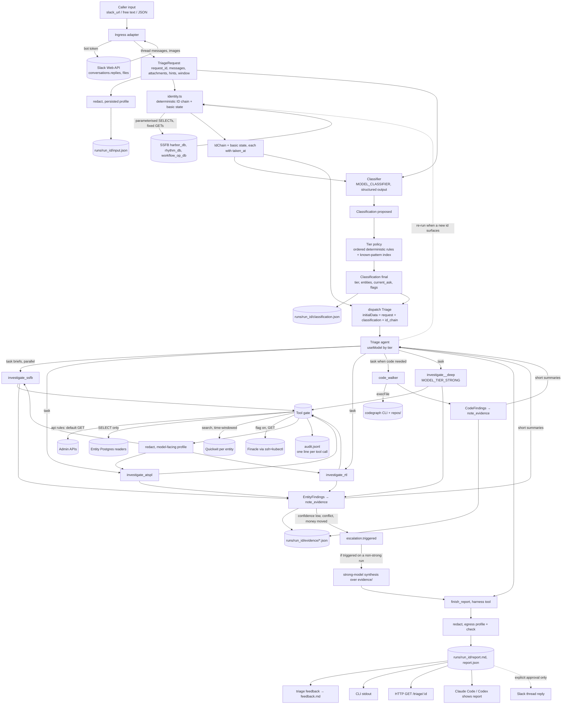
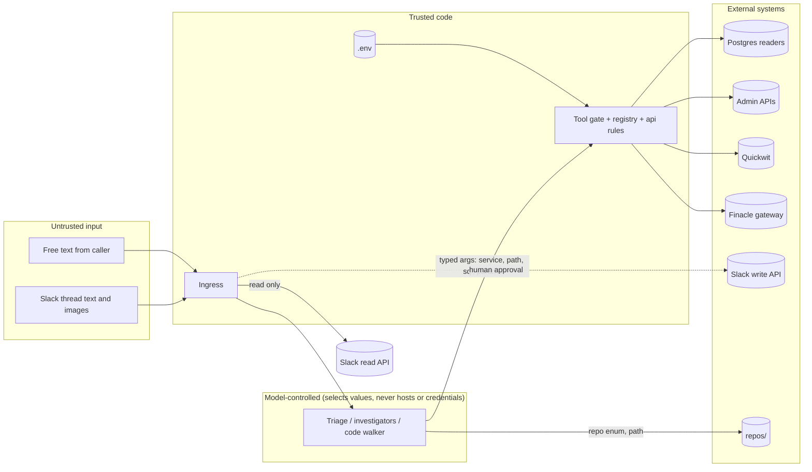

# 03. Data flow diagram

Two views: the request lifecycle (what data moves where) and the trust boundaries (what may touch what).

## 1. Request lifecycle

### Data objects

| Object | Produced by | Consumed by | Persisted | Contains PII? |
|---|---|---|---|---|
| `TriageRequest` | ingress | identity step, classifier, Triage (initial data) | `input.json` (persisted profile) | raw copy in memory only |
| `IdChain` + basic state | `identity.ts` (ingress) and `resolve_identity` (tool) | classifier, Triage, investigator briefs | in `classification.json` and `report.json` | UUIDs are treated as identifiers, not PII (assumption A11); account numbers masked on disk |
| `Classification` | classifier + policy | Triage (`useModel`, plan), evals | `classification.json` | masked ids only |
| `EntityFindings` / `CodeFindings` | investigators / code walker | Triage, synthesis pass | `evidence/<entity>.json` | persisted profile before write |
| `Report` | Triage via `finish_report` | all outputs, evals | `report.md`, `report.json` | egress profile with check; the tool refuses on a miss |
| `feedback.md` | `triage feedback` / HTTP | evals | run folder | verdict and free text, redacted |
| Audit line | gate | operators, evals | `audit.jsonl` | summary redacted; DSN never logged, only env var name |
| Fixtures | recording mode | mock mode, evals | `fixtures/**` | persisted profile at record time |

## 2. Trust boundaries

Rules encoded at the boundary:

1. **The model never supplies a host, a credential, or an entity.** Host comes from `.env` via the registry; entity is fixed in the investigator's closure; credentials are read by the tool from `.env` at call time.
2. **Slack write is not a tool.** Only ingress code paths post, and only after an interactive confirmation (CLI) or an authenticated approval call (HTTP, future Slack button).
3. **Untrusted text is data.** Slack thread content is passed to the model as the problem statement. Any instruction-like text inside it (for example "run this SQL") is still subject to the gate, which does not care where the instruction came from.
4. **Every crossing writes an audit line**, including refusals.
5. **Two redaction profiles.** The model sees the identifiers it needs to search with (account numbers, UTRs, phones, UUIDs); PAN, passport and card numbers are masked even for the model. Everything persisted or leaving the run folder gets the full mask, and `finish_report` refuses to complete if the check finds unmasked PII. Tier models may be Anthropic, OpenAI direct or local Ollama; OpenRouter is allowed only for the classifier, which sees the redacted thread (Q21, D41). Decrypted harbor fields (D34) follow the same two profiles.
6. **Budgets are enforced in code.** Per-run caps on tool calls and delegations; when hit, I/O tools refuse and escalation fires.

## 3. Where time is spent (estimates, not measured)

| Phase | Typical | Bound by |
|---|---|---|
| Ingress incl. Slack fetch | 1–3 s | Slack API |
| Classification | 1–5 s | classifier model (Ollama local can be slower) |
| Identity resolution | 1–3 s | 3 SQL hops over the SSFB tunnel |
| Entity investigation (parallel) | 30–180 s | Quickwit latency and the per-entity concurrency cap; model turns |
| Code walk | 30–120 s | CodeGraph CLI calls, strong model |
| Synthesis + redaction | 10–30 s | model |

The per-entity Quickwit semaphore is the deliberate bottleneck. Removing it is a config change, not a code change, once Quickwit is sized for it.
