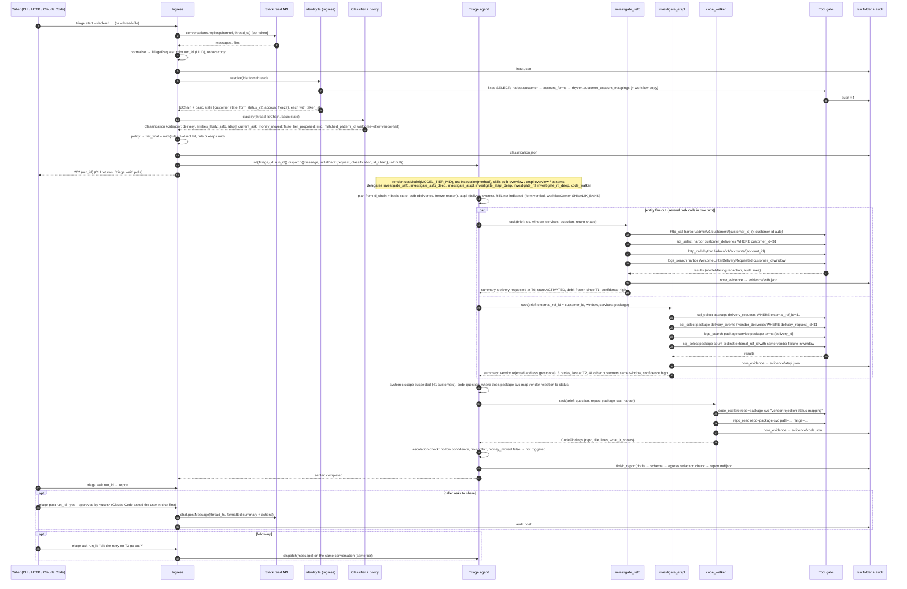

# 04. LLD: one request that spans multiple entities

Worked example: a `#nri-banking-cx` thread says the customer's welcome letter and debit card never arrived and now the app shows "account under review". This touches **SSFB** (harbor customer state, rhythm account freeze) and **ATSPL** (package-svc delivery), and possibly **RTL** if the customer is still in Part-1 onboarding. Welcome-letter and delivery cases are the most common cross-entity shape in `refs/` (about 17 in the delivery bucket; the welcome-letter ones all hop SSFB → ATSPL).

Everything below is design. No code exists yet. Type names are proposals for `src/types.ts`. Flue API usage marked **[verify in spike]** was checked against the docs and installed types by the review but not yet run.

## 1. Sequence



## 2. Step-by-step contract

### 2.1 Ingress → `TriageRequest`

```ts
type TriageRequest = {
  request_id: string;                  // ULID; also the Flue conversation id (run_id)
  interface: 'cli' | 'http' | 'claude-code' | 'slack';
  requested_by: string;                // email or slack user id
  source: { kind: 'slack'; channel_id: string; thread_ts: string; permalink: string }
        | { kind: 'thread_file' } | { kind: 'text' } | { kind: 'json' };
  messages: { ts: string; author: string; text: string; is_parent: boolean }[];
  attachments: { name: string; mime: string; bytes_ref: string }[];   // images attached to model calls when the model is multimodal
  hints: { entities?: Entity[]; ids?: Partial<KnownIds>; tier?: Tier; time_window?: {from: string; to: string} };
  window: { from: string; to: string };  // default: first message ts − TRIAGE_DEFAULT_LOOKBACK_DAYS .. now; hints override
  received_at: string;
};
```

- Slack `p<digits>` → `thread_ts` by inserting the dot 6 digits from the right (same rule as today's Slack-report skill).
- The whole thread is fetched; the "current ask" is decided by the classifier from the **latest** messages, because 38 threads in `refs/` pivot mid-way.
- `--thread-file` accepts the same `messages[]` shape so a coding agent can supply the thread it fetched with its own Slack tool.
- Ingress persists only the redacted copy. The raw text goes to the model in memory.
- HTTP: an `Idempotency-Key` header maps to an existing `run_id` in sqlite for 24 h; the CLI has no dedupe. Flue's own `idempotencyKey` is not used because it is scoped to one instance id, and every request mints a new id.

### 2.2 Identity and basic state (deterministic, before the classifier)

The same code as the `resolve_identity` tool, run in ingress. Hop table (entity fixed = ssfb, parameterised statements, never model SQL):

| Have | Query | Get | Notes |
|---|---|---|---|
| `horus_customer_id` (bot field) | `harbor.customer WHERE customer_id = $1` | `account_form_id`, `state`, `sub_state`, `external_reference_id IS NOT NULL` (CIF exists) | "Horus Customer ID" is the harbor `customer_id`, not the userId |
| old-template `UserId` | try as `external_user_ref` first, then as `customer_id` | whichever resolves | the old field sometimes held a customer_id |
| `account_form_id` / `nstp_application_id` | `harbor.account_forms WHERE form_id = $1 AND is_deleted = false` | `external_user_ref` (userId), `status_v2` (authoritative), `status`, `session_id` | NSTP Application ID = form_id |
| `alphadesk_user_id` | `harbor.account_forms WHERE external_user_ref = $1 AND is_deleted = false ORDER BY created_at DESC` | `form_id`s | may not resolve for returning-user device re-binds |
| `device_id` (auth cases) | `guardian.device_auth_attempts.verification_id → refresh_tokens.verification_id → refresh_tokens.subject` | userId | join documented but marked unverified in the notes; reported as such |
| `customer_id` | `rhythm.customer_account_mappings WHERE customer_id = $1` | `account_id`, `account_number`, `account_type`, `scheme_code` | `account_id` for admin APIs, `account_number` for logs |
| `form_id` | `workflow_op.workflow_executions WHERE reference_id = $1 AND reference_type='FORM'` on the SSFB copy; if empty, the RTL copy | `status`, `current_step_identifier`, `workflow_identifier` | the two copies of workflow-op hold different forms |

Basic state read at the same time (three fixed GET/SELECTs): harbor customer `state/sub_state`, `account_forms.status_v2`, rhythm account `status` and debit flag. Each carries `taken_at`. If the SSFB tunnel is down, the step records `id_chain.hops[*].status = 'unreachable'` and continues; the classifier then sees only thread ids and routes up.

### 2.3 Classifier

One structured-output call on `MODEL_CLASSIFIER` with schema validation, few-shot examples from redacted `refs/` cases, the category table from [00-lay-of-the-land.md](00-lay-of-the-land.md) §5, and now the `IdChain` and basic state as input.

```ts
type Classification = {
  category: 'onboarding' | 'auth' | 'delivery' | 'transfer_out' | 'funding_in' | 'card' | 'beneficiary'
          | 'account_view' | 'upi_third_party' | 'fd_td' | 'systemic' | 'unknown';
  subcategory: string;
  entities_likely: Entity[];
  current_ask: string;                       // one sentence, from the latest messages
  money_moved: boolean;                      // transfer, credit or reversal involved
  misdirected_funds: boolean;
  tier_proposed: 'cheap' | 'mid' | 'strong';
  confidence: number;                        // 0..1
  matched_pattern_id?: string;
  missing_info: string[];
  images_seen: boolean;
  classifier_error?: string;                 // set when output was invalid; policy then forces strong
};
```

Tier policy: the ordered table in [02 §4.3](02-hld-detailed.md). `tier_proposed`, `tier_final` and the rule that fired are all saved.

### 2.4 Dispatch and render

```ts
const handle = init(Triage, { id: request.request_id });
const receipt = await handle.dispatch({ message: renderThread(request), uid: null,
                                        initialData: { request: redactedRequest, classification, id_chain } });
// CLI `run --wait` / `triage wait`: 
const reply = await handle.read(receipt, { signal });          // re-attachable across processes with db.ts sqlite  [verify in spike]
```

Inside `Triage()`:

```ts
const init = useInitialData<TriageInit>();                       // schema on Triage.initialData rejects a bare create
useModel(modelForTier(init.classification.tier_final), { thinkingLevel: thinkingForTier(init.classification.tier_final) });
useInstruction(methodText(init));                                 // always-on method + report format
const entities = enabledEntities(init.request.hints.entities);   // TRIAGE_ENTITIES narrowed, never widened
for (const e of entities) {
  useSubagent(investigatorFor(e, init.request.request_id));                       // investigate_<e>
  useSubagent(investigatorFor(e, init.request.request_id, { deep: true }));       // investigate_<e>_deep, model MODEL_TIER_STRONG
  useSkill(overviewSkills[e]);                                                    // static import map
}
useSubagent(codeWalker(init.request.request_id)); useSkill(patternsSkill);
useTool(resolveIdentity(init.request.request_id)); useTool(noteEvidence(init.request.request_id)); useTool(finishReport(init));
const [esc, setEsc] = usePersistentState('escalation', { triggered: false, reasons: [] });
const [retries, setRetries] = usePersistentState('finish_retries', 0);
useAgentFinish((ctx) => {
  const done = ctx.response.toolCalls.some(c => c.tool === 'finish_report' && !c.isError);
  if (done) return;
  if (retries === 0) { setRetries(1); ctx.append({ kind: 'signal', type: 'triage.finish_required', body: 'Call finish_report with the Report before finishing.' }); return; }
  throw new Error('finish_report not called');                    // settles failed; evidence folder intact
});
return '';                                                        // instructions delivered via useInstruction
```

`investigatorFor` lives in a plain module (no `'use agent'`), so it is never registered as a top-level agent. Its returned agent function mounts `toolsFor(e, runId)` and the `<e>-<service>` skills, and uses no `useModel`/`usePersistentState`/lifecycle hooks (those throw in delegates).

### 2.5 Fan-out briefs

The parent writes one `task` per entity in a single assistant turn so Flue runs them in parallel. Whether a given model emits several `task` calls in one turn is an eval concern; the instruction text asks for it explicitly. The brief template:

```
Entity: atspl
Question: Was a welcome-letter delivery created for this customer, what did the vendor say, and is the failure isolated?
Ids: external_ref_id = <customer_id>, address_id = <…>
Window: 2026-09-01T00:00Z .. 2026-09-23T00:00Z
Services in play: package
Return: EntityFindings. Quote the exact vendor event text. Count distinct external_ref_id with the same failure in the window.
```

### 2.6 Inside `investigate_atspl`

Ladder the instruction prescribes: admin API (if configured) → DB → logs → CBS (SSFB only). For ATSPL today only DB and logs have env vars, so `http_call` answers "not configured for atspl:package" and the investigator records the gap. When a base URL exists, `http_call` evaluates `atspl.api.rules.json` on the built path; with an empty file that means GET only.

Gate behaviour on a sample call:

```
sql_select { service: 'package', sql: "SELECT id, status, vendor, created_at, updated_at FROM delivery_requests WHERE external_ref_id = $1 ORDER BY created_at DESC", params: ['<customer_id>'] }
→ budget.ts: call 7 of 120 for run_id
→ scope.ts: param $1 is the run's customer_id → in scope
→ gate.sql: parse ok; single SELECT; functions used: none; wrap LIMIT 200
→ resolveDb('atspl','package') = env ATSPL_PACKAGE_DB_URL
→ connection: SET default_transaction_read_only=on; SET statement_timeout=30000
→ rows → model-facing redaction (identifiers kept) → audit {run_id, entity:'atspl', tool:'sql_select', decision:'allow', service:'package', target:'ATSPL_PACKAGE_DB_URL', summary_redacted, ms}
```

A refused call:

```
sql_select { service: 'package', sql: "UPDATE delivery_requests SET status='RETRY' WHERE id=$1", params:[…] }
→ gate.sql: root is UPDATE → SqlNotSelectError
→ audit {…, decision:'deny', reason:'not a SELECT'}
→ tool result: "Refused: only SELECT is allowed. If a write is needed, recommend it under actions.ops_bank in the report."
```

In mock mode the same call resolves the fixture keyed `sql_select | atspl | package | delivery_requests | external_ref_id=<customer_id>`; a miss with `TRIAGE_MOCK_STRICT=true` is a tool error.

### 2.7 When RTL is consulted

Triggers, from the survey rather than invented: the mobile step's `workflowOwner` is `ASPORA_RTL`; no harbor form exists or it is still `open`/`submitted`; the SSFB copy of `workflow_executions` has no row for the form; or SSFB and ATSPL both come back clean on an onboarding case. When triggered, `investigate_rtl` queries the RTL copy of workflow-op, kyc-service and banking-service, and RTL Quickwit if `RTL_QUICKWIT_URL` is set. If it is blank, the investigator reports "RTL logs not configured", which is the same dead end past cases hit, now explicit in `gaps[]`. In this example RTL is not indicated and the report says so.

### 2.8 Escalation within a run

Deterministic triggers (`escalation.triggered`, set by `note_evidence` when it sees them): any `EntityFindings.confidence = low`; two entities' hypotheses conflict; `money_moved` on a non-strong run; budget exhausted before a root cause. The instruction also tells the orchestrator it may delegate to `investigate_<entity>_deep` on its own judgement. When triggered, `finish_report` ignores the cheap draft's narrative and runs the strong-model synthesis pass over the evidence folder before writing. The report records `escalated: true` and the reasons.

### 2.9 Report

```ts
type Report = {
  run_id: string; env_label: string; generated_at: string;
  request: { permalink?: string; current_ask: string; requested_by: string };
  classification: { proposed: Classification; tier_final: Tier; rule_fired: string; tier_override_by?: string };
  id_chain: IdChain;
  current_state: { item: string; value: string; taken_at: string; source: EvidenceRef }[];
  timeline: { at: string; entity: Entity; what: string; source: EvidenceRef }[];
  root_cause: { statement: string; code_refs: { repo: string; file: string; lines: string }[]; matched_pattern_id?: string } | null;
  scope: { kind: 'single' | 'systemic' | 'unknown'; affected_count?: number; how_measured?: string };
  status: 'root_cause_confirmed' | 'resolved' | 'pending_user' | 'pending_bank' | 'inconclusive';
  cx_answer: { action_owner: 'user' | 'backend' | 'bank' | 'unknown'; money_safe: 'yes' | 'no' | 'unknown';
               should_retry: 'yes' | 'no' | 'wait'; reply_text: string; escalate_to?: string };
  actions: { cx: string[]; eng: string[]; ops_bank: string[] };   // writes appear here as recommendations only
  confidence: 'high' | 'medium' | 'low'; confidence_reason: string;
  evidence_ladder: ('api' | 'db' | 'logs' | 'cbs' | 'code')[];
  entities_consulted: Entity[]; gaps: string[]; escalated: boolean; escalation_reasons: string[];
  images_seen: boolean;
  cost: { models: Record<string, { calls: number; input_tokens: number; output_tokens: number }>; wall_ms: number };  // from observe() turn events
};
```

`finish_report` validates the schema, applies the egress redaction with check semantics, writes `report.json` and renders `report.md` in the team's section order. The Slack formatter (TL;DR, 2–5 bullets, `cx_answer.reply_text`, actions, reviewer tag) is a pure function in ingress.

### 2.10 Feedback

`triage feedback <run_id> --verdict … [--actual-root-cause …] [--faster-path …]` and `POST /triage/:run_id/feedback` write `feedback.md` with the existing eval front-matter (`input / investigation / ground_truth`), so the ground-truth set keeps growing without the Stop-hook questionnaire.

## 3. Failure handling

| Failure | Behaviour |
|---|---|
| Slack fetch fails / no bot token | ingress error; suggest `--thread-file`; nothing dispatched |
| Identity step unreachable (tunnel down) | hops marked `unreachable`; classify on thread only; policy routes to strong; report lists the gap |
| Classifier unreachable or output invalid | `category: unknown`, `tier_final: strong`, `classifier_error` recorded; still dispatched |
| Tool refusal (gate) | short refusal to the model; audit `deny`; run continues |
| Entity unreachable mid-run | labelled infrastructure error; investigator records the gap; doctor explains the fix |
| Quickwit timeout | one retry after backoff, then gap; concurrency stays capped |
| Budget exhausted | I/O tools refuse; escalation triggered; `finish_report` still allowed |
| Delegate task interrupted (crash) | Flue reattaches to the child's transcript on recovery **[verify in spike]**; a delegate removed by a redeploy settles as an error and the parent continues |
| `finish_report` never called | one signal, then throw → submission `failed`, evidence kept |
| Redaction check fails | `finish_report` refuses listing the patterns; model fixes and retries |
| Run exceeds `TRIAGE_RUN_TIMEOUT_MS` | settles `failed`; partial evidence kept; whether the deadline is preemptive or between turns is disputed in Flue's docs, so tools honour `signal` |

## 4. What this LLD does not settle yet

- Exact instruction wording and brief template (iterated with evals).
- SQL parser library (`pgsql-ast-parser` vs `libpg-query`): a spike against the current `safe_sql` denylist cases and the function allowlist.
- Fixture semantic-key details per tool and the fixture recording workflow.
- The `suggested_fix` rendering (D35): how a cURL with `$VAR` placeholders and a verification query are laid out in the Markdown report.
- The pre-flight sequence in local mode (D32) and where kubectl runs (Q26).
- Slack-bot interaction flow with Yes / No / Comment buttons (v2, D39).
