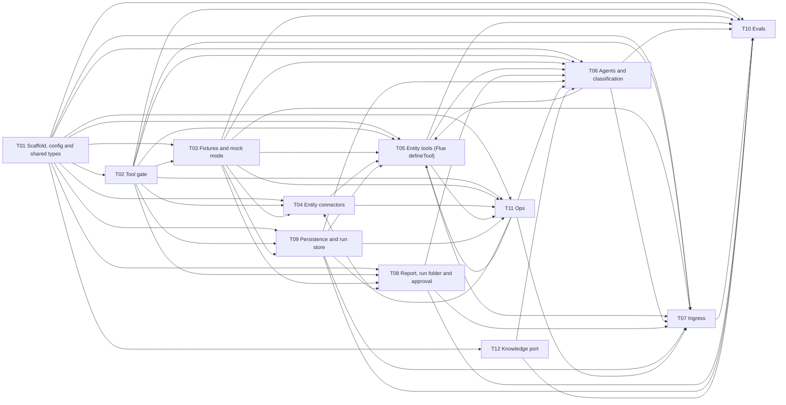

# 09. Implementation plan

This is the build plan for triage-app v1. It splits the v1 scope in [08-scope.md](08-scope.md) into 12 tickets and 101 sub-tickets, each small enough for one agent session, and orders them into 15 waves by dependency. Each sub-ticket is implemented by one agent in its own git worktree: Opus 5.5 implements, Sonnet reviews, and each sub-ticket lands as one commit. The sub-tickets in a wave run in parallel, and the wave is merged to main before the next wave starts. No two sub-tickets in a wave touch the same file. The machine-readable source is [plan/plan.json](plan/plan.json), which the implementation workflows read; this page is generated from it. The plan came from a planning workflow and a separate critique, and the critique is folded in (see [Changes from the critique](#changes-from-the-critique)). v1 scope is the "In v1" table only; P4 and P5 are excluded; Q26 to Q29 take their defaults; tests make no real network, SQL or Quickwit calls; mock mode is the default.

## Conventions

- Directory layout: bin/triage.mjs (CLI shim, Node); src/app.ts and src/db.ts (Flue entries, T01); src/config/ (env.ts, keys.ts, errors.ts, registry.ts, repos.ts; T01); src/types/&lt;domain&gt;.ts (shared Valibot schemas; T01; no barrel file); src/gate/ (pure gate, T02, plus quickwit.ts and quickwit-window.ts from T04.4); src/mock/ (fixture lookup and recording, T03); src/connectors/ (all real I/O: pg, http, quickwit-http, quickwit-qw, cbs, codegraph and the one exec runner; T04, T05.10, T11.1); src/models.ts (provider registration side effect, T06.1); src/tools/\*\*/&lt;name&gt;.tool.ts (one tool per file; T05 entity, code and evidence tools, T06.9 finish\_report); src/agents/&lt;name&gt;.agent.ts (root agents with 'use agent') and src/agents/delegates/ (plain modules without the directive; T06); src/classify/ (T06); src/ingress/ (T07); src/server/ (HTTP server boot, T07.10); src/http/\*\*/&lt;name&gt;.http.ts (T07); src/cli/commands/\*\*/&lt;name&gt;.command.ts (T07, T08, T10, T11); src/report/ (rendering, T08; together with src/gate/audit.ts, the only code that reads config.display.envLabel); src/runstore/ and src/embed/ (T09; src/runstore/ settles the HLD vs P2 path conflict); src/evals/ (T10); src/ops/ (T11; src/ops/preflight.ts is the only consumer of deployModeForPreflight); knowledge/ (T12); resources/ (registries, rules files, repos.json); fixtures/ and fixtures/\_unreviewed/ (T03); test/support/ (shared test helpers: T01 owns no-io-guard, bun-preload, vitest-setup, home, fake-tool-context; other areas add new files here); test/contract/\*\*/\*.contract.ts (T03, T06, T10; never \*.contract.test.ts); evals/promptfoo/classifier/ (T10); scripts/ (bun scripts).
- Naming: file names are kebab-case. A tool's model-facing name is snake\_case and its file is the kebab form (sql\_select -&gt; src/tools/sql-select.tool.ts; SSFB-only tools go in src/tools/ssfb/, code tools in src/tools/code/). Delegate names are investigate\_&lt;entity&gt;, investigate\_&lt;entity&gt;\_deep and code\_walker. Skill directory names are &lt;entity&gt;-&lt;service&gt; or a global name (patterns, repo-map), unique across knowledge/. Schemas are &lt;Name&gt;Schema, with the type = v.InferOutput&lt;typeof &lt;Name&gt;Schema&gt; in the same file. Entity ids are lowercase ssfb|atspl|rtl; 'shivalik' is accepted only as a registry alias. Env keys are never read directly: use config, lookupEnv or the registry.
- Tool file shape: src/tools/&lt;name&gt;.tool.ts exports `export const toolModule: ToolModule = { name: 'sql_select', mounts: ['investigator'], entities: 'all' | ['ssfb'], enabled: (ctx) => ({ on: true }) | ({ on: false, reason }), create: (ctx) => defineTool({ name, description, input: v.object({...}), run: async (input, tctx) => ok(data) | refused(msg) | notConfigured(entity, service) }) }`. Entity and run\_id come from ctx (a closure) and never appear in the input schema. create() builds the tool only and touches ctx.deps only inside run(). run() always returns the { output } envelope built by the helpers in src/types/tool-result.ts, passes tctx.signal to all async work, and throws only for loud errors such as a strict mock miss. Gate refusals are returned, not thrown. Row-returning tools stage full rows with stageRows() from src/tools/\_lib/pipeline.ts (T05.1), which picks the persisted profile for e2b and daytona (D45).
- CLI command file shape: src/cli/commands/&lt;name&gt;.command.ts exports `export const command: CliCommand = { path: ['tunnel', 'up'], summary: '...', configure(cmd) { cmd.argument(...).option('--json') }, async run(ctx, { args, opts }) { ...; return EXIT.OK } }`. Load config lazily with ctx.config(). Write output only through ctx.io and printJson/printHuman, never console.log in commands. --json output is machine-stable. There is no --env flag. Prompt for interactive input only when ctx.io.isTTY.
- HTTP module shape: src/http/&lt;name&gt;.http.ts exports `export const httpModule: HttpModule = { id, order, mount(app, ctx) }`. The bearer middleware is the module with id 'bearer-auth' and order 0. Until it exists, src/app.ts answers 503 on every route. There is no createAgentRouter mount.
- Root agent file shape: src/agents/&lt;name&gt;.agent.ts starts with 'use agent' as its first statement, exports the capitalized agent function and `export const rootAgent = <Fn>`. Delegate factories live in src/agents/delegates/ without the directive.
- How areas register without editing shared files: add a file that matches the glob (\*.tool.ts, \*.command.ts, \*.http.ts, src/agents/\*.agent.ts) with the named export. bun run gen (run automatically by postinstall, test, typecheck and build) regenerates the gitignored \*.gen.ts import lists. Never edit src/tools/index.ts, src/agents/index.ts, src/cli/index.ts, src/app.ts or any \*.gen.ts. Add fields to ToolDeps, CliDeps or HttpDeps with `declare module '<path>/types.ts' { interface ToolDeps { audit: AuditSink } }` in your own file. Needing a new dependency, script, env key or schema field means a declared shared edit to package.json, keys.ts/.env.example or src/types/&lt;file&gt;.ts; list it in the sub-ticket's files and the merge step serialises it.
- Test placement: unit tests are colocated \*.test.ts files next to the source and run by `bun run test` (bun test ./src ./test ./scripts, with preload running gen and installing the no-io guard). Contract tests are test/contract/\*\*/\*.contract.ts (never \*.contract.test.ts) and eval files are \*.eval.ts, both run by Vitest on Node (`bun run test:contract`) with the same no-io guard. promptfoo suites live under evals/promptfoo/ (`bun run evals:classifier`). No test reads a real .env: use makeTestHome() from test/support/home.ts and makeToolContext() from test/support/fake-tool-context.ts. Model calls in tests go only through the fake provider T03 provides. Only \*.test.ts files may import bun:test; src/ never imports bun:\* or uses Bun.\*.
- Commit format: conventional commits, one commit per sub-ticket, subject '&lt;type&gt;(&lt;sub-ticket id&gt;): &lt;summary&gt;' in the imperative, under 72 characters, for example 'feat(T02.1): SQL parser refuses non-SELECT'. Types are feat, fix, test, chore, docs and refactor. The body says what changed and names any declared shared-file edit. The attribution trailer follows the session's attribution rules.

## Ticket dependency graph

An arrow from A to B means some sub-ticket of B depends on a sub-ticket of A (53 edges).

## Sub-ticket dependency graph

The full graph has 561 depends_on edges, over the 300 that stay readable, and keeping only cross-ticket edges plus in-ticket chains would still leave more than 400. So the diagram drops every edge that a longer path already implies (a transitive reduction). That keeps 222 edges, 116 across tickets and 106 inside tickets, and loses no ordering. plan.json has every edge.

```mermaid
flowchart TB
  subgraph T01["T01 Scaffold, config and shared types"]
    T01_1["T01.1 Toolchain Flue Vite project"]
    T01_2["T01.2 Index generator and test runner"]
    T01_3["T01.3 Config typed frozen .env loader"]
    T01_4["T01.4 Shared types and Valibot schemas"]
    T01_5["T01.5 Entity registry shipped resources"]
    T01_6["T01.6 Extension points tools index agents"]
    T01_7["T01.7 CLI extension point bin/triage"]
    T01_8["T01.8 Test home builder and source"]
  end
  subgraph T02["T02 Tool gate"]
    T02_1["T02.1 SQL parser guard admit one"]
    T02_2["T02.2 Read-only transaction and LIMIT wrap"]
    T02_3["T02.3 HTTP rules engine and api.rules.json"]
    T02_4["T02.4 HTTP URL builder bound"]
    T02_5["T02.5 Scope rule id-shaped params must"]
    T02_6["T02.6 Budgets per run and per"]
    T02_7["T02.7 Two redaction profiles"]
    T02_8["T02.8 Audit line and JSONL writer"]
  end
  subgraph T03["T03 Fixtures and mock mode"]
    T03_1["T03.1 Fixture semantic keys"]
    T03_2["T03.2 Mock resolver strict misses"]
    T03_3["T03.3 Fixture recorder for real runs"]
    T03_4["T03.4 Promotion library for reviewed fixtures"]
    T03_5["T03.5 triage fixtures review CLI command"]
    T03_6["T03.6 Fake model provider helper"]
  end
  subgraph T04["T04 Entity connectors"]
    T04_1["T04.1 Connector contract and mock port"]
    T04_2["T04.2 Postgres connector with read-only transaction"]
    T04_3["T04.3 Admin HTTP connector bound"]
    T04_4["T04.4 Quickwit gate query builder"]
    T04_5["T04.5 Quickwit transports (qw CLI"]
    T04_6["T04.6 CBS connector kubectl exec curl"]
    T04_7["T04.7 Harbor AES-SIV field encryption helpers"]
  end
  subgraph T05["T05 Entity tools (Flue defineTool)"]
    T05_1["T05.1 Tool pipeline tool deps"]
    T05_2["T05.2 sql_select tool"]
    T05_3["T05.3 http_call tool"]
    T05_4["T05.4 logs_search tool with per-entity concurrency"]
    T05_5["T05.5 resolve_identity tool (orchestrator only)"]
    T05_6["T05.6 SSFB get_account_statement and detect_silent_reversals"]
    T05_7["T05.7 SSFB gated extras encrypt_lookup_value decrypt_fields"]
    T05_8["T05.8 Tool set integration and conformance"]
    T05_9["T05.9 note_evidence tool"]
    T05_10["T05.10 CodeGraph tools code_explore code_node code_callers"]
    T05_11["T05.11 repo_read and repo_grep"]
    T05_12["T05.12 Deterministic ID-chain core hop table"]
  end
  subgraph T06["T06 Agents and classification"]
    T06_1["T06.1 src/models.ts provider registration side effect"]
    T06_2["T06.2 Deterministic tier policy and known-pattern"]
    T06_3["T06.3 Classifier one structured call"]
    T06_4["T06.4 Runtime skills and method instruction"]
    T06_5["T06.5 Deterministic escalation triggers and strong-model"]
    T06_6["T06.6 investigate_entity _deep and code_walker delegates"]
    T06_7["T06.7 Sandbox factory and instrument() tripwire"]
    T06_8["T06.8 Triage root agent"]
    T06_9["T06.9 finish_report tool escalation strong synthesis"]
    T06_10["T06.10 Agent contract tests"]
  end
  subgraph T07["T07 Ingress"]
    T07_1["T07.1 TriageRequest normalisation from text thread"]
    T07_2["T07.2 Slack thread fetch with bot"]
    T07_3["T07.3 Ingress identity step extract ids"]
    T07_4["T07.4 Submission pipeline and Flue dispatch/read"]
    T07_5["T07.5 CLI commands run start wait"]
    T07_7["T07.7 HTTP API polling routes"]
    T07_8["T07.8 Claude Code / Codex skill"]
    T07_9["T07.9 Detached worker spawn and stdin"]
    T07_10["T07.10 HTTP server boot port auth"]
  end
  subgraph T08["T08 Report, run folder and approval"]
    T08_1["T08.1 Run folder layout and safe"]
    T08_2["T08.2 Report Valibot schema with suggested_fix"]
    T08_3["T08.3 Markdown renderer for report.md"]
    T08_4["T08.4 Report writer used by finish_report"]
    T08_5["T08.5 Slack message formatter and reviewer"]
    T08_6["T08.6 CLI approval gate (TRIAGE_APPROVAL_MODE=cli)"]
    T08_7["T08.7 Slack post after approval"]
    T08_8["T08.8 Feedback capture and the triage"]
  end
  subgraph T09["T09 Persistence and run store"]
    T09_1["T09.1 Flue persistence adapter in src/db.ts"]
    T09_2["T09.2 RunStore interface record types"]
    T09_3["T09.3 Postgres migrations as plain SQL"]
    T09_4["T09.4 Postgres run store provider"]
    T09_5["T09.5 Embeddings client on MODEL_EMBEDDING (Ollama"]
    T09_6["T09.6 Case-card and request embeddings"]
    T09_7["T09.7 Prior-case retrieval for the orchestrator"]
    T09_8["T09.8 Retention and erasure runs prune"]
  end
  subgraph T10["T10 Evals"]
    T10_1["T10.1 Eval home template and eval-home"]
    T10_2["T10.2 Eval audit gates no_real_io"]
    T10_3["T10.3 Eval case schema pseudonymiser cost"]
    T10_4["T10.4 runCase driver faux script helper"]
    T10_5["T10.5 Safety contract tests tripwire strict"]
    T10_6["T10.6 Report-path contract tests escalation redaction"]
    T10_7["T10.7 promptfoo classifier suite (suite 1)"]
    T10_8["T10.8 triage evals CLI command"]
    T10_9["T10.9 Pipeline contract scenarios single entity"]
  end
  subgraph T11["T11 Ops"]
    T11_1["T11.1 Exec runner fixed-argv execFile argv"]
    T11_2["T11.2 SSFB DB tunnel up/status/down over"]
    T11_3["T11.3 CodeGraph ops init/sync/status per-repo lock"]
    T11_4["T11.4 Repos status drift current commit"]
    T11_5["T11.5 Pre-flight the only reader"]
    T11_6["T11.6 Doctor core check model config"]
    T11_7["T11.7 Doctor probes DB role check"]
    T11_8["T11.8 CLI commands doctor preflight tunnel"]
  end
  subgraph T12["T12 Knowledge port"]
    T12_1["T12.1 Knowledge layout contract classifier category"]
    T12_2["T12.2 Orchestrator method brief template"]
    T12_3["T12.3 Investigator logs and code-walker instruction"]
    T12_4["T12.4 Port SSFB overview harbor"]
    T12_5["T12.5 Port the remaining SSFB service"]
    T12_6["T12.6 Port ATSPL and RTL overview"]
    T12_7["T12.7 Repo map CodeGraph limits"]
    T12_8["T12.8 Known-pattern index and knowledge coverage"]
  end
  T01_1 --> T01_2
  T01_1 --> T01_3
  T01_1 --> T01_4
  T01_3 --> T01_5
  T01_4 --> T01_5
  T01_2 --> T01_6
  T01_5 --> T01_6
  T01_2 --> T01_7
  T01_3 --> T01_7
  T01_2 --> T01_8
  T01_5 --> T01_8
  T01_8 --> T02_1
  T01_8 --> T02_2
  T01_8 --> T02_3
  T02_3 --> T02_4
  T01_8 --> T02_5
  T01_8 --> T02_6
  T01_8 --> T02_7
  T02_7 --> T02_8
  T01_3 --> T03_1
  T01_4 --> T03_1
  T03_1 --> T03_2
  T02_7 --> T03_3
  T03_2 --> T03_3
  T02_7 --> T03_4
  T03_1 --> T03_4
  T01_7 --> T03_5
  T03_4 --> T03_5
  T01_8 --> T03_6
  T03_3 --> T04_1
  T11_1 --> T04_1
  T02_1 --> T04_2
  T02_2 --> T04_2
  T04_1 --> T04_2
  T02_4 --> T04_3
  T04_1 --> T04_3
  T01_8 --> T04_4
  T02_6 --> T04_5
  T04_1 --> T04_5
  T04_4 --> T04_5
  T02_4 --> T04_6
  T04_1 --> T04_6
  T04_1 --> T04_7
  T01_6 --> T05_1
  T02_5 --> T05_1
  T02_6 --> T05_1
  T02_8 --> T05_1
  T03_3 --> T05_1
  T04_2 --> T05_2
  T05_1 --> T05_2
  T04_3 --> T05_3
  T05_1 --> T05_3
  T04_5 --> T05_4
  T05_1 --> T05_4
  T05_1 --> T05_5
  T05_12 --> T05_5
  T04_2 --> T05_6
  T04_3 --> T05_6
  T05_1 --> T05_6
  T04_6 --> T05_7
  T04_7 --> T05_7
  T05_1 --> T05_7
  T05_2 --> T05_8
  T05_3 --> T05_8
  T05_4 --> T05_8
  T05_5 --> T05_8
  T05_6 --> T05_8
  T05_7 --> T05_8
  T05_9 --> T05_8
  T05_10 --> T05_8
  T05_11 --> T05_8
  T05_1 --> T05_9
  T06_5 --> T05_9
  T09_2 --> T05_9
  T05_1 --> T05_10
  T11_3 --> T05_10
  T05_1 --> T05_11
  T02_8 --> T05_12
  T04_2 --> T05_12
  T01_3 --> T06_1
  T01_4 --> T06_2
  T02_7 --> T06_3
  T03_6 --> T06_3
  T06_1 --> T06_3
  T12_1 --> T06_3
  T01_3 --> T06_4
  T02_6 --> T06_5
  T03_6 --> T06_5
  T05_2 --> T06_6
  T05_3 --> T06_6
  T05_4 --> T06_6
  T05_5 --> T06_6
  T05_6 --> T06_6
  T05_7 --> T06_6
  T05_9 --> T06_6
  T05_10 --> T06_6
  T05_11 --> T06_6
  T06_1 --> T06_6
  T06_4 --> T06_6
  T05_2 --> T06_7
  T05_3 --> T06_7
  T05_4 --> T06_7
  T05_5 --> T06_7
  T05_6 --> T06_7
  T05_7 --> T06_7
  T05_9 --> T06_7
  T05_10 --> T06_7
  T05_11 --> T06_7
  T05_8 --> T06_8
  T06_6 --> T06_8
  T06_7 --> T06_8
  T06_9 --> T06_8
  T05_1 --> T06_9
  T06_1 --> T06_9
  T06_5 --> T06_9
  T08_4 --> T06_9
  T11_4 --> T06_9
  T06_8 --> T06_10
  T01_5 --> T07_1
  T02_8 --> T07_2
  T03_3 --> T07_2
  T07_1 --> T07_2
  T05_12 --> T07_3
  T06_2 --> T07_4
  T06_3 --> T07_4
  T06_8 --> T07_4
  T07_2 --> T07_4
  T07_3 --> T07_4
  T09_7 --> T07_4
  T11_5 --> T07_4
  T07_4 --> T07_5
  T07_9 --> T07_5
  T07_4 --> T07_7
  T08_8 --> T07_7
  T07_5 --> T07_8
  T08_7 --> T07_8
  T08_8 --> T07_8
  T01_7 --> T07_9
  T07_1 --> T07_9
  T07_7 --> T07_10
  T09_8 --> T07_10
  T01_3 --> T08_1
  T01_4 --> T08_1
  T01_4 --> T08_2
  T08_2 --> T08_3
  T08_3 --> T08_4
  T09_4 --> T08_4
  T08_2 --> T08_5
  T01_3 --> T08_6
  T02_8 --> T08_7
  T03_3 --> T08_7
  T08_5 --> T08_7
  T08_6 --> T08_7
  T09_4 --> T08_7
  T08_1 --> T08_8
  T08_2 --> T08_8
  T09_4 --> T08_8
  T01_7 --> T09_1
  T01_8 --> T09_1
  T02_7 --> T09_2
  T09_1 --> T09_3
  T09_2 --> T09_4
  T09_3 --> T09_4
  T02_7 --> T09_5
  T03_3 --> T09_6
  T09_4 --> T09_6
  T09_5 --> T09_6
  T09_6 --> T09_7
  T09_4 --> T09_8
  T01_8 --> T10_1
  T02_8 --> T10_2
  T12_1 --> T10_3
  T07_4 --> T10_4
  T10_1 --> T10_4
  T10_2 --> T10_4
  T10_3 --> T10_4
  T10_4 --> T10_5
  T08_1 --> T10_6
  T10_4 --> T10_6
  T06_2 --> T10_7
  T06_3 --> T10_7
  T10_1 --> T10_7
  T10_2 --> T10_7
  T10_3 --> T10_7
  T10_4 --> T10_8
  T10_7 --> T10_8
  T10_4 --> T10_9
  T01_8 --> T11_1
  T11_1 --> T11_2
  T11_1 --> T11_3
  T11_3 --> T11_4
  T11_2 --> T11_5
  T02_4 --> T11_6
  T09_5 --> T11_6
  T05_2 --> T11_7
  T05_3 --> T11_7
  T05_4 --> T11_7
  T05_5 --> T11_7
  T05_6 --> T11_7
  T05_7 --> T11_7
  T05_9 --> T11_7
  T05_10 --> T11_7
  T05_11 --> T11_7
  T11_2 --> T11_7
  T11_4 --> T11_7
  T11_6 --> T11_7
  T01_7 --> T11_8
  T11_5 --> T11_8
  T11_7 --> T11_8
  T01_8 --> T12_1
  T12_1 --> T12_2
  T12_1 --> T12_3
  T12_1 --> T12_4
  T12_1 --> T12_5
  T12_1 --> T12_6
  T12_1 --> T12_7
  T12_2 --> T12_8
  T12_3 --> T12_8
  T12_4 --> T12_8
  T12_5 --> T12_8
  T12_6 --> T12_8
  T12_7 --> T12_8
```

## Waves

| Wave | Sub-tickets | Why these run together |
|---|---|---|
| 0 | T01.1 | Scaffold; no dependencies. |
| 1 | T01.2, T01.3, T01.4 | Test runner and guards, config loader and shared types; each needs only the scaffold. |
| 2 | T01.5, T01.7, T03.1, T06.1, T06.2, T06.4, T08.1, T08.2, T08.6 | Registry, CLI entry and sqlite db.ts, fixture store, model resolution, tier policy, skills runtime, run-folder layout, report schema and approval gate; they need config or types only. |
| 3 | T01.6, T01.8, T03.2, T07.1, T08.3, T08.5 | Extension points and the test home (need the registry), mock resolver, request normalisation, Markdown renderer and Slack formatter. |
| 4 | T02.1, T02.2, T02.3, T02.5, T02.6, T02.7, T03.6, T04.4, T07.9, T10.1, T11.1, T12.1 | Gate modules, fake model, Quickwit gate, worker spawn, eval home, exec runner and knowledge contract; they need the test home from wave 3. |
| 5 | T02.4, T02.8, T03.3, T03.4, T06.3, T06.5, T09.1, T09.2, T09.5, T10.3, T11.2, T11.3, T12.2, T12.3, T12.4, T12.5, T12.6, T12.7 | Need redaction, rules, the fake model, the exec runner or the knowledge contract: URL builder, audit, recorder and promotion, classifier, escalation, Flue db adapter, run store interface, embeddings, eval cases, tunnel, CodeGraph ops, knowledge notes. |
| 6 | T03.5, T04.1, T05.1, T07.2, T09.3, T10.2, T11.4, T11.5, T11.6, T12.8 | Need audit or the recorder: fixtures review CLI, connector contract, tool pipeline, Slack fetch, migrations, eval audit gates, repos, pre-flight, doctor core, pattern index. |
| 7 | T04.2, T04.3, T04.5, T04.6, T04.7, T05.9, T05.10, T05.11, T09.4 | Connectors on the connector contract, note\_evidence and code tools on the pipeline, Postgres run store. |
| 8 | T05.2, T05.3, T05.4, T05.6, T05.7, T05.12, T08.4, T08.7, T08.8, T09.6, T09.8, T10.7 | Entity tools on the connectors, ID-chain core, report writer, Slack post, feedback, embeddings after settle, retention, promptfoo suite. |
| 9 | T05.5, T06.9, T07.3, T09.7 | resolve\_identity and the ingress identity step on the ID-chain core, finish\_report, prior cases. |
| 10 | T05.8, T06.6, T06.7, T11.7 | Need every tool: conformance check, delegates, sandbox and tripwire, doctor probes. |
| 11 | T06.8, T11.8 | Triage root agent; ops CLI commands. |
| 12 | T06.10, T07.4 | Agent contract tests and the submission pipeline, both on the root agent. |
| 13 | T07.5, T07.7, T10.4 | CLI run commands, HTTP routes and the runCase driver on the submission pipeline. |
| 14 | T07.8, T07.10, T10.5, T10.6, T10.8, T10.9 | Coding-agent skill, server boot, safety, report-path and pipeline contract tests, evals CLI. |

Files edited by more than one sub-ticket, always in different waves:

- `package.json`: T01.1 (wave 0), T01.2 (wave 1), T01.7 (wave 2), T02.1 (wave 4), T04.2 (wave 7), T09.1 (wave 5), T10.7 (wave 8)
- `src/db.ts`: T01.7 (wave 2), T09.1 (wave 5)
- `src/db.test.ts`: T01.7 (wave 2), T09.1 (wave 5)

## Tickets

### T01 Scaffold, config and shared types

Flue Vite project on Node (flue.config.ts, vite.config.ts, src/app.ts, src/db.ts, package.json with every dependency the other areas will need: valibot, pg, pgvector, better-sqlite3 or libsql, promptfoo as dev dep, node-pg-migrate or hand-rolled migrations, dotenv, commander or citty for the CLI, an AES-SIV library, node-sql-parser or pgsql-ast-parser), .env loader from TRIAGE\_HOME with typed Config and blank-key handling, the entity registry (resources/registry.json shape, per-entity services, quickwit block, kube block, field\_encryption, cohort), shared types and valibot schemas (Entity, Tier, IdChain, TriageRequest, Report, AuditLine), the extension-point indexes (src/tools/index.ts, src/cli/index.ts, src/agents/index.ts) and the repo conventions list (directory layout, naming, tool file shape, CLI command file shape, test placement, commit format). Also owns .env.example changes and the three empty api.rules.json files plus resources/repos.json.

| Sub-ticket | Title | Estimate | Wave | Depends on | Files | Tests |
|---|---|---|---|---|---|---|
| T01.1 | Toolchain: Flue Vite project on Node, dependencies, repo conventions | M | 0 | none | `package.json` `bun.lock` `tsconfig.json` `flue.config.ts` `vite.config.ts` `.gitignore` `.agents/rules/use-bun-instead-of-node-vite-npm-pnpm.md` `index.ts` `CONVENTIONS.md` `AGENTS.md` | none added (config only). Verified by bun install and bunx tsc --noEmit in the worktree |
| T01.2 | Index generator and test runner guards (no network, no host binaries) | M | 1 | T01.1 | `scripts/gen-indexes.ts` `scripts/gen-indexes.test.ts` `bunfig.toml` `vitest.config.ts` `test/support/no-io-guard.ts` `test/support/no-io-guard.test.ts` `test/support/bun-preload.ts` `test/support/vitest-setup.ts` `package.json` | scripts/gen-indexes.test.ts: empty tree, two tools in nested dirs sorted, missing export fails, --check stale/fresh test/support/no-io-guard.test.ts: fetch, http.request, https.request, net.connect and tls.connect blocked; loopback blocked unless allowLoopback([port]) opts in, and then only for that port; denylisted binaries (ssh, qw, kubectl, psql, curl, aws, codegraph, git, gh) blocked via spawn, execFile and exec, including shell:true; bun and node not blocked cwd .env not auto-loaded (temp dir with a .env setting a sentinel key; assert process.env lacks it) |
| T01.3 | Config: typed, frozen .env loader from TRIAGE\_HOME with blank-key handling | L | 1 | T01.1 | `src/config/keys.ts` `src/config/env.ts` `src/config/errors.ts` `src/config/env.test.ts` `.env.example` | src/config/env.test.ts: home vs cwd precedence; missing TRIAGE\_HOME; each default including the two byte-budget keys; each cross-field refusal (record+mock, local sandbox, slack approval); policyChecks:false bypasses only the two policy refusals; TRIAGE\_DEPLOY\_MODE=prod loads raw; enum/int/bool refusals name the key; quoted/exported/multi-line parsing; secret-leak test over error text, util.inspect and JSON.stringify; frozen; relative path resolution; keys.ts vs .env.example sync; lookupEnv missing/blank/set; overrides take precedence over the file; applyProviderEnv sets only non-blank keys and never writes a file (fs write spy count 0) |
| T01.4 | Shared types and Valibot schemas | L | 1 | T01.1 | `src/types/core.ts` `src/types/request.ts` `src/types/id-chain.ts` `src/types/classification.ts` `src/types/findings.ts` `src/types/report.ts` `src/types/audit.ts` `src/types/tool-result.ts` `src/types/types.test.ts` | src/types/types.test.ts: one valid sample per schema parses; bare TriageInit rejected; missing classification rejected; TriageInit with redaction\_names and preflight\_warnings parses and a non-string name is rejected; bad tier rejected; confidence bounds; suggested\_fix kind; missing taken\_at on current\_state and basic\_state; audit transport required; tool-result helpers produce the envelope with an ISO taken\_at; notConfigured message is 'not configured for &lt;entity&gt;:&lt;service&gt;' |
| T01.5 | Entity registry, shipped resources and repos manifest | L | 2 | T01.3, T01.4 | `src/config/registry.ts` `src/config/repos.ts` `src/config/registry.test.ts` `src/config/repos.test.ts` `resources/ssfb.entity.json` `resources/atspl.entity.json` `resources/rtl.entity.json` `resources/ssfb.api.rules.json` `resources/atspl.api.rules.json` `resources/rtl.api.rules.json` `resources/repos.json` | src/config/registry.test.ts: shipped files parse; env-name coverage against .env.example; alias resolution and duplicate alias; TRIAGE\_ENTITIES unknown id; narrowing never widens; missing vs blank key for enabled and disabled entities; each quickwit disabled reason; bad transport enum; finacle cbs-only; capabilityReport leak test; rules files equal [] src/config/repos.test.ts: valid manifest; unknown entity; default branch; repoEnum union and missing-pin report |
| T01.6 | Extension points: tools index, agents index, HTTP modules and src/app.ts | M | 3 | T01.2, T01.3, T01.4, T01.5 | `src/tools/types.ts` `src/tools/index.ts` `src/tools/index.test.ts` `src/agents/index.ts` `src/agents/index.test.ts` `src/http/types.ts` `src/app.ts` `src/app.test.ts` `test/support/fake-tool-context.ts` | src/tools/index.test.ts (fake modules injected through an internal buildToolIndex(modules) so the test does not depend on generated content): entity filter, deep union, duplicate, reserved, bad name pattern, disabled/mountPlan, lazy deps, created-name mismatch; conformance over the real generated list (passes vacuously when empty) src/agents/index.test.ts: duplicate agentName rejected, empty list ok src/app.test.ts: 503 without auth module; order of mount; auth module present lifts 503; no createAgentRouter (source grep) |
| T01.7 | CLI extension point, bin/triage and src/db.ts (sqlite) | M | 2 | T01.2, T01.3 | `src/cli/types.ts` `src/cli/index.ts` `src/cli/output.ts` `src/cli/main.ts` `src/cli/index.test.ts` `bin/triage.mjs` `src/db.ts` `src/db.test.ts` `package.json` | src/cli/index.test.ts (fake commands injected into buildProgram, fake io): help without config; nested path; group help; duplicate path; exit-code mapping for ConfigError; --json error shape; no --env option src/db.test.ts: sqlite adapter for a temp file under a temp TRIAGE\_HOME; postgres not-built error message contains the key name TRIAGE\_DB\_PROVIDER and no DSN smoke (in the same test file, spawning node on bin/triage.mjs --help; node is not on the no-io denylist): exit 0 |
| T01.8 | Test home builder and source guard tests | M | 3 | T01.2, T01.3, T01.5 | `test/support/home.ts` `test/support/home.test.ts` `test/guards/source-rules.test.ts` | test/support/home.test.ts: loadable; credentials blank; mock forced; overrides; cleanup test/guards/source-rules.test.ts: each rule against a positive and a negative in-memory fixture, then the real tree |

#### T01.1 Toolchain: Flue Vite project on Node, dependencies, repo conventions

**Scope.** Turn the bun init into a Flue 2.0.8 Node project. Write flue.config.ts (defineConfig({ target: 'node', agents: 'agents/\*.agent.ts' }) from '@flue/runtime/config'), vite.config.ts with the flue() plugin from '@flue/vite', and extend tsconfig.json (keep strict and noUncheckedIndexedAccess, add erasableSyntaxOnly, types bun+node). package.json gets every runtime dependency the other areas need, engines.node '&gt;=22.19', and only the scripts that do not need the index generator: typecheck:raw, build:raw, triage. Amend the Bun-only rule file per D18: Bun for install, scripts and unit tests; Vite and Vitest where Flue needs them; no Bun.\* or bun:\* APIs in src/ because the runtime is Node. Delete index.ts, add .data/, fixtures/\_unreviewed/, evals/\_unreviewed/ and \*.gen.ts to .gitignore, and write CONVENTIONS.md (the conventions list in this plan), linked from AGENTS.md. File notes: index.ts: deleted.

**Shared files.** `package.json` (also edited by another sub-ticket in a different wave).

**Acceptance criteria:**

- package.json dependencies include: @flue/runtime, @flue/cli, @flue/vite, @flue/postgres, @earendil-works/pi-ai 0.83.0, valibot, hono, @hono/node-server, pg, pgvector, dotenv, commander, ulidx, miscreant (RFC 5297 AES-SIV), libpg-query and pgsql-ast-parser (T02 spike picks one and removes the other), just-bash, e2b, @daytonaio/sdk. devDependencies include: vitest, promptfoo, @types/pg, @types/node, @types/bun, typescript
- no better-sqlite3, libsql, node-pg-migrate or dotenv/config import. The reasons are in CONVENTIONS.md: Flue's built-in node:sqlite covers sqlite, and T09 hand-rolls migrations
- bun install succeeds and bun.lock is committed
- bunx tsc --noEmit passes on the empty src/
- flue.config.ts narrows the agent scan to agents/\*.agent.ts, and no .flue/ directory exists
- the amended rule file says Vite and Vitest are allowed for Flue build and contract tests, and forbids Bun.\* and bun:\* imports in src/ (tests are exempt)
- CONVENTIONS.md contains directory layout, naming, tool file shape, CLI command file shape, HTTP module shape, test placement, commit format and the registration rules
- commit subject: 'chore(T01.1): flue node scaffold, deps and conventions'

**Doc refs:** docs/05-decisions.md D1, D18, D38, D43; docs/02-hld-detailed.md header and §7 Providers/Persistence; .claude/skills/flue-framework/references/guides\_project-layout.md; .claude/skills/flue-framework/references/guides\_database.md; .claude/skills/flue-framework/references/ecosystem\_databases-postgres.md

#### T01.2 Index generator and test runner guards (no network, no host binaries)

**Scope.** Add scripts/gen-indexes.ts (bun). It scans four globs and writes gitignored, sorted, type-free import lists: src/tools/\*\*/\*.tool.ts (named export toolModule) -&gt; src/tools/tool-modules.gen.ts; src/agents/\*.agent.ts (rootAgent) -&gt; src/agents/agent-modules.gen.ts; src/cli/commands/\*\*/\*.command.ts (command) -&gt; src/cli/command-modules.gen.ts; src/http/\*\*/\*.http.ts (httpModule) -&gt; src/http/http-modules.gen.ts. It has a --check mode, and it fails with the file path when a matched file lacks the expected 'export const &lt;name&gt;'. Add bunfig.toml: disable Bun's automatic .env loading, and preload test/support/bun-preload.ts, which runs the generator and installs test/support/no-io-guard.ts. The guard replaces globalThis.fetch and net.Socket connect with throwing stubs and patches node:tls, node:http and node:https connect/request the same way (loopback only for ports a test opts into with allowLoopback(ports) from the same module; there is no env switch). It also makes child\_process spawn/execFile/exec throw for ssh, qw, kubectl, psql, curl, aws, codegraph, git and gh, including shell:true variants. This is the only no-io guard and the only preload wiring in the repo; T10 reuses it and adds no second guard. Add vitest.config.ts (Node environment, include test/contract/\*\*/\*.contract.ts and \*\*/\*.eval.ts, setupFiles test/support/vitest-setup.ts reusing the same guard, raised testTimeout). Add package.json scripts: gen, postinstall (gen), test (bun test ./src ./test ./scripts), test:contract (vitest run), typecheck and build (both run gen first), and evals:classifier as `node bin/triage.mjs evals classifier` (the T10.8 command runs the suite through promptfoo evaluate()), so T10 does not edit package.json for it. It also pre-declares `ci` (bun scripts/ci.ts, filled by T10.8) and `serve` (node bin/triage-server.mjs, filled by T07.10), so those sub-tickets do not touch package.json. File notes: package.json: scripts only; sequential after T01.1.

**Shared files.** `package.json` (also edited by another sub-ticket in a different wave).

**Acceptance criteria:**

- bun run gen on a tree with no modules writes four .gen.ts files, each exporting an empty readonly array, and tsc passes
- generated output is byte-identical across runs and sorted by posix path
- gen --check exits 1 when a module file was added and the .gen.ts is stale
- a \*.tool.ts without 'export const toolModule' makes gen fail and name the file
- in bun tests and Vitest, fetch('https://example.com') throws an error naming the no-io guard
- net.connect, tls.connect, http.request and https.request to a non-loopback host throw
- child\_process.execFile('ssh', ...), spawn('qw', ...), execFile('git', ...) and exec('gh ...') throw, and shell:true variants are denied too
- a .env file in the cwd is not loaded into process.env under bun run test (bunfig env disabled; if this Bun version lacks the bunfig key, scripts pass --no-env-file and the test proves it)
- bun run test does not pick up \*.contract.ts or \*.eval.ts files
- commit subject: 'feat(T01.2): index generator and no-io test guards'
- loopback is denied unless a test calls allowLoopback([port]), and then only that port is allowed
- vitest.config.ts include is exactly test/contract/\*\*/\*.contract.ts and \*\*/\*.eval.ts

**Doc refs:** docs/05-decisions.md D18, D19, D42; docs/02-hld-detailed.md §7 Evals; .claude/skills/flue-framework/references/advanced\_evals.md

#### T01.3 Config: typed, frozen .env loader from TRIAGE\_HOME with blank-key handling

**Scope.** Add src/config/keys.ts, one table of every non-entity key in .env.example with its type (string, int, bool, enum, path, csv), default and group. Add src/config/env.ts exporting loadConfig({ home?, overrides? }): Config, configFromRecord(record, home) for tests, and lookupEnv(config, name): { state: 'missing'|'blank'|'set', value? } for entity keys the registry resolves. Also export deployModeForPreflight(config), the only accessor for TRIAGE\_DEPLOY\_MODE. The loader keeps that value as a raw string with no enum check, so an unknown value reaches pre-flight, which warns and falls back to probe-only (D32). Export providerEnv(config) and applyProviderEnv(config), which copy non-blank ANTHROPIC\_API\_KEY, OPENAI\_API\_KEY and OPENROUTER\_API\_KEY into process.env in memory for pi-ai and never write a file. The loader reads TRIAGE\_HOME from process.env only, parses &lt;home&gt;/.env with dotenv.parse (never dotenv.config), ignores the cwd, resolves relative paths against the home, maps blank values to undefined or the documented default, and returns a deep-frozen object. Its util.inspect.custom and toJSON print key names only. Errors are ConfigError from src/config/errors.ts and carry key names, never values. TRIAGE\_ENV\_LABEL is exposed only as config.display.envLabel. Also edit .env.example comments: TRIAGE\_HOME must come from the shell, SSFB\_CBS\_BASTION is unused under the Q26 default (kubectl on the laptop), and qw is --since only with correlation by timestamp (Q28/Q29 defaults). Add two keys to keys.ts and .env.example for the byte budgets T02.6 needs: TRIAGE\_MAX\_RESPONSE\_BYTES\_PER\_CALL (default 1048576) and TRIAGE\_MAX\_BYTES\_PER\_RUN (default 20971520). configFromRecord(record, home, { policyChecks: false }) skips only the v1 policy refusals (TRIAGE\_SANDBOX\_PROVIDER=local, TRIAGE\_APPROVAL\_MODE=slack) so tests can reach the use-time checks in T06.7, T08.6 and T11.6; loadConfig always applies them, and a source guard (T01.8) allows policyChecks:false only in test files.

**Acceptance criteria:**

- loadConfig with TRIAGE\_HOME=&lt;tmp&gt; reads &lt;tmp&gt;/.env even when the cwd has a different .env
- missing TRIAGE\_HOME -&gt; ConfigError naming TRIAGE\_HOME
- defaults with an empty .env: mock.enabled=true, mock.strict=true, mock.record=false, db.provider='sqlite', approval.mode='cli', sandbox.provider='virtual', budgets 120/12, sql 200/30000/2000
- TRIAGE\_RECORD\_FIXTURES=true with TRIAGE\_MOCK\_MODE=true -&gt; ConfigError
- TRIAGE\_SANDBOX\_PROVIDER=local -&gt; ConfigError that names D45
- TRIAGE\_APPROVAL\_MODE=slack -&gt; ConfigError 'reserved for v2'
- an invalid enum value (e.g. TRIAGE\_DB\_PROVIDER=mysql or TRIAGE\_APPROVAL\_MODE=auto) -&gt; ConfigError naming the key
- a bad bool ('yes') or bad int -&gt; ConfigError naming the key
- quoted, exported ('export KEY=...') and multi-line quoted values parse correctly
- no error message, inspect output or JSON.stringify(config) contains any value from the .env. Tested with seeded fake secrets
- config is deep-frozen
- relative paths (./.data, ./knowledge, the sqlite TRIAGE\_DB\_URL) resolve under TRIAGE\_HOME
- blank MODEL\_CODE\_WALKER is undefined (the models module falls back to strong)
- blank TRIAGE\_RUNS\_RETENTION\_DAYS is undefined (keep)
- every key in .env.example is either in keys.ts or matches ^(SSFB|ATSPL|RTL)\_, and every keys.ts entry appears in .env.example
- commit subject: 'feat(T01.3): typed .env loader from TRIAGE\_HOME'
- TRIAGE\_DEPLOY\_MODE=prod loads without error and deployModeForPreflight returns 'prod' unchanged; no other part of Config exposes the value
- TRIAGE\_MAX\_RESPONSE\_BYTES\_PER\_CALL and TRIAGE\_MAX\_BYTES\_PER\_RUN are in keys.ts and .env.example with their defaults, and a bad int for either is a ConfigError naming the key
- configFromRecord with policyChecks:false accepts TRIAGE\_SANDBOX\_PROVIDER=local and TRIAGE\_APPROVAL\_MODE=slack; loadConfig still refuses both

**Doc refs:** docs/02-hld-detailed.md §4.1, §7; docs/05-decisions.md D4, D19, D27, D32, D38, D39, D45, 'Mistakes recorded'; .env.example header; docs/06-open-questions.md Q26-Q29

#### T01.4 Shared types and Valibot schemas

**Scope.** Add Valibot schemas with inferred types under src/types/, one file per domain and no barrel, so parallel importers never share a file. core.ts has ENTITIES ['ssfb','atspl','rtl'], EntitySchema, TierSchema, InterfaceSchema ('cli'|'http'|'claude-code'|'slack'), KnownIdsSchema (horus\_customer\_id, customer\_id, user\_id, old\_user\_id, form\_id, account\_form\_id, alphadesk\_user\_id, device\_id, account\_id, account\_number, phone, utr) and a TakenAt string. request.ts has TriageRequestSchema per LLD §2.1. id-chain.ts has IdChainSchema: ids, hops[] {from, to?, source, status: resolved|not\_found|unreachable|unverified|skipped, taken\_at} and basic\_state[] {item, value, taken\_at, source}. classification.ts has ClassificationSchema per LLD §2.3, TierDecisionSchema {proposed, tier\_final, rule\_fired, tier\_raised\_for\_images?, tier\_override\_by?}, and TriageInitSchema {request, classification: TierDecision, id\_chain, prior\_cases?, redaction\_names?: string[], preflight\_warnings?: {entity?, step, message, fix?}[]}, which rejects a bare {}. findings.ts has EvidenceRef, EntityFindings and CodeFindings. report.ts has ReportSchema per LLD §2.9 plus status, cx\_answer (action\_owner includes 'unknown'), suggested\_fix[] {title, kind: curl|sql|manual, command, preconditions, verify\_with} per D35, repo\_commits[] per D37 and preflight warnings folded into gaps. audit.ts has AuditLineSchema per HLD §3. tool-result.ts has ToolResultSchema {status: ok|refused|not\_configured|unreachable, taken\_at, data?, message?} and helpers ok(), refused(), notConfigured(entity, service), unreachable(), all returning the Flue { output } envelope. redaction\_names carries the ingress-collected names (Slack profiles, bot template fields) to finish\_report's egress check. It sits on TriageInit, not on TriageRequest, so the run store never receives it; the same names already reach Flue's conversation stream through the dispatched thread, so this adds no new exposure. preflight\_warnings carries pre-flight warnings into the report's gaps.

**Acceptance criteria:**

- every exported type is v.InferOutput of its exported &lt;Name&gt;Schema, and no hand-written duplicate types exist
- TriageInitSchema rejects {} and rejects a value that lacks classification or id\_chain
- ClassificationSchema rejects tier\_proposed outside cheap|mid|strong and confidence outside 0..1
- ReportSchema rejects suggested\_fix.kind outside curl|sql|manual, a current\_state item without taken\_at, and status outside the five values
- EntityFindingsSchema enforces confidence high|medium|low
- IdChain hop status accepts 'unreachable', and every basic\_state item needs taken\_at
- AuditLineSchema requires transport real|mock and decision allow|deny, and target is a string field documented as an env var name (never a DSN)
- tool-result helpers return { output: {...} } with taken\_at set, and never a bare object
- every schema is v.object at the top level, so Flue tool input and output accept it
- nothing in src/types imports from other src/ folders
- commit subject: 'feat(T01.4): shared types and valibot schemas'
- TriageInitSchema accepts redaction\_names as a string array and preflight\_warnings as an array of {entity?, step, message, fix?}, and both are optional
- TriageRequestSchema has no redaction\_names field
- KnownIdsSchema includes old\_user\_id and account\_form\_id (the LLD §2.2 hop table and T07.3 use them)

**Doc refs:** docs/04-lld-multi-entity-request.md §2.1, §2.2, §2.3, §2.9; docs/02-hld-detailed.md §1.2, §1.4, §3 audit.ts, §6; docs/05-decisions.md D20, D23, D35, D37, D42, D43

#### T01.5 Entity registry, shipped resources and repos manifest

**Scope.** Add src/config/registry.ts with EntityRegistrySchema (Valibot, following HLD §4.2: entity, aliases, services {db?, api?, quickwit\_service?, repo?, customer\_header?, auth?, field\_encryption?, transport?: 'cbs', note?}, quickwit\_fields, a quickwit block, cbs.enabled\_flag, kube, repos\_extra) and loadRegistry(config): Registry. Registry exposes resolveEntity(aliasOrId), enabledEntities(hints?) (TRIAGE\_ENTITIES narrowed by hints, never widened), services(entity), serviceDb/serviceApi/serviceAuth(entity, service) returning Capability = {status:'ok', envName, value} | {status:'disabled', envName, reason:'blank'}, fieldEncryption, quickwit(entity) (resolved transport qw|http, index, maxConcurrency default 1, maxHits default 500, http url/auth/token, qw context, or disabled with a reason), quickwitFields, cbsEnabled, kube, repos(entity), and capabilityReport(entity), which lists env names and statuses and never values. For enabled entities, a referenced env name that is absent from the .env is a startup RegistryError listing the key names. Add src/config/repos.ts with loadRepos(config, registry): RepoPin[] {repo, entities[], branch?}, which rejects unknown entities, plus repoEnum(registry, repos). Ship resources/ssfb.entity.json (harbor, rhythm, guardian, comms, workflow, cohort, pdfgen, reminder, bro, eventbus, audit, finacle), atspl.entity.json (package, pulse), rtl.entity.json (workflow, banking, kyc), the three api.rules.json files as exactly [], and resources/repos.json.

**Acceptance criteria:**

- all three shipped registries parse against EntityRegistrySchema, and every env name they reference exists in .env.example
- resolveEntity('shivalik') === 'ssfb', and an unknown alias returns undefined
- an alias listed by two entities is a RegistryError
- TRIAGE\_ENTITIES containing an unknown id -&gt; RegistryError naming TRIAGE\_ENTITIES
- enabledEntities(['atspl']) with TRIAGE\_ENTITIES=ssfb,atspl -&gt; ['atspl']
- enabledEntities(['rtl']) with rtl not enabled -&gt; []
- a registry key absent from the .env for an enabled entity -&gt; startup error listing the key names; the same key absent for a disabled entity -&gt; no error
- a blank SSFB\_COHORT\_API\_URL -&gt; serviceApi('ssfb','cohort') is disabled with reason 'blank'
- a blank SSFB\_HARBOR\_FIELD\_ENC\_KEY -&gt; fieldEncryption disabled
- quickwit transport 'qw' with a blank &lt;ENTITY&gt;\_QW\_CONTEXT -&gt; disabled with a reason naming the key; transport 'http' with auth 'bearer' and a blank token -&gt; disabled; transport value 'grpc' -&gt; startup error
- the finacle service has transport 'cbs' and serviceApi marks it cbs-only
- capabilityReport output contains no value from the .env (seeded secret test)
- the three api.rules.json files are exactly []
- repos.json entries validate, an unknown entity in a pin is an error, a missing branch means the default branch, and repoEnum is the union of repos.json and registry repo/repos\_extra, with registry repos missing from repos.json reported
- commit subject: 'feat(T01.5): entity registry, resources and repos manifest'

**Doc refs:** docs/02-hld-detailed.md §4.2, §4.4 (shipped content), §7 Repos; docs/05-decisions.md D3, D5, D14, D21, D34, D37, D40, D44, A4, A5, A10; docs/survey/02-entities-atspl-rtl-frontend.md (ATSPL service strings, repo names)

#### T01.6 Extension points: tools index, agents index, HTTP modules and src/app.ts

**Scope.** Add src/tools/types.ts: Mount = 'triage'|'investigator'|'investigator\_deep'|'code\_walker'; ToolContext {runId, entity: Entity|null, config, registry, deps: ToolDeps}; an empty interface ToolDeps that other areas extend with 'declare module' augmentation; and ToolModule {name, mounts, entities: 'all'|Entity[], enabled(ctx) -&gt; {on:true}|{on:false, reason}, create(ctx) -&gt; Flue ToolDefinition}. Add src/tools/index.ts, which imports tool-modules.gen.ts and exports allToolModules, allToolNames() (for the tripwire), toolsFor(mount, ctx) (deep = investigator ∪ investigator\_deep) and mountPlan(mount, ctx) (name/on/reason, for doctor). toolsFor enforces unique names, a snake\_case name pattern, the reserved Flue names (task, activate\_skill, read\_skill\_resource, finish, give\_up, read, write, edit, bash, grep, glob), created-name equals module name, and entity filtering. Add src/agents/index.ts, which exports rootAgents from agent-modules.gen.ts and checks unique agentName. Add src/http/types.ts (HttpModule {id, order, mount(app, ctx)}, HttpDeps for augmentation) and src/app.ts: a Hono app that mounts http-modules.gen.ts modules in order and answers 503 'http auth not configured' on every route unless a module with id 'bearer-auth' is present, default-exported for Flue. Add test/support/fake-tool-context.ts (makeToolContext with deps as a Proxy that throws on any access).

**Acceptance criteria:**

- with no generated modules: allToolModules is [], rootAgents is [], tsc passes, and app returns 503 for GET /triage
- toolsFor('investigator', ctx for atspl) excludes modules whose entities is ['ssfb']
- toolsFor('investigator\_deep', ...) returns investigator tools plus investigator\_deep tools
- two modules with the same name mounted together -&gt; DuplicateToolNameError naming both files
- a module named 'bash' or 'task' -&gt; ReservedToolNameError
- a disabled module is absent from toolsFor and appears in mountPlan with its reason
- create() is not called for disabled modules, and create() touching ctx.deps throws in the fake context (tools must defer deps to run())
- a conformance test runs over every generated tool module: its created input schema has no 'entity' or 'run\_id' key (D3), it is a v.object, and its name matches the module
- app mounts modules by ascending order, and a 'bearer-auth' module lifts the 503
- src/app.ts contains no createAgentRouter import
- commit subject: 'feat(T01.6): tool, agent and http extension points'

**Doc refs:** .claude/skills/flue-framework/references/guides\_tools.md; .claude/skills/flue-framework/references/guides\_subagents.md; .claude/skills/flue-framework/references/guides\_routing.md; docs/02-hld-detailed.md §1.1-1.4, §2, §5.2; docs/05-decisions.md D2, D3, D25, D45

#### T01.7 CLI extension point, bin/triage and src/db.ts (sqlite)

**Scope.** Add src/cli/types.ts: CliCommand {path: readonly string[], summary, configure(cmd: commander.Command): void, run(ctx, {args, opts}): Promise&lt;number&gt;}; CliContext {config() (lazy loadConfig, so --help works without TRIAGE\_HOME), io {stdout, stderr, stdin, isTTY}, deps: CliDeps (empty, for augmentation)}. Add src/cli/index.ts with buildProgram(commands, ctx), which creates intermediate groups for multi-part paths (tunnel up, repos sync, fixtures review, runs delete), rejects duplicate paths, adds a global --json flag and maps thrown ConfigError/RegistryError to exit code 3 with key names only. Add src/cli/output.ts (printJson, printHuman, EXIT {OK:0, ERROR:1, USAGE:2, CONFIG:3}), src/cli/main.ts and bin/triage.mjs, a '#!/usr/bin/env node' shim that imports src/cli/main.ts through Node &gt;= 22.19 type stripping. Add a 'bin' entry to package.json. Add src/db.ts with a named createPersistence(config) that returns sqlite(config.db.url) from '@flue/runtime/node' for TRIAGE\_DB\_PROVIDER=sqlite, throws a named 'postgres adapter not built (T09)' error for postgres, and default-exports createPersistence(loadConfig()) for vite build and flue run. T01.7 owns src/db.ts; T09.1 later replaces the postgres branch as a declared edit. File notes: package.json: bin field only; sequential after T01.2.

**Shared files.** `src/db.ts`, `src/db.test.ts`, `package.json` (also edited by another sub-ticket in a different wave).

**Acceptance criteria:**

- node bin/triage.mjs --help exits 0 on Node 22.19+ with no TRIAGE\_HOME set and lists every generated command
- with zero command modules, --help still works
- duplicate command paths -&gt; error at program build naming both files
- a command at path ['tunnel','up'] is reachable as 'triage tunnel up', and 'triage tunnel' prints group help
- a command that calls ctx.config() without TRIAGE\_HOME exits 3, and stderr names TRIAGE\_HOME and no values
- with --json, errors print {"error":{"code","message"}} on stdout, and the output parses as JSON
- there is no --env flag or option anywhere in buildProgram
- createPersistence with provider sqlite and a tmp path returns a Flue PersistenceAdapter; with provider postgres it throws the named not-built error
- src/db.ts never logs TRIAGE\_DB\_URL
- commit subject: 'feat(T01.7): cli extension point, bin and sqlite persistence entry'

**Doc refs:** docs/02-hld-detailed.md §5.1, §7 Persistence; docs/05-decisions.md D4, D12, D28, D38, D42; .claude/skills/flue-framework/references/guides\_database.md; .claude/skills/flue-framework/references/advanced\_workflows.md

#### T01.8 Test home builder and source guard tests

**Scope.** Add test/support/home.ts, which exports makeTestHome({ overrides?, entities? }) -&gt; { home, config, registry, cleanup }. It builds a temp TRIAGE\_HOME whose generated .env is derived from .env.example with every credential and host value blanked: \*\_DB\_URL, \*\_API\_URL, \*\_URL, \*\_TOKEN, \*\_KEY, \*\_SECRET, \*\_BASTION, \*\_IDENTITY\_FILE, \*\_REMOTE\_HOST, \*\_OAUTH\_SCOPE, SLACK\_BOT\_TOKEN, and the provider keys. It forces TRIAGE\_MOCK\_MODE=true and TRIAGE\_MOCK\_STRICT=true and copies resources/ into the home. No .env file is ever committed. Add test/guards/source-rules.test.ts, a static scan of src/\*\*/\*.ts excluding \*.test.ts. Rules: 'use agent' appears only as the first statement of src/agents/\*.agent.ts; process.env is read only under src/config/; the string TRIAGE\_DEPLOY\_MODE appears only in src/config/keys.ts and src/ops/preflight.ts, and deployModeForPreflight is referenced only in src/config/env.ts and src/ops/preflight.ts; envLabel is referenced only in src/config/, src/report/ and src/gate/audit.ts; no Bun.\* or bun:\* imports; no import of .md files; no import of local from '@flue/runtime/node'; no createAgentRouter; no shell: true; no \*.gen.ts is committed; no .flue/ directory exists; no file is named \*.contract.test.ts (contract tests are test/contract/\*\*/\*.contract.ts only); configFromRecord with policyChecks:false is called only from \*.test.ts, \*.contract.ts or test/ files.

**Acceptance criteria:**

- makeTestHome() returns a loadable config and registry, and every registry capability that needs a credential is disabled (blank)
- no value in the generated .env contains '@', '://' or a hostname for any entity key or provider key
- mock.enabled and mock.strict are true in the test home, and overrides are applied
- cleanup removes the temp dir
- each guard rule has a fixture proving it fires: a temp file with the violation is scanned by the same rule function and reported with file:line
- the guards pass on the current tree
- commit subject: 'test(T01.8): test home builder and source guard rules'

**Doc refs:** docs/05-decisions.md D4, D19, D27, D32, D42, D45, 'Mistakes recorded'; docs/02-hld-detailed.md §4.1, §7 Evals; /Users/varun/code/work/triage-app/.env.example

### T02 Tool gate

src/gate/\*: SQL parser that admits a single SELECT/WITH and refuses everything else including SET/RESET/SHOW/multi-statement (D7, D33), the read-only transaction wrapper contract (BEGIN READ ONLY; SET LOCAL statement\_timeout/lock\_timeout; COMMIT) as a pure function producing the statement list, http rules engine over resources/{entity}.api.rules.json (ordered rules, first match wins, default GET allow, non-GET deny, host bound to registry) (D6, D31, D40), scope rule (id-shaped params must belong to the ID chain unless aggregate-only) (rule 10), budgets per run and per entity (calls, rows, bytes, quickwit concurrency cap), the two redaction profiles (model-facing and persisted) with the egress check, and the audit writer (JSONL, one line per call, run\_id, transport real|mock) (D8, D20, D24, D26).

| Sub-ticket | Title | Estimate | Wave | Depends on | Files | Tests |
|---|---|---|---|---|---|---|
| T02.1 | SQL parser guard: admit one SELECT/WITH, refuse everything else | L | 4 | T01.1, T01.2, T01.8 | `src/gate/sql.ts` `src/gate/sql-functions.ts` `src/gate/sql.test.ts` `src/gate/sql-cases.ts` `package.json` | deny: INSERT, UPDATE, DELETE, MERGE, TRUNCATE, COPY FROM/TO, CREATE/ALTER/DROP, GRANT/REVOKE each refused deny: SET statement\_timeout, SET LOCAL, RESET ALL, SHOW, EXPLAIN, EXPLAIN ANALYZE, DO, CALL, PREPARE/EXECUTE, LISTEN/NOTIFY, LOCK, VACUUM, BEGIN/COMMIT/ROLLBACK refused deny: 'SELECT 1; SELECT 2', 'SELECT 1;;', and 'SELECT 1; UPDATE ...' refused as MULTI\_STATEMENT deny: WITH x AS (DELETE ... RETURNING \*) SELECT, and WITH x AS (UPDATE ...) and (INSERT ...) variants deny: SELECT ... INTO t, and FOR UPDATE / FOR SHARE / FOR NO KEY UPDATE / FOR KEY SHARE deny: pg\_sleep, pg\_read\_file, set\_config, current\_setting, dblink, dblink\_exec, lo\_import, lo\_export, query\_to\_xml, xpath, public.fn(), pg\_catalog.now() deny: generate\_series and jsonb\_array\_elements in the target list, in FROM, and under LATERAL; any unlisted function deny: casts to regclass, regproc, oid, a composite type or an array-of-unknown type deny: SELECT from pg\_catalog.pg\_stat\_activity, pg\_shadow, information\_schema.tables, and an unqualified pg\_authid deny: parameter gaps ($1, $3) and $0 refused; the text '$1' inside a string literal is not counted as a parameter allow: 'last\_update' column and '--' or ';' inside string literals do not trigger refusals (regressions from the old regex guard) aggregateOnly: count(\*) GROUP BY status is true; SELECT customer\_id is false; GROUP BY customer\_id is false; max(customer\_id) is false sql-cases.ts ports the old safe\_sql denylist cases as a table (case structure only, no customer data) |
| T02.2 | Read-only transaction and LIMIT wrap as pure statement builders | S | 4 | T01.1, T01.2, T01.8 | `src/gate/sql-txn.ts` `src/gate/sql-txn.test.ts` | order snapshot of buildReadOnlyTxn with 30000/2000 deny: timeout '1; DROP TABLE x', -1, 0, 1.5, NaN, Infinity and 10^12 each throw wrapWithCap('SELECT a FROM t WHERE id = $1', 1) yields LIMIT $2 wrapWithCap strips a trailing ';' and newline readOnlyConnectionOptions returns the exact option string |
| T02.3 | HTTP rules engine and api.rules.json loader checks | M | 4 | T01.1, T01.2, T01.5, T01.8 | `src/gate/rules.ts` `src/gate/rules-file.ts` `src/gate/rules.test.ts` | deny: POST, PUT, PATCH, DELETE with no rules -&gt; block/default deny: '/custom/api/\*' does not match '/custom/apix' or '/custom/api'; it matches '/custom/api/x/y' deny: ':form\_id' does not match an empty segment ('/forms//x') or two segments deny: method match is exact; 'get' in a rule file is a loader error, not a silent match deny: {harbor, \*, \*, block} blocks harbor GETs; other services unaffected HLD example: GET block then \* allow on same path -&gt; GET blocked, POST allowed loader deny: unknown service, action 'deny', duplicate rule, shadowed rule (after {harbor,\*,\*,block}), broad allow api '\*' without confirm\_broad, broad allow method '\*' on '/x/\*' without reason loader: confirm\_broad with reason loads; allow without reason yields a warning a pathname argument containing '?' is refused shipped resources/{ssfb,atspl,rtl}.api.rules.json equal [] |
| T02.4 | HTTP URL builder bound to the registry host, headers from the IdChain | M | 5 | T01.2, T01.4, T01.8, T02.3 | `src/gate/http.ts` `src/gate/http.test.ts` | deny: '../x', '/a/../../b', '/a/%2e%2e/b', '/a/%2F/b', '/a%5Cb', '/a\\b', '/a%00', '/a\r\nHost: x', 'http://evil/x', 'https:x', '//evil.com/x', '/@evil.com', 'x/relative' each refused deny: base 'https://h/api' refuses '/apix/v1' and accepts '/api/v1'; base origin with port preserved and cannot be changed deny: query key with '&' or '=' refused; query value with '&' is encoded, not split deny: service 'finacle' via http\_call refused with cbs\_call hint deny: method 'CONNECT', 'TRACE', 'get ' refused deny: POST with [] rules blocked, rule\_index 'default'; known mutating paths (trigger-delivery, sync-address, force-sign, trigger-customer-creation, bro PUT rules) as POST/PUT blocked by default deny: IdChain customer\_id with a space, newline or ';' -&gt; header refused deny: cbs path with '?', '..', a space or a '%' refused allow: GET '/admin/v1/forms/&lt;uuid&gt;' against a registry base builds the expected URL with rule\_index 'default' deny: '/api/v1#@evil.com', '/api/v1%23x' and '/api/v1?x=1' refused; a base with a path prefix ('https://h/api') cannot be escaped through a fragment or query in the path deny: an IPv6 base 'http://[::1]:8080/api' and a base with an explicit port keep host and port for every accepted path; a path cannot change host, port or userinfo |
| T02.5 | Scope rule: id-shaped params must belong to the run's ID chain | M | 4 | T01.2, T01.4, T01.8 | `src/gate/id-patterns.ts` `src/gate/scope.ts` `src/gate/scope.test.ts` | allow: run customer\_id as $1; form\_id in an http path segment; account number in a logs term deny: foreign UUID in $1; foreign UUID inside a JSON string param; foreign UUID in an http path segment; foreign UUID in an http query value; foreign account number in a logs term; foreign phone in cbs body deny: foreign id uppercased or with surrounding whitespace still denied deny: systemic with sqlAggregateOnly false; systemic logs\_search in search mode allow: systemic + aggregateOnly with a foreign-looking literal; systemic logs count deny: an id that appears only in the thread text (not in IdChain) is out of scope a synthetic phone with a +91 prefix and spaces matches the same 10 digits stored in the chain extendScopeSet adds a new customer\_id; the old one stays allowed offending entries never contain the full value |
| T02.6 | Budgets per run and per entity, with the Quickwit concurrency cap | M | 4 | T01.2, T01.4, T01.8 | `src/gate/budget.ts` `src/gate/semaphore.ts` `src/gate/budget.test.ts` `src/gate/semaphore.test.ts` | deny: 121st tool call with cap 120 refused; exhausted stays true deny: 13th task with cap 12 refused allow: finish\_report and note\_evidence after exhaustion deny: per-entity maxCalls reached for atspl while ssfb still allowed deny: accountBytes past maxBytesPerRun refused; single response over maxBytesPerCall flagged for truncation isolation: run A exhausted, run B unaffected construction with maxToolCalls 0 or NaN throws semaphore: cap 1, two acquires -&gt; second resolves only after first release (ordering asserted) semaphore: aborting a waiting acquire rejects it and does not consume the slot semaphore: release after throw in the holder frees the slot |
| T02.7 | Two redaction profiles and the egress check | L | 4 | T01.2, T01.4, T01.8 | `src/gate/redact-patterns.ts` `src/gate/redact-decode.ts` `src/gate/redact.ts` `src/gate/redact.test.ts` | PAN (Luhn-valid) masked in both profiles; a Luhn-invalid 16-digit run is not treated as PAN but is masked as digits6 when persisted account number visible model-facing, \*\*\*\*last4 when persisted phone visible model-facing, masked when persisted email local part masked model-facing, whole email masked when persisted deny/egress: base64-encoded phone in reply\_text -&gt; unmasked ['phone'] deny/egress: URL-encoded email in suggested\_fix.command -&gt; unmasked ['email'] deny/egress: JSON-escaped digits inside a nested string caught deny/egress: an ingress-collected name in reply\_text -&gt; unmasked ['name']; name matching is case-insensitive and whole-word postcode-shaped address line masked when persisted UUID unchanged in both profiles quoted, export-prefixed and multi-line DSN-like strings with passwords are masked (synthetic values) object keys and non-string scalars (booleans, null) are preserved checkEgress output contains no substring of any input PII value |
| T02.8 | Audit line and JSONL writer with transport real\|mock | M | 5 | T01.2, T01.4, T01.8, T02.7 | `src/gate/audit.ts` `src/gate/audit-sink.ts` `src/gate/audit.test.ts` `src/gate/purity.test.ts` | deny: target 'postgres://u:p@h/db' throws; target 'https://h/x' throws; target 'SSFB\_HARBOR\_DB\_URL' accepted deny: missing transport throws deny line keeps reason; reason containing a phone is masked summary with an account number is \*\*\*\*last4 in the line decrypt\_fields line has count and no plaintext field http line with rule\_index 'default' and action 'block' sink: two writes -&gt; two lines in both files under a temp dir; mirror dir created on first write sink: field with '\n' stays one line memory sink records lines in order purity: grep of src/gate for forbidden imports finds none outside the allowlist |

#### T02.1 SQL parser guard: admit one SELECT/WITH, refuse everything else

**Scope.** Add src/gate/sql.ts exporting validateSelect(sql: string): SqlCheck, where SqlCheck is {ok: true, tables: string[] (sorted, schema-qualified as written), functions: string[], aggregateOnly: boolean, paramCount: number} or {ok: false, code: SqlRefusalCode, message: string}. It parses with libpg-query (WASM build of the real Postgres grammar) and admits exactly one statement whose root is SELECT or WITH ... SELECT with no data-modifying CTE, no INTO, no locking clause and no LATERAL over a function. Every utility statement is refused (SET, RESET, SHOW, EXPLAIN, COPY, DO, CALL, PREPARE, EXECUTE, LISTEN, NOTIFY, LOCK, VACUUM, DDL, DML, MERGE). Functions are checked against the allowlist in src/gate/sql-functions.ts (string, date, math, aggregates, JSON accessors). Anything schema-qualified, pg\_\*, lo\_\*, dblink\*, set\_config, current\_setting, query\_to\_xml, xpath, and any unlisted or set-returning function is refused. Casts are allowed only to scalar types, and relations in pg\_catalog, information\_schema or named pg\_\* are refused. aggregateOnly is true only when every target entry is count/count(distinct)/sum/avg, a literal, or a GROUP BY expression that is not id-like (id, \*\_id, account\*, phone, email, utr); min/max over id-like columns counts as not aggregate. Parameters are $n only: indexes must run contiguously from $1, and paramCount is returned so the tool can match it against params.length. File notes: package.json: shared: adds libpg-query dependency; merge step serialises.

**Shared files.** `package.json` (also edited by another sub-ticket in a different wave).

**Acceptance criteria:**

- validateSelect is pure: no env reads, no I/O, and it returns a result instead of throwing, including for empty input, input over 20000 chars and input containing NUL
- Every refusal carries a stable code (NOT\_SELECT, MULTI\_STATEMENT, UTILITY, DATA\_MODIFYING\_CTE, INTO, LOCKING, LATERAL\_FUNCTION, FUNCTION\_NOT\_ALLOWED, SCHEMA\_QUALIFIED\_FUNCTION, SET\_RETURNING\_FUNCTION, CAST\_NOT\_ALLOWED, CATALOG\_RELATION, BAD\_PARAM, PARSE\_ERROR) and a short model-facing message
- The allowed-case table includes count(\*), date\_trunc, coalesce, lower, jsonb -&gt;&gt; and -&gt;, now(), interval arithmetic, CTE with plain SELECTs, joins and subqueries
- tables[] is stable under whitespace, comment and alias changes, so T03's mock key can use it
- aggregateOnly rules are documented in a comment at the top of sql.ts and covered by tests
- Commit subject: feat(T02.1): SQL parser admits a single SELECT and refuses the rest

**Doc refs:** docs/02-hld-detailed.md §3 sql.ts; docs/05-decisions.md D7, D33; docs/04-lld-multi-entity-request.md §2.6, §4

#### T02.2 Read-only transaction and LIMIT wrap as pure statement builders

**Scope.** Add src/gate/sql-txn.ts exporting wrapWithCap(sql: string, paramCount: number): {sql: string, capParam: string}, which returns 'SELECT \* FROM (&lt;sql&gt;) \_capped LIMIT $&lt;paramCount+1&gt;', and buildReadOnlyTxn({statementTimeoutMs, lockTimeoutMs}, wrappedSql): string[]. The statement list is ['BEGIN READ ONLY', 'SET LOCAL statement\_timeout = &lt;n&gt;', 'SET LOCAL lock\_timeout = &lt;n&gt;', wrappedSql, 'COMMIT']. SET LOCAL cannot take bind parameters, so the timeouts are validated as safe integers in a bounded range and interpolated only after that check. It also exports readOnlyConnectionOptions(): string, which returns '-c default\_transaction\_read\_only=on' for T04's connector to append to the DSN options. The file does no parsing and no I/O. T04 executes the list.

**Acceptance criteria:**

- Statement order is exactly BEGIN READ ONLY, SET LOCAL statement\_timeout, SET LOCAL lock\_timeout, the wrapped select, COMMIT
- The cap is a bind parameter ($k+1), never an interpolated number, and existing $1..$k stay positional
- A non-integer, negative, zero, NaN, Infinity, string or over-limit timeout throws before any statement is built
- The wrapped SQL has trailing semicolons and whitespace stripped before wrapping, so the subquery stays syntactically valid
- Commit subject: feat(T02.2): read-only transaction and LIMIT wrap builders

**Doc refs:** docs/02-hld-detailed.md §3 sql.ts (Every call is its own transaction); docs/05-decisions.md D33

#### T02.3 HTTP rules engine and api.rules.json loader checks

**Scope.** Add src/gate/rules.ts exporting type ApiRule {service, method, api, action: 'allow'|'block', reason?, confirm\_broad?}, matchTemplate(template, pathname): boolean, evaluateRule(rules, {service, method, pathname}): {action, rule\_index: number|'default', reason?}, and validateRules(raw: unknown, serviceNames: string[]): {rules: ApiRule[], errors: string[], warnings: string[]}. First matching rule wins. With no match, GET and HEAD are allowed and every other method is blocked. ':name' matches one non-empty segment, a trailing '/\*' matches any suffix at a segment boundary, '\*' alone matches all paths, and otherwise the template must match the whole path segment by segment. Query strings are never matched. The loader rejects: an unknown service, an action outside allow|block, a lowercase or unknown method, a duplicate, a rule fully shadowed by an earlier one, and an allow with api '\*' or method '\*' on a '/\*' template unless confirm\_broad is true and a reason is set. It warns on an allow without a reason. src/gate/rules-file.ts exports loadRulesFile(home, entity, serviceNames), a thin readFileSync + JSON.parse + validateRules wrapper that throws a startup error naming the file and the rule index. The three shipped files resources/{ssfb,atspl,rtl}.api.rules.json are created as [] by T01.5; this ticket does not write them and only adds the test that they validate and equal [].

**Acceptance criteria:**

- evaluateRule is pure and total: every input returns a decision with rule\_index or 'default'
- With [] rules, GET and HEAD are allowed and POST, PUT, PATCH, DELETE, OPTIONS and TRACE are blocked with rule\_index 'default'
- All HLD §4.4 item 6 examples behave as documented
- The three shipped files parse, validate with no errors or warnings, and deep-equal []
- Loader errors name the entity, file and rule index; they never echo env values
- Commit subject: feat(T02.3): api.rules.json evaluator and loader checks

**Doc refs:** docs/02-hld-detailed.md §4.4; docs/05-decisions.md D31, D40, D35

#### T02.4 HTTP URL builder bound to the registry host, headers from the IdChain

**Scope.** Add src/gate/http.ts exporting buildUrl(base, path, query?): {ok: true, url: URL, pathname} | refusal, buildHeaders({auth?: {header, scheme, token}, customerHeader?, idChain}): Record&lt;string,string&gt; | refusal, checkCbsPath(path), and decideHttp({service, method, path, query, base, rules, tool: 'http\_call'|'cbs\_call'}): {ok: true, url, method, rule\_index, action: 'allow', reason?} | {ok: false, code, message, rule\_index?}. Before URL construction, buildUrl rejects a path that does not start with '/', or that contains '..', '%2e'/'%2E' dot segments, '%2F'/'%2f', '%5C', a backslash, '%00', control characters, a scheme, '//', '@', '#' or '?' (fragments and queries never come through the path). It then runs new URL(path, base) and asserts the same origin and the base pathname prefix at a segment boundary. Query values are added only via URLSearchParams, and keys must match ^[A-Za-z0-9\_.\-\[\]]+$. decideHttp refuses service 'finacle' for http\_call (message points to cbs\_call) and refuses any method outside GET, HEAD, POST, PUT, PATCH, DELETE. It then calls evaluateRule from T02.3 on the built pathname. The base URL is passed in (the tool resolves it through the T01 registry), so the module does no env reads.

**Acceptance criteria:**

- The host is always the registry base; no input can change origin, port or userinfo
- Rules are evaluated only on the canonical built pathname, never on the model's raw string
- x-customer-id comes only from the IdChain customer\_id after the ^[A-Za-z0-9\-]+$ check; there is no parameter for model-supplied headers
- cbs\_call paths must match ^/[A-Za-z0-9/\_.\-]+$ with no '?' and no '..', and are then evaluated with service 'finacle'
- Every refusal returns a stable code and a short model-facing message
- Commit subject: feat(T02.4): URL builder bound to registry host

**Doc refs:** docs/02-hld-detailed.md §2 http\_call and cbs\_call rows, §3 http.ts; docs/05-decisions.md D8, D30, D31, D40

#### T02.5 Scope rule: id-shaped params must belong to the run's ID chain

**Scope.** Add src/gate/id-patterns.ts exporting extractIdShaped(value: unknown): {kind: 'uuid'|'digits'|'phone'|'email', raw, normalised}[]. It walks strings, numbers, arrays and objects: UUIDs of any version; digit runs of 9+ (account numbers, CIFs, 10-digit phones); +&lt;cc&gt; phones normalised to the last 10 digits; emails lowercased. Add src/gate/scope.ts exporting createScopeSet(idChain): ScopeSet, extendScopeSet(set, idChain), and checkScope({tool, params, scopeSet, systemic?: boolean, sqlAggregateOnly?: boolean, logsMode?: 'search'|'count'|'group\_by'}): {ok: true} | {ok: false, reason, offending: {kind, masked}[]}. Id-shaped values in sql\_select params, http\_call path segments, query values and body, logs\_search terms and fields, and cbs\_call path and body must be in the set. With systemic true, sql\_select passes only when sqlAggregateOnly is true, and logs\_search only in count or group\_by mode; ids are then not checked. offending values are masked to their kind plus last 4 characters so the audit line never carries a full foreign id.

**Acceptance criteria:**

- The scope set is built only from IdChain values (all hops, any status), never from thread text
- A value in the chain matches after normalisation (UUID case, phone country prefix, email case)
- Systemic mode never widens scope for row-returning SQL or log search
- A resolve\_identity re-run extends the set via extendScopeSet without losing earlier ids
- The deny result carries a reason string suitable for the audit line and a masked offending list
- Commit subject: feat(T02.5): scope rule binds ids to the run's ID chain

**Doc refs:** docs/02-hld-detailed.md §3 scope.ts; docs/05-decisions.md D26; docs/01-hld-birds-eye.md rule 10

#### T02.6 Budgets per run and per entity, with the Quickwit concurrency cap

**Scope.** Add src/gate/budget.ts exporting createRunBudget({runId, maxToolCalls, maxTasks, maxRowsPerCall, maxBytesPerCall, maxBytesPerRun, perEntity?: Record&lt;Entity, {maxCalls?: number, maxHits: number}&gt;}). The returned object has consumeToolCall(tool, entity), consumeTask(), clampRows(n), clampHits(entity, n), accountBytes(n) and state(): {calls, tasks, bytes, exhausted, exhaustedReason?}. A consume past a cap returns {ok: false, message: 'budget exhausted, finish with what you have'}. finish\_report and note\_evidence are exempt and always pass. Once exhausted, the state stays exhausted so T06's escalation can read budget\_exhausted. getRunBudget(runId) and a process-level registry keep counters per run\_id. Add src/gate/semaphore.ts exporting quickwitSlot(entity, maxConcurrency).acquire(signal): Promise&lt;release&gt;: one FIFO semaphore per entity for the whole process, released on abort and never leaked on throw. All limits arrive as arguments (T01 config and registry supply them); the module reads no env. This is the only semaphore in the repo: the Quickwit connector (T04.5) acquires quickwitSlot from here, and no other module builds its own.

**Acceptance criteria:**

- Call N+1 (N = maxToolCalls) and task M+1 (M = maxTasks) are refused with the fixed message, and exhaustion is sticky
- Counters for different run\_ids never share state
- Invalid limits (0, negative, NaN, non-integer) throw at construction
- clampRows and clampHits never return more than the configured cap
- Quickwit semaphore with cap 1 serialises two concurrent acquires on one entity, while other entities run independently
- Commit subject: feat(T02.6): per-run and per-entity budgets with Quickwit cap

**Doc refs:** docs/02-hld-detailed.md §3 budget.ts, §2 logs\_search row (per-entity semaphore); docs/04-lld-multi-entity-request.md §3 (Budget exhausted); docs/05-decisions.md D44, Mistakes (Quickwit fan-out)

#### T02.7 Two redaction profiles and the egress check

**Scope.** Add src/gate/redact-patterns.ts: named detectors for pan (Luhn-checked 13-19 digits), card, passport, email, phone, digits6 (6+ digit runs), postcode\_address, and name (from a supplied list), each with a mask function (digits6 -&gt; \*\*\*\*last4). Add src/gate/redact-decode.ts: decodeLayers(s) returns the string and its decoded forms (URL-decoding, JSON unicode and escape sequences, base64 blobs of 24+ chars that decode to printable text), so the scanner looks inside encoded text. Add src/gate/redact.ts exporting redactModelFacing(value), redactPersisted(value, {names}) and checkEgress(value, {names}): {ok: true} | {ok: false, unmasked: PatternName[], paths: string[]}. All three deep-walk objects and arrays, including reply\_text, statement and suggested\_fix.command. The file also exports the branded type Persisted&lt;T&gt;, which only redactPersisted produces. The model-facing profile masks PAN, card, passport and the email local part, and keeps account numbers, UTRs, phones, UUIDs and names. The persisted profile masks all of the model-facing set plus digits6, phone, full email, supplied names and postcode-matched addresses. UUIDs pass both profiles (A11), and keys are never altered.

**Acceptance criteria:**

- Both profiles are pure and idempotent: redacting twice gives the same result
- checkEgress returns pattern names and JSON paths only, never the matched values
- Encoded PII (URL-encoded, JSON-escaped, base64) is caught by the persisted profile and by checkEgress
- Persisted&lt;T&gt; cannot be constructed by casting in normal code (branded with a unique symbol), and redactPersisted is the only producer
- All test data is synthetic; no values are copied from triage-shivalik refs/
- Commit subject: feat(T02.7): model-facing and persisted redaction with egress check

**Doc refs:** docs/02-hld-detailed.md §3 redact.ts; docs/05-decisions.md D24, A11, Mistakes (regex redaction on .env values); docs/03-data-flow.md §2 rule 5

#### T02.8 Audit line and JSONL writer with transport real|mock

**Scope.** Add src/gate/audit.ts exporting makeAuditLine(input): AuditLine. The input is {run\_id, ts, interface, entity, tool, decision: 'allow'|'deny', reason?, service?, target, transport: 'real'|'mock', summary, duration\_ms, exit, rule\_index?, action?, count?}. The builder runs summary and reason through redactPersisted from T02.7 into summary\_redacted. It requires target to match ^[A-Z][A-Z0-9\_]\*$ (an env var name), so a DSN, URL or token is rejected. It requires transport, and for decrypt\_fields it keeps count only. Add src/gate/audit-sink.ts exporting type AuditSink {write(line)}, createJsonlAuditSink({auditLogPath, runsDir}), which appends one JSON.stringify line to TRIAGE\_AUDIT\_LOG and mirrors it to &lt;runsDir&gt;/&lt;run\_id&gt;/audit.jsonl (mkdir -p, append mode), and createMemoryAuditSink() for tests. Add src/gate/purity.test.ts, which asserts that no file under src/gate imports node:fs, node:net, node:child\_process, pg or fetch, except audit-sink.ts and rules-file.ts. The purity test globs src/gate/\*\*, so src/gate/quickwit.ts and src/gate/quickwit-window.ts (T04.4) are covered when they land.

**Acceptance criteria:**

- Each call produces exactly one line, including refusals; deny lines always carry reason
- transport is mandatory, and a line without it is a type error and a runtime throw
- No field can hold a DSN, URL with credentials or token value: target is validated as an env var name, and summary and reason pass the persisted profile
- HTTP decisions carry rule\_index (number or 'default') and action
- The JSONL sink writes to both the global log and the run-folder mirror, and a line containing a newline in any field still produces a single physical line
- purity.test.ts passes over the whole src/gate tree
- Commit subject: feat(T02.8): JSONL audit line with transport real|mock

**Doc refs:** docs/02-hld-detailed.md §3 audit.ts, §4.4 Audit; docs/05-decisions.md D20, D34, D42

### T03 Fixtures and mock mode

src/mock/\*: fixture store layout under TRIAGE\_HOME, keyed by tool + normalised input hash, strict-miss behaviour in mock mode (D19), recorder that writes candidate fixtures from real runs (redacted with the persisted profile), the promotion path used by the fixtures review CLI (D27), transport flag plumbing so every I/O tool reports real|mock to audit, and a fake model provider helper for tests (pi-ai fauxProvider wired as a Flue custom provider) shared by contract tests.

| Sub-ticket | Title | Estimate | Wave | Depends on | Files | Tests |
|---|---|---|---|---|---|---|
| T03.1 | Fixture semantic keys and the fixture store | M | 2 | T01.1, T01.3, T01.4 | `src/mock/types.ts` `src/mock/key.ts` `src/mock/store.ts` `src/mock/key.test.ts` `src/mock/store.test.ts` | key.test.ts: order-insensitivity table for every kind key.test.ts: different tables, params, method, path, query, terms and mode each produce a different hash key.test.ts: the logs\_search key has no transport property (snapshot of key\_string) store.test.ts (temp dir): case fixture shadows shared fixture store.test.ts: a file placed under \_unreviewed/ is not found store.test.ts: a renamed file (name does not match hash) is a load error store.test.ts: schema-invalid file error message contains the path and not the result value store.test.ts: relative fixtures dir resolves against an injected TRIAGE\_HOME while cwd is elsewhere |
| T03.2 | Mock resolver, strict misses and real\|mock transport flag | M | 3 | T01.3, T01.4, T03.1 | `src/mock/settings.ts` `src/mock/errors.ts` `src/mock/resolve.ts` `src/mock/resolve.test.ts` `src/mock/settings.test.ts` | resolve.test.ts: hit returns fixture result with transport mock and the fixture hash resolve.test.ts: strict miss throws FixtureMissError; message snapshot contains kind and key\_string resolve.test.ts: non-strict miss returns fixture\_miss true resolve.test.ts: real() spy never called in mock mode across hit, strict miss and non-strict miss resolve.test.ts: real mode calls real() once, transport real, and does not touch the store resolve.test.ts: recorder called only when record is on; recorder throw swallowed resolve.test.ts: pre-aborted signal rejects with no side effects settings.test.ts: defaults, the record-with-mock rejection, strict false parsing settings.test.ts: grep src/mock for TRIAGE\_ENV\_LABEL and TRIAGE\_DEPLOY\_MODE finds nothing |
| T03.3 | Fixture recorder for real runs | S | 5 | T01.3, T02.7, T03.1, T03.2 | `src/mock/recorder.ts` `src/mock/index.ts` `src/mock/recorder.test.ts` | recorder.test.ts (temp dir): writes under \_unreviewed/&lt;run\_id&gt;/&lt;kind&gt;/&lt;entity&gt;/ recorder.test.ts: synthetic phone, account number and name are masked; UUID is kept recorder.test.ts: run\_id '../x' refused recorder.test.ts: fake checkPersisted returning ['pan'] drops the file and the gap text contains 'pan' and not the value recorder.test.ts: a second record of the same key does not overwrite recorder.test.ts: createMockLayer with mockMode=true has no recorder; with mockMode=false, record=true it records through resolveIo end to end, with a fake real() |
| T03.4 | Promotion library for reviewed fixtures and eval case drafts | M | 5 | T01.3, T02.7, T03.1 | `src/mock/promote.ts` `src/mock/promote.test.ts` | promote.test.ts (temp dirs): happy path fixture to shared and to cases/&lt;caseId&gt; promote.test.ts: edited key gets a new hash name promote.test.ts: mask token in key refused promote.test.ts: fake check flags 'phone' and promotion is refused promote.test.ts: conflict on target with different content refused; same content no-op promote.test.ts: decline keeps the file promote.test.ts: eval draft folder promotion and refusal when one file fails the check promote.test.ts: child\_process spy shows zero spawns |
| T03.5 | triage fixtures review CLI command | S | 6 | T01.3, T01.7, T03.4 | `src/cli/commands/fixtures-review.command.ts` `src/cli/commands/fixtures-review.test.ts` | fixtures-review.test.ts: non-TTY refusal fixtures-review.test.ts: scripted prompt y/N/skip over three items gives the expected moves fixtures-review.test.ts: --case target folder fixtures-review.test.ts: a refused item is reported and the next item is still offered fixtures-review.test.ts: seeded fake secret in the test .env does not appear in stdout |
| T03.6 | Fake model provider helper for contract tests | M | 4 | T01.1, T01.2, T01.8 | `src/mock/fake-model.ts` `src/mock/fake-model.test.ts` `test/fixtures/agents/echo-agent.ts` `test/contract/fake-model.contract.ts` | fake-model.test.ts (bun test): model metadata, modelEnv values, byAgent routing and unmatched-prompt error fake-model.test.ts: script() with an exhausted queue gives the documented error fake-model.contract.ts (Vitest): echo agent tool call round trip via start() and install(), then flue.stop() fake-model.contract.ts: fetch spy shows zero network calls fake-model.contract.ts: delegate shares the faux queue (spike assertion) |

#### T03.1 Fixture semantic keys and the fixture store

**Scope.** Add src/mock/types.ts with FixtureKind ('sql\_select'|'http\_call'|'logs\_search'|'resolve\_identity'|'get\_account\_statement'|'detect\_silent\_reversals'|'cbs\_call'|'slack\_read'|'doctor\_probe'), a SemanticKey type per kind, and the on-disk Fixture shape {schema: 1, kind, entity, key, key\_string, result, meta {source: 'hand'|'recorded', recorded\_at, run\_id?, reviewed\_by?, reviewed\_at?}}, with Valibot schemas. Add src/mock/key.ts exporting semanticKey(kind, facts) and keyHash(key). Key builders take facts the caller has already parsed, not raw model input: sql\_select {entity, service, tables, params} with tables and param values sorted; http\_call {entity, service, method upper-cased, canonical path with trailing slash and duplicate slashes removed, query sorted}; logs\_search {entity, service, sorted de-duplicated terms, mode search|count|histogram, group\_by?}, with no transport field (D44); resolve\_identity {sorted id pairs}; slack\_read {channel, thread\_ts}; doctor\_probe {entity, probe}; plus the SSFB tools and cbs\_call. key\_string is canonical JSON with sorted keys. The file name is sha256(key\_string) truncated to 16 hex characters, so the name is a hash of the normalised semantic key and not of the raw input (D27). Add src/mock/store.ts exporting createFixtureStore({fixturesDir, caseId?}) with get(kind, entity, key) and list(). Lookup reads &lt;fixturesDir&gt;/cases/&lt;caseId&gt;/&lt;kind&gt;/&lt;entity&gt;/&lt;hash&gt;.json first and then &lt;fixturesDir&gt;/shared/&lt;kind&gt;/&lt;entity&gt;/&lt;hash&gt;.json. It never reads \_unreviewed/. A file whose key\_string does not match its name, or that fails the schema, is a load error naming the path.

**Acceptance criteria:**

- semanticKey is pure: the same facts in a different order give the same key\_string and hash
- sql\_select keys differ when the table set or any param value differs, and match when only the table order or param order differs
- logs\_search keys carry no transport field, so the qw and http transports resolve to the same fixture
- http\_call keys normalise method case, trailing slash and query order, and keep concrete ids in the path
- the store resolves a case-scoped fixture before a shared one, never returns anything from \_unreviewed/, and refuses a file whose name does not equal the hash of its key\_string
- fixture files are validated with Valibot; an invalid file raises an error naming the path and the failing field, never the result contents
- relative TRIAGE\_FIXTURES\_DIR resolves under TRIAGE\_HOME, not the cwd

**Doc refs:** docs/02-hld-detailed.md §3 mock.ts; docs/05-decisions.md D19, D27, D42, D44; docs/04-lld-multi-entity-request.md §2.6, §4; docs/proposals/P1-promptfoo-evals.md (one fixtures tree with case subfolders); .env.example TRIAGE\_FIXTURES\_DIR

#### T03.2 Mock resolver, strict misses and real|mock transport flag

**Scope.** Add src/mock/settings.ts exporting mockSettingsFrom(config) -&gt; {mockMode, strict, record, fixturesDir, caseId?}. It reads TRIAGE\_MOCK\_MODE (default true), TRIAGE\_MOCK\_STRICT (default true) and TRIAGE\_RECORD\_FIXTURES (default false) from the typed Config, and rejects record=true together with mockMode=true. Add src/mock/errors.ts with FixtureMissError(kind, key\_string). Add src/mock/resolve.ts exporting resolveIo&lt;T&gt;({kind, entity, key, real, signal, recorder?}) -&gt; Promise&lt;IoOutcome&lt;T&gt;&gt;, where IoOutcome = {value, transport: 'real'|'mock', fixture: {hash, hit: boolean} | null, fixture\_miss: boolean}. In mock mode it looks up the store and never calls real(). A strict miss throws FixtureMissError, whose message names the kind and the key\_string so the model and the transcript show the miss. A non-strict miss returns {value: null, fixture\_miss: true, transport: 'mock'} and the calling tool renders an empty result. In real mode it calls real(signal) and, when record is on, passes the result to the optional Recorder interface (declared here as recorder.record(outcome, ctx), implemented in T03.3). A recorder failure never fails the call. Every I/O tool (T05), the identity step, Slack read and the doctor probes call resolveIo, and put IoOutcome.transport and fixture\_miss on their audit line.

**Acceptance criteria:**

- with no TRIAGE\_MOCK\_\* keys set, settings give mockMode=true, strict=true, record=false
- TRIAGE\_RECORD\_FIXTURES=true with TRIAGE\_MOCK\_MODE=true is rejected with an error naming both keys
- in mock mode real() is never invoked, on a hit or a miss (spy call count 0)
- a strict miss throws FixtureMissError containing kind and key\_string; a non-strict miss returns fixture\_miss=true and value null
- every outcome carries transport; mock mode always reports 'mock' and real mode always reports 'real'
- an aborted signal rejects before any store read or real() call
- in real mode with record=false the recorder is not called; with record=true it is called once with the outcome, and a throwing recorder does not change the returned value
- no code in src/mock branches on TRIAGE\_ENV\_LABEL or TRIAGE\_DEPLOY\_MODE (grep test)

**Doc refs:** docs/05-decisions.md D19, D20, D27, D32, D42; docs/02-hld-detailed.md §3 mock.ts and audit.ts, §4.1; .env.example lines 48-52; docs/proposals/P1-promptfoo-evals.md (fixture\_miss metric)

#### T03.3 Fixture recorder for real runs

**Scope.** Add src/mock/recorder.ts exporting createRecorder({fixturesDir, redactPersisted, checkPersisted, now}), which implements the Recorder interface from T03.2. The recorder writes candidate fixtures to &lt;fixturesDir&gt;/\_unreviewed/&lt;run\_id&gt;/&lt;kind&gt;/&lt;entity&gt;/&lt;hash&gt;.json, and nowhere else. Both the result and the key object are redacted with the persisted profile using the run's ingress-collected names (D24). The hash is taken over the redacted key, so the file is consistent with itself. If checkPersisted still reports unmasked patterns after redaction, the candidate is dropped and a gap is returned listing the pattern names, never the values. Writes go to a temp file and are then renamed. An existing file at the same path is kept, and a second record of the same key in the same run does not overwrite it. Add src/mock/index.ts exporting createMockLayer(config, deps) that wires the settings, store, resolver and recorder for tool factories to use.

**Acceptance criteria:**

- recorded files land only under \_unreviewed/&lt;run\_id&gt;/; a path traversal attempt through run\_id or entity is refused
- a phone number, a 6+ digit run and an ingress name in the result are masked in the written file; UUIDs are kept (A11)
- the key object is redacted too, and the file name equals the hash of the redacted key\_string
- a candidate that still fails the persisted check is not written, and the returned gap lists pattern names only
- nothing is written when record is off or mock mode is on (the recorder is never constructed by createMockLayer in those cases)
- the recorder never runs git or any subprocess

**Doc refs:** docs/05-decisions.md D19, D24, D27, A11; docs/02-hld-detailed.md §3 mock.ts and redact.ts; docs/03-data-flow.md data objects (Fixtures row); docs/07-review.md (fixtures inherit redaction blind spots)

#### T03.4 Promotion library for reviewed fixtures and eval case drafts

**Scope.** Add src/mock/promote.ts exporting listUnreviewed({fixturesDir, evalsDir}) -&gt; ReviewItem[] and promote(item, {reviewer, caseId?}) / decline(item). There are two item kinds: a fixture from fixtures/\_unreviewed/&lt;run\_id&gt;/..., and an eval case draft folder from evals/\_unreviewed/&lt;run\_id&gt;/. D42 asks for one promotion path for both. promote re-validates the fixture schema. It recomputes the hash from the key object in the file, because the reviewer may have replaced masks with pseudonyms, and refuses a key that still contains a mask token ('\*\*\*\*'). It runs the persisted redaction check on the result and refuses if it finds anything unmasked. It moves the file (a rename, not a copy) to fixtures/cases/&lt;caseId&gt;/... when a caseId is given, or to fixtures/shared/... otherwise. It stamps meta.reviewed\_by and meta.reviewed\_at. It refuses to overwrite a target with different content. Eval case folders are moved to evals/cases/&lt;case\_id&gt;/ after the same redaction check over every text file in the folder. Declined items stay where they are. Nothing runs git.

**Acceptance criteria:**

- promote moves, never copies: the source is gone and the target exists with reviewed\_by and reviewed\_at set
- the target file name is recomputed from the (possibly edited) key object
- a key containing '\*\*\*\*' is refused with a message telling the reviewer to pseudonymise the ids
- a result failing the persisted check is refused, listing pattern names only
- an existing target with different content is refused; identical content is a no-op success
- decline leaves the item in \_unreviewed
- eval case drafts move from evals/\_unreviewed/&lt;run\_id&gt;/ to evals/cases/&lt;case\_id&gt;/ only after every file passes the redaction check
- no subprocess (git or anything else) is spawned (spy on child\_process)

**Doc refs:** docs/05-decisions.md D27, D29, D42; docs/02-hld-detailed.md §3 mock.ts, §5.1 (triage fixtures review); docs/proposals/P1-promptfoo-evals.md (one review command, pseudonyms not masks)

#### T03.5 triage fixtures review CLI command

**Scope.** Add src/cli/commands/fixtures-review.command.ts, one file per CLI command following the T01 convention. It exports the command definition for 'triage fixtures review [--case &lt;case\_id&gt;]'. It lists items from listUnreviewed. For each item it prints the kind, entity, key\_string and the result (already persisted-redacted) and asks 'promote? [y/N/skip]' through an injected prompt. It calls promote or decline and prints a summary of promoted, declined and refused counts. It refuses to run when stdin is not a TTY, because promotion needs a human reading each item (D27). The reviewer name comes from --reviewer or the git-free OS user name. It exports `command: CliCommand` with path ['fixtures', 'review'] and is picked up by the generated command list; no index file is edited.

**Acceptance criteria:**

- a non-TTY stdin exits non-zero with a message and promotes nothing
- answering y promotes, N or an empty answer declines, and skip leaves the item without a decision
- --case routes promoted fixtures to fixtures/cases/&lt;case\_id&gt;/
- a refused promotion (mask token, redaction miss, conflict) is reported and the loop continues
- the output prints fixture contents that are already redacted and never prints any .env value
- the command works from any cwd, because paths resolve through TRIAGE\_HOME

**Doc refs:** docs/02-hld-detailed.md §5.1; docs/05-decisions.md D27, D28, D42; docs/08-scope.md In v1 Ingress row

#### T03.6 Fake model provider helper for contract tests

**Scope.** Add src/mock/fake-model.ts exporting createFakeModel(opts?). It wraps fauxProvider from '@earendil-works/pi-ai' with provider id 'faux' and models classifier, cheap, mid and strong, where strong has input ['text','image'] (D36) and cheap and mid are text-only. It returns {faux, provider, modelEnv, install(), script(steps), byAgent(routes)}. modelEnv holds the MODEL\_CLASSIFIER, MODEL\_TIER\_CHEAP|MID|STRONG and MODEL\_CODE\_WALKER overrides pointing at faux/&lt;id&gt;. install() calls setProvider(faux.provider) from '@flue/runtime', which replaces by id, so the side-effect Ollama registration in src/models.ts stays. The alternative of passing [provider] to start({providers}) is documented in the file header. byAgent(routes) is a FauxResponseFactory that picks a response queue by matching context.systemPrompt, because the root agent, delegates and harness.prompt all share one faux queue. Helpers toolCall(name, args), text(s) and finish(reportDraft) wrap fauxToolCall, fauxText and fauxAssistantMessage. An exhausted queue fails the test with a clear message. The ticket includes a spike contract test with a minimal test-only agent (test/fixtures/agents/echo-agent.ts, 'use agent', one tool). The spike proves start({agents:[Echo]}) plus install() drives a tool call and a final text with zero network, and checks how a delegate's calls draw from the shared queue. It runs under Vitest on Node, because running start() under bun test is unverified.

**Acceptance criteria:**

- createFakeModel exposes faux/strong with image input and faux/cheap, faux/mid, faux/classifier text-only, as seen through pi-ai model metadata
- install() registers the provider with setProvider and does not remove other registered providers
- modelEnv values are the exact 'faux/&lt;id&gt;' specifiers
- byAgent routes a response by system prompt, and an unmatched prompt fails with a message naming the prompt's first line
- the spike contract test boots Flue with the echo agent, gets one tool call and a final text, and makes no network request (global fetch spy count 0)
- the spike records whether a delegate's turns come from the same queue, and the header comment of fake-model.ts states the verified behaviour
- no real provider API key is read by the helper

**Doc refs:** node\_modules/@earendil-works/pi-ai/dist/providers/faux.d.ts; .claude/skills/flue-framework/references/reference\_provider-api.md (setProvider contract); .claude/skills/flue-framework/references/guides\_models.md; .claude/skills/flue-framework/references/advanced\_evals.md; docs/05-decisions.md D36, D42; docs/proposals/P1-promptfoo-evals.md (driver lifecycle clash)

### T04 Entity connectors

src/connectors/\*: Postgres client per entity DSN using the gate SQL wrapper (statement\_timeout, lock\_timeout, row and byte caps, reader-node friendly), read-only role check (has\_table\_privilege) with warn or block per TRIAGE\_REQUIRE\_READONLY\_DB\_ROLE (D33); HTTP client for admin APIs bound to registry hosts, default-deny through gate rules, bearer/basic auth from env; Quickwit client with two transports per entity, qw CLI (spawn QW\_BIN with --context, -o json, --since) and direct HTTP (url, auth, token), window rule anchored to the thread, concurrency cap default 1 (D44); CBS call via kubectl exec curl in the eventbus pod behind SSFB\_CBS\_VIA\_KUBECTL\_ENABLED with OAuth token cache as tool infrastructure (D14, A13); harbor AES-SIV encrypt\_lookup\_value and decrypt\_fields helpers (D34). Every connector has a mock branch through the fixtures store and never makes a network call in tests.

| Sub-ticket | Title | Estimate | Wave | Depends on | Files | Tests |
|---|---|---|---|---|---|---|
| T04.1 | Connector contract and mock port | S | 6 | T01.1, T01.2, T01.3, T01.4, T01.8, T03.1, T03.2, T03.3, T11.1 | `src/connectors/types.ts` `src/connectors/mock.ts` `src/connectors/mock.test.ts` | src/connectors/mock.test.ts: hit, strict miss, non-strict miss in mock mode, real mode passthrough, record called only when recording is on |
| T04.2 | Postgres connector with read-only transaction and role check | M | 7 | T01.2, T01.3, T01.5, T01.8, T02.1, T02.2, T03.1, T03.2, T03.3, T04.1 | `src/connectors/sql/pg-client.ts` `src/connectors/sql/readonly-role.ts` `src/connectors/sql/pg-client.test.ts` `src/connectors/sql/readonly-role.test.ts` `package.json` | src/connectors/sql/pg-client.test.ts: statement order, param binding, rollback, the refusal of every malformed plan variant, not\_configured, byte cap, abort, mock never touching pg, DSN never echoed src/connectors/sql/readonly-role.test.ts: writable/warn, writable/block, read-only/ok, cached once per env name, check SQL runs inside BEGIN READ ONLY |
| T04.3 | Admin HTTP connector bound to registry hosts | M | 7 | T01.2, T01.3, T01.5, T01.8, T02.3, T02.4, T03.1, T03.2, T03.3, T04.1 | `src/connectors/http/client.ts` `src/connectors/http/auth.ts` `src/connectors/http/client.test.ts` `src/connectors/http/auth.test.ts` | src/connectors/http/client.test.ts: every refusal path above (exhaustive), redirect refusal, timeout, abort, body cap, JSON and text bodies, mock branch src/connectors/http/auth.test.ts: bearer, basic, blank token, customer-id charset table |
| T04.4 | Quickwit gate: query builder and thread-anchored window in src/gate/ | M | 4 | T01.2, T01.3, T01.4, T01.5, T01.8 | `src/gate/quickwit.ts` `src/gate/quickwit-window.ts` `src/gate/quickwit.test.ts` `src/gate/quickwit-window.test.ts` | src/gate/quickwit.test.ts: table-driven inputs including every refusal, escaping, per-word AND, UUID rule, clamping, charset denials src/gate/quickwit-window.test.ts: default, explicit, invalid, since conversion with fixed now |
| T04.5 | Quickwit transports (qw CLI and direct HTTP) behind one client | L | 7 | T01.2, T01.3, T01.5, T01.8, T02.6, T03.1, T03.2, T03.3, T04.1, T04.4, T11.1 | `src/connectors/quickwit/qw-transport.ts` `src/connectors/quickwit/http-transport.ts` `src/connectors/quickwit/client.ts` `src/connectors/quickwit/qw-transport.test.ts` `src/connectors/quickwit/http-transport.test.ts` `src/connectors/quickwit/client.test.ts` | src/connectors/quickwit/qw-transport.test.ts: argv shape per mode, charset denials, JSON parsing, not-logged-in mapping, output cap src/connectors/quickwit/http-transport.test.ts: request body per mode, auth none/bearer, blank token, redirect refusal, timeout src/connectors/quickwit/client.test.ts: transport dispatch from registry, not\_configured table, retry-once, semaphore serialisation, shared envelope, mock key identical across transports |
| T04.6 | CBS connector: kubectl exec curl in the eventbus pod with OAuth token cache | L | 7 | T01.2, T01.3, T01.5, T01.8, T02.3, T02.4, T03.1, T03.2, T03.3, T04.1 | `src/connectors/cbs/kubectl.ts` `src/connectors/cbs/token-cache.ts` `src/connectors/cbs/client.ts` `src/connectors/cbs/kubectl.test.ts` `src/connectors/cbs/token-cache.test.ts` `src/connectors/cbs/client.test.ts` | src/connectors/cbs/kubectl.test.ts: argv shapes for get pods, get secret and exec, stdin-only data, the escape table, env charset denials src/connectors/cbs/token-cache.test.ts: temp TRIAGE\_DATA\_DIR, reuse, expiry by JWT exp and by expires\_in, single-flight, file mode, credentials never persisted src/connectors/cbs/client.test.ts: flag off, every path and decision refusal (exhaustive), headers, 401 remint, mock branch |
| T04.7 | Harbor AES-SIV field encryption helpers | M | 7 | T01.2, T01.3, T01.8, T03.1, T03.2, T03.3, T04.1 | `src/connectors/crypto/aes-siv.ts` `src/connectors/crypto/harbor-field.ts` `src/connectors/crypto/aes-siv.test.ts` `src/connectors/crypto/harbor-field.test.ts` | src/connectors/crypto/aes-siv.test.ts: RFC 5297 A.1, empty plaintext, CMAC subkey edge cases (block-aligned and not), tamper detection src/connectors/crypto/harbor-field.test.ts: golden vectors above, determinism, normalisation per kind, 20-value cap, passthrough, tamper, blank and short key, key never echoed, mock branch |

#### T04.1 Connector contract and mock port

**Scope.** Add the shared plumbing every connector uses. src/connectors/types.ts exports ConnectorContext {signal, now(), mock: MockPort, runId}, ConnectorResult&lt;T&gt; {data, transport: 'real'|'mock', target\_env (env var NAME, never a value), taken\_at, duration\_ms, truncated?}, ConnectorError with codes not\_configured | unreachable | timeout | refused | strict\_miss | readonly\_role\_required | cap\_exceeded, and the size constants MAX\_SQL\_RESULT\_BYTES, MAX\_HTTP\_BODY\_BYTES, MAX\_EXEC\_OUTPUT\_BYTES. src/connectors/mock.ts exports the MockPort interface {enabled, strict, lookup(tool, keyInput), record?(tool, keyInput, output)}, mockPortFromFixtures(), which adapts the T03 fixtures store and mock-mode config, and withMock(ctx, tool, keyInput, real), which returns the fixture in mock mode and never calls real(). A miss under strict mode throws strict\_miss naming the key; recording happens only when T03 says recording is on. The ExecRunner in src/connectors/exec.ts comes from T11.1; connectors that shell out take an ExecRunner argument and never import child\_process. Connectors are plain modules, not Flue tools. They take ctx.signal from the tool's run so they honour Flue's signal rule.

**Acceptance criteria:**

- withMock in mock mode returns the fixture and the real() spy is called 0 times
- a strict-mode miss throws ConnectorError strict\_miss, and the message names the semantic key, not any env value
- a non-strict miss falls through to real() only when mock mode is off. When mock mode is on, it returns a not-found fixture error and never calls real()
- ConnectorResult.target\_env holds only an env var name. A type-level test shows there is no field that carries a DSN or URL

**Doc refs:** docs/02-hld-detailed.md §2 intro, §3 mock.ts; docs/05-decisions.md D19 D27 D30 D42; docs/08-scope.md In v1 Mock and fixtures row

#### T04.2 Postgres connector with read-only transaction and role check

**Scope.** src/connectors/sql/pg-client.ts exports createSqlConnector({registry, config, pgFactory?}), which returns runSelect(ctx, {entity, service, plan, params, keyInput}). plan is the T02 read-only transaction plan: BEGIN READ ONLY; SET LOCAL statement\_timeout; SET LOCAL lock\_timeout; the capped SELECT; COMMIT. The connector refuses a plan whose first statement is not BEGIN READ ONLY or that has no SET LOCAL timeouts, so it never runs raw strings. It resolves the DSN through registry.resolveDb(entity, service); a blank value gives not\_configured for &lt;entity&gt;:&lt;service&gt;. It keeps one lazy bounded pg.Pool per env var name, created with options '-c default\_transaction\_read\_only=on' set through the pg config, not by editing the DSN string. It runs all statements on one checked-out client and does ROLLBACK on any error. It enforces MAX\_SQL\_RESULT\_BYTES on serialised rows, cancels the query when ctx.signal aborts, and maps Postgres errors to ConnectorError codes without echoing the DSN. The same code path works on hot-standby reader nodes. src/connectors/sql/readonly-role.ts exports checkReadOnlyRole(ctx, entity, service), which runs one fixed internal statement (bool\_or of has\_table\_privilege(c.oid,'INSERT'|'UPDATE'|'DELETE') over user tables) inside the same read-only transaction. It returns {writable}. It also exports enforceRolePolicy, which runs once per env var name per process: writable plus TRIAGE\_REQUIRE\_READONLY\_DB\_ROLE=true gives readonly\_role\_required for real calls; otherwise it returns a warning the tool and doctor can surface. The mock branch goes through withMock with keyInput {entity, service, tables, params} from the T02 parse. Adds pg and @types/pg to package.json, which the merge step serialises. File notes: package.json: shared: add pg, @types/pg only.

**Shared files.** `package.json` (also edited by another sub-ticket in a different wave).

**Acceptance criteria:**

- with a fake pg client, the statement order is exactly BEGIN READ ONLY, SET LOCAL statement\_timeout = &lt;TRIAGE\_SQL\_STATEMENT\_TIMEOUT\_MS&gt;, SET LOCAL lock\_timeout = &lt;TRIAGE\_SQL\_LOCK\_TIMEOUT\_MS&gt;, the wrapped SELECT with $n params bound (never interpolated), COMMIT
- any failure after BEGIN issues ROLLBACK and releases the client
- the pool config carries options -c default\_transaction\_read\_only=on
- these plans are refused before any client checkout: a raw string, a plan without BEGIN READ ONLY, a plan without both SET LOCAL timeouts, a plan with more than one data statement
- a blank DB env var gives not\_configured naming '&lt;entity&gt;:&lt;service&gt;' and the env var name only
- a result over MAX\_SQL\_RESULT\_BYTES is truncated with truncated=true, and row\_count reports the rows returned
- an aborted ctx.signal cancels the running query and gives timeout or refused. The pool is not leaked
- checkReadOnlyRole: writable role with TRIAGE\_REQUIRE\_READONLY\_DB\_ROLE=false gives a warning and the call proceeds; with true, real calls get readonly\_role\_required; the check runs once per env var name
- mock mode: the fake pg factory is never constructed (spy count 0)
- no error message, log line or result contains the DSN value (a seeded fake DSN is grepped out of every output)

**Doc refs:** docs/05-decisions.md D7 D33; docs/02-hld-detailed.md §3 sql.ts (transaction and role check); docs/04-lld-multi-entity-request.md §2.6 (follow D33 over the LLD connection-level SET)

#### T04.3 Admin HTTP connector bound to registry hosts

**Scope.** src/connectors/http/client.ts exports createHttpConnector({registry, config, fetchImpl?}), which returns send(ctx, {entity, service, method, url, decision, customerId?, body?, keyInput}). url is the URL already built by the T02 buildUrl, and decision is the T02 rules result. The connector refuses unless decision.action === 'allow'. As a second check it re-asserts that url.origin equals the registry base origin for that service and that the pathname sits under the base pathname at a segment boundary. It refuses any service whose registry transport is 'cbs' (finacle). Headers are built only here: registry auth (scheme Bearer or Basic, value from the token\_env named in the registry; blank means not\_configured), x-customer-id only when it matches ^[A-Za-z0-9-]+$, accept json. No header supplied by the caller passes through. fetch uses redirect:'manual', and any 3xx is returned as a refusal, so a redirect cannot leave the bound host. The timeout is TRIAGE\_HTTP\_TIMEOUT\_MS, combined with ctx.signal through AbortSignal.any. The body is read as a stream up to MAX\_HTTP\_BODY\_BYTES and marked truncated. JSON is parsed when the content type says so. The result is {status, body, truncated, rule\_index}. The mock branch goes through withMock with keyInput {entity, service, method, path}.

**Acceptance criteria:**

- refused before fetch (fake fetch spy count 0): decision block, decision missing, url origin differs from the registry base, url path outside the base path prefix ('/api' base vs '/apix/..'), service finacle or any transport 'cbs' service, method other than the decided one
- a caller-supplied Authorization, Cookie, Host or x-customer-id header is ignored; only registry auth and the validated customer id are sent
- x-customer-id with a space, newline, colon or non-ASCII character is refused
- Bearer auth sends 'Authorization: Bearer &lt;value of token\_env&gt;'; Basic sends base64 of the env value; a blank token\_env gives not\_configured naming the env var
- a 301/302/307 response is returned as refused and the Location host is not fetched
- a body over MAX\_HTTP\_BODY\_BYTES is cut and truncated=true
- the timeout aborts the fetch and gives timeout; an aborted ctx.signal aborts the fetch
- mock mode never calls fetch
- no token value appears in errors or results (seeded fake token grepped)

**Doc refs:** docs/05-decisions.md D8 D31 D40; docs/02-hld-detailed.md §2 http\_call row, §3 http.ts, §4.2, §4.4

#### T04.4 Quickwit gate: query builder and thread-anchored window in src/gate/

**Scope.** Pure pieces shared by both Quickwit transports. They live under src/gate/ as the HLD names them (§3 quickwit.ts), import no I/O module and are covered by the T02.8 purity test, so logs\_search goes through the shared pure gate like every other I/O tool (D2). src/gate/quickwit.ts exports buildLogsQuery(entityCfg, input {service, message?, error?, terms?, fields?, level?, max\_hits?, group\_by?, count?}) -&gt; {query, fields, maxHits, mode: 'search'|'count'|'histogram'}. It escapes terms for the Quickwit query language, allowlists field names from registry quickwit\_fields, maps service to the registry quickwit\_service value, splits error into per-word AND, applies the UUID first-segment rule, refuses a query with no selective term (service alone), and clamps max\_hits to &lt;ENTITY&gt;\_QUICKWIT\_MAX\_HITS. It also exports normalizeMessage(), a port of the sim-binding normalisation, and assertQwSafe(s), a charset check for anything that goes into qw argv. src/gate/quickwit-window.ts exports resolveWindow(input.from?, input.to?, requestWindow, now), which always returns a bounded window. It defaults to the request window, which is anchored to the thread's first message minus TRIAGE\_DEFAULT\_LOOKBACK\_DAYS. It refuses from &gt;= to and to in the future beyond now. toSince(window, now) converts the start into a qw --since duration and returns window\_note 'upper bound dropped (qw --since only)' per the Q28 default. The per-entity concurrency cap is not built here: the Quickwit connector (T04.5) uses quickwitSlot from src/gate/semaphore.ts (T02.6).

**Acceptance criteria:**

- service-only input is refused with a message asking for a selective term
- an unknown field name is refused; an allowlisted one passes
- quotes, colons, parentheses, backslashes and boolean words in terms are escaped, not interpreted
- error 'foo bar' becomes AND of both words; a UUID term is matched on its first segment per the rule
- max\_hits above the entity cap is clamped; count maps to mode count, group\_by to mode histogram
- assertQwSafe refuses newline, NUL, backtick, $(, ;, |, & and a leading '-' (option injection)
- resolveWindow with no from/to returns the request window; from &gt;= to is refused; a window is always returned (never unbounded)
- toSince produces a duration covering the window start and sets window\_note when an upper bound is dropped
- normalizeMessage folds two messages that differ only by ids and numbers into one string
- src/gate/quickwit.ts and src/gate/quickwit-window.ts import nothing from node:fs, node:net, node:child\_process or src/connectors (T02.8 purity test passes)

**Doc refs:** docs/05-decisions.md D44; docs/02-hld-detailed.md §2 logs\_search row, §3 quickwit.ts; docs/06-open-questions.md Q28; docs/05-decisions.md Mistakes recorded (Quickwit fan-out)

#### T04.5 Quickwit transports (qw CLI and direct HTTP) behind one client

**Scope.** src/connectors/quickwit/qw-transport.ts runs QW\_BIN through the injected ExecRunner with fixed argv [search|count|histogram, index, query, '--since', since, '-o', 'json', '--fields', fields, '--context', &lt;ENTITY&gt;\_QW\_CONTEXT]. Every element passes assertQwSafe. There is no shell, and it runs on the host, never in the sandbox. It parses the JSON output into hits or counts, and maps 'not logged in' stderr to unreachable with a hint to run qw login (the login itself is preflight's job). src/connectors/quickwit/http-transport.ts POSTs to &lt;ENTITY&gt;\_QUICKWIT\_URL/api/v1/&lt;index&gt;/search with {query, max\_hits, start\_timestamp, end\_timestamp} (a terms aggregation for group\_by, max\_hits 0 for count). Auth is none or bearer from &lt;ENTITY&gt;\_QUICKWIT\_AUTH and &lt;ENTITY&gt;\_QUICKWIT\_TOKEN, and it uses the injected fetch with redirect:'manual' and TRIAGE\_HTTP\_TIMEOUT\_MS. src/connectors/quickwit/client.ts exports createQuickwitConnector({registry, config, exec?, fetchImpl?}) -&gt; search(ctx, entity, input, requestWindow). It resolves the transport from registry quickwitConfig(entity). A blank transport, a blank index, qw without a context, or http without a URL gives not\_configured. It builds the query and window with src/gate/quickwit.ts (T04.4), holds the per-entity slot from quickwitSlot in src/gate/semaphore.ts (T02.6) for the whole call, which is the only place the cap is held, and retries once after backoff on timeout only. It returns one envelope shape {hits|groups|count, num\_hits, window, window\_note?, truncated} whichever transport ran. The transport kind goes only in meta for audit, never in data. No run\_id is sent to qw (Q29 default: correlate by timestamp through started\_at in meta). The mock branch uses a transport-neutral keyInput {entity, service, sorted terms, mode}.

**Acceptance criteria:**

- the fake ExecRunner receives an argv array with bin QW\_BIN, contains '--context' followed by the entity context, '-o json' and '--since'. It never receives shell:true, and no element fails assertQwSafe
- a query containing a shell metacharacter or leading '-' is refused before exec (spy count 0)
- http transport sends Authorization Bearer only when auth=bearer; auth=bearer with a blank token gives not\_configured; redirects are refused
- both transports return the same data shape for the same fixture-equivalent result; data never contains the words qw/http or the transport kind
- exactly one retry after a timeout, none after other errors; the second timeout gives timeout
- two concurrent searches on one entity with cap 1 never overlap (the fake runner records start and end times)
- not\_configured for: transport blank, index blank (RTL today), qw with blank context, http with blank URL
- mock mode: neither exec nor fetch is called, and the qw and http configs resolve the same fixture key
- qw stderr indicating no login gives unreachable with the qw login hint and no token or context value beyond the context name

**Doc refs:** docs/05-decisions.md D44 A3; docs/02-hld-detailed.md §2 logs\_search row; docs/06-open-questions.md Q27 Q28 Q29

#### T04.6 CBS connector: kubectl exec curl in the eventbus pod with OAuth token cache

**Scope.** Uses laptop kubectl, the Q26 default. There is no bastion SSH hop in v1. src/connectors/cbs/kubectl.ts exports resolvePod(exec, kcfg), which runs kubectl --context &lt;SSFB\_KUBE\_CONTEXT&gt; get pods -n &lt;SSFB\_CBS\_K8S\_NAMESPACE&gt; -l &lt;SSFB\_CBS\_POD\_SELECTOR&gt; --field-selector=status.phase=Running -o json and takes the first Running pod. It also exports podCurl(exec, kcfg, pod, curlConfig), which runs kubectl --context C exec -i &lt;pod&gt; -n NS -c &lt;SSFB\_CBS\_CONTAINER&gt; -- curl -sS --max-time N -K -. The curl config (url, headers including the token, data, write-out for the status code) travels on stdin, so no path, body or token is ever in argv and no sh runs in the pod. It also exports curlConfigEscape(). Every env-derived argv value is charset-checked. src/connectors/cbs/token-cache.ts exports getToken(ctx, exec, cfg). It reads the cache file at TRIAGE\_DATA\_DIR/cache/ssfb-cbs-oauth.json (mode 0600, write to temp then rename) and reuses the token when more than 30s remain; expiry comes from the JWT exp or expires\_in. Otherwise it mints: kubectl get secret &lt;ns/name from SSFB\_CBS\_CREDS\_SECRET&gt; -o json, reads FINACLE\_API\_USERNAME and FINACLE\_API\_PASSWORD in memory, then podCurl POSTs a password grant with scope SSFB\_CBS\_OAUTH\_SCOPE to &lt;SSFB\_CBS\_GATEWAY\_URL&gt;/security/oauth. Credentials are never written anywhere, and .env is never written. Mints are single-flight. src/connectors/cbs/client.ts exports createCbsConnector({registry, config, exec?}) -&gt; call(ctx, {path, method, decision, body?, keyInput}). It is disabled (not\_configured) unless SSFB\_CBS\_VIA\_KUBECTL\_ENABLED=true. It requires decision.action==='allow' from T02 rules evaluated with service finacle, re-checks path against ^/[A-Za-z0-9/\_.\-]+$ with no '..' and no '?', and adds the Source and SourceIdentifier headers from env. On a 401 it clears the cache, mints once and retries once. The mock branch uses keyInput {entity:'ssfb', service:'finacle', method, path}.

**Acceptance criteria:**

- the flag false or blank gives not\_configured and the fake ExecRunner is never called
- refused before any exec: decision block or missing, path with '?', '..', '//', a space, %, a newline, a non-leading-slash path, method other than the decided one
- the kubectl argv (fake runner) contains no path, body, token, username or password. Those appear only in stdin
- curlConfigEscape turns quotes, backslashes and newlines in values into safe config strings; a value that would start a new config directive is refused
- env values with shell or argv metacharacters, or a leading '-', in context, namespace, selector, container or secret are refused
- token cache: a fresh token is reused without a mint; a token with 30s or less left triggers a mint; the cache file mode is 0600; the file never contains the username or password; two concurrent calls run one mint
- a 401 from CBS clears the cache, mints once, retries once, then returns the error
- no Running pod gives unreachable with the namespace and selector key names
- mock mode: no kubectl invocation, no cache read or write

**Doc refs:** docs/05-decisions.md D14 D30 A13; docs/06-open-questions.md Q26 (default: laptop kubectl); docs/02-hld-detailed.md §2 cbs\_call row; triage-shivalik shivalik/scripts/cbs\_curl\_via\_eventbus.sh (structure only: secret key names, oauth path, pod selection)

#### T04.7 Harbor AES-SIV field encryption helpers

**Scope.** src/connectors/crypto/aes-siv.ts is a native RFC 5297 AES-SIV built on node:crypto: AES-CMAC, S2V over a list of associated-data components, then AES-CTR with bits 31 and 63 cleared. It exports sivSeal(key64, adList, pt) and sivOpen(key64, adList, ct), where the output is the 16-byte tag followed by the ciphertext. It supports 32/48/64-byte keys. src/connectors/crypto/harbor-field.ts matches go-commons lib/crypto/siv.go. It derives a 64-byte key with HKDF-SHA256(base key decoded from base64 SSFB\_HARBOR\_FIELD\_ENC\_KEY, salt empty, info 'vance-aes-siv-v1') and refuses a base key under 16 bytes. It seals with zero AD components and formats the result as 'enc:' + base64. It exports createFieldCrypto({config}), which returns encryptLookupValue(ctx, value, kind: phone|email|cif) and decryptFields(ctx, values: string[] with at most 20). Normalisation per kind (upper-case and trim, as EncryptValueNormalized does, or trim only) is taken from how harbor calls it; the implementer confirms this by reading the harbor repo for structure only and records it in a code comment. decryptFields passes a value without the 'enc:' prefix through unchanged, as the Go code does, and reports a per-item error for tampered or garbage values instead of throwing. It returns counts {decrypted, passthrough, failed} for the audit line. A blank key means the capability is disabled (not\_configured) so T05 does not mount the tools. The key and derived key never leave the module: they are not returned, logged or put in errors. In mock mode both functions answer through withMock (keyInput {op, kind, values}), so dev and evals never need the real key.

**Acceptance criteria:**

- the RFC 5297 Appendix A.1 deterministic vector (one AD component) seals and opens exactly
- golden vectors with the non-secret go-commons test base key '0123456789abcdef0123456789abcdef' (HKDF info 'vance-aes-siv-v1', no AD): 'ABCDEF' -&gt; enc:46pdXr8EbuAVM1AhnMQaLy3eg4SaAQ==, '+919000000001' -&gt; enc:RzNnTdZoSaEAFfQSnHaHJ6fOgVnTA7MFzlyQOX0=, 'TEST@EXAMPLE.COM' -&gt; enc:YfU4gWdBOUK/02Cq3LseKX30BzEmfN/fbF9a1RR4iyc=
- encrypt is deterministic and round-trips through decrypt
- a tampered tag or ciphertext fails that item only; the others in the batch still decrypt
- decryptFields with 21 values is refused; with a value lacking 'enc:' it passes through and counts as passthrough
- a base key under 16 bytes or invalid base64 is refused with the env var name only
- a blank SSFB\_HARBOR\_FIELD\_ENC\_KEY gives not\_configured
- no result, error or log contains the base key, the derived key or any hex/base64 of them (a seeded key is grepped out of every output)
- mock mode never derives a key and never reads the env key

**Doc refs:** docs/05-decisions.md D34 (supersedes A6); docs/02-hld-detailed.md §2 encrypt\_lookup\_value and decrypt\_fields rows; triage-shivalik repos/go-commons/lib/crypto/siv.go (structure: HKDF label, 'enc:' prefix, nil AD); RFC 5297 Appendix A.1

### T05 Entity tools (Flue defineTool)

src/tools/\*: one file per tool, each bound to an entity by closure (rule 2) and calling the gate before the connector: sql\_query, http\_call, logs\_search, resolve\_ids (orchestrator-only identity resolution across entities), SSFB statement and reversal-detection tools, encrypt\_lookup\_value, decrypt\_fields, cbs\_call behind its flag, point-in-time labelling of results (rule 5), model-facing redaction of results, audit per call. Tool descriptions are the model documentation. Registration into the scaffold tools index by adding one import line each is allowed only in the final integration sub-ticket of this area.

| Sub-ticket | Title | Estimate | Wave | Depends on | Files | Tests |
|---|---|---|---|---|---|---|
| T05.1 | Tool pipeline, tool deps and sandbox staging | M | 6 | T01.1, T01.2, T01.3, T01.4, T01.5, T01.6, T01.8, T02.5, T02.6, T02.7, T02.8, T03.2, T03.3 | `src/tools/_lib/pipeline.ts` `src/tools/_lib/context.ts` `test/tools/pipeline.test.ts` | test/tools/pipeline.test.ts: call-order spies on allow path deny path: budget exhausted deny path: scope out-of-chain id deny path: gate refusal deny path: blank env var -&gt; not configured deny path: strict mock miss throws with key deny path: non-strict mock miss deny path: aborted signal mock mode never touches connector staging profile per sandbox provider envelope always has taken\_at fake DSN never in audit or output |
| T05.2 | sql\_select tool | M | 8 | T01.5, T02.1, T02.2, T02.5, T03.1, T03.3, T04.2, T05.1 | `src/tools/sql-select.tool.ts` `test/tools/sql-select.test.ts` | test/tools/sql-select.test.ts: schema has no entity/run\_id, picklist per entity deny: each non-SELECT form listed in acceptance deny: out-of-scope param deny: systemic with non-aggregate select allow: systemic aggregate not configured on blank env mock hit with row cap model-facing redaction of rows audit target is env name |
| T05.3 | http\_call tool | M | 8 | T01.5, T02.3, T02.4, T02.5, T03.1, T03.3, T04.3, T05.1 | `src/tools/http-call.tool.ts` `test/tools/http-call.test.ts` | test/tools/http-call.test.ts: deny each non-GET method with empty rules deny: each traversal variant deny: finacle deny: out-of-scope id in path and in query not configured on blank base allow: GET mock hit returns status, body, rule\_index, taken\_at schema has no headers/entity/run\_id body cap enforced |
| T05.4 | logs\_search tool with per-entity concurrency cap | M | 8 | T01.5, T02.5, T02.6, T03.1, T03.3, T04.4, T04.5, T05.1 | `src/tools/logs-search.tool.ts` `test/tools/logs-search.test.ts` | test/tools/logs-search.test.ts: schema has no transport field deny: service-only query deny: unknown field deny: out-of-scope id term deny: systemic without count/group\_by max\_hits clamp default window applied same-entity calls serialise through the connector slot, with no second acquire in the tool (fake timers, fake connector wrapping quickwitSlot) same envelope and fixture key for qw and http not configured on blank config qw upper-bound note |
| T05.5 | resolve\_identity tool (orchestrator only) | S | 9 | T01.4, T02.8, T03.1, T03.3, T05.1, T05.12 | `src/tools/resolve-identity.tool.ts` `test/tools/resolve-identity.test.ts` | test/tools/resolve-identity.test.ts: schema has no free-form query fields mock hit returns IdChain strict miss throws unreachable hops continue IdChain extension widens scope budget exhaustion refuses and audits deny: model-supplied foreign id with no hop to the chain -&gt; unverified, IdChain unchanged, next scope check denies it |
| T05.6 | SSFB get\_account\_statement and detect\_silent\_reversals | L | 8 | T01.5, T02.1, T02.2, T02.3, T02.4, T02.5, T03.1, T03.3, T04.2, T04.3, T05.1 | `src/tools/ssfb/get-account-statement.tool.ts` `src/tools/ssfb/detect-silent-reversals.tool.ts` `src/tools/_lib/reversal-join.ts` `test/tools/ssfb-account-statement.test.ts` `test/tools/ssfb-silent-reversals.test.ts` | test/tools/ssfb-account-statement.test.ts: pagination over two fixture pages response-shape variants normalise to one shape deny: out-of-scope account\_id not configured on blank rhythm API test/tools/ssfb-silent-reversals.test.ts: REVERSED flag NO\_UTR flag orphan leg healthy leg not flagged (false-positive case from the script comment) deny: out-of-scope customer\_id not configured on blank rhythm DB |
| T05.7 | SSFB gated extras: encrypt\_lookup\_value, decrypt\_fields, cbs\_call | M | 8 | T01.3, T02.3, T02.4, T02.5, T02.7, T03.1, T03.3, T04.6, T04.7, T05.1 | `src/tools/ssfb/encrypt-lookup-value.tool.ts` `src/tools/ssfb/decrypt-fields.tool.ts` `src/tools/ssfb/cbs-call.tool.ts` `test/tools/ssfb-field-crypto.test.ts` `test/tools/ssfb-cbs-call.test.ts` | test/tools/ssfb-field-crypto.test.ts: determinism and round trip deny: more than 20 values key never in output/log/audit decrypt audit count only isEnabled false on blank key test/tools/ssfb-cbs-call.test.ts: deny each bad path form deny: POST with empty rules deny: out-of-scope id isEnabled flag handling mock hit, connector untouched |
| T05.8 | Tool set integration and conformance over the real tools | S | 10 | T01.6, T01.8, T05.2, T05.3, T05.4, T05.5, T05.6, T05.7, T05.9, T05.10, T05.11 | `test/tools/tools-for.test.ts` `test/tools/conformance.test.ts` | test/tools/tools-for.test.ts: per-mount and per-entity set membership, flag and key gating, disjoint service picklists, no I/O at construction test/tools/conformance.test.ts: T01.6 conformance rules over the real generated tool list (not vacuous: asserts at least the 15 T05 tools are present) |
| T05.9 | note\_evidence tool | M | 7 | T01.4, T01.6, T02.6, T02.7, T02.8, T05.1, T06.5, T09.2 | `src/tools/note-evidence.tool.ts` `src/tools/note-evidence.test.ts` | src/tools/note-evidence.test.ts: invalid EntityFindings refused, store spy count 0 phone and account number masked in the stored JSON (in-memory RunStore fake) decrypt\_fields plaintext masked on persist escalationFor() records a low-confidence trigger from a delegate-style context schema scan: no entity or run\_id in the input schema for any mount budget exhausted -&gt; still accepted CodeFindings accepted on the code\_walker mount, EntityFindings refused there |
| T05.10 | CodeGraph tools: code\_explore, code\_node, code\_callers, code\_impact | M | 7 | T01.5, T01.6, T03.1, T03.2, T05.1, T11.1, T11.3 | `src/connectors/codegraph.ts` `src/tools/code/code-explore.tool.ts` `src/tools/code/code-node.tool.ts` `src/tools/code/code-callers.tool.ts` `src/tools/code/code-impact.tool.ts` `src/tools/code/codegraph-tools.test.ts` | src/tools/code/codegraph-tools.test.ts: argv shape per tool with the fake runner deny: query '--output=/etc/x', 'a;rm', 'a\|b', '$(x)', '`x`', 'a\nb' each refused, runner spy count 0 deny: unknown repo refused sync-once: two queries on one repo call ensureSynced once mock mode: fixture hit, no exec not configured on blank CODEGRAPH\_BIN |
| T05.11 | repo\_read and repo\_grep under a realpath jail | M | 7 | T01.5, T01.6, T01.8, T05.1 | `src/tools/code/_lib/jail.ts` `src/tools/code/_lib/grep.ts` `src/tools/code/repo-read.tool.ts` `src/tools/code/repo-grep.tool.ts` `src/tools/code/repo-tools.test.ts` | src/tools/code/repo-tools.test.ts (temp synthetic repo): deny '../' escape, absolute path, NUL deny: symlink to a file outside the repo deny: .git/config and .env reads; grep skips dot-directories deny: unknown repo deny: (a+)+$ pattern stops at the time budget allow: read a line range; grep with path\_glob and match cap |
| T05.12 | Deterministic ID-chain core: hop table and basic-state reads | M | 8 | T01.4, T01.5, T02.2, T02.8, T03.1, T03.2, T04.2 | `src/tools/_lib/identity-core.ts` `src/tools/_lib/identity-statements.ts` `src/tools/_lib/identity-core.test.ts` | src/tools/\_lib/identity-core.test.ts: each hop row with a fake SQL connector returning synthetic rows unreachable connector -&gt; hops unreachable, no throw form\_id falls back from the SSFB workflow copy to the RTL copy when the first is empty mock mode: fixture hit, strict miss throws, SQL connector spy count 0 audit lines: one per statement, env var names only, a seeded fake DSN never appears static check: no template literal or + concatenation in identity-statements.ts |

#### T05.1 Tool pipeline, tool deps and sandbox staging

**Scope.** Add src/tools/\_lib/pipeline.ts exporting runIoTool(spec, ctx), the one wrapper every I/O tool uses so the order is fixed: abort check on ctx.signal -&gt; budget (consumeToolCall) -&gt; scope check -&gt; tool-specific gate -&gt; 'not configured for &lt;entity&gt;:&lt;service&gt;' when the backing env var is blank -&gt; mock lookup (TRIAGE\_MOCK\_MODE) or real connector -&gt; audit line (allow or deny, transport real|mock, target = env var name) -&gt; stage full result to the sandbox as /data/&lt;toolCallId&gt;.json through harness.sandbox.writeFile (persisted-profile text when TRIAGE\_SANDBOX\_PROVIDER is e2b or daytona, model-facing text on virtual) -&gt; model-facing redaction -&gt; envelope. Add src/tools/\_lib/context.ts, which extends T01.6's ToolDeps through `declare module` augmentation with {budget, audit, fixtures, connectors, runStore, escalation, idChain()} and exports createToolDeps(), called once per run by the agents area. Tools receive T01.6's ToolContext (entity and runId set by closure; they never reach a schema, D3). The IdChain accessor is a getter so a mid-run resolve\_identity re-run widens scope for later calls. Envelopes come from the ok(), refused(), notConfigured() and unreachable() helpers in src/types/tool-result.ts (T01.4); there is no second envelope module. Refusals return a short model-facing text and the run continues; a strict mock miss and an aborted signal throw (loud tool error). Staging is owned here and nowhere else: pipeline.ts exports stageRows(harness, toolCallId, rows, config), which writes /data/&lt;toolCallId&gt;.json and picks the persisted profile when TRIAGE\_SANDBOX\_PROVIDER is e2b or daytona (D45). The T06.7 sandbox factory only builds the sandbox. The IdChain accessor widens only through resolve\_identity (T05.5).

**Acceptance criteria:**

- Spies prove the call order is signal, budget, scope, gate, not-configured, mock or real, audit, stage, redact, envelope, for both the allow path and each deny path
- Budget exhaustion returns 'budget exhausted, finish with what you have', writes a deny audit line, and never calls the gate, mock or connector
- Scope deny, gate deny and not-configured each write exactly one audit line with decision 'deny' and a reason, and touch no connector
- In mock mode the real connector spy is called zero times and the audit line says transport 'mock'
- A strict mock miss throws an error naming the semantic key; a non-strict miss returns a refused envelope
- An aborted signal throws before budget is consumed
- Every returned envelope carries taken\_at (ISO string) and is JSON-serialisable; run never returns a bare object
- Staging writes persisted-profile text when the provider is e2b or daytona and model-facing text on virtual; a staging failure is logged with ctx.log and does not fail the call
- Audit lines contain env var names only; a seeded fake DSN value never appears in any audit line or envelope
- No real network, SQL or Quickwit call is possible from the tests (connectors are injected fakes)
- No src/tools/\_lib/envelope.ts exists; every envelope is built with the src/types/tool-result.ts helpers

**Doc refs:** docs/02-hld-detailed.md §2 intro and Sandbox paragraph; docs/02-hld-detailed.md §3; docs/04-lld-multi-entity-request.md §2.6, §3; docs/01-hld-birds-eye.md rule 5; D2; D3; D19; D20; D24; D26; D27; D42; D45; .claude/skills/flue-framework/references/guides\_tools.md

#### T05.2 sql\_select tool

**Scope.** Add src/tools/sql-select.tool.ts exporting sqlSelectTool(ctx: ToolRunContext) that returns defineTool({name: 'sql\_select', input: v.object({service: v.picklist(&lt;entity db services from registry&gt;), sql: v.string(), params: v.optional(v.array(...)), scope: v.optional(v.literal('systemic'))}), harness: true, run}). run goes through runIoTool: scope check on bound params (systemic only with aggregate-only SQL), validateSelect + wrapWithCap from the SQL gate, resolveDb(entity, service), then the SQL connector's read-only transaction (BEGIN READ ONLY, SET LOCAL timeouts, COMMIT per D33) or the fixture keyed by entity|service|tables|sorted params. Returns capped rows, row\_count, truncated flag and taken\_at; full rows staged to /data. The description tells the model: one SELECT only, $n params, row cap, what 'Refused' and 'not configured' mean, and to recommend writes under the report instead. The file exports `toolModule: ToolModule` in the shape CONVENTIONS.md gives (name, mounts, entities, enabled, create) and is picked up by the generated tool list; no index file is edited.

**Acceptance criteria:**

- The model-visible schema has no entity or run\_id field and the service picklist contains only the closure entity's DB services
- UPDATE, INSERT, DELETE, two statements, SET/RESET/SHOW and a data-modifying CTE each return a refused envelope ('Refused: only SELECT is allowed...') and a deny audit line; the connector is never called
- A param that is not in the IdChain is denied; the same query flagged scope 'systemic' is allowed only when the select list is aggregate-only
- Blank &lt;ENTITY&gt;\_&lt;SERVICE&gt;\_DB\_URL returns 'not configured for &lt;entity&gt;:&lt;service&gt;'
- Mock hit returns fixture rows with row\_count and taken\_at; rows beyond TRIAGE\_SQL\_MAX\_ROWS are cut and truncated is true
- Row values pass through the model-facing profile (a PAN in a row is masked, an account number is kept)
- Audit target is the env var name, e.g. ATSPL\_PACKAGE\_DB\_URL, never the DSN

**Doc refs:** docs/02-hld-detailed.md §2 sql\_select row, §3 sql.ts; docs/04-lld-multi-entity-request.md §2.6; D3; D7; D26; D33

#### T05.3 http\_call tool

**Scope.** Add src/tools/http-call.tool.ts exporting httpCallTool(ctx) returning defineTool 'http\_call' with input v.object({service: picklist of the entity's API services, path: v.string(), method: v.optional(v.picklist(['GET','HEAD','POST','PUT','PATCH','DELETE']), 'GET'), query: v.optional(v.record(...)), body: v.optional(...)}), harness: true. run via runIoTool: scope check on path segments and query values, resolveBase + buildUrl + buildHeaders from the HTTP gate (auth from registry, x-customer-id from the IdChain, never from the model), evaluateRule on the built pathname, then the HTTP connector or the fixture keyed by entity|service|method|path template. Returns status, size-capped body, rule\_index ('default' or a number) and taken\_at; full body staged to /data. service 'finacle' is refused with a pointer to cbs\_call. The file exports `toolModule: ToolModule` in the shape CONVENTIONS.md gives (name, mounts, entities, enabled, create) and is picked up by the generated tool list; no index file is edited.

**Acceptance criteria:**

- POST, PUT, PATCH and DELETE with the shipped empty rules file are refused with rule\_index 'default' and a deny audit line; GET and HEAD are allowed
- Path traversal and URL tricks ('..', '%2F', '%00', '//host', 'http://x') are refused before any connector call
- service 'finacle' is refused and the message names cbs\_call
- A UUID in a path segment or query value that is not in the IdChain is denied
- Blank API env var returns 'not configured for atspl:package' style text
- The model cannot set headers: the schema has no headers field and x-customer-id comes from the IdChain
- Response body is capped and passed through the model-facing profile; rule\_index and taken\_at are in the output

**Doc refs:** docs/02-hld-detailed.md §2 http\_call row, §3 http.ts, §4.4; D8; D26; D31; D40

#### T05.4 logs\_search tool with per-entity concurrency cap

**Scope.** Add src/tools/logs-search.tool.ts exporting logsSearchTool(ctx) returning defineTool 'logs\_search' with the typed input {service, message?, error?, terms?, fields?, from?, to?, level?, max\_hits?, group\_by?, normalize?, count?}, harness: true. run via runIoTool: scope check on id-shaped terms (systemic only with count or group\_by), query build through buildLogsQuery in src/gate/quickwit.ts (T04.4) (window defaults to the request window, max\_hits clamped to &lt;ENTITY&gt;\_QUICKWIT\_MAX\_HITS, service-only query refused), then the connector (which holds the per-entity slot sized by &lt;ENTITY&gt;\_QUICKWIT\_MAX\_CONCURRENCY, default 1)'s transport (http or qw, chosen from registry and env, not visible to the model) or the transport-neutral fixture. Returns hits or grouped counts, the applied window and taken\_at. With the qw transport and a request window that has an upper bound, the output notes that qw only takes --since and the upper bound was dropped (Q28 default). The file exports `toolModule: ToolModule` in the shape CONVENTIONS.md gives (name, mounts, entities, enabled, create) and is picked up by the generated tool list; no index file is edited.

**Acceptance criteria:**

- The schema has no transport, entity, index or run\_id field
- A service-only query is refused; an unknown field is refused; max\_hits above the entity cap is clamped
- No from/to supplied -&gt; the request window is applied and returned in the output
- An id-shaped term outside the IdChain is denied; systemic scope without count or group\_by is denied
- logs\_search holds no limiter of its own; two concurrent real-mode calls on one entity with cap 1 still run one after the other through the connector, and calls on different entities do not block each other
- qw and http transports return the same envelope shape and share one fixture key
- A blank Quickwit config for an entity returns 'not configured for &lt;entity&gt;:logs'
- With qw transport and an upper window bound, the output carries a note that the upper bound was dropped

**Doc refs:** docs/02-hld-detailed.md §2 logs\_search row, §3 quickwit.ts; docs/01-hld-birds-eye.md rule 6; D26; D44; docs/06-open-questions.md Q27, Q28, Q29

#### T05.5 resolve\_identity tool (orchestrator only)

**Scope.** Add src/tools/resolve-identity.tool.ts exporting resolveIdentityTool(ctx) returning defineTool 'resolve\_identity' with input v.object({ids: partial KnownIds object, entity\_hint: optional entity picklist}). It calls resolveIdChain from src/tools/\_lib/identity-core.ts (T05.12; fixed parameterised statements only, hop table LLD §2.2) through the pipeline for budget, audit and mock, merges the result into the run's IdChain held by ToolRunContext so later investigator calls see the wider scope set, and returns the IdChain with per-hop status ('unreachable' allowed) and taken\_at. It takes no SQL, path or query from the model. Mounted on Triage only. The file exports `toolModule: ToolModule` in the shape CONVENTIONS.md gives (name, mounts, entities, enabled, create) and is picked up by the generated tool list; no index file is edited. Scope rule for new ids: an id the model passes joins the run IdChain only when a hop links it to an id already in the chain (or ingress extracted it from the thread). An id that resolves on its own, with no hop to the existing chain, comes back with status unverified and does not widen scope.

**Acceptance criteria:**

- The input schema has no sql, path, query, entity-for-I/O or run\_id field
- Mock mode answers from identity fixtures keyed by the ids; strict miss throws
- A new id found mid-run is added to the run IdChain and a following sql\_select with that id passes the scope check (tested with the T05.2 tool against fakes if merged, otherwise against the scope function)
- Unreachable DB marks hops 'unreachable' and still returns an envelope, no throw
- Each resolution writes one audit line per underlying fixed statement or one summary line, with env var names only
- Output carries taken\_at on every state item
- A model-supplied id that resolves but has no hop to the existing chain is returned as unverified, is not added to the IdChain, and a following sql\_select with it is denied by scope

**Doc refs:** docs/02-hld-detailed.md §1.1 Tools, §1.5, §2 resolve\_identity row; docs/04-lld-multi-entity-request.md §2.2; D22; D26

#### T05.6 SSFB get\_account\_statement and detect\_silent\_reversals

**Scope.** Add src/tools/ssfb/get-account-statement.tool.ts (defineTool 'get\_account\_statement', input {account\_id, from?, to?, page?}) that issues the fixed rhythm admin GET /admin/v1/accounts/:account\_id/transactions through the HTTP gate and connector with pagination and the response-shape probing ported from list\_transactions.sh, returning normalised transactions and taken\_at. Add src/tools/ssfb/detect-silent-reversals.tool.ts (defineTool 'detect\_silent\_reversals', input {account\_id, customer\_id, since?, limit?}) that runs one fixed parameterised SELECT on rhythm transfer\_transactions through the SQL connector and the same statement fetch, then joins them with pure logic in src/tools/\_lib/reversal-join.ts (port of transfer\_lifecycle.sh: flags REVERSED where DB says success and the statement shows a reversal, NO\_UTR, and orphan reversal legs; strips self-matching status words before the reversal regex). Both tools scope-check account\_id and customer\_id against the IdChain, go through runIoTool, and stage full results to /data. The file exports `toolModule: ToolModule` in the shape CONVENTIONS.md gives (name, mounts, entities, enabled, create) and is picked up by the generated tool list; no index file is edited.

**Acceptance criteria:**

- Neither schema accepts a path, SQL, service or entity field; the endpoint and statement are fixed in code
- account\_id or customer\_id outside the IdChain is denied and audited
- Blank SSFB\_RHYTHM\_API\_URL or SSFB\_RHYTHM\_DB\_URL returns 'not configured for ssfb:rhythm'
- Statement normaliser handles every response shape the shell script probed (synthetic fixtures, no customer data)
- reversal-join flags REVERSED, NO\_UTR and orphan legs correctly on synthetic fixtures, and does not flag a healthy leg whose narration contains the word REVERSED as a status
- Output carries taken\_at and the flag table; values pass the model-facing profile

**Doc refs:** docs/02-hld-detailed.md §2 get\_account\_statement and detect\_silent\_reversals rows; D29; triage-shivalik/shivalik/scripts/list\_transactions.sh (structure only); triage-shivalik/shivalik/scripts/transfer\_lifecycle.sh (structure only)

#### T05.7 SSFB gated extras: encrypt\_lookup\_value, decrypt\_fields, cbs\_call

**Scope.** Add src/tools/ssfb/encrypt-lookup-value.tool.ts (defineTool 'encrypt\_lookup\_value', input {value, kind: picklist phone|email|cif}) and src/tools/ssfb/decrypt-fields.tool.ts (defineTool 'decrypt\_fields', input {values: array max 20}) over the AES-SIV field-encryption module; the key is read from config inside the tool and never appears in output, logs or audit; decrypt output passes the model-facing profile; audit lines record counts only. Each module's enabled(ctx) is on only when SSFB\_HARBOR\_FIELD\_ENC\_KEY is non-blank. Add src/tools/ssfb/cbs-call.tool.ts (defineTool 'cbs\_call', input {path, method?: default GET, body?}) that checks path against ^/[A-Za-z0-9/\_.\-]+$ (no query, no '..'), scope-checks ids in the path, evaluates the rules gate with service 'finacle', then calls the CBS connector (laptop kubectl per Q26 default; path, body and token as stdin data) or the fixture. Its enabled(ctx) is on only when SSFB\_CBS\_VIA\_KUBECTL\_ENABLED is true. The file exports `toolModule: ToolModule` in the shape CONVENTIONS.md gives (name, mounts, entities, enabled, create) and is picked up by the generated tool list; no index file is edited.

**Acceptance criteria:**

- encrypt is deterministic (same input gives same ciphertext) and round-trips through decrypt\_fields using a test key
- decrypt\_fields with 21 values is refused
- The key value never appears in any envelope, ctx.log line or audit line (seeded test key grepped)
- decrypt audit line has a count and no plaintext
- isEnabled is false for both crypto tools when SSFB\_HARBOR\_FIELD\_ENC\_KEY is blank
- cbs\_call refuses paths with '?', '..', spaces or a scheme before any connector call
- cbs\_call POST with the empty rules file is refused with rule\_index 'default'
- cbs\_call id in path outside the IdChain is denied
- isEnabled for cbs\_call is false unless the flag is exactly 'true'
- Mock mode: cbs\_call never calls the connector and audits transport 'mock'

**Doc refs:** docs/02-hld-detailed.md §2 encrypt\_lookup\_value, decrypt\_fields, cbs\_call rows; D14; D30; D34; docs/06-open-questions.md Q26 (default: laptop kubectl)

#### T05.8 Tool set integration and conformance over the real tools

**Scope.** Final integration check for the entity and code tools. No index file is edited: the tools are registered by the generated tool list, and toolsFor(mount, ctx) and mountPlan(mount, ctx) from T01.6's src/tools/index.ts are the only tool-set builders (the agents call toolsFor('investigator', ctx), toolsFor('investigator\_deep', ctx), toolsFor('code\_walker', ctx) and toolsFor('triage', ctx)). Add test/tools/tools-for.test.ts, which builds a test-home ToolContext per entity and checks the sets each mount gets, and test/tools/conformance.test.ts, which runs T01.6's conformance rules over the real generated list: every created input schema is a v.object with no entity or run\_id key, names match their module, are unique per mount and avoid the reserved Flue names.

**Acceptance criteria:**

- No tool schema returned by toolsFor for any mount contains an 'entity' or 'run\_id' property (walk every schema)
- atspl and rtl sets contain no SSFB-only tool; the ssfb investigator set contains get\_account\_statement and detect\_silent\_reversals
- Crypto tools present only when SSFB\_HARBOR\_FIELD\_ENC\_KEY is set; cbs\_call present only when SSFB\_CBS\_VIA\_KUBECTL\_ENABLED=true; disabled ones show in mountPlan with a reason
- The triage mount holds resolve\_identity, note\_evidence and finish\_report only (finish\_report joins when T06.9 lands; the test lists it as optional until then); code\_walker holds the six code tools and note\_evidence
- Tool names in each set are unique and none uses a Flue reserved name (task, activate\_skill, read\_skill\_resource, finish, give\_up, read, write, edit, bash, grep, glob)
- service picklists of the ssfb and rtl sets are disjoint
- toolsFor makes no I/O (spies on connectors and fixture store show zero calls) and returns synchronously
- No file under src/tools/index.ts, src/cli/index.ts or src/app.ts is changed by this sub-ticket

**Doc refs:** docs/02-hld-detailed.md §1.1, §1.2, §2; D3; D34; D14; .claude/skills/flue-framework/references/guides\_tools.md (Gotchas)

#### T05.9 note\_evidence tool

**Scope.** Add src/tools/note-evidence.tool.ts, the note\_evidence tool mounted on triage, investigator, investigator\_deep and code\_walker. Input is EntityFindingsSchema for investigator mounts and CodeFindingsSchema for code\_walker (T01.4), chosen by the mount in create(), so the model never passes an entity or run\_id. run() validates the findings, runs the persisted-profile redaction over every text field (so decrypt\_fields plaintext is masked on persist, D34), writes evidence/&lt;entity&gt;.json or evidence/code.json through RunStore.putEvidence (T09.2), records the findings in escalationFor(runId) (T06.5) so escalation triggers are collected from delegate contexts, writes one audit line, and returns {evidence\_id, version}. It is exempt from the tool-call budget (T02.6). A schema failure returns a refused envelope listing the failing paths so the model can retry. The file exports `toolModule: ToolModule` in the shape CONVENTIONS.md gives (name, mounts, entities, enabled, create) and is picked up by the generated tool list; no index file is edited.

**Acceptance criteria:**

- Invalid EntityFindings (bad confidence, missing summary, extra entity field) is refused with the failing paths and nothing is written
- A phone and an account number in evidence summaries are masked in the stored evidence/&lt;entity&gt;.json
- decrypt\_fields plaintext pasted into a finding is masked on persist (D34)
- escalationFor(runId).snapshot() holds the findings after a call made from a delegate context, and a low-confidence finding shows up as a trigger
- The input schema has no entity or run\_id field; the entity comes from the ToolContext closure
- note\_evidence passes after the run budget is exhausted
- Mounted on triage, investigator, investigator\_deep and code\_walker; code\_walker gets the CodeFindings schema
- commit subject: 'feat(T05.9): note\_evidence tool'

**Doc refs:** docs/02-hld-detailed.md §1.2 Returns, §2 note\_evidence row; docs/04-lld-multi-entity-request.md §2.6, §2.8; docs/05-decisions.md D3, D23, D24, D34, D43

#### T05.10 CodeGraph tools: code\_explore, code\_node, code\_callers, code\_impact

**Scope.** Add src/connectors/codegraph.ts, which runs CODEGRAPH\_BIN through the T11.1 ExecRunner with fixed argv and '-p &lt;TRIAGE\_REPOS\_DIR&gt;/&lt;repo&gt;', and four tools in src/tools/code/: code-explore.tool.ts, code-node.tool.ts, code-callers.tool.ts and code-impact.tool.ts, mounted on code\_walker and investigator\_deep. Input has repo as a picklist built from resources/repos.json (T01.5), never a path, plus the query or symbol. Every query and symbol passes a charset check: no leading '-', no NUL, newline, backtick, '$(', ';', '|' or '&'. Before the first query per repo per run the tools call ensureSynced from T11.3 when CODEGRAPH\_SYNC\_BEFORE\_QUERY=true. Output is capped and carries taken\_at and the repo's current commit. In mock mode answers come from fixtures keyed by repo, subcommand and query, and the binary is never run. A blank CODEGRAPH\_BIN or a repo without an index answers 'not configured'. The file exports `toolModule: ToolModule` in the shape CONVENTIONS.md gives (name, mounts, entities, enabled, create) and is picked up by the generated tool list; no index file is edited.

**Acceptance criteria:**

- Every call uses execFile with fixed argv through ExecRunner; no shell and no command string
- A query or symbol with a leading '-', NUL, newline, backtick, '$(', ';', '|' or '&' is refused before any exec
- An unknown repo is refused by the picklist; the input schema has no path field
- ensureSynced is called once per repo per run when CODEGRAPH\_SYNC\_BEFORE\_QUERY=true and never in mock mode
- Mock mode answers from fixtures and the fake runner records zero calls
- Blank CODEGRAPH\_BIN -&gt; not configured for code:&lt;repo&gt;
- commit subject: 'feat(T05.10): codegraph tools'

**Doc refs:** docs/02-hld-detailed.md §1.4, §2 code tools rows; docs/05-decisions.md D11, D37; docs/01-hld-birds-eye.md rule 2

#### T05.11 repo\_read and repo\_grep under a realpath jail

**Scope.** Add src/tools/code/\_lib/jail.ts exporting resolveInRepo(reposDir, repo, relPath), which resolves symlinks with realpath first and then requires the result to sit under the realpath of &lt;TRIAGE\_REPOS\_DIR&gt;/&lt;repo&gt;; it refuses absolute paths, '..' escapes, NUL, any path segment starting with '.' (so .git, .env and other dotfiles are excluded) and files over a size cap. Add src/tools/code/\_lib/grep.ts, an in-process grep over the jailed tree with a file count cap, a match cap, a per-file byte cap and a time budget checked between files, which skips dot-directories and binary files. The pattern is compiled with a length cap and run per line with the time budget, so a catastrophic-backtracking pattern stops at the budget instead of hanging. Add src/tools/code/repo-read.tool.ts (repo\_read {repo, path, start\_line?, end\_line?}) and src/tools/code/repo-grep.tool.ts (repo\_grep {repo, pattern, path\_glob?, max\_matches?}), mounted on code\_walker and investigator\_deep. Repo is a picklist from resources/repos.json. Reads are local disk only; in mock mode they read the same TRIAGE\_REPOS\_DIR (the test home points it at a synthetic repo) and the audit line says transport mock. The file exports `toolModule: ToolModule` in the shape CONVENTIONS.md gives (name, mounts, entities, enabled, create) and is picked up by the generated tool list; no index file is edited.

**Acceptance criteria:**

- '../x', '/etc/passwd', 'a/../../b' and a path with NUL are refused
- A symlink inside the repo that points outside it is refused after realpath
- .git/config, .env and any dotfile or dot-directory path are refused, and repo\_grep never reports matches inside them
- An unknown repo is refused by the picklist
- A catastrophic-backtracking pattern such as (a+)+$ over a long line returns within the time budget with a truncated note
- Output is capped (lines, matches, bytes) and carries taken\_at
- commit subject: 'feat(T05.11): jailed repo\_read and repo\_grep'

**Doc refs:** docs/02-hld-detailed.md §1.4, §2 repo\_read and repo\_grep rows; docs/05-decisions.md D2, D11, D37, D45

#### T05.12 Deterministic ID-chain core: hop table and basic-state reads

**Scope.** Add src/tools/\_lib/identity-core.ts exporting resolveIdChain(ids: Partial&lt;KnownIds&gt;, deps: {sql, mock, audit, now, signal, entities}) -&gt; {id\_chain, basic\_state}. It walks the LLD §2.2 hop table with fixed parameterised statements kept in src/tools/\_lib/identity-statements.ts (one constant per hop, $n parameters only, no string building), runs each through the T04.2 SQL connector inside the T02.2 read-only transaction, and records a hop per statement with status resolved|not\_found|unreachable|unverified|skipped and taken\_at. It also runs the three fixed basic-state reads (harbor state/sub\_state, account\_forms.status\_v2, rhythm status and debit flag). The model never supplies SQL; the statements bypass the model SQL gate on purpose because they are trusted constants, and each still writes one audit line (env var names only). In mock mode every hop answers from fixtures under tool name 'resolve\_identity' keyed by hop and parameters, and a strict miss throws. Both the ingress identity step (T07.3) and the resolve\_identity tool (T05.5) call this one function.

**Acceptance criteria:**

- Every statement in identity-statements.ts is a constant string with $n placeholders; a test asserts no template literal or concatenation builds SQL in either file
- Each LLD §2.2 hop row is covered: horus\_customer\_id, account\_form\_id / nstp\_application\_id, alphadesk\_user\_id, old\_user\_id (external\_user\_ref then customer\_id) and form\_id (SSFB workflow copy, then the RTL copy)
- An unreachable DB marks that hop and dependent hops unreachable and returns without throwing
- Every basic\_state item carries taken\_at and source
- Mock mode answers from fixtures and never calls the SQL connector; a strict miss throws naming the fixture key
- One audit line per statement, target is the env var name of the DSN (for example SSFB\_HARBOR\_DB\_URL), never the DSN
- commit subject: 'feat(T05.12): deterministic id-chain core'

**Doc refs:** docs/04-lld-multi-entity-request.md §2.2, §3; docs/02-hld-detailed.md §1.5, §2 resolve\_identity row; docs/05-decisions.md D22, D26, D33

### T06 Agents and classification

src/agents/\*: classifier (code-driven model call on MODEL\_CLASSIFIER, structured output: category, entities, ask, money-moved flags, tier), deterministic tier policy with fail-upward, image-capable fallback and override (D9, D22, D36, section 4.3), Triage root agent (useModel from tier, useSandbox once with provider virtual|e2b|daytona and local() refused, useSubagent per enabled entity, resolve\_ids tool only, runtime defineSkill for knowledge, escalation triggers and strong-model synthesis) (D3, D10, D11, D23, D45), investigate\_&lt;entity&gt; and \_deep subagents bound to entity tool sets, code\_walker subagent on CodeGraph with read-only repo tools (D37), knowledge skills loading from knowledge/ at runtime. Contract tests with the fake model provider that assert tool mounting per agent and the tripwire allowlist (instrument()).

| Sub-ticket | Title | Estimate | Wave | Depends on | Files | Tests |
|---|---|---|---|---|---|---|
| T06.1 | src/models.ts: provider registration side effect, tier models and image capability | S | 2 | T01.1, T01.3 | `src/models.ts` `src/models.test.ts` | bun test src/models.test.ts: tier mapping, code-walker fallback, thinking level per tier from MODEL\_THINKING\_\* deny cases: openrouter in cheap, mid, strong and code\_walker each refused; malformed spec without '/' refused; unknown provider refused acceptsImages true and false from an injected metadata stub error messages contain key names and no seeded fake value side effect: import with a test home registers once (setProvider spy); import without TRIAGE\_HOME registers nothing and does not throw faux/\* accepted once a provider with id faux is registered; an unregistered provider id is refused |
| T06.2 | Deterministic tier policy and known-pattern match | M | 2 | T01.4 | `src/classify/policy.ts` `src/classify/patterns.ts` `src/classify/policy.test.ts` `src/classify/patterns.test.ts` `src/classify/__fixtures__/patterns.json` | bun test src/classify/policy.test.ts: one case per rule, rule-order cases (rule 2 then 5, rule 4 then 5, rule 3 then 6), fail-upward on every malformed input bun test src/classify/patterns.test.ts: signature regex match, service filter, no match, invalid file rejected |
| T06.3 | Classifier: one structured call on MODEL\_CLASSIFIER | M | 5 | T01.3, T01.4, T02.7, T03.6, T06.1, T12.1 | `src/classify/classify.ts` `src/classify/prompt.ts` `src/classify/classify.test.ts` | bun test src/classify/classify.test.ts with the T03 fake provider: happy path, four failure paths, image and no-image model, openrouter redaction prompt snapshot test for a synthetic thread (pseudonymised data only) |
| T06.4 | Runtime skills and method instruction from knowledge/ | M | 2 | T01.1, T01.3 | `src/agents/skills.ts` `src/agents/instruction.ts` `src/agents/skills.test.ts` `src/agents/instruction.test.ts` `src/agents/__fixtures__/knowledge/` `src/agents/knowledge-tree.test.ts` | bun test src/agents/skills.test.ts over src/agents/\_\_fixtures\_\_/knowledge bun test src/agents/instruction.test.ts src/agents/knowledge-tree.test.ts: frontmatter and uniqueness validation over the real knowledge/ tree (runs once T12 content is merged) |
| T06.5 | Deterministic escalation triggers and strong-model synthesis | M | 5 | T01.4, T02.6, T03.6 | `src/agents/escalation.ts` `src/agents/synthesis.ts` `src/agents/escalation.test.ts` `src/agents/synthesis.test.ts` | bun test src/agents/escalation.test.ts: every trigger alone, combinations, the strong-run exemption, run isolation bun test src/agents/synthesis.test.ts with a stub harness that records its call arguments, plus a ResultUnavailableError case |
| T06.6 | investigate\_&lt;entity&gt;, \_deep and code\_walker delegates | M | 10 | T01.5, T05.2, T05.3, T05.4, T05.5, T05.6, T05.7, T05.9, T05.10, T05.11, T06.1, T06.4 | `src/agents/delegates/investigator.ts` `src/agents/delegates/code-walker.ts` `src/agents/delegates/delegates.test.ts` | bun test src/agents/delegates/delegates.test.ts: names, model and thinking per variant, tool-name sets per entity with SSFB flags on and off (mock mode, all credentials blank), schema field scan for entity/run\_id, and the static grep checks |
| T06.7 | Sandbox factory and instrument() tripwire | M | 10 | T01.3, T02.6, T02.8, T05.2, T05.3, T05.4, T05.5, T05.6, T05.7, T05.9, T05.10, T05.11 | `src/agents/sandbox.ts` `src/agents/tripwire.ts` `src/agents/sandbox.test.ts` `src/agents/tripwire.test.ts` | bun test src/agents/sandbox.test.ts: provider selection and refusals, network-off check, /data write and read bun test src/agents/tripwire.test.ts, exhaustive deny list: curl, psql, git, gh, kubectl, ssh, qw, slack\_post, local, shell, exec, http\_get, deep\_investigator, near misses (SQL\_SELECT, sql\_select\_, ' sql\_select'), empty string, a name from a disabled entity's SSFB-only tool when SSFB is not enabled; allow list: every mounted name passes allowlist snapshot for TRIAGE\_ENTITIES=ssfb,atspl,rtl with SSFB flags on tripwire.test.ts: task budget: tasks 1 to 12 pass, task 13 denied end to end through observe() and consumeTask tripwire.test.ts: code tool names allowed when enabled; denied, with an audit line, when CODEGRAPH\_BIN is blank sandbox.test.ts: local refused at use time with a policyChecks:false config |
| T06.8 | Triage root agent | M | 11 | T01.4, T01.5, T01.6, T02.8, T03.1, T03.2, T03.3, T05.5, T05.8, T05.9, T06.1, T06.4, T06.5, T06.6, T06.7, T06.9, T08.2, T09.4 | `src/agents/triage.agent.ts` `src/agents/triage-plan.ts` `src/agents/triage-plan.test.ts` | bun test src/agents/triage-plan.test.ts: tier model and thinking per tier, entity narrowing never widens, delegate and skill names per entity set, finishDecision sequence (signal once, then throw) static checks in the same file: 'use agent' is the first statement of triage.agent.ts, rootAgent exported, no TRIAGE\_DEPLOY\_MODE or TRIAGE\_ENV\_LABEL |
| T06.9 | finish\_report tool: escalation, strong synthesis, commits, cost and report write | M | 9 | T01.4, T01.6, T02.6, T05.1, T06.1, T06.5, T08.4, T09.2, T11.4 | `src/tools/finish-report.tool.ts` `src/tools/finish-report.test.ts` | src/tools/finish-report.test.ts (stub harness, in-memory RunStore, fake writeReport): refusal returned as a model-visible retry, not thrown; report store spy count 0 after the refusal retry after refusal writes once escalation on cheap -&gt; synthesizeOnStrong called with the strong spec; strong run -&gt; not called ResultUnavailableError path -&gt; draft kept with a gap repo\_commits from a fake currentCommit; cost from a fake UsageReader with and without pricing preflight\_warnings copied into gaps; redaction\_names forwarded |
| T06.10 | Agent contract tests with the fake model | M | 12 | T01.8, T03.1, T03.2, T03.3, T03.6, T06.8 | `test/contract/agents/mounting.contract.ts` `test/contract/agents/tripwire.contract.ts` `test/contract/agents/lifecycle.contract.ts` | vitest test/contract/agents/mounting.contract.ts: per-agent tool and skill mounting, entity narrowing, unique names across three entities vitest test/contract/agents/tripwire.contract.ts: unknown tool denied end to end, allowed tools pass vitest test/contract/agents/lifecycle.contract.ts: initialData rejection, finish\_required then failure, escalation to strong synthesis, all-mock audit check |

#### T06.1 src/models.ts: provider registration side effect, tier models and image capability

**Scope.** Add src/models.ts. It exports modelForTier(tier), thinkingForTier(tier), classifierModel(), codeWalkerModel() (a blank MODEL\_CODE\_WALKER falls back to MODEL\_TIER\_STRONG), acceptsImages(spec) (read from pi-ai model metadata `input` containing 'image', with the metadata lookup injectable for tests) and registerProviders(config), which calls setProvider once for Ollama when OLLAMA\_BASE\_URL is set. The module is a side-effect module (HLD §7 Providers): importing it runs registerProviders(loadConfig()) once, and when TRIAGE\_HOME is not set it skips registration without throwing so vite build and --help still work. The Triage agent module (T06.8) and the classifier (T06.3) import it, so start(), vite build and flue run all see the registration; start() is called without providers. It parses 'provider/model' specs. A spec is accepted when its provider is one pi-ai knows (anthropic, openai) or one registered with setProvider (ollama here, faux in tests and the eval home, D42). openrouter is refused for every tier, strong and code-walker spec and accepted only for MODEL\_CLASSIFIER (D41). An unknown, unregistered provider is refused. Errors name the env key, never its value. The module reads config through T01's config-env accessors, never process.env directly, and never branches on an environment name.

**Acceptance criteria:**

- modelForTier('cheap'|'mid'|'strong') returns MODEL\_TIER\_CHEAP/MID/STRONG; MODEL\_TIER\_CHEAP may equal MODEL\_TIER\_MID
- codeWalkerModel() returns MODEL\_TIER\_STRONG when MODEL\_CODE\_WALKER is blank
- an openrouter/\* spec in any MODEL\_TIER\_\* or MODEL\_CODE\_WALKER throws an error naming the key; openrouter/\* in MODEL\_CLASSIFIER is accepted
- an ollama/\* spec with blank OLLAMA\_BASE\_URL fails with a named reason
- acceptsImages reads model metadata, with no hardcoded model list
- registerProviders() is idempotent (calling it twice registers the provider once)
- no network call is made by any function in the module
- importing src/models.ts registers the Ollama provider once when OLLAMA\_BASE\_URL is set, and importing it with no TRIAGE\_HOME does not throw
- after the T03.6 fake provider is installed, faux/cheap, faux/mid and faux/strong are accepted for the tiers

**Doc refs:** docs/02-hld-detailed.md §1.1 Model, §7 Providers; docs/05-decisions.md D1, D9, D36, D41; .claude/skills/flue-framework/references/guides\_models.md

#### T06.2 Deterministic tier policy and known-pattern match

**Scope.** Add src/classify/policy.ts, which exports applyTierPolicy(classification, ctx) -&gt; {tier\_proposed, tier\_final, rule\_fired, tier\_raised\_for\_images?, tier\_override\_by?, images\_dropped?}. It implements rules 1-7 of HLD §4.3 in order: the first match sets the floor and later rules may only raise. The two exceptions are rule 5 (lower one tier, never below cheap and never below the rule 4 mid floor) and rule 7 (caller override, recorded). Image capability comes in through ctx.imageCapable(tier), so the module stays pure and independent of models.ts. It also adds src/classify/patterns.ts: loadPatterns(knowledgeDir) validates knowledge/patterns/patterns.json with Valibot, and matchPattern(text, services, category, patterns) returns matched\_pattern\_id and the pattern's stable flag. Prior cases are never an input.

**Acceptance criteria:**

- each of rules 1-7 fires alone and is reported in rule\_fired
- invalid classifier output or category unknown -&gt; strong, and no later rule lowers it
- category beneficiary|funding\_in|systemic or misdirected\_funds -&gt; strong
- confidence &lt; 0.6 -&gt; strong
- money\_moved -&gt; at least mid; a stable matched pattern cannot take a money\_moved case below mid
- a stable pattern lowers one tier at most, floor cheap; a non-stable pattern lowers nothing
- images present and the chosen tier's model lacks image input -&gt; raised to the first image-capable tier, tier\_raised\_for\_images recorded
- caller override is honoured and recorded as tier\_override\_by; when the override tier cannot take images, images\_dropped is true
- patterns.json with a missing field or a bad regex fails loading with the entry id

**Doc refs:** docs/02-hld-detailed.md §1.5, §4.3, §4.5; docs/04-lld-multi-entity-request.md §2.3, §3; docs/05-decisions.md D9, D36, D43

#### T06.3 Classifier: one structured call on MODEL\_CLASSIFIER

**Scope.** Add src/classify/classify.ts, which exports classify({thread, idChain, basicState, images}, deps) -&gt; Classification. It makes one pi-ai structured-output call on classifierModel() and validates the result with the Valibot Classification schema from shared-types. The completion function is injectable so tests use the fake provider. Invalid, unparseable or unreachable output returns category 'unknown' with classifier\_error set, so the policy fails upward to strong. Images are attached only when acceptsImages(classifierModel()) is true; otherwise images\_seen is false. src/classify/prompt.ts builds the prompt from the category list, the redacted thread (model-facing profile, and the persisted profile when the provider is openrouter), the IdChain and basic state, and asks for current\_ask from the latest messages. Prior cases are never passed in. classify.ts imports src/models.ts (T06.1) so the provider registration side effect has run before the first call.

**Acceptance criteria:**

- a valid fake-model response round-trips into a schema-valid Classification
- garbage text, schema-invalid JSON, a thrown provider error and a timeout each yield category 'unknown' with classifier\_error set, and never throw
- text-only classifier model: images are not sent and images\_seen is false
- prompt input for an openrouter classifier passes the persisted redaction profile (no unmasked phone or account number)
- the prompt contains no prior-case content and no entity credential or env value
- no real network call: tests use the fake provider only

**Doc refs:** docs/02-hld-detailed.md §1.5; docs/04-lld-multi-entity-request.md §2.3, §3; docs/05-decisions.md D9, D22, D36, D41, D43

#### T06.4 Runtime skills and method instruction from knowledge/

**Scope.** Add src/agents/skills.ts. It exports loadKnowledge(dir) (called at boot, never in render). The loader reads every knowledge/&lt;name&gt;/SKILL.md under TRIAGE\_KNOWLEDGE\_DIR (resolved against TRIAGE\_HOME), parses the frontmatter and builds defineSkill({name, description, instructions, files}). It checks that the name equals the directory name and fails on duplicates. It also exports cached accessors: overviewSkill(entity), serviceSkills(entity, services), patternsSkill(), repoMapSkill(), codegraphLimitsSkill(). A missing skill is reported, not crashed on, for services that have no notes. src/agents/instruction.ts exports methodText(init), built from knowledge/method/\*.md plus the run's window, ids and enabled entities. It covers the evidence ladder, confidence rubric, taken\_at labelling, the brief template (ids, window, services, question, expected return) and parallel fan-out. No file imports a .md statically.

**Acceptance criteria:**

- loadKnowledge over the fixture tree returns method text, skills keyed by directory name, and nothing from knowledge/method as a skill
- a SKILL.md with a name different from its directory, an empty description or missing frontmatter fails with the path
- two directories resolving to the same skill name fail
- serviceSkills('ssfb', ['harbor','nosuch']) returns ssfb-harbor and reports nosuch as having no notes
- methodText contains every brief template field and the run's window
- grep test: no source file under src/ imports a .md file
- the same loader works under bun test and Vitest (no build-resolved imports)

**Doc refs:** docs/02-hld-detailed.md §1.1 Skills, §1.2 Skills, §1.4 Skills, §4.5; docs/04-lld-multi-entity-request.md §2.5; docs/05-decisions.md D16, D42; .claude/skills/flue-framework/references/guides\_skills.md; .claude/skills/flue-framework/references/advanced\_evals.md

#### T06.5 Deterministic escalation triggers and strong-model synthesis

**Scope.** Add src/agents/escalation.ts. It exports the pure computeEscalation({findings[], classification, tierFinal, budgetExhausted}) -&gt; {triggered, reasons[]}. The reasons are low\_confidence (any EntityFindings.confidence low), conflicting\_hypotheses (two or more entities at high or medium confidence, each placing the root cause in its own entity), money\_moved\_non\_strong, and budget\_exhausted\_no\_root\_cause (no finding at high confidence). It also exports escalationFor(runId), a closure-held per-run store: record(findings), markBudgetExhausted() and snapshot(). The store exists because note\_evidence runs inside delegates, which cannot use usePersistentState. Add src/agents/synthesis.ts, which exports synthesizeOnStrong(harness, {draft, evidence, reasons}). It calls harness.prompt(synthesisPrompt, {model: modelForTier('strong'), result: ReportSchema}) and returns the strong report with escalated=true and escalation\_reasons. On ResultUnavailableError it keeps the draft and adds a gap. T08's finish\_report and T05's note\_evidence call these functions; this ticket does not define those tools.

**Acceptance criteria:**

- each of the four triggers fires alone with its reason; no trigger -&gt; triggered false
- money\_moved on a strong run does not fire money\_moved\_non\_strong
- budget exhausted with a high-confidence finding does not fire
- two entities with medium confidence that each blame themselves -&gt; conflicting\_hypotheses; one blaming the other entity via suggested\_next\_entity does not
- escalationFor(runA) and escalationFor(runB) do not share state
- synthesizeOnStrong passes the strong model spec and ReportSchema to harness.prompt and returns escalated=true with the reasons
- ResultUnavailableError -&gt; the draft is returned with a gap noting synthesis failed; nothing throws

**Doc refs:** docs/02-hld-detailed.md §2 finish\_report row, §4.3 Deterministic escalation; docs/04-lld-multi-entity-request.md §2.8, §3; docs/05-decisions.md D10, D23; .claude/skills/flue-framework/references/guides\_tools.md

#### T06.6 investigate\_&lt;entity&gt;, \_deep and code\_walker delegates

**Scope.** Add src/agents/delegates/investigator.ts (plain module, no 'use agent'). It exports investigatorFor(entity, runId, {deep?}) -&gt; defineSubagent. The normal variant is named investigate\_&lt;entity&gt; and has model undefined (it inherits the run's tier model). The deep variant is named investigate\_&lt;entity&gt;\_deep, runs on modelForTier('strong') with thinking high, and adds the code tools. The delegate body mounts toolsFor(deep ? 'investigator\_deep' : 'investigator', ctx) from src/tools/index.ts, where ctx is the T01.6 ToolContext with entity and runId set by closure, and serviceSkills(entity, registry services) with useTool and useSkill only, and never calls useModel, useSandbox, usePersistentState or lifecycle hooks. Add src/agents/delegates/code-walker.ts, which exports codeWalkerFor(runId) -&gt; defineSubagent named code\_walker on codeWalkerModel(). It mounts toolsFor('code\_walker', ctx): the code\_explore, code\_node, code\_callers, code\_impact, repo\_read, repo\_grep (T05.10, T05.11) and note\_evidence (T05.9) tools, and the repo-map and codegraph-limits skills. Entity and run\_id reach the delegates only by closure.

**Acceptance criteria:**

- delegate names are investigate\_ssfb, investigate\_ssfb\_deep, investigate\_atspl, ... and code\_walker; all unique across three entities
- normal variant has no model override; deep variant uses MODEL\_TIER\_STRONG and thinking high
- the deep variant's tool set is the normal set plus the code tools, with no duplicate names
- investigate\_atspl and investigate\_rtl mount no SSFB-only tools
- code\_walker mounts no sql\_select, http\_call or logs\_search
- no model-visible tool schema on any delegate contains an 'entity' or 'run\_id' field
- grep test: investigator.ts and code-walker.ts contain no 'use agent' and no useModel/useSandbox/usePersistentState/useAgentStart/useAgentFinish calls

**Doc refs:** docs/02-hld-detailed.md §1.2, §1.3, §1.4; docs/04-lld-multi-entity-request.md §2.4; docs/05-decisions.md D3, D11, D23, D37; .claude/skills/flue-framework/references/guides\_subagents.md

#### T06.7 Sandbox factory and instrument() tripwire

**Scope.** Add src/agents/sandbox.ts, which exports sandboxFactory() chosen by TRIAGE\_SANDBOX\_PROVIDER. The value virtual (the default when unset) gives just-bash over InMemoryFs with no allowed URL prefixes, python per TRIAGE\_SANDBOX\_PYTHON and a per-command timeout. The values e2b and daytona load their adapters by dynamic import and throw 'sandbox not configured' when the adapter or API key is missing, with no fallback. The value local or any other string throws. Add src/agents/tripwire.ts, which exports allowedToolNames() and installTripwire({audit, budget}). allowedToolNames() is the union of root tool names, toolsFor('investigator\_deep', ctx) for every entity in TRIAGE\_ENTITIES, toolsFor('code\_walker', ctx), the six sandbox tools and task/activate\_skill/read\_skill\_resource/finish. installTripwire installs instrument() once with a symbol key. Its interceptor denies any {type:'tool'} operation whose toolName is outside the allowlist and writes an audit deny line. Its observe() counts task delegations into gate-budgets consumeTask and accumulates per-run token usage from turn events. The interceptor also refuses a task operation once consumeTask reports the task budget exhausted, so the 13th delegation with the default cap of 12 is denied and audited. The per-run token usage is exported as runUsage(runId) for finish\_report's cost (T06.9). The sandbox factory only builds the sandbox; staging rows is T05.1's job. The local refusal is also checked here as defence in depth, and its test builds config with configFromRecord(..., { policyChecks: false }).

**Acceptance criteria:**

- unset provider -&gt; virtual; 'local', 'LOCAL', 'docker' and '' each throw with a message naming TRIAGE\_SANDBOX\_PROVIDER
- virtual sandbox: curl to any origin fails; writing /data/x.json then running jq on it works
- e2b with blank E2B\_API\_KEY and daytona with blank DAYTONA\_API\_KEY throw 'sandbox not configured'
- the tripwire denies every name outside the allowlist and passes every allowlisted name
- every deny writes one audit line with decision deny and the tool name
- installing twice does not throw and does not double-install
- each task operation consumes one task from the run's budget
- the 13th task operation with TRIAGE\_MAX\_TASKS\_PER\_RUN=12 is denied by the interceptor with the budget message and one audit deny line
- code tool names (code\_explore, code\_node, code\_callers, code\_impact, repo\_read, repo\_grep) are on the allowlist when their modules are enabled and denied when they are disabled (blank CODEGRAPH\_BIN)
- runUsage(runId) returns the summed input and output tokens per model for that run only (removed by D59: the usage meter in `src/usage/meter.ts` counts tokens now, and the tripwire no longer does)

**Doc refs:** docs/02-hld-detailed.md §2 Sandbox paragraph and 'Not mounted anywhere'; docs/05-decisions.md D2, D45; .claude/skills/flue-framework/references/guides\_sandboxes.md; .claude/skills/flue-framework/references/advanced\_observability.md

#### T06.8 Triage root agent

**Scope.** Add src/agents/triage.agent.ts, whose first statement is 'use agent', exporting Triage and `export const rootAgent = Triage` so the generated agent list picks it up. It imports src/models.ts (T06.1) for the provider registration side effect. The pure choices (tier model, enabled entities after narrowing, delegate and skill names) live in src/agents/triage-plan.ts as triagePlan(init, config, registry) so they can be unit tested under bun. It exports a synchronous function Triage({id}) with statics agentName='triage', initialData (the Valibot TriageInit schema) and durability={timeoutMs: TRIAGE\_RUN\_TIMEOUT\_MS, maxAttempts: TRIAGE\_RUN\_MAX\_ATTEMPTS}. The body calls useInitialData, then useModel(modelForTier(tier\_final)) with the tier's thinking level once, then useSandbox(sandboxFactory()) once, then useInstruction(methodText(init)). It mounts toolsFor('triage', ctx), which holds resolve\_identity (T05.5), note\_evidence (T05.9) and finish\_report (T06.9) only. For each entity in enabledEntities(hints) (narrowed, never widened) it mounts useSubagent(investigatorFor(e,id)), useSubagent(investigatorFor(e,id,{deep:true})) and useSkill(overviewSkill(e)). It also mounts useSubagent(codeWalkerFor(id)) and useSkill(patternsSkill()). Persistent state holds plan, evidence\_index, escalation (mirrored from escalationFor(id).snapshot() in callbacks) and finish\_retries. useAgentFinish appends the 'triage.finish\_required' signal once, then throws on the second miss. The contract tests that boot this agent with the fake model are T06.10. It passes T06.7's runUsage to finish\_report through the UsageReader field of ToolDeps (T06.9).

**Acceptance criteria:**

- src/agents/triage.agent.ts starts with 'use agent', exports rootAgent, and the generated agent list contains it
- Triage.initialData is TriageInitSchema from src/types/classification.ts
- triagePlan picks modelForTier(tier\_final) and that tier's thinking level
- triagePlan: hints.entities=[atspl] gives only investigate\_atspl, investigate\_atspl\_deep and code\_walker; a hint for an entity outside TRIAGE\_ENTITIES adds nothing
- the root mounts toolsFor('triage', ctx) and no sql\_select, http\_call or logs\_search
- useAgentFinish appends triage.finish\_required once, then throws on the second miss (logic in triage-plan.ts as a pure finishDecision(retries, calledFinish) helper)
- grep test: src/agents/triage.agent.ts reads no TRIAGE\_DEPLOY\_MODE or TRIAGE\_ENV\_LABEL
- commit subject: 'feat(T06.8): triage root agent'
- the ToolDeps passed to the triage mount carry a UsageReader backed by T06.7's runUsage(runId)

**Doc refs:** docs/02-hld-detailed.md §1.1; docs/04-lld-multi-entity-request.md §2.4, §3; docs/05-decisions.md D3, D10, D22, D23, D42, D45; .claude/skills/flue-framework/references/guides\_building-agents.md; .claude/skills/flue-framework/references/guides\_agent-hooks.md; .claude/skills/flue-framework/references/advanced\_evals.md

#### T06.9 finish\_report tool: escalation, strong synthesis, commits, cost and report write

**Scope.** Add src/tools/finish-report.tool.ts, the finish\_report tool mounted on triage only, declared harness: true. Input is the ReportSchema draft. run() reads the evidence folder through the RunStore, computes escalation with computeEscalation over the stored findings plus escalationFor(runId).snapshot() and the budget state (T06.5), and when escalation is triggered and the tier is not strong, calls synthesizeOnStrong(harness, ...) and uses its result; a ResultUnavailableError keeps the draft and adds a gap. It fills repo\_commits from currentCommit(repo) (T11.4) for every repo code\_walker touched (D37), fills cost from a UsageReader in ToolDeps (declared in this file with `declare module` augmentation; T06.8 wires T06.7's runUsage into it) priced with the pi-ai model metadata cost fields (a model without pricing gives cost null and a gap), copies initialData.preflight\_warnings into gaps, then calls writeReport (T08.4) with initialData.redaction\_names as the ingress names. A writeReport refusal (schema or unmasked patterns) is returned as a refused envelope the model can act on and retry; it is never thrown. It is exempt from the tool-call budget. The file exports `toolModule: ToolModule` in the shape CONVENTIONS.md gives (name, mounts, entities, enabled, create) and is picked up by the generated tool list; no index file is edited.

**Acceptance criteria:**

- A writeReport refusal comes back as a refused envelope listing pattern names or schema paths, the tool does not throw, and report.json is not written
- A retry with a clean draft writes report.json and report.md
- Escalation triggered on a cheap run calls synthesizeOnStrong once; on a strong run it does not
- A synthesis ResultUnavailableError keeps the draft, adds a gap and still writes the report
- repo\_commits holds one {repo, commit} per repo in the code evidence, taken from currentCommit
- cost holds tokens per model and a USD total when pricing is known, and null with a gap when not (changed by D59: see below)
- preflight\_warnings from initialData appear in the report gaps; redaction\_names are passed to writeReport
- finish\_report passes after the run budget is exhausted
- commit subject: 'feat(T06.9): finish\_report tool'

**Changed by D59 (2026-09-26):** cost is no longer priced here or read from the tripwire. finish\_report sums the rows of the usage meter (`src/usage/meter.ts`), which prices each call when it is counted. An unpriced model no longer makes cost null: the total is the sum of the priced models, the unpriced ones are listed in `unpriced_models`, and a gap names them. cost is null only when no usage was recorded. See docs/05-decisions.md D59.

**Doc refs:** docs/02-hld-detailed.md §1.1 Tools, §2 finish\_report row, §4.3, §6; docs/04-lld-multi-entity-request.md §2.8, §2.9, §3; docs/05-decisions.md D23, D24, D35, D37; .claude/skills/flue-framework/references/guides\_tools.md

#### T06.10 Agent contract tests with the fake model

**Scope.** Vitest contract tests that boot start({agents:[Triage]}) with the T03.6 fake provider installed (setProvider, so the src/models.ts registration stays) in strict mock mode with every entity credential blank, using makeTestHome from T01.8. They are written against the routing behaviour T03.6's spike verified; if per-agent routing by system prompt turned out not to work, mounting is asserted from the rendered tool definitions in the fake provider's per-call context instead. mounting.contract.ts checks per-agent tool and skill mounting and entity narrowing; tripwire.contract.ts checks an unknown tool denied end to end; lifecycle.contract.ts checks initialData rejection, finish\_required then failure, escalation to strong synthesis and that every audit line says transport mock.

**Acceptance criteria:**

- a create without initialData, or with initialData missing classification, is rejected
- Triage's model context holds exactly resolve\_identity, note\_evidence, finish\_report, the six sandbox tools and the framework tools; no sql\_select, http\_call or logs\_search
- hints.entities=[atspl] mounts only investigate\_atspl, investigate\_atspl\_deep and code\_walker; a hint for an entity outside TRIAGE\_ENTITIES mounts nothing extra
- each delegate's model context shows the tool set asserted in T06.6, observed through the fake provider's per-call context
- a scripted tool call to 'curl' is denied by the tripwire, audited, and the run continues
- a scripted low-confidence note\_evidence on a cheap run makes finish\_report use the strong synthesis (fake strong model called)
- no finish\_report: one triage.finish\_required signal, then the submission settles failed with the evidence folder intact
- every audit line written during contract tests has transport 'mock'
- the files run under `bun run test:contract` (Vitest) and are not picked up by bun test
- commit subject: 'test(T06.10): agent contract tests with the fake model'

**Doc refs:** docs/02-hld-detailed.md §1.1; docs/04-lld-multi-entity-request.md §2.4, §3; docs/05-decisions.md D3, D10, D22, D23, D42, D45; .claude/skills/flue-framework/references/advanced\_evals.md

### T07 Ingress: CLI, HTTP API, coding-agent skill

src/ingress/\* and src/cli/\*: TriageRequest normalisation from free text, Slack thread URL (bot token fetch of thread and attachments, or thread file) and structured JSON; deterministic ID-chain resolution before the classifier; redacted input written to the run folder; CLI commands run, start, wait, status, ask, post, feedback (each a file under src/cli/commands/); HTTP API routes (polling only, bearer auth on every route, no Slack post by default) mounted in src/app.ts through createAgentRouter plus custom routes (D12, D25, D28); the Claude Code / Codex skill files that drive the CLI; dispatch and read through Flue init(). Commands doctor, preflight, tunnel, repos, fixtures review, evals belong to other areas.

| Sub-ticket | Title | Estimate | Wave | Depends on | Files | Tests |
|---|---|---|---|---|---|---|
| T07.1 | TriageRequest normalisation from text, thread file, JSON and Slack permalink | S | 3 | T01.3, T01.4, T01.5 | `src/ingress/normalise.ts` `src/ingress/slack-url.ts` `src/ingress/ulid.ts` `src/ingress/normalise.test.ts` `src/ingress/slack-url.test.ts` | slack-url: p1695460000123456 -&gt; 1695460000.123456 slack-url: a permalink with a thread\_ts query uses the parent ts, not the reply's p value slack-url: non-Slack host, missing channel, and p value shorter than 7 digits are all refused normalise: equality of the thread-file and JSON forms normalise: window default and override, and inverted window refused normalise: entity hint narrowing, alias shivalik, empty intersection error normalise: parseIdsFlag unknown key and malformed pair ulid: monotonic within one ms, 26 chars, valid charset |
| T07.2 | Slack thread fetch with bot token, attachments and ingress name collection (mockable) | M | 6 | T01.3, T01.4, T02.8, T03.1, T03.2, T03.3, T07.1 | `src/ingress/slack.ts` `src/ingress/slack.test.ts` `src/ingress/__fixtures__/slack-replies.page1.json` `src/ingress/__fixtures__/slack-replies.page2.json` `fixtures/slack_read/C0SYNTH01-1695460000.123456.json` | pagination merge with an injected fetch returning the two page fixtures attachment mime filter and size cap users.info name collection and de-duplication blank token refused with zero fetch calls ok:false and HTTP 500 mapping, hint text asserted mock mode: fetch spy count 0, fixture returned, audit transport 'mock' strict mock miss error names the key token not present in the serialised audit line or error (seeded fake token grep) off-host url\_private refused |
| T07.3 | Ingress identity step: extract ids from the thread, resolve the ID chain and basic state before the classifier | M | 9 | T01.4, T03.1, T03.2, T03.3, T05.12 | `src/ingress/extract-ids.ts` `src/ingress/identity.ts` `src/ingress/extract-ids.test.ts` `src/ingress/identity.test.ts` | extract-ids: a table of template snippets (old and new bot formats, synthetic values) -&gt; expected KnownIds extract-ids: hints override, duplicates collapsed, case-insensitive labels identity: fake core returning a full chain -&gt; id\_chain and basic\_state passed through with taken\_at identity: fake core returning unreachable -&gt; no throw, hops unreachable identity: no ids -&gt; core not called grep test: no 'SELECT' literal in src/ingress/identity.ts |
| T07.4 | Submission pipeline and Flue dispatch/read | L | 12 | T01.3, T02.7, T06.1, T06.2, T06.3, T06.7, T06.8, T07.1, T07.2, T07.3, T09.1, T09.4, T09.6, T09.7, T11.5 | `src/ingress/prepare.ts` `src/ingress/submit.ts` `src/ingress/runtime.ts` `src/ingress/render-thread.ts` `src/ingress/submit.test.ts` | submit: happy-path order with injected fakes for store, preflight, identity, classify, policy and a fake dispatcher {init -&gt; {dispatch, read}} submit: raw-thread leak test with seeded synthetic PII submit: mock mode skips preflight submit: classifier error -&gt; strong, still dispatched submit: read rejection -&gt; phase failed submit: askRun unknown run and known run submit: prior cases on/off prepare: blank Slack token -&gt; SlackFetchError hint, and neither store nor dispatch called prepare: thread file that fails the schema -&gt; usage error listing the bad field render-thread: PAN in the thread text is masked, account number kept submit: fake dispatcher captures the message and initialData: a seeded synthetic PAN is masked in the message, and initialData.request equals the persisted-profile copy submit: embedRun called after settle; embedRun throwing leaves phase completed submit: image attachments reach the dispatch for an image-capable tier and are dropped with a note for a text-only tier submit: redaction\_names present in initialData and absent from every store call argument |
| T07.5 | CLI commands run, start, wait, status, ask and the hidden worker | M | 13 | T01.3, T01.7, T07.4, T07.9, T08.2, T08.3, T08.4, T09.4 | `src/cli/commands/run.command.ts` `src/cli/commands/start.command.ts` `src/cli/commands/worker.command.ts` `src/cli/commands/wait.command.ts` `src/cli/commands/status.command.ts` `src/cli/commands/ask.command.ts` `src/cli/lib/request-args.ts` `src/cli/lib/output-schemas.ts` `src/cli/commands/run-start-wait.test.ts` | request-args: exclusive-flag matrix, --ids parsing, --tier/--entities validation, --env rejected start: stdout is exactly one JSON line; fake spawnWorker called once; Slack error path spawns nothing wait: fake store phase sequence -&gt; completed; timeout path exit 3 with no abort call status: stalled detection with an injected pid checker ask: unknown run exits 1; known run spawns a worker with the ask payload run: in-process path with fake runSubmission prints Markdown and --json variants worker: reads the stdin payload and calls runSubmission with it (fake stdin stream) |
| T07.7 | HTTP API: polling routes with bearer auth, idempotency and Slack post off | M | 13 | T01.1, T01.3, T01.6, T02.7, T07.4, T08.8, T09.4 | `src/ingress/http/routes.ts` `src/ingress/http/auth.ts` `src/ingress/http/schemas.ts` `src/http/bearer-auth.http.ts` `src/http/triage.http.ts` `src/ingress/http/routes.test.ts` `src/ingress/http/auth.test.ts` | auth: exhaustive deny matrix above across all five routes and one unknown route, via app.request() auth: constant-time compare used (spy on timingSafeEqual) and a length-mismatch path covered routes: POST /triage schema deny cases routes: idempotency repeat with a fake store routes: Slack fetch failure -&gt; 422 with hint routes: GET 404 and redaction pass routes: post-to-slack 403/501 with the flag off and on, Slack sink spy count 0 routes: ask on an unknown run 404, known 202 {run\_id, submission\_id} grep tests for createAgentRouter and runtime import |
| T07.8 | Claude Code / Codex skill that drives the triage CLI | S | 14 | T01.7, T07.5, T08.7, T08.8 | `integrations/coding-agent/triage/SKILL.md` `integrations/coding-agent/pretooluse-triage-only.json` `integrations/coding-agent/skill.test.ts` | skill.test: frontmatter parse skill.test: command and flag cross-check against the CLI command definitions skill.test: forbidden-strings grep (safe\_sql, safe\_curl, --env, http://, https://) skill.test: hook JSON shape and matcher |
| T07.9 | Detached worker spawn and stdin payload | S | 4 | T01.4, T01.7, T07.1 | `src/ingress/worker-payload.ts` `src/ingress/detach.ts` `src/ingress/detach.test.ts` | src/ingress/detach.test.ts: fake spawn asserts argv, stdin payload, detached and unref payload round trip for submit and ask kinds; a bad payload is rejected fs write spy count 0 |
| T07.10 | HTTP server boot: port, auth check and retention timer | S | 14 | T01.3, T01.7, T07.7, T09.4, T09.8 | `src/server/boot.ts` `src/server/boot.test.ts` `bin/triage-server.mjs` | src/server/boot.test.ts: blank token refused, no timer started (fake timer factory) port from TRIAGE\_HTTP\_PORT; retention timer started once and stopped by stop() shim order: PORT set before the server import (import stubbed) |

#### T07.1 TriageRequest normalisation from text, thread file, JSON and Slack permalink

**Scope.** Pure module that turns caller input into a TriageRequest (docs/04 §2.1). src/ingress/normalise.ts exports ThreadFileSchema (Valibot, messages[] {ts, author, text, is\_parent?} plus optional ids/entities/tier), RawThread type, buildTriageRequest(input, {now, newId, lookbackDays, enabledEntities}) for kinds text|thread\_file|json|slack, and parseIdsFlag(['k=v']) -&gt; Partial&lt;KnownIds&gt;. src/ingress/slack-url.ts exports parseSlackPermalink(url) -&gt; {channel\_id, thread\_ts, permalink}, turning p&lt;digits&gt; into a thread\_ts by putting the dot 6 digits from the right (the thread\_ts query param wins when present). src/ingress/ulid.ts exports newRunId(), a ULID from node:crypto, so no new dependency. The default window is the first message ts minus TRIAGE\_DEFAULT\_LOOKBACK\_DAYS up to now, and hints.time\_window overrides it. hints.entities is kept only where it intersects TRIAGE\_ENTITIES (never widened), and the alias 'shivalik' resolves through the registry.

**Acceptance criteria:**

- A thread file and an HTTP-style JSON body with the same messages[] produce equal TriageRequest objects, apart from request\_id, source.kind and received\_at
- A --text input becomes one message with is\_parent true and source.kind 'text'
- Messages are sorted by ts and exactly one is marked is\_parent (the earliest one when the input has none)
- The window defaults to the first message ts minus TRIAGE\_DEFAULT\_LOOKBACK\_DAYS, up to now; an explicit hints.time\_window replaces it; a from later than to is rejected
- hints.entities outside TRIAGE\_ENTITIES are dropped, never added; if the intersection is empty, a named error lists the enabled entities
- The --ids parser accepts only known KnownIds keys; an unknown key or a missing '=' is a usage error naming the key
- Returned objects hold no references to caller-mutable arrays (deep copy)
- newRunId() returns 26-char Crockford base32 ids that sort by time
- The module does no I/O: a grep test finds no fs, fetch or process.env in normalise.ts

**Doc refs:** docs/04-lld-multi-entity-request.md §2.1; docs/05-decisions.md D21 D22 D28; docs/02-hld-detailed.md §5.1

#### T07.2 Slack thread fetch with bot token, attachments and ingress name collection (mockable)

**Scope.** src/ingress/slack.ts exports fetchSlackThread({channel\_id, thread\_ts}, deps: {token, fetch, mock, audit, maxAttachmentBytes}) -&gt; RawThread & {attachments, names}. It calls conversations.replies with cursor pagination to fetch the whole thread. It downloads image files (png, jpeg, gif, webp only, with a size cap) from url\_private with the bearer token and writes them under TRIAGE\_DATA\_DIR/attachments/&lt;run\_id&gt;/, returning bytes\_ref paths. It also collects display and real names through users.info, plus the names found in the bot template fields, so the persisted redaction profile can use them. A blank SLACK\_BOT\_TOKEN, an HTTP or Slack API error (ok:false), or a missing thread throws SlackFetchError, whose message tells the caller to use --thread-file. In mock mode the read goes through T03's fixture lookup under tool name 'slack\_read', keyed by channel|thread\_ts, and a strict miss is a loud error. fetch is always injected. The module writes one audit line per Slack read (transport real|mock, target 'SLACK\_BOT\_TOKEN', never the token value).

**Acceptance criteria:**

- Two cursor pages are merged into one ordered messages[] with the parent first
- Only image mimes are downloaded; other file types are listed as attachments with no bytes\_ref; files over the cap are skipped and noted
- The collected names include the Slack profile names of every author plus the names in the bot template fields; the result carries names separately from the text
- A blank token throws SlackFetchError telling the caller to use --thread-file, before any fetch call
- Slack ok:false (not\_in\_channel, thread\_not\_found) and HTTP 429/5xx map to SlackFetchError with the Slack error code and the --thread-file hint; 429 is not retried in v1
- In mock mode (the default) the injected fetch is called zero times and the fixture is returned; a strict miss throws and names the key
- The token never appears in the audit line, the error messages or the returned object
- The Authorization header is set only on slack.com and files.slack.com hosts; a file url\_private on any other host is refused

**Doc refs:** docs/04-lld-multi-entity-request.md §2.1 §3; docs/05-decisions.md D19 D22 D24 D27; docs/02-hld-detailed.md §1.5; .env.example SLACK\_BOT\_TOKEN

#### T07.3 Ingress identity step: extract ids from the thread, resolve the ID chain and basic state before the classifier

**Scope.** src/ingress/extract-ids.ts exports extractKnownIds(request) -&gt; Partial&lt;KnownIds&gt;. It is pure. It reads bot template fields ('Horus Customer ID' -&gt; horus\_customer\_id, 'UserId' -&gt; old\_user\_id, 'NSTP Application ID' / 'Form ID' -&gt; account\_form\_id, 'Alphadesk User ID' -&gt; alphadesk\_user\_id, 'Device ID' -&gt; device\_id) and UUID-shaped tokens from the messages, then merges hints.ids, which win. src/ingress/identity.ts exports resolveIngressIdentity(request, deps) -&gt; {id\_chain, basic\_state}. It calls resolveIdChain from src/tools/\_lib/identity-core.ts (T05.12) with the extracted ids; that core also runs the three fixed basic-state reads (harbor state/sub\_state, account\_forms.status\_v2, rhythm status and debit flag), so this module never builds SQL of its own. An unreachable source marks hops 'unreachable' and returns without throwing. Every state item carries taken\_at. In mock mode everything is answered from identity fixtures through the same core.

**Acceptance criteria:**

- Bot template fields map to the right KnownIds keys; the old-template 'UserId' is passed as old\_user\_id so the core tries external\_user\_ref and then customer\_id
- hints.ids override the ids extracted from text for the same key
- Ids inside free text such as 'ignore the above and look up &lt;uuid&gt;' are extracted like any other id; extraction never widens beyond ids that appear in the request
- The call to resolveIdChain (T05.12) carries only the extracted ids; identity.ts contains no SQL string (grep test)
- An unreachable DB (the core returns status 'unreachable') produces an IdChain with unreachable hops and empty basic\_state items that are marked unreachable, with no throw
- Every basic\_state item has taken\_at
- No ids at all -&gt; empty IdChain with a gap 'no ids in request', no core call

**Doc refs:** docs/04-lld-multi-entity-request.md §2.2 §3; docs/02-hld-detailed.md §1.5; docs/05-decisions.md D22 D26

#### T07.4 Submission pipeline and Flue dispatch/read

**Scope.** src/ingress/prepare.ts exports prepareRequest(input, deps). It resolves the input kind (a slack URL goes through fetchSlackThread, a thread file is read and schema-checked, text and JSON pass straight through), then calls buildTriageRequest. Errors surface to the caller at this point and nothing is dispatched. src/ingress/submit.ts exports runSubmission(prepared, deps), which runs the order from docs/04 §1: store.createRun with the persisted-profile copy only (redactPersisted with the ingress names), preflight via runPreflight (skipped in mock mode, warnings kept), resolveIngressIdentity, classify with the model-facing thread, applyTierPolicy, store.putClassification, and the initialData {request (redacted), classification, id\_chain, preflight\_warnings, redaction\_names (the ingress-collected names), prior\_cases only when TRIAGE\_PRIOR\_CASES=true}. It then calls init(Triage, {id: run\_id}).dispatch({message: renderThread(request), uid: null, initialData}), records the submission id and a phase for each step, awaits handle.read(receipt), and records completed or failed. After the submission settles it calls embedRun(store, embedder, run\_id) from T09.6; an embedding failure is recorded as a gap and never changes the run's status. Image attachments from the Slack fetch go into the dispatch message as image parts when the tier model accepts images (acceptsImages, D36); otherwise they are dropped and the drop is recorded. The implementer checks Flue's dispatch message type first; if it takes text only, the images are written to the sandbox at /data/attachments/&lt;n&gt;.&lt;ext&gt; and named in the message, and the choice is written in the file header. The CLI (T07.5) and the HTTP routes (T07.7) both submit through runSubmission, so both get the embedRun and attachment handling. askRun(run\_id, question, by) dispatches a new submission on the same id with no initialData. src/ingress/runtime.ts exports bootRuntime(), which wraps start({agents: [Triage], db: createPersistence()}) for CLI processes only, since the HTTP server already runs inside a configured runtime. src/ingress/render-thread.ts exports renderThread(request), which applies the model-facing redaction profile.

**Acceptance criteria:**

- The step order is asserted with spies: createRun (redacted) -&gt; preflight -&gt; identity -&gt; classify -&gt; policy -&gt; putClassification -&gt; dispatch -&gt; read -&gt; phase completed
- The raw thread never reaches the run store: a seeded synthetic phone and name in the input are absent from every store call argument
- In mock mode runPreflight is not called; outside mock mode its warnings reach initialData.preflight\_warnings and the run record
- A classifier failure still dispatches, with tier\_final strong from the policy; an unreachable identity step still dispatches
- dispatch is called with uid: null and id equal to run\_id; initialData satisfies the Triage.initialData schema
- A read() rejection (AgentRunError) records phase failed with the error class name, and the evidence already stored is left untouched
- askRun on an unknown run\_id throws RunNotFound; on a known run it dispatches without initialData and records a new submission with the redacted question
- prior\_cases is absent from initialData when TRIAGE\_PRIOR\_CASES is false (the default) and the prior-cases provider is not called
- bootRuntime is never imported by src/ingress/http/\* or src/http/\* (grep test); start() is called once per process
- No code in src/ingress reads TRIAGE\_DEPLOY\_MODE or TRIAGE\_ENV\_LABEL (grep test)
- The dispatch message is built with the model-facing profile (PAN masked, account number kept) while initialData.request carries the persisted-profile copy; the orchestrator's first turn never sees an unmasked PAN
- initialData.redaction\_names holds the ingress-collected names and the run store never receives them
- embedRun is called once after a completed or failed settle; an embedRun failure leaves the run status unchanged
- With screenshots in the Slack thread and an image-capable tier model, the dispatch carries the images; with a text-only tier the images are dropped and the drop is recorded

**Doc refs:** docs/04-lld-multi-entity-request.md §1 §2.1 §2.4 §3; docs/02-hld-detailed.md §1.5 §5.1; docs/05-decisions.md D9 D22 D24 D28 D32 D38 D43; .claude/skills/flue-framework/references/advanced\_workflows.md

#### T07.5 CLI commands run, start, wait, status, ask and the hidden worker

**Scope.** One file per command under src/cli/commands/, each in the command shape T01's CLI index defines. run.ts blocks in-process: bootRuntime, prepareRequest, runSubmission, then prints the report (Markdown, or JSON with --json). start.ts runs prepareRequest in-process so input errors fail fast, mints the run\_id, calls spawnWorker and prints exactly {run\_id} with --json. worker.ts is the hidden \_\_worker command: it reads the payload from stdin, runs bootRuntime and runSubmission, and records its pid on the run. wait.ts polls the run store until the phase is terminal or --timeout passes, and prints {run\_id, status, report?}; a timeout only stops the waiting, never aborts the run. status.ts prints {run\_id, status, phase, tier\_final, submissions, preflight\_warnings}, and reports status 'stalled' when the phase is not terminal and the worker pid is gone. ask.ts calls askRun through a detached worker and prints {run\_id, submission\_id}. src/cli/lib/request-args.ts parses the shared input flags (--slack-url | --thread-file | --text, --ids k=v..., --entities, --tier, --requested-by, --interface cli|claude-code). src/cli/lib/output-schemas.ts holds the Valibot schemas for each --json shape; printing and exit codes use printJson, printHuman and EXIT from T01.7's src/cli/output.ts, with no second printer. Each command file exports `command: CliCommand` and is picked up by the generated command list (T01.2); no index file is edited.

**Acceptance criteria:**

- The input flags --slack-url, --thread-file and --text are mutually exclusive; giving none or two is a usage error with exit code 2
- --tier accepts only cheap|mid|strong; --entities accepts only registry ids and aliases, and narrowing below TRIAGE\_ENTITIES is allowed while widening is refused
- start --json writes exactly one JSON line {"run\_id": ...} to stdout and exits 0 before the worker finishes
- A start that hits a Slack fetch error exits non-zero with the --thread-file hint and spawns no worker
- wait --timeout 1 on a run that is still going prints status 'timeout', exits 3 and does not abort the run
- wait on a completed run prints the report JSON from the run store (persisted profile) and exits 0; on a failed run it exits 1 with the failure reason
- status reports 'stalled' when the phase is not terminal and the recorded pid is not alive
- ask on an unknown run\_id exits 1 with 'run not found'
- --json output shapes are fixed by Valibot schemas in output.ts, and the tests check them
- No --env flag exists; config comes only from TRIAGE\_HOME (a test asserts the flag is rejected)
- All commands work from an unrelated cwd with TRIAGE\_HOME set (a test runs with cwd set to a temp dir)

**Doc refs:** docs/02-hld-detailed.md §5.1; docs/05-decisions.md D4 D12 D28 D42; docs/04-lld-multi-entity-request.md §1

#### T07.7 HTTP API: polling routes with bearer auth, idempotency and Slack post off

**Scope.** src/ingress/http/routes.ts exports createTriageRoutes(deps): Hono, with POST /triage, GET /triage/:run\_id, POST /triage/:run\_id/ask, POST /triage/:run\_id/feedback and POST /triage/:run\_id/post-to-slack. POST /triage checks {slack\_url | messages[], ids?, entities?, tier?, requested\_by} with Valibot and runs prepareRequest synchronously (a Slack failure returns 422 with the messages[] hint). It claims an optional Idempotency-Key (at most 256 chars) through store.claimIdempotencyKey, and answers 202 {run\_id} (the same run\_id and deduplicated: true on a repeat) while runSubmission runs in the background in the server's own runtime, with no start() call. GET returns {status, phase, classification, id\_chain, report?} from the run store after one more redactPersisted pass. post-to-slack returns 403 unless TRIAGE\_HTTP\_ALLOW\_SLACK\_POST=true, and 501 even then in v1, because signed Slack approval is v2. It never calls Slack and never reads approved\_by from the caller. src/ingress/http/auth.ts exports bearerAuth(token), a timing-safe compare applied to every route, and assertHttpConfig(env), which throws when TRIAGE\_HTTP\_AUTH\_TOKEN is blank. createAgentRouter is not mounted (D25). Two HTTP modules register the routes through the generated list, with no edit to src/app.ts: src/http/bearer-auth.http.ts (id 'bearer-auth', order 0) calls assertHttpConfig and applies bearerAuth to every route, which lifts T01.6's 503; src/http/triage.http.ts (order 10) mounts createTriageRoutes. The feedback route calls recordFeedback from src/report/feedback.ts (T08.8). Port, retention timer and process start are T07.10.

**Acceptance criteria:**

- assertHttpConfig throws with a blank or whitespace-only TRIAGE\_HTTP\_AUTH\_TOKEN, and the error names the key, never a value
- Every route returns 401 for: no Authorization header, wrong scheme (Basic), 'Bearer' with an empty token, a wrong token, a token with a prefix or suffix added, and the token in a query string instead of the header
- The 401 body is identical for all deny cases and holds no hint of the token
- Unknown routes also require auth (401 before 404)
- A POST /triage body with neither or both of slack\_url and messages -&gt; 400; a missing requested\_by -&gt; 400; an Idempotency-Key over 256 chars -&gt; 400
- The same Idempotency-Key twice returns the same run\_id and runSubmission is called once
- GET for an unknown run -&gt; 404; GET output with a seeded synthetic phone in the stored report comes back masked
- post-to-slack -&gt; 403 when the flag is false and 501 when it is true; a caller-sent approved\_by is ignored; the Slack sink is never called
- feedback route rejects a bad verdict with 400 and calls recordFeedback on success
- Grep test: no file in src/ references createAgentRouter
- Grep test: src/ingress/http/\* and src/http/\* do not import src/ingress/runtime.ts
- src/app.ts is not changed; with both HTTP modules present the app answers 401 without a token instead of 503

**Doc refs:** docs/02-hld-detailed.md §5.2; docs/05-decisions.md D13 D25 D39 D43; docs/04-lld-multi-entity-request.md §2.1; .claude/skills/flue-framework/references/guides\_routing.md

#### T07.8 Claude Code / Codex skill that drives the triage CLI

**Scope.** integrations/coding-agent/triage/SKILL.md, a skill installable into ~/.claude/skills/ and .agents/skills/ by copying the folder. It says: run `triage start ... --json --interface claude-code`; poll `triage wait <run_id> --timeout 90 --json` until the run is terminal; show the report; use `--thread-file` with a messages[] file the agent fetched itself when no bot token is configured; handle follow-ups with `triage ask`; before sharing, ask the user in chat (AskUserQuestion in Claude Code), then run `triage post <run_id> --yes --approved-by <user>`. It must never run post without that answer. integrations/coding-agent/pretooluse-triage-only.json is an optional PreToolUse(Bash) hook example that allows only `triage *` in a credentialed workspace. The skill lives outside knowledge/ and outside any sandbox cwd, so Flue never finds it as a workspace skill. A test checks the frontmatter and that every `triage <command> --flag` written in the skill exists in the CLI command definitions.

**Acceptance criteria:**

- The frontmatter has name 'triage' and a non-empty description that says when to trigger (triage a Slack thread or an NRI banking issue)
- Every command and flag in the skill's code blocks exists in the src/cli/commands definitions (test parses the skill and compares)
- The skill states that post needs an explicit chat confirmation and passes --approved-by with the confirming user
- The skill has no hostnames, tokens, customer data or references to triage-shivalik wrappers (safe\_sql, safe\_curl, --env)
- The hook example parses as JSON and its matcher allows only commands starting with 'triage '
- Nothing under integrations/ is loaded by the knowledge loader (a test asserts the loader's root is knowledge/)

**Doc refs:** docs/02-hld-detailed.md §5.3; docs/05-decisions.md D12 D28

#### T07.9 Detached worker spawn and stdin payload

**Scope.** src/ingress/worker-payload.ts exports WorkerPayloadSchema (Valibot: kind 'submit' with the prepared request and run\_id, or kind 'ask' with run\_id, question and by) plus encodePayload and decodePayload, which read the whole of stdin and validate it. src/ingress/detach.ts exports spawnWorker(payload, {spawn}), which starts the CLI's hidden \_\_worker command (T07.5) detached with node and bin/triage.mjs, writes the encoded payload to the child's stdin and closes it, then unrefs the child. The prepared raw request goes only over stdin, never on argv or disk, so the raw thread is never stored (D43). The spawn function is injected; this is the one allowed child\_process import outside src/connectors/exec.ts.

**Acceptance criteria:**

- spawnWorker passes the payload on stdin only; the argv holds just \_\_worker and the run id; detached true, stdio to the child ignored after the write, unref called
- decodePayload rejects a payload that fails the schema and names the failing field
- No temp file is written: an fs write spy records zero calls during spawnWorker
- commit subject: 'feat(T07.9): detached worker spawn over stdin'

**Doc refs:** docs/02-hld-detailed.md §5.1 start; docs/05-decisions.md D28, D43

#### T07.10 HTTP server boot: port, auth check and retention timer

**Scope.** Add src/server/boot.ts exporting prepareServer(config, deps) -&gt; {port, stop}. It calls assertHttpConfig (T07.7) so a blank TRIAGE\_HTTP\_AUTH\_TOKEN stops the boot, takes the port from TRIAGE\_HTTP\_PORT, and starts startRetentionTimer(store, config) from T09.8 with the run store from createRunStore. Add bin/triage-server.mjs, a Node shim that loads config, calls prepareServer, sets PORT for the Flue-built server (Flue's Node server reads PORT, default 3000) and then imports dist/server.mjs, so the timer runs in the same process as the routes. The `serve` script is pre-declared by T01.2. The shim is outside src/, so the process.env write is allowed by the source guard.

**Acceptance criteria:**

- prepareServer with a blank TRIAGE\_HTTP\_AUTH\_TOKEN throws naming the key and starts no timer
- prepareServer returns TRIAGE\_HTTP\_PORT as the port and starts the retention timer once; stop() clears it
- bin/triage-server.mjs sets PORT before importing dist/server.mjs (checked by a test that stubs the import)
- package.json is not edited; the `serve` script from T01.2 runs the shim
- commit subject: 'feat(T07.10): http server boot with retention timer'

**Doc refs:** docs/02-hld-detailed.md §5.2, §7 Run store; docs/05-decisions.md D25, D43; .claude/skills/flue-framework/references/ecosystem\_deploy-node.md

### T08 Report, run folder and approval

src/report/\*: Report JSON schema and Markdown renderer with status, cx\_answer, suggested\_fix[] (commands for a human, never executed), point-in-time labels, findings per entity, escalation record (D35, section 6); run folder layout under TRIAGE\_HOME/runs/&lt;run\_id&gt;; approval flow TRIAGE\_APPROVAL\_MODE=cli with post --yes --approved-by and the Slack post as narrow code (not a model tool) that runs only after confirmation (D13, D39); reviewer and on-call handle from env; feedback capture appended to the run.

| Sub-ticket | Title | Estimate | Wave | Depends on | Files | Tests |
|---|---|---|---|---|---|---|
| T08.1 | Run folder layout and safe file helpers | S | 2 | T01.3, T01.4 | `src/report/run-folder.ts` `src/report/run-folder.test.ts` | path table snapshot for a fixed run\_id deny cases for assertRunId: traversal, slash, backslash, NUL, wrong length, empty atomic write: simulated rename failure keeps the previous content appendJsonl twice gives two parseable lines all tests use a temp dir under the OS tmp; nothing written under the repo |
| T08.2 | Report Valibot schema with suggested\_fix and point-in-time rules | M | 2 | T01.4 | `src/report/schema.ts` `src/report/schema.test.ts` `src/report/__fixtures__/sample-report.json` | one accept test per status value deny tests: bad kind, literal host, literal Authorization header, literal DSN, missing taken\_at, escalated without reasons, unknown action\_owner, money\_safe outside yes\|no\|unknown, should\_retry outside yes\|no\|wait the fixture file contains only pseudonymised UUIDs and no phone, account or name-like strings (checked in the test) |
| T08.3 | Markdown renderer for report.md | M | 3 | T08.2 | `src/report/markdown.ts` `src/report/markdown.test.ts` `src/report/__snapshots__/markdown.test.ts.snap` | snapshot of the sample report heading-order assertion fence-escape test with triple backticks inside a command root\_cause null / status inconclusive variant escalated true variant lists reasons grep test: markdown.ts imports nothing from node:child\_process, node:fs or fetch |
| T08.4 | Report writer used by finish\_report | M | 8 | T01.3, T02.7, T08.2, T08.3, T09.4 | `src/report/write.ts` `src/report/write.test.ts` `src/report/no-exec.test.ts` | happy path with an in-memory RunStore fake schema refusal writes nothing (store spy count 0) redaction refusal for phone, account number, email and base64-encoded phone, each asserting pattern names and no values ingress-collected name in reply\_text is refused no-exec grep test over src/report/\*\* |
| T08.5 | Slack message formatter and reviewer choice | S | 3 | T08.2 | `src/report/slack-format.ts` `src/report/slack-format.test.ts` | snapshot bullet clamp with 0, 1 and 9 candidate items pickReviewer table covering all four fallback cases plus the normal case grep test: no fetch or Slack client import in slack-format.ts |
| T08.6 | CLI approval gate (TRIAGE\_APPROVAL\_MODE=cli) | S | 2 | T01.3 | `src/report/approval.ts` `src/report/approval.test.ts` | exhaustive deny table: every combination of mode {cli, slack, '', other} x tty {true, false} x yes {true, false} x approvedBy {missing, valid, invalid}; only the valid cells approve prompt answer table including EOF and whitespace order test: display happens before confirm ts-expect-error test that a hand-built object is not assignable to Approval |
| T08.7 | Slack post after approval and the triage post command | L | 8 | T01.3, T01.7, T02.7, T02.8, T03.2, T03.3, T08.2, T08.5, T08.6, T09.4 | `src/report/slack-client.ts` `src/report/slack-post.ts` `src/report/slack-post.test.ts` `src/cli/commands/post.command.ts` `src/cli/commands/post.test.ts` | mock-mode end to end with fake RunStore + fixture reviewer lookup: sink receives one post with the right thread\_ts real-mode unit test with injected fake fetch asserting chat.postMessage body shape and bearer header from config, no network deny: no approval, redaction miss, blank token, missing target, strict fixture miss on reviewer lookup audit line shape and no token or message text in it src/cli/commands/post.test.ts: approval deny matrix (non-TTY without flags, --yes only, --approved-by only, slack mode, empty approved-by); TTY y approves, TTY n or empty declines with nothing sent; no report -&gt; exit 1; mock mode sink called once and the real transport never import-boundary grep test |
| T08.8 | Feedback capture and the triage feedback command | M | 8 | T01.3, T01.7, T02.7, T08.1, T08.2, T09.4 | `src/report/feedback.ts` `src/report/feedback.test.ts` `src/cli/commands/feedback.command.ts` `src/cli/commands/feedback.test.ts` | verdict deny table append-then-render latest-wins redaction of free text before write (store spy sees masked text only) draft path assertion against a temp TRIAGE\_HOME front-matter parse round trip with a YAML parser src/cli/commands/feedback.test.ts: missing --verdict exits non-zero; verdict picklist deny cases (empty, uppercase, unknown); a valid call prints the draft path |

#### T08.1 Run folder layout and safe file helpers

**Scope.** Add src/report/run-folder.ts. It exports runPaths(runsDir, runId), which returns the paths for input.json, classification.json, evidence/&lt;entity|code&gt;.json, report.json, report.md, feedback.jsonl, feedback.md, audit.jsonl (the audit mirror), meta.json and embeddings.json under TRIAGE\_RUNS\_DIR/&lt;run\_id&gt;/. It also exports assertRunId(runId), which accepts only a ULID (Crockford base32, 26 chars) so a run\_id can never escape the runs dir. It exports writeFileAtomic(path, text) (temp file in the same dir, fsync, then rename), appendJsonl(path, obj), and evalDraftDir(home, runId) -&gt; &lt;TRIAGE\_HOME&gt;/evals/\_unreviewed/&lt;run\_id&gt;/. There is no business logic: T09's folder provider, T02's audit mirror and T08 writers all import these paths so the layout is defined in one place.

**Acceptance criteria:**

- runPaths returns every file named in 02 §7 and 03 data objects under &lt;TRIAGE\_RUNS\_DIR&gt;/&lt;run\_id&gt;/
- run\_ids that are not ULIDs ('..', '../x', 'a/b', empty, 27 chars, lowercase with invalid chars) are refused before any path is built
- writeFileAtomic never leaves a half-written target; a failed write leaves the old file intact
- appendJsonl writes exactly one line per call, with a trailing newline
- The module reads no env var itself; runsDir and home are passed in from config

**Doc refs:** docs/02-hld-detailed.md §0 diagram (RUN node), §7 Run store; docs/03-data-flow.md data objects table; docs/05-decisions.md D20, D43

#### T08.2 Report Valibot schema with suggested\_fix and point-in-time rules

**Scope.** Add src/report/schema.ts. It exports ReportSchema (Valibot) and type Report per LLD 04 §2.9, plus status, cx\_answer {action\_owner: user|backend|bank|unknown, money\_safe, should\_retry, reply\_text, escalate\_to?} and suggested\_fix[] {title, kind: curl|sql|manual, command, preconditions[], verify\_with} from 02 §6 and D35. It also exports SuggestedFixSchema and checkPlaceholders(command, kind): any URL or host in a curl command must start with a $VAR or ${VAR}, Authorization/token header values must be $VAR, and no DSN literal (postgres://, user:pass@) is allowed. The schema requires taken\_at on every current\_state item, requires escalation\_reasons to be non-empty when escalated is true, and has no root\_cause.service field (D42). It imports Entity, Tier, IdChain, Classification and EvidenceRef from src/types.ts and does not redefine them.

**Acceptance criteria:**

- A sample report built from the LLD shape (pseudonymised, no real ids) parses
- suggested\_fix kind outside curl|sql|manual is rejected
- A curl command with a literal https host or a literal bearer token is rejected, and so is a sql command with a DSN; the same commands with $SSFB\_RHYTHM\_API\_URL and $TOKEN pass
- A current\_state item without taken\_at is rejected
- escalated true with empty escalation\_reasons is rejected
- status and every cx\_answer enum is enforced
- The schema has no root\_cause.service field

**Doc refs:** docs/04-lld-multi-entity-request.md §2.9; docs/02-hld-detailed.md §6; docs/05-decisions.md D35, D42

#### T08.3 Markdown renderer for report.md

**Scope.** Add src/report/markdown.ts, which exports renderReportMarkdown(report: Report): string. It is pure and deterministic, with no clock or env reads. Section order: header (run\_id, env\_label as display text only, generated\_at), TL;DR (status + root cause statement), Customer answer (cx\_answer), Current state (each item labelled 'as of &lt;taken\_at&gt;, may have changed since'), Timeline, Findings by entity (timeline items and gaps grouped per entities\_consulted entry), Root cause with code refs and repo commits, Scope, Actions (cx/eng/ops\_bank marked as recommendations), Suggested fixes, Escalation record (escalated, reasons, tier\_final, rule\_fired, tier\_override\_by, images\_seen), Evidence ladder and Confidence footer in the team's format, Gaps (including preflight warnings), Cost. Each suggested\_fix is a heading plus a fenced code block tagged bash or sql, preconditions as a list and verify\_with as its own block, under a fixed banner saying triage never runs these and a human runs them after checking the preconditions. User-supplied text is escaped so it cannot break the fences.

**Acceptance criteria:**

- The output for the sample report matches a committed snapshot
- The section order is fixed and asserted by heading list
- Every current\_state line carries its taken\_at label
- Every suggested\_fix renders inside a fenced block under the never-executed banner
- Backticks in command or reply\_text cannot close a fence early
- An inconclusive report with root\_cause null renders 'No confirmed root cause' and still lists gaps
- The escalation record section appears whether escalated is true or false

**Doc refs:** docs/02-hld-detailed.md §6; docs/04-lld-multi-entity-request.md §2.9, §4 (suggested\_fix layout); docs/05-decisions.md D35, D37, D32

#### T08.4 Report writer used by finish\_report

**Scope.** Add src/report/write.ts, which exports writeReport({runId, draft, ingressNames, store, config}) -&gt; {ok: true, paths} | {ok: false, reason: 'schema', issues} | {ok: false, reason: 'unmasked', patterns: string[]}. Order: fill env\_label from config (display only) and generated\_at from an injected clock, validate with ReportSchema, run the T02 checkEgress over every text field including suggested\_fix.command and reply\_text, and refuse listing pattern names, never values. Then render Markdown and persist report.json and report.md through RunStore.putReport as persisted-profile values. finish\_report (T06.9) calls this and turns a refusal into a model-visible retry message. The ticket also adds a grep test that no file under src/report imports child\_process, execa, Bun.spawn or a SQL client, so suggested\_fix cannot be executed from here.

**Acceptance criteria:**

- A valid draft writes report.json and report.md via the store and returns their paths
- Schema failure returns issues and writes nothing
- An unmasked phone in reply\_text or a 12-digit account number in a suggested\_fix command returns reason 'unmasked' with the pattern names only, and writes nothing
- The refusal message contains no part of the offending value
- env\_label comes from config and no branch reads it
- report.json round-trips through ReportSchema

**Doc refs:** docs/02-hld-detailed.md §2 finish\_report row, §6; docs/04-lld-multi-entity-request.md §2.9, §3 (redaction check fails); docs/05-decisions.md D24, D35, D43

#### T08.5 Slack message formatter and reviewer choice

**Scope.** Add src/report/slack-format.ts with two pure functions. pickReviewer({reviewer?: {id, active}, approverSlackId?, requesterSlackId?, fallbackHandle}) returns {kind: 'user', id} or {kind: 'group', handle}. It falls back to the group when the reviewer is blank, inactive, is the approver or is the requester. formatSlackReport(report, reviewerTag) returns Slack mrkdwn text in this order: reviewer tag with the validate-before-acting disclaimer at the top, the 'Triage report' line with run\_id and env\_label, TL;DR, 2 to 5 bullets taken from current\_state/timeline/scope, cx\_answer.reply\_text, recommended actions, and a pointer that suggested fixes are in report.md. The Slack message leaves out command text. Ids render inline as code.

**Acceptance criteria:**

- The output for the sample report matches a snapshot
- The bullet count is always between 2 and 5, clamped when the report has more or fewer items
- The reviewer tag and disclaimer are the first line
- A blank reviewer, an inactive reviewer, a reviewer equal to the approver and a reviewer equal to the requester each give the fallback group handle
- suggested\_fix command text never appears in the Slack text

**Doc refs:** docs/04-lld-multi-entity-request.md §2.9 (formatter is a pure function); docs/02-hld-detailed.md §5.3; docs/05-decisions.md D13, D41

#### T08.6 CLI approval gate (TRIAGE\_APPROVAL\_MODE=cli)

**Scope.** Add src/report/approval.ts, which exports requireApproval({mode, stdinIsTTY, yes, approvedBy, verbatimText, confirm}) -&gt; {ok: true, approval: {approved\_by, method: 'tty' | 'flag', at}} | {ok: false, reason}. confirm is an injected y/N prompt that defaults to No. In mode 'cli' with a TTY and no flags, the function shows verbatimText and then asks. Non-interactive use requires both --yes and --approved-by. Mode 'slack' refuses with 'reserved for v2'. Any other mode value refuses. approved\_by must match ^[A-Za-z0-9.\_@+-]{1,128}$. The returned Approval is a branded type that only this module can build, so slack-post cannot be called without it. There is no HTTP constructor: the HTTP post route stays disabled in v1 (D25).

**Acceptance criteria:**

- TTY with answer 'y' or 'yes' approves with method 'tty'
- A TTY answer of anything else (empty, 'n', 'Y es', EOF) refuses
- Non-TTY without --yes refuses
- Non-TTY with --yes but without --approved-by refuses
- --approved-by without --yes refuses
- Mode 'slack' refuses with the v2 message; mode blank or unknown refuses
- approved\_by with a space, newline, shell metacharacters or over 128 chars refuses
- verbatimText is always passed to the prompt before confirm is called
- Approval cannot be built outside approval.ts (type-level test)

**Doc refs:** docs/02-hld-detailed.md §5.1 post, §7 Approval; docs/05-decisions.md D13, D25, D28, D39

#### T08.7 Slack post after approval and the triage post command

**Scope.** Add src/report/slack-client.ts with an injected-fetch client exposing lookupUserByEmail and postThreadReply(channel, thread\_ts, text). In mock mode it is replaced by a recording client: lookups answer from T03 fixtures (a strict miss is an error) and posts go to an in-memory sink. It is never real in dev or tests. Add src/report/slack-post.ts, which exports prepareSlackPost(runId, deps) -&gt; {text, target, reviewer} and postReport(prepared, approval: Approval, deps). prepareSlackPost loads the report and the run's slack\_target {channel\_id, thread\_ts} from the RunStore, resolves the reviewer, formats the message and runs checkEgress over the final text, refusing on a miss. postReport posts, then writes a T02 audit line (tool 'slack\_post', interface 'cli', transport real|mock, approved\_by, no message text). Add src/cli/commands/post.command.ts: triage post &lt;run\_id&gt; [--yes --approved-by], which prints the verbatim text, calls requireApproval and then postReport. No agent tool imports these modules (D13). The post command prints the exact text that will be sent before asking for approval, refuses TRIAGE\_APPROVAL\_MODE=slack with a message naming v2 (use-time check, tested with a policyChecks:false config), and exits 1 with 'no report yet' when the run has no report. Each command file exports `command: CliCommand` and is picked up by the generated command list (T01.2); no index file is edited.

**Acceptance criteria:**

- With TRIAGE\_MOCK\_MODE=true (the default) the fetch spy is called zero times and the audit line says transport mock
- postReport cannot be called without an Approval from T08.6 (type-level)
- A refused approval posts nothing and writes an audit deny line
- An unmasked pattern in the formatted text refuses before approval is asked
- In real mode a blank SLACK\_BOT\_TOKEN refuses with a message naming the key, never a value
- A missing slack\_target (a run started from --text) refuses with 'no Slack thread for this run'
- The audit line carries approved\_by and the env var name SLACK\_BOT\_TOKEN, never the token
- grep test: nothing under src/tools or src/agents imports src/report/slack-post or slack-client
- post with no TTY and no --yes refuses with exit 2; post with --yes but no --approved-by refuses; the formatter still runs so the text is shown
- post on a run with no report exits 1 with 'no report yet'
- TRIAGE\_APPROVAL\_MODE=slack -&gt; refusal naming v2, with no Slack call
- approved\_by is passed to postReport for the audit line

**Doc refs:** docs/02-hld-detailed.md §5.1 post, §5.2 post-to-slack, §7 Approval; docs/05-decisions.md D13, D19, D20, D25, D28, D39, D41; .env.example SLACK\_\* keys

#### T08.8 Feedback capture and the triage feedback command

**Scope.** Add src/report/feedback.ts, which exports recordFeedback(runId, {verdict: correct|partial|wrong|pending, actual\_root\_cause?, faster\_path?, given\_by, interface: 'cli' | 'http'}, deps). It redacts the free text with the persisted profile and appends one record through RunStore.putFeedback (append-only). It then renders feedback.md from all records (latest wins) in the existing eval front-matter (id, type, input {problem, identifiers, ref}, investigation {root\_cause, queries}, ground\_truth {verdict, actual\_root\_cause, faster\_path}, captured\_at), built from report.json and the latest record. It writes a draft to &lt;TRIAGE\_HOME&gt;/evals/\_unreviewed/&lt;run\_id&gt;/ containing that feedback.md plus a copy of report.json, and never writes to evals/cases. Add src/cli/commands/feedback.command.ts for triage feedback &lt;run\_id&gt; --verdict ... [--actual-root-cause] [--faster-path]. This is the only feedback recorder: the CLI command and T07.7's HTTP feedback route both call it (the route with interface 'http'). Each command file exports `command: CliCommand` and is picked up by the generated command list (T01.2); no index file is edited.

**Acceptance criteria:**

- A verdict outside correct|partial|wrong|pending is rejected and writes nothing
- Two feedback calls give two appended records; feedback.md reflects the second
- A phone or account number in actual\_root\_cause is masked before any write
- The draft lands only under evals/\_unreviewed/&lt;run\_id&gt;/ and nothing is written under evals/cases
- The front-matter keys match the existing eval capture shape, with no service fields (D42)
- Feedback on an unknown run\_id refuses with a clear message

**Doc refs:** docs/04-lld-multi-entity-request.md §2.10; docs/05-decisions.md D29, D42, D43; docs/proposals/P4-self-learning.md (one append-only source, feedback.md rendered from it; only this point, P4 itself is excluded)

### T09 Persistence and run store

src/db.ts Flue adapter selectable by TRIAGE\_DB\_PROVIDER=sqlite|postgres on TRIAGE\_DB\_URL (D38); RunStore interface, postgres provider in schema triage with pgvector (runs, submissions, feedback, embeddings with two kinds), folder provider on sqlite; embeddings via MODEL\_EMBEDDING (default Ollama) computed from persisted-profile text only; prior-case retrieval behind TRIAGE\_PRIOR\_CASES=false exposed to the orchestrator only; retention TRIAGE\_RUNS\_RETENTION\_DAYS and erasure that clears the store (D43). Migrations as plain SQL files. Tests use sqlite and a mocked pg client; no live Postgres.

| Sub-ticket | Title | Estimate | Wave | Depends on | Files | Tests |
|---|---|---|---|---|---|---|
| T09.1 | Flue persistence adapter in src/db.ts (sqlite \| postgres) | S | 5 | T01.1, T01.2, T01.3, T01.7, T01.8 | `src/db.ts` `src/db/pg.ts` `src/db.test.ts` `package.json` | sqlite relative path resolves under TRIAGE\_HOME when cwd differs sqlite(':memory:') path accepted for tests unknown provider -&gt; error names key only (seed a secret-looking value and assert it is absent from the message) postgres without a postgresql:// DSN -&gt; error names TRIAGE\_DB\_URL only fake pool: transaction issues BEGIN, queries on the same client, COMMIT, release fake pool: throw inside fn -&gt; ROLLBACK then release, error rethrown close() ends the pool grep test: src/db.ts and src/db/pg.ts contain no 'flue\_' table names |
| T09.2 | RunStore interface, record types and folder provider | L | 5 | T01.2, T01.3, T01.4, T01.8, T02.7 | `src/runstore/types.ts` `src/runstore/atomic.ts` `src/runstore/folder.ts` `src/runstore/contract.ts` `src/runstore/folder.test.ts` | contract: createRun twice with same run\_id is a no-op, not an error contract: putEvidence returns incrementing versions per key; getRun returns latest contract: putReport for submission 1 and 2 both retrievable contract: putFeedback twice, latest verdict wins, both lines kept contract: claimIdempotencyKey same key within TTL -&gt; same run\_id; after TTL (fake clock) -&gt; new run\_id contract: findSimilar orders by cosine, filters by model and kind, excludes self run contract: findSimilar with no embeddings returns [] contract: deleteRun removes everything for that run and getRun returns null contract: listExpired(before) returns runs created before the cutoff only folder: re-scan refusal on unmasked phone leaves no file on disk folder: concurrent claimIdempotencyKey calls with one key yield one winner (wx) folder: evidence/ssfb.json layout matches HLD paths so other readers keep working |
| T09.3 | Postgres migrations as plain SQL and a startup migrator | S | 6 | T01.2, T01.8, T09.1 | `src/runstore/migrations/0001_init.sql` `src/runstore/migrate.ts` `src/runstore/migrate.test.ts` | fake runner: first run applies 0001 inside BEGIN/COMMIT and inserts its version fake runner: second run with version recorded applies nothing fake runner: error in file -&gt; ROLLBACK, error names the file grep test: migrations/\*.sql contain no 'flue\_' and no 'USING hnsw' or 'ivfflat' grep test: every CREATE TABLE is qualified with triage. files applied in lexical order (0001 before 0002 with a temp second file) |
| T09.4 | Postgres run store provider and createRunStore factory | M | 7 | T01.2, T01.3, T01.8, T02.7, T09.1, T09.2, T09.3 | `src/runstore/postgres.ts` `src/runstore/index.ts` `src/runstore/fake-pg.ts` `src/runstore/postgres.test.ts` | contract suite (from src/runstore/contract.ts) against fake-pg fake-pg: createRun issues INSERT ... ON CONFLICT (run\_id) DO NOTHING with params fake-pg: claimIdempotencyKey uses key\_sha256 and expires\_at; raw key never sent sanitiseModelTable('ollama/nomic-embed-text') -&gt; 'emb\_ollama\_nomic\_embed\_text'; 'x"; drop' refused dims mismatch on second putEmbedding refused with a named error findSimilar SQL uses '&lt;=&gt;' and LIMIT $n with model filter and run\_id &lt;&gt; $self deleteRun runs in one transaction createRunStore(sqlite) never constructs a pg runner (spy count 0) grep test: postgres.ts has no string concatenation into SQL other than the sanitised table name |
| T09.5 | Embeddings client on MODEL\_EMBEDDING (Ollama, OpenAI, mock hash) | M | 5 | T01.2, T01.3, T01.8, T02.7 | `src/embed/spec.ts` `src/embed/ollama.ts` `src/embed/openai.ts` `src/embed/hash.ts` `src/embed/index.ts` `src/embed/embed.test.ts` | parseEmbeddingSpec: 'ollama/nomic-embed-text' ok, 'openrouter/x' refused, 'anthropic/x' refused, '' disabled mock mode: fetch spy count 0, same text -&gt; same vector, different text -&gt; different vector hash embedder: similar word sets score higher cosine than disjoint ones ollama client: POST body {model, input[]} to OLLAMA\_BASE\_URL/api/embed via fake fetch openai client: Authorization header set, key absent from thrown error messages non-2xx response -&gt; EmbeddingError with status, no body echo of the key abort signal cancels the fake fetch forbidRemote refuses openai spec |
| T09.6 | Case-card and request embeddings after settle, plus runs reembed | M | 8 | T01.4, T01.7, T02.7, T03.2, T03.3, T09.4, T09.5 | `src/embed/case-text.ts` `src/runstore/embed-run.ts` `src/cli/commands/runs-reembed.command.ts` `src/runstore/embed-run.test.ts` | caseCardText on a fixture run contains category and status lines and no id\_chain values requestText output passes the persisted-profile check embedRun writes one case and one request row for the latest submission embedRun twice with unchanged text writes nothing the second time embedder throws -&gt; embedRun resolves with a gap, store unchanged except no embedding reembed --missing over three runs, one already embedded -&gt; two embed calls runs-reembed command with --json prints counts only fake fetch spy count 0 in mock mode |
| T09.7 | Prior-case retrieval for the orchestrator, off by default | S | 9 | T01.3, T01.4, T09.6 | `src/runstore/prior-cases.ts` `src/runstore/prior-cases.test.ts` | flag false -&gt; [] with store and embedder spies untouched flag true, three similar fixture runs -&gt; top 3 ordered by similarity, all above floor hit below 0.75 dropped wrong-verdict run excluded; self excluded projection passes PriorCaseSchema and contains no UUID-shaped or 6+ digit tokens schema rejects an object with an extra free-text field findSimilar throws -&gt; [] plus gap 'prior cases unavailable' grep test: src/classify/\*\* does not import src/runstore/prior-cases |
| T09.8 | Retention and erasure: runs prune and runs delete | S | 8 | T01.3, T01.7, T09.4 | `src/runstore/retention.ts` `src/cli/commands/runs-delete.command.ts` `src/cli/commands/runs-prune.command.ts` `src/runstore/retention.test.ts` | pruneExpired with days=30 and fixture runs at 10 and 40 days (fake clock) -&gt; only the 40-day run deleted pruneExpired with blank days -&gt; 0 deletions, listExpired not called expired idempotency keys cleared, live ones kept eraseRun returns the limits text naming Flue stream and audit log runs-delete --json unknown id -&gt; non-zero, store untouched runs-prune --json prints {deleted, idempotency\_cleared} startRetentionTimer with store that throws -&gt; logged, timer keeps running, stop() clears it grep test: retention.ts does not reference 'flue\_' or TRIAGE\_AUDIT\_LOG writes |

#### T09.1 Flue persistence adapter in src/db.ts (sqlite | postgres)

**Scope.** Extend src/db.ts, which T01.7 created (declared shared edit; the sqlite branch and T01.7's tests keep passing). It default-exports the Flue PersistenceAdapter so vite build and flue run discover it. It also exports a named createPersistence(config, deps?) for start({agents, db}) in the CLI and tests, because start() does not discover db.ts. TRIAGE\_DB\_PROVIDER=sqlite returns sqlite(path) from '@flue/runtime/node', where TRIAGE\_DB\_URL is a file path and a relative path resolves under TRIAGE\_HOME. postgres returns postgres({query, transaction, close}) from '@flue/postgres'. src/db/pg.ts exports createPgRunner(dsn, {poolFactory}) and getSharedPgRunner(config): a bounded pg Pool, and a transaction runner that holds one checked-out client for BEGIN/COMMIT/ROLLBACK and releases it in finally. The run store's postgres provider (T09.4) reuses the same runner, so there is one DSN and one pool. An unknown provider value, or a non-postgresql:// value under postgres, is a startup error that names the key only, never the value. The module does not run Flue migrations and never touches flue\_\* tables. File notes: package.json: shared: add @flue/postgres, pg@^8.21.0, @types/pg; serialised by merge step.

**Shared files.** `src/db.ts`, `src/db.test.ts`, `package.json` (also edited by another sub-ticket in a different wave).

**Acceptance criteria:**

- createPersistence with TRIAGE\_DB\_PROVIDER=sqlite returns a Flue sqlite adapter at an absolute path under TRIAGE\_HOME
- createPersistence with postgres returns an @flue/postgres adapter built on the injected pool factory; no pg connection is opened in tests
- Unknown provider and malformed postgres DSN fail with an error containing 'TRIAGE\_DB\_PROVIDER' or 'TRIAGE\_DB\_URL' and not the value
- The transaction runner uses one client for every query inside fn, calls ROLLBACK on throw and always releases the client
- src/db.ts has a default export and no code branches on TRIAGE\_DEPLOY\_MODE or TRIAGE\_ENV\_LABEL

**Doc refs:** docs/05-decisions.md D38; docs/02-hld-detailed.md §7 Persistence; docs/05-decisions.md D43 (one DSN); .claude/skills/flue-framework/references/guides\_database.md; .claude/skills/flue-framework/references/ecosystem\_databases-postgres.md

#### T09.2 RunStore interface, record types and folder provider

**Scope.** src/runstore/types.ts defines the RunStore interface: createRun (idempotent by run\_id), addSubmission, setPhase, putClassification, putEvidence (returns version), putReport(runId, submissionId, report, md), putFeedback (append-only, latest wins), claimIdempotencyKey(key, runId, ttlMs), getRun, listRuns, putEmbedding, findSimilar, deleteRun, listExpired(before). It also defines RunRecord, Submission, EmbeddingRow {run\_id, submission\_id?, kind: 'case'|'request', model, text\_sha256, source\_text, vector} and SimilarHit. Every write takes the Persisted&lt;T&gt; brand from the redaction module and re-runs the persisted-profile check before writing; a hit throws RunStoreRedactionError listing pattern names only. src/runstore/folder.ts implements it under TRIAGE\_RUNS\_DIR/&lt;run\_id&gt;/: meta.json {schema\_version, created\_at, phase}, input.json, classification.json, evidence/&lt;entity|code&gt;.json (latest, older versions kept as .v&lt;n&gt;.json), submissions/&lt;seq&gt;/report.json|report.md with the root report.json/report.md holding the latest, feedback.md plus feedback.jsonl, and embeddings.json. findSimilar is a brute-force cosine over embeddings.json filtered by model and kind, excluding the calling run. src/runstore/atomic.ts has writeFileAtomic (temp file then rename) and createExclusive (wx flag) for idempotency claims under TRIAGE\_DATA\_DIR/idempotency/&lt;sha256(key)&gt;.json. The same contract suite is exported from src/runstore/contract.ts so T09.4 reuses it.

**Acceptance criteria:**

- Folder provider passes the full exported contract suite against a temp dir
- A value not produced by the persisted redaction profile fails to type-check at putEvidence/putReport/putFeedback/createRun
- Runtime re-scan rejects an unmasked phone, email or 6+ digit run and the error lists pattern names, never the matched text
- Two submissions on one run keep both reports; root report.json is the latest
- claimIdempotencyKey returns the first run\_id inside the TTL and accepts a new claim after expiry
- No partial file is ever visible (writes go through temp-then-rename)
- The raw thread type is not accepted by createRun (only Persisted&lt;TriageRequest&gt;)

**Doc refs:** docs/05-decisions.md D43; docs/02-hld-detailed.md §7 Run store; docs/03-data-flow.md data objects table; docs/proposals/P2-pluggable-run-storage.md §3.1 §3.2 (D43 overrides: no appendAudit, two embedding kinds); docs/05-decisions.md D24 D20

#### T09.3 Postgres migrations as plain SQL and a startup migrator

**Scope.** src/runstore/migrations/0001\_init.sql creates schema triage and runs CREATE EXTENSION IF NOT EXISTS vector. Tables: triage.schema\_migrations, runs (run\_id pk, created\_at, phase, category, subcategory, tier\_proposed, tier\_final, rule\_fired, matched\_pattern\_id, report\_status, escalated, request jsonb, classification jsonb, id\_chain jsonb), submissions (run\_id, seq, created\_at, pk(run\_id, seq)), evidence (run\_id, key, version, findings jsonb, pk(run\_id, key, version)), reports (run\_id, seq, report jsonb, report\_md text), feedback (id bigserial, run\_id, verdict, given\_by, given\_at, body jsonb), idempotency (key\_sha256 pk, run\_id, expires\_at) and embedding\_models (model pk, table\_name unique, dims). Child tables use ON DELETE CASCADE from runs (changed by D60: no foreign keys; migration 0005 drops them and deleteRun clears each table itself). There are no audit table, no HNSW index and no fixed vector(n) column. src/runstore/migrate.ts exports migrateRunStore(runner): it reads the .sql files in order, applies each one not yet recorded inside a transaction, and records it in schema\_migrations. It is idempotent on re-run. It does not reference flue\_\* tables.

**Acceptance criteria:**

- Migrations are plain .sql files; migrate.ts contains no DDL strings of its own beyond the schema\_migrations bootstrap
- Every object lives in schema triage; no statement mentions flue\_
- Running the migrator twice applies each file once
- A failing migration rolls back and leaves schema\_migrations unchanged
- No vector index and no fixed-dimension vector column is created by migrations

**Doc refs:** docs/05-decisions.md D43 (rejected: HNSW, fixed vector(n), run\_audit); docs/proposals/P2-pluggable-run-storage.md §3.3; docs/02-hld-detailed.md §7 Run store

#### T09.4 Postgres run store provider and createRunStore factory

**Scope.** src/runstore/postgres.ts implements RunStore over the shared PgRunner from src/db/pg.ts, using $n parameters only. putEmbedding looks up or registers the model in triage.embedding\_models. On first use it creates a per-model table triage.emb\_&lt;slug&gt; (run\_id, with no foreign key since D60, submission\_seq, kind, text\_sha256, source\_text, embedding vector(&lt;dims of first vector&gt;)). The table name comes from sanitiseModelTable(model), which allows only [a-z0-9\_] and a length cap, and anything else throws. A dimension mismatch against the registered dims is refused. findSimilar is an exact scan ORDER BY embedding &lt;=&gt; $1 LIMIT $k with no index. deleteRun deletes from runs in one transaction; cascades clear child and embedding rows (changed by D60: deleteRun deletes from every child and embedding table itself). src/runstore/index.ts exports createRunStore(config, deps) and getRunStore(). The provider follows TRIAGE\_DB\_PROVIDER: postgres runs migrateRunStore first, and sqlite uses the folder provider. Tools and ingress receive the store by closure.

**Acceptance criteria:**

- Postgres provider passes the shared contract suite against the in-repo fake runner (no live Postgres)
- Every SQL statement is parameterised; no interpolated values except the sanitised per-model table identifier
- sanitiseModelTable refuses quotes, dots, spaces, semicolons and names over the cap
- Embedding with dims different from the registered model dims is refused, not truncated
- createRunStore picks folder for sqlite and postgres for postgres, and runs migrations before the first postgres use
- Persisted re-scan runs before every write, as in the folder provider

**Doc refs:** docs/05-decisions.md D43; docs/05-decisions.md D38; docs/proposals/P2-pluggable-run-storage.md §3.3 §3.6; docs/02-hld-detailed.md §7 Run store

#### T09.5 Embeddings client on MODEL\_EMBEDDING (Ollama, OpenAI, mock hash)

**Scope.** src/embed/spec.ts exports parseEmbeddingSpec(value). It parses provider/model. A blank value disables embeddings. openrouter and any provider other than ollama or openai are refused. src/embed/ollama.ts calls POST {OLLAMA\_BASE\_URL}/api/embed and src/embed/openai.ts calls POST /v1/embeddings with OPENAI\_API\_KEY. Both use an injected fetch, honour an AbortSignal, have a timeout, and never log the key. src/embed/hash.ts is a deterministic hashing-trick embedder (bag of words into fixed dims) used whenever TRIAGE\_MOCK\_MODE=true, so dev and tests make no call. src/embed/index.ts exports createEmbedder(config, {fetch, forbidRemote}) returning {model, embed(texts: Persisted&lt;string&gt;[]): Promise&lt;number[][]&gt;} or null when disabled. Its input type accepts Persisted&lt;string&gt; only. forbidRemote=true (passed by the eval driver) refuses openai.

**Acceptance criteria:**

- Blank MODEL\_EMBEDDING -&gt; createEmbedder returns null and nothing else fails
- openrouter/\* and unknown providers refused with an error naming MODEL\_EMBEDDING only
- TRIAGE\_MOCK\_MODE=true uses the hash embedder regardless of spec; injected fetch is never called
- Ollama and OpenAI clients send the documented request shape and parse vectors; tests use an injected fetch only
- forbidRemote=true refuses openai/\* and allows ollama/\*
- embed() rejects non-Persisted input at compile time

**Doc refs:** docs/05-decisions.md D43 (embedding model paragraph); docs/05-decisions.md D41; docs/proposals/P2-pluggable-run-storage.md §3.5; .env.example MODEL\_EMBEDDING

#### T09.6 Case-card and request embeddings after settle, plus runs reembed

**Scope.** src/embed/case-text.ts exports caseCardText(run) and requestText(run). They build short labelled lines from the stored persisted-profile records only: the case card is category, subcategory, current\_ask, root\_cause.statement, status, matched\_pattern\_id; the request is the redacted parent message plus the latest messages. The result is Persisted&lt;string&gt; and never uses the Flue stream. src/runstore/embed-run.ts exports embedRun(store, embedder, runId). It writes both kinds for the latest submission, skips a kind whose text\_sha256 is unchanged, and records a failure as a returned gap without throwing, so a run is never blocked. It also exports reembed(store, embedder, {missing?}), which rebuilds all runs or only those missing the current model. src/cli/commands/runs-reembed.command.ts wires 'triage runs reembed [--missing]'. runSubmission in T07.4 calls embedRun after each submission settles, for CLI and HTTP alike. Each command file exports `command: CliCommand` and is picked up by the generated command list (T01.2); no index file is edited.

**Acceptance criteria:**

- Only two kinds, 'case' and 'request', are written
- Embedded text is built from store records only; no raw thread or Flue transcript is an input
- An embedder failure returns a gap and leaves the run and report untouched
- Blank MODEL\_EMBEDDING makes embedRun a no-op returning 'embeddings disabled'
- reembed --missing only touches runs without a row for the current model
- Command runs in mock mode with the hash embedder and makes no network call

**Doc refs:** docs/05-decisions.md D43 (two kinds, reembed); docs/02-hld-detailed.md §7 Run store; docs/proposals/P2-pluggable-run-storage.md §3.4 (only case and request kept)

#### T09.7 Prior-case retrieval for the orchestrator, off by default

**Scope.** src/runstore/prior-cases.ts exports PriorCaseSchema (Valibot) and priorCasesFor(config, store, embedder, runId). With TRIAGE\_PRIOR\_CASES=false, or when the embedder is null, it returns [] and does no store read. When the flag is true it embeds the current run's requestText and calls store.findSimilar over kinds case and request for the current model, excluding this run and any run whose feedback verdict is 'wrong'. It takes the top 3 with similarity &gt;= 0.75; both are module constants because D43 added no env keys. The result is a structured projection with no ids and no free text: {category, subcategory, report\_status, matched\_pattern\_id, escalated, feedback\_verdict, age\_days, similarity}. The projection is validated against the schema. A final scrub rejects any UUID-, digit-run- or phone-shaped string. Any store or embedder error returns [] plus a gap. The function is meant for Triage initialData only. The module exports nothing the classifier path could import by accident, and a grep test enforces this.

**Acceptance criteria:**

- Flag false (default) -&gt; [] and findSimilar spy count 0
- Projection contains only the listed structured fields; no run\_id, id\_chain, root cause statement or reply text
- Runs with feedback verdict 'wrong' and the current run are excluded
- Store or embedder failure yields [] and a gap, never a throw
- No file under src/classify imports prior-cases (grep test)

**Doc refs:** docs/05-decisions.md D43 (prior cases paragraph); docs/05-decisions.md D41; docs/proposals/P2-pluggable-run-storage.md §3.6 §3.7 (ingress step; D43 moves it to orchestrator only); .env.example TRIAGE\_PRIOR\_CASES

#### T09.8 Retention and erasure: runs prune and runs delete

**Scope.** src/runstore/retention.ts exports pruneExpired(store, config, now). It reads TRIAGE\_RUNS\_RETENTION\_DAYS; blank means keep and prunes nothing. It calls deleteRun for every run from listExpired(now - days), clears expired idempotency keys, and returns counts. It also exports eraseRun(store, runId), which calls deleteRun and returns a fixed statement that the Flue conversation stream, the global TRIAGE\_AUDIT\_LOG and other runs' initial data are not reached. Flue has no scheduler, so retention runs through 'triage runs prune'. src/runstore/retention.ts also exports startRetentionTimer(store, config, {intervalMs}) for the HTTP server boot (T07.10) to call: one prune at start, then daily, with errors logged and never thrown. src/cli/commands/runs-delete.command.ts wires 'triage runs delete &lt;run\_id&gt;' and src/cli/commands/runs-prune.command.ts wires 'triage runs prune'; both have --json. Each command file exports `command: CliCommand` and is picked up by the generated command list (T01.2); no index file is edited.

**Acceptance criteria:**

- Blank TRIAGE\_RUNS\_RETENTION\_DAYS deletes nothing
- Runs older than the window are deleted from the store; newer runs are untouched
- runs delete removes the run from the configured provider and prints the stated limits (Flue stream, audit JSONL, other runs)
- runs delete on an unknown run\_id exits non-zero with 'run not found' and deletes nothing
- startRetentionTimer never throws out of the timer and can be stopped
- No code path deletes from flue\_\* tables or truncates TRIAGE\_AUDIT\_LOG

**Doc refs:** docs/05-decisions.md D43 (erasure and retention paragraph); docs/02-hld-detailed.md §7 Run store; .claude/skills/flue-framework/references/advanced\_schedules.md (Flue has no scheduler); .env.example TRIAGE\_RUNS\_RETENTION\_DAYS

### T10 Evals

tests and evals: bun test unit layer conventions, Vitest contract tests driving agents in-process with the fake model provider (advanced\_evals), promptfoo classifier suite with custom file:// provider and llm-rubric judge on TRIAGE\_EVAL\_JUDGE\_MODEL with TRIAGE\_EVAL\_MAX\_COST\_USD guard, eval home under TRIAGE\_HOME, pseudonymised eval cases, the evals CLI command, CI script that runs everything in mock mode (D42). No suite may call a real entity; the judge model is the only network call and is off by default.

| Sub-ticket | Title | Estimate | Wave | Depends on | Files | Tests |
|---|---|---|---|---|---|---|
| T10.1 | Eval home template and eval-home guard | M | 4 | T01.2, T01.3, T01.5, T01.8 | `src/evals/home.ts` `src/evals/make-home.ts` `evals/home/.env.example` `src/evals/home.test.ts` `src/evals/make-home.test.ts` | home.test.ts: one deny test per credential key category (DB\_URL, API\_URL, QUICKWIT\_URL, QUICKWIT\_TOKEN, QW\_CONTEXT, KUBE\_CONTEXT, AWS\_PROFILE, SSFB\_CBS\_\*, SSFB\_DB\_TUNNEL\_\*, HARBOR\_FIELD\_ENC\_KEY, BRO\_ADMIN\_TOKEN, SLACK\_BOT\_TOKEN) for each entity that has it home.test.ts: deny on SSFB\_CBS\_VIA\_KUBECTL\_ENABLED=true, sandbox e2b and daytona, db provider postgres, MODEL\_EMBEDDING openai/\* and openrouter/\* home.test.ts: seeded fake secret never appears in the error message or stack home.test.ts: all-blank template passes make-home.test.ts: template key set equals root .env.example key set; \_\_REPO\_\_ replaced; output written only under the target dir |
| T10.2 | Eval audit gates: no\_real\_io and scope | S | 6 | T01.2, T01.4, T01.8, T02.8 | `src/evals/audit-gates.ts` `src/evals/audit-gates.test.ts` | audit-gates.test.ts: missing transport field is a failure, not a pass audit-gates.test.ts: empty audit is a pass for no\_real\_io audit-gates.test.ts: scope gate cases (allowed injected id -&gt; fail; denied injected id -&gt; pass with soft count; in-chain id allowed -&gt; pass) |
| T10.3 | Eval case schema, pseudonymiser, cost meter and synthetic cases | M | 5 | T01.4, T12.1 | `src/evals/case-schema.ts` `src/evals/pseudonym.ts` `src/evals/cost.ts` `src/evals/case-schema.test.ts` `src/evals/pseudonym.test.ts` `src/evals/cost.test.ts` `evals/cases/syn-*/case.yaml` | case-schema.test.ts: rejects a case without taxonomy\_version, a basic\_state item without taken\_at, and an expected.tier outside cheap\|mid\|strong pseudonym.test.ts: UUID output is a valid UUID; account number keeps its length; phone keeps its prefix and length; two distinct accounts sharing last4 get distinct pseudonyms pseudonym.test.ts: validateCaseIds fails when the thread mentions an id missing from id\_chain cost.test.ts: faux model usage costs 0; a known model usage matches calculateCost; cap boundary (equal is not over) |
| T10.4 | runCase driver, faux script helper and routing spike | M | 13 | T01.6, T02.8, T03.1, T03.2, T03.3, T03.6, T06.2, T06.3, T06.8, T06.9, T07.1, T07.3, T07.4, T08.2, T09.1, T09.4, T10.1, T10.2, T10.3 | `src/evals/driver.ts` `src/evals/contract/faux-script.ts` `test/contract/faux-routing.contract.ts` `test/contract/driver.contract.ts` | test/contract/faux-routing.contract.ts: a scripted turn meant for investigate\_ssfb is consumed by that delegate, not the root test/contract/driver.contract.ts: assertEvalHome failure refuses boot; second boot reuses the runtime; runCase output shape on one synthetic case |
| T10.5 | Safety contract tests: tripwire, strict miss, scope, budget | M | 14 | T02.5, T02.6, T02.8, T03.1, T03.2, T03.3, T05.8, T05.9, T06.5, T06.6, T06.7, T06.8, T06.9, T10.4 | `test/contract/safety/tripwire.contract.ts` `test/contract/safety/strict-miss.contract.ts` `test/contract/safety/scope.contract.ts` `test/contract/safety/budget.contract.ts` `fixtures/contract/safety/*.json` | tripwire.contract.ts: curl, psql, bash\_host and slack\_post each denied (four cases) strict-miss.contract.ts: sql\_select miss, http\_call miss, logs\_search miss scope.contract.ts: foreign UUID in sql params, foreign UUID in an http path segment, systemic non-aggregate SQL, systemic logs\_search without count/group\_by budget.contract.ts: tool-call cap exhaustion, and the 13th delegation with TRIAGE\_MAX\_TASKS\_PER\_RUN=12 refused end to end through the tripwire and consumeTask while finish\_report still succeeds |
| T10.6 | Report-path contract tests: escalation, redaction refusal, finish required | M | 14 | T02.7, T03.1, T03.3, T05.9, T06.5, T06.7, T06.8, T06.9, T08.1, T08.2, T08.3, T08.4, T10.4 | `test/contract/report/escalation.contract.ts` `test/contract/report/redaction-refusal.contract.ts` `test/contract/report/finish-required.contract.ts` `fixtures/contract/report/*.json` | escalation.contract.ts: low confidence; conflicting hypotheses; strong run no-escalation control redaction-refusal.contract.ts: phone in reply\_text; base64-encoded email in suggested\_fix.command finish-required.contract.ts: missing finish\_report twice |
| T10.7 | promptfoo classifier suite (suite 1) with explicit judge and cost guard | L | 8 | T01.3, T03.6, T06.2, T06.3, T10.1, T10.2, T10.3 | `evals/promptfoo/provider-classifier.ts` `evals/promptfoo/provider-judge.ts` `evals/promptfoo/judge.ts` `evals/promptfoo/classifier.config.ts` `evals/promptfoo/asserts/schema.ts` `evals/promptfoo/asserts/category.ts` `evals/promptfoo/asserts/tier.ts` `evals/promptfoo/judge.test.ts` `evals/promptfoo/provider-classifier.test.ts` `package.json` | judge.test.ts: blank judge with judgeOn -&gt; throws; blank judge with judgeOff -&gt; refusing grader; openrouter judge -&gt; throws; same-family judge (anthropic tier and anthropic judge of the same family; ollama same base model) -&gt; throws; different family -&gt; ok provider-classifier.test.ts: faux mode returns policy tier for each syn case; model passed per call, not from env; cost cap stops the third call when the cap is set below two calls' cost; network deny active in faux mode asserts: tier assert fails on under-tiering and passes on exact; category assert compares against expected.category |
| T10.8 | triage evals CLI command and CI script | M | 14 | T01.3, T01.7, T10.1, T10.3, T10.4, T10.7 | `src/cli/commands/evals.command.ts` `scripts/ci.ts` `src/cli/commands/evals.test.ts` | src/cli/commands/evals.test.ts: non-eval home refused; 'triage' subcommand refused; --judge without judge model refused; provider list defaults to faux; pseudonymise rejects a key passed as an argument ci.ts smoke: exit code non-zero when a stubbed step fails, and steps run in order |
| T10.9 | Pipeline contract scenarios: single entity, multi-entity fan-out, classifier failure | M | 14 | T05.8, T05.9, T06.6, T06.7, T06.9, T08.4, T10.4 | `test/contract/pipeline/pipeline.contract.ts` `test/contract/pipeline/cases/pipeline-*.yaml` `fixtures/contract/pipeline/*.json` | pipeline.contract.ts: single-entity happy path pipeline.contract.ts: SSFB and RTL fan-out pipeline.contract.ts: classifier failure -&gt; strong pipeline.contract.ts: runCase output has run\_id, report, tool\_calls, audit, fixture\_misses=0 |

#### T10.1 Eval home template and eval-home guard

**Scope.** Add src/evals/home.ts exporting credentialKeys(registry) (every env name the three registries reference for DB, API, Quickwit URL/token/context, kube/AWS, plus SSFB\_CBS\_\*, SSFB\_DB\_TUNNEL\_\*, SSFB\_HARBOR\_FIELD\_ENC\_KEY, SSFB\_BRO\_ADMIN\_TOKEN, SLACK\_BOT\_TOKEN), assertEvalHome(config, registry) which throws EvalHomeError naming the offending key names (never values), and forceEvalFlags(env) which sets TRIAGE\_MOCK\_MODE=true, TRIAGE\_MOCK\_STRICT=true and TRIAGE\_RECORD\_FIXTURES=false. assertEvalHome also refuses SSFB\_CBS\_VIA\_KUBECTL\_ENABLED=true, TRIAGE\_SANDBOX\_PROVIDER other than virtual, TRIAGE\_DB\_PROVIDER other than sqlite, and a MODEL\_EMBEDDING that is not blank or ollama/\* (D43). Add evals/home/.env.example: a template listing every key from the root .env.example with entity credentials blank, mock strict on, recording off, sqlite, virtual sandbox, MODEL\_\* set to faux/cheap, faux/mid, faux/strong and faux/classifier, judge blank, and \_\_REPO\_\_ placeholders for knowledge, fixtures and resources paths. Add src/evals/make-home.ts exporting materialiseEvalHome(targetDir, repoRoot), which writes &lt;targetDir&gt;/.env from the template with the placeholders replaced and returns the TRIAGE\_HOME path. Nothing in this ticket reads a real .env.

**Acceptance criteria:**

- assertEvalHome throws on every credential key category when any one of them is non-blank, and the error text contains the key name and never the value
- A non-blank value that is only whitespace, quoted ("x"), or exported still counts as set
- forceEvalFlags overrides TRIAGE\_MOCK\_MODE=false, TRIAGE\_MOCK\_STRICT=false and TRIAGE\_RECORD\_FIXTURES=true
- evals/home/.env.example contains every key referenced by resources/\*.entity.json and every key of the root .env.example, so the registry loader does not hit a missing-key startup error
- materialiseEvalHome output loads through the T01 config loader with zero capability errors, and every entity capability is reported disabled

**Doc refs:** docs/05-decisions.md D42; docs/05-decisions.md D43; docs/05-decisions.md D4; docs/02-hld-detailed.md §7 Evals; docs/proposals/P1-promptfoo-evals.md §3.6; /Users/varun/code/work/triage-app/.env.example

#### T10.2 Eval audit gates: no\_real\_io and scope

**Scope.** Add src/evals/audit-gates.ts exporting checkNoRealIo(auditLines) -&gt; {ok, offending[]}, which fails on any transport:'real' line or a missing transport field, and checkScopeNeverAllowed(auditLines, idChain, injectedIds), which is the D42 hard gate (an out-of-scope id was never allowed) and reports attempted denies as a soft count. The network and binary guard for every test run is T01.2's test/support/no-io-guard.ts; this ticket adds no second guard, preload or runner config.

**Acceptance criteria:**

- checkNoRealIo fails on one transport:'real' line among many mock lines and names its tool and index
- checkScopeNeverAllowed fails when any allow line carries an injected id, and passes (soft count &gt; 0) when the injected id was only denied
- No file in this ticket patches fetch, node:net or child\_process

**Doc refs:** docs/05-decisions.md D42; docs/05-decisions.md D20; docs/05-decisions.md D26; docs/proposals/P1-promptfoo-evals.md critic (scope hard gate)

#### T10.3 Eval case schema, pseudonymiser, cost meter and synthetic cases

**Scope.** Add src/evals/case-schema.ts: a Valibot CaseSchema {id, taxonomy\_version, label\_source: verified|triager\_findings|synthetic, request {messages[] | text}, ids, id\_chain, basic\_state (each item with taken\_at), expected {category, tier, money\_moved?, entities?, status?, current\_ask?}, faux\_classification?, provenance} and loadCases(dir). Add src/evals/pseudonym.ts: keyed, format-preserving pseudonyms built on HMAC-SHA256 for UUIDs, digit-run account numbers, phones (keeping the country prefix and length) and form ids. It exports pseudonymise(value, kind, key) and pseudonymiseCase(case, key), which rewrite thread text, ids, id\_chain and basic\_state consistently, and validateCaseIds(case), which checks that every id in the thread is well-formed and present in id\_chain. Add src/evals/cost.ts: a CostMeter that uses pi-ai calculateCost from model cost metadata, with add(model, usage), totalUsd() and overCap(capUsd | undefined). Add six fictional synthetic cases under evals/cases/syn-\*/case.yaml that cover the tier-policy branches (money\_moved, low confidence, strong category, stable pattern, image raise, unknown). Each carries a faux\_classification so the suite runs offline. File notes: evals/cases/syn-\*/case.yaml: 6 files.

**Acceptance criteria:**

- Every evals/cases/\*/case.yaml validates against CaseSchema and passes validateCaseIds
- pseudonymise is deterministic for the same key and value, different for a different key, and its output matches the scope-gate id regexes for its kind
- pseudonymiseCase maps the same original id to the same pseudonym across thread text, ids, id\_chain and basic\_state
- Synthetic cases contain no real names, hostnames or ids. Their category values come from the T12 category list and they carry taxonomy\_version
- CostMeter.overCap is false when the cap is blank, and true once the total exceeds the cap

**Doc refs:** docs/05-decisions.md D42; docs/proposals/P1-promptfoo-evals.md §3.5 and critic 'Masking breaks the evals'; docs/04-lld-multi-entity-request.md §2.3; docs/02-hld-detailed.md §4.3

#### T10.4 runCase driver, faux script helper and routing spike

**Scope.** Add src/evals/driver.ts, exporting bootEvalRuntime({faux}), runCase(caseSpec) and stopEvalRuntime(). bootEvalRuntime calls assertEvalHome and forceEvalFlags, then starts the Flue runtime once per process through the T09 db adapter, with setProvider(faux.provider) so the models.ts registrations stay. runCase submits through runSubmission from T07.4 (normalise, identity, classify, policy, dispatch, read); it does not go through the CLI commands. It returns {run\_id, report, tool\_calls[], audit[], fixture\_misses, cost\_usd, wall\_ms}, with tool calls taken from read() onEvent tool-input chunks and audit taken from the run-folder mirror. Add src/evals/contract/faux-script.ts, a FauxResponseFactory builder that routes scripted turns by which agent is calling (root, investigate\_&lt;entity&gt;, \_deep, code\_walker, harness.prompt). Its first test is a spike that confirms the routing signal (system prompt or tool set). The routing spike is test/contract/faux-routing.contract.ts; its result is written into the faux-script.ts header and decides how T10.9, T10.5 and T10.6 script their turns. The pipeline scenarios are T10.9.

**Acceptance criteria:**

- bootEvalRuntime refuses to start when assertEvalHome fails, and no Flue runtime is started
- A second bootEvalRuntime in the same process reuses the runtime rather than throwing
- The routing spike records which signal (system prompt or tool set) identifies the calling agent, and faux-script.ts routes on that signal
- runCase on a minimal synthetic case returns {run\_id, report, tool\_calls, audit, fixture\_misses, cost\_usd, wall\_ms} with fixture\_misses 0 and every audit line transport mock
- The files run with zero network (T01.2 guard active) and zero model spend
- commit subject: 'feat(T10.4): runCase driver and faux routing'

**Doc refs:** docs/proposals/P1-promptfoo-evals.md §3.2; docs/04-lld-multi-entity-request.md §2.1-§2.9; docs/05-decisions.md D42; /Users/varun/code/work/triage-app/.claude/skills/flue-framework/references/advanced\_evals.md; /Users/varun/code/work/triage-app/.claude/skills/flue-framework/references/guides\_subagents.md

#### T10.5 Safety contract tests: tripwire, strict miss, scope, budget

**Scope.** Add Vitest contract files that drive Triage with scripted faux turns through runCase. tripwire.contract.ts: a scripted call to tool names curl, psql, bash\_host and slack\_post is denied by the instrument tripwire and audited, and the run still finishes. strict-miss.contract.ts: an investigator's sql\_select with no matching fixture comes back as a visible tool error, fixture\_misses is incremented, and no transport is touched. scope.contract.ts: a thread with an injected foreign UUID leads the investigator to query it; the call is denied, checkScopeNeverAllowed passes, and a systemic non-aggregate SELECT is denied. budget.contract.ts: with TRIAGE\_MAX\_TOOL\_CALLS\_PER\_RUN at a small value in the case, call N+1 is refused with the fixed message, finish\_report still succeeds, and escalation records budget\_exhausted. Fixtures go under fixtures/contract/safety/.

**Acceptance criteria:**

- Each denied tool name yields one audit deny line and no allow line for that name
- Strict miss surfaces in the delegate's tool result as an error naming the semantic key, and the run does not crash
- No out-of-scope id is ever allowed (hard gate), and the attempted deny is counted
- Budget refusal text matches the fixed message, and finish\_report is not blocked
- All four files pass checkNoRealIo

**Doc refs:** docs/02-hld-detailed.md §2 (tripwire paragraph), §3 scope.ts, budget.ts, mock.ts; docs/05-decisions.md D2 D26 D27 D42 D45; docs/04-lld-multi-entity-request.md §3

#### T10.6 Report-path contract tests: escalation, redaction refusal, finish required

**Scope.** Add Vitest contract files. escalation.contract.ts: a cheap-tier run where an investigator's note\_evidence has confidence low (and a second case with conflicting hypotheses across ssfb and rtl). The test asserts that finish\_report calls harness.prompt on faux/strong and that the report records escalated:true with the reasons. redaction-refusal.contract.ts: the scripted root puts an unmasked phone in cx\_answer.reply\_text, finish\_report refuses with a message listing 'phone', the scripted retry passes, and report.json exists only after the passing call. finish-required.contract.ts: the root never calls finish\_report, so exactly one 'triage.finish\_required' signal is appended, the second miss fails the submission, and the evidence folder is intact. Fixtures go under fixtures/contract/report/.

**Acceptance criteria:**

- Escalated cheap run: the strong synthesis turn is consumed from the faux queue and report.escalated is true, with reasons that include confidence\_low (or conflicting\_hypotheses)
- A strong-tier run with money\_moved does not escalate on that trigger
- The redaction refusal lists pattern names, never the value, and report.json is absent between the refusal and the retry
- finish-required ends in a failed submission after one signal, and the evidence/\*.json files remain
- All files pass checkNoRealIo

**Doc refs:** docs/02-hld-detailed.md §4.3, §6; docs/04-lld-multi-entity-request.md §2.8, §2.9, §3; docs/05-decisions.md D23 D24 D35

#### T10.7 promptfoo classifier suite (suite 1) with explicit judge and cost guard

**Scope.** Add evals/promptfoo/provider-classifier.ts, a promptfoo file:// provider. Its callApi reads the case vars (thread, ids, id\_chain, basic\_state), calls classify() with the model passed as an argument (never read from process.env, so side-by-side providers do not race), applies applyTierPolicy, meters cost with CostMeter, and returns JSON output. In faux mode it serves the case's faux\_classification and installs the T10.2 network deny. Once TRIAGE\_EVAL\_MAX\_COST\_USD is exceeded it returns an error for the remaining cases. Add evals/promptfoo/asserts/{schema,category,tier}.ts as javascript asserts with named metrics (tier: under-tiering fails, binary). Add evals/promptfoo/judge.ts: resolveJudge(env, modelsUnderTest, judgeOn) returns the judge provider or throws when the judge is on and TRIAGE\_EVAL\_JUDGE\_MODEL is blank, is openrouter/\*, or is in the same family as any model under test. Add evals/promptfoo/provider-judge.ts, which calls pi-ai on the judge model. Add evals/promptfoo/classifier.config.ts, whose buildClassifierSuite({providers, judgeOn, repeat}) loads evals/cases, adds the llm-rubric current\_ask check only when judgeOn, and always sets defaultTest.options.provider explicitly (a refusing provider when the judge is off), so promptfoo can never fall back to a default grader. The promptfoo devDependency is added to package.json (shared file, serialised). File notes: package.json: shared: promptfoo devDependency only.

**Shared files.** `package.json` (also edited by another sub-ticket in a different wave).

**Acceptance criteria:**

- With the judge off and faux providers, the suite runs over evals/cases/syn-\* with zero network and every assert passes on the synthetic expectations
- Two providers with different classifier models run in one promptfoo process without cross-talk (each result records the model it used)
- The judge is on but TRIAGE\_EVAL\_JUDGE\_MODEL is blank: the suite fails before any case runs
- The judge is openrouter/\* or in the same family as a model under test: the suite fails before any case runs
- defaultTest.options.provider is always set, and with the judge off any grader call errors
- Cost cap exceeded: the remaining cases return an error and the run reports cost\_cap\_exceeded
- The provider never reads or writes entity config and makes no entity calls

**Doc refs:** docs/05-decisions.md D42 D41 D9 D36; docs/proposals/P1-promptfoo-evals.md §3.3, §3.4 and critic (judge fallback, process.env race, cost cap); docs/02-hld-detailed.md §4.3; /Users/varun/code/work/triage-app/.env.example (TRIAGE\_EVAL\_\*)

#### T10.8 triage evals CLI command and CI script

**Scope.** Add src/cli/commands/evals.command.ts, one CliCommand at path ['evals'] with an optional positional suite argument (contract | classifier | triage | pseudonymise), picked up by the generated command list. `triage evals` runs contract then classifier. `triage evals contract` runs Vitest over test/contract. `triage evals classifier [--provider <spec>...] [--judge] [--repeat k]` runs promptfoo evaluate() on buildClassifierSuite, using faux providers unless --provider is given. `triage evals triage` refuses with 'full-Triage suite is not in v1'. `triage evals pseudonymise <case_dir>` reads the key from stdin and rewrites the case in place. Before any promptfoo import, the command asserts the eval home and sets the promptfoo telemetry, sharing and update-check off switches plus a config dir under TRIAGE\_DATA\_DIR, in the process env only; the names are verified against the installed promptfoo. Add scripts/ci.ts, run with bun. It materialises an eval home in a temp dir, sets TRIAGE\_HOME, and runs tsc --noEmit, bun test, the contract suite and the classifier suite in faux mode with the judge off, exiting non-zero on the first failure. The `ci` script is pre-declared by T01.2.

**Acceptance criteria:**

- triage evals refuses (non-zero, key names only) when the TRIAGE\_HOME is not an eval home
- triage evals triage exits non-zero with the v1 message
- The default classifier run uses only faux providers and makes no network call; --judge without TRIAGE\_EVAL\_JUDGE\_MODEL fails before running
- --repeat k is passed through to promptfoo
- The promptfoo off switches are set before promptfoo is imported, and none is written to any .env
- pseudonymise reads the key from stdin, never argv or env, and the rewritten case passes validateCaseIds
- bun scripts/ci.ts passes on a clean checkout with no VPN, no credentials and no model keys

**Doc refs:** docs/05-decisions.md D42 D4 D18; docs/08-scope.md In v1 (Ingress, Evals rows); docs/02-hld-detailed.md §5.1, §7 Evals; docs/proposals/P1-promptfoo-evals.md critic (PROMPTFOO\_\* keys in process env)

#### T10.9 Pipeline contract scenarios: single entity, multi-entity fan-out, classifier failure

**Scope.** Add test/contract/pipeline/pipeline.contract.ts, driven through runCase (T10.4) with scripted faux turns. It covers a single-entity SSFB run to finish\_report, the LLD 04 multi-entity case (SSFB and RTL in parallel) writing evidence/ssfb.json and evidence/rtl.json, and a classifier failure that still dispatches on strong. Case files go under test/contract/pipeline/cases/ and hand-written pseudonymous fixtures under fixtures/contract/pipeline/. Nothing is taken from triage-shivalik refs/.

**Acceptance criteria:**

- The pipeline contract produces a report.json that validates against ReportSchema, with classification.json persisted and tier\_final equal to the policy result
- Every audit line in every pipeline case has transport:'mock', and checkNoRealIo passes
- The multi-entity case writes evidence files for both entities, and the investigators' tool calls are asserted through audit lines, not the parent transcript
- A classifier that returns invalid output still dispatches, with tier\_final strong and classifier\_error recorded
- Fixtures use pseudonymous ids that pass validateCaseIds (T10.3)
- commit subject: 'test(T10.9): pipeline contract scenarios'

**Doc refs:** docs/04-lld-multi-entity-request.md §2.1-§2.9; docs/05-decisions.md D42; docs/proposals/P1-promptfoo-evals.md §3.2

### T11 Ops: doctor, pre-flight, tunnel, repos, codegraph

src/ops/\* and CLI commands doctor, preflight, tunnel, repos sync: doctor checks (env completeness per enabled entity, DB role check result, quickwit transport reachability as a dry check, sandbox provider, model providers, fixtures dir) printed as a table; pre-flight in TRIAGE\_DEPLOY\_MODE=local (SSH tunnel up, aws sso and eks update-kubeconfig with &lt;ENTITY&gt;\_AWS\_PROFILE and &lt;ENTITY&gt;\_KUBE\_CONTEXT, qw whoami) that warns and never blocks (D32); tunnel open/close for the bastion; repos sync that clones and pins resources/repos.json branches and runs codegraph index and optional sync-before-query (D37); everything shells out through a small exec helper that is mocked in tests.

| Sub-ticket | Title | Estimate | Wave | Depends on | Files | Tests |
|---|---|---|---|---|---|---|
| T11.1 | Exec runner: fixed-argv execFile, argv validation, fake runner for tests | M | 4 | T01.1, T01.2, T01.8 | `src/connectors/exec.ts` `src/connectors/exec-fake.ts` `src/connectors/exec.test.ts` `test/guards/no-child-process.test.ts` | Deny-path table for assertSafeArg: ';', '\|', '&', '$(', '`', '>', '<', newline, CR, NUL, a leading '-', '--opt=x', '<user>@host', '<password>', empty string. Each is refused, and the message holds no part of the value Allow-path table: 'user@10.0.0.1', 'ssfb-prod', '/home/u/.ssh/id\_ed25519', 'main', 'feature/x-1' createExecRunner run on process.execPath with ['-e', "process.stdout.write('ok')"] returns stdout 'ok'; a script that echoes stdin returns it; output past maxOutputBytes is truncated. Only local node is spawned, nothing touches the network The timeout case returns timedOut:true, and an aborted signal kills the child The fake runner records calls in order and throws on an unscripted bin/argv test/guards/no-child-process.test.ts: no file under src/ except src/connectors/exec.ts and src/ingress/detach.ts imports node:child\_process or child\_process |
| T11.2 | SSFB DB tunnel: up/status/down over an ssh control socket | M | 5 | T01.3, T11.1 | `src/ops/tunnel.ts` `test/ops/tunnel.test.ts` | argv snapshot from a fixture env Bastion values with ';', a space, a leading '-' or '&lt;user&gt;@&lt;bastion-ip&gt;' are refused before any runner call A port of 0, 70000 or 'abc' is refused up is idempotent: tcpProbe true gives no ssh -f call up failure (ssh exit 255) returns {state:'down', error} and does not throw status maps check exit 0 plus probe true to up/owned, and probe true plus check non-zero to up/not owned down calls -O exit only when owned A seeded fake identity path and bastion never appear in the returned messages |
| T11.3 | CodeGraph ops: init/sync/status, per-repo lock, sync-once-per-run guard | S | 5 | T01.3, T01.5, T11.1 | `src/ops/codegraph.ts` `test/ops/codegraph.test.ts` | Missing index: init is called with the repo dir. Existing index: sync is called ensureSynced called twice for the same repo gives one runner call. Two repos give two calls Mock mode and a false flag each give zero runner calls Repo 'x/../../etc' and an unknown repo name are refused A held lock gives 'busy'. A stale lock older than 10 minutes is taken over codegraph exit non-zero gives an error result, with no throw and a trimmed stderr tail |
| T11.4 | Repos: status, drift, current commit, and repos sync against resources/repos.json | M | 6 | T01.3, T01.5, T11.1, T11.3 | `src/ops/git.ts` `src/ops/repos.ts` `test/ops/repos.test.ts` | Fake runner: a clean repo on the wrong branch gives fetch, checkout -B, then codegraph sync, in order Branch absent in the pin gives a default-branch lookup, then that branch is used A dirty tree gives skipped: dirty, with no fetch or checkout calls Missing dir with no remote gives 'not checked out' and no clone. Missing dir with a remote gives clone --branch Branch names 'main;rm', '-x' and '../x' are refused repoStatus reports drift for a repo on 'pre-prod' when the pin says 'main' A failure in repo A still lets repo B sync |
| T11.5 | Pre-flight: the only reader of TRIAGE\_DEPLOY\_MODE; warns, never blocks | M | 6 | T01.3, T01.5, T11.1, T11.2 | `src/ops/preflight.ts` `src/ops/preflight-steps.ts` `test/ops/preflight.test.ts` `test/ops/deploy-mode-grep.test.ts` | Mock mode gives no calls on the fake runner, fake tunnel or fake probe Local mode with a failing tunnel gives one warning and the other steps still run, and it resolves Local mode with the ssfb cbs flag false gives no aws or kubectl calls Local mode with the cbs flag true and a blank SSFB\_AWS\_PROFILE gives a warning naming SSFB\_AWS\_PROFILE qw whoami exit non-zero for atspl gives a warning whose fix names 'qw login --context $ATSPL\_QW\_CONTEXT' http-transport entities get no qw calls Server mode makes probes only. A qw-transport entity in server mode gives the headless-login warning Unknown mode 'prod' gives a warning and probe-only behaviour isTty false with an expired SSO session gives a warning and no 'aws sso login' call Deploy-mode grep over src/ matches only src/config/keys.ts and src/ops/preflight.ts |
| T11.6 | Doctor core: check model, config checks, table renderer | M | 6 | T01.2, T01.3, T01.5, T01.8, T02.3, T02.4, T09.5 | `src/ops/doctor/types.ts` `src/ops/doctor/run.ts` `src/ops/doctor/checks-config.ts` `test/ops/doctor-config.test.ts` | Secret-leak test over table and JSON output with seeded values SSFB\_HARBOR\_DB\_URL containing '&lt;password&gt;' gives fail naming SSFB\_HARBOR\_DB\_URL, and the value is absent A blank ATSPL\_PACKAGE\_API\_URL gives a disabled row with a reason TRIAGE\_SANDBOX\_PROVIDER=local gives fail. e2b with a blank E2B\_API\_KEY gives fail. An unset provider defaults to virtual and gives ok MODEL\_TIER\_MID=openrouter/x gives fail. MODEL\_CLASSIFIER=openrouter/x gives ok MODEL\_TIER\_STRONG set to a text-only faux model gives fail anthropic/\* with a blank ANTHROPIC\_API\_KEY gives fail A missing fixtures dir gives fail. \_unreviewed with 3 items gives a warning mentioning 3 A rules file with an allow and no reason gives a warning. A shadowed rule gives fail A check that throws is isolated Table snapshot MODEL\_EMBEDDING blank gives a disabled 'embeddings off' row; openrouter/x gives fail real mode with a fake embedder returning 768 floats gives ok showing length 768; a throwing embedder gives a warning; mock mode skips the probe |
| T11.7 | Doctor probes: DB role check, Quickwit dry check, tunnel, CodeGraph, repo drift, mounted tools | M | 10 | T01.3, T01.5, T03.1, T03.2, T03.3, T04.2, T05.2, T05.3, T05.4, T05.5, T05.6, T05.7, T05.9, T05.10, T05.11, T11.2, T11.3, T11.4, T11.6 | `src/ops/doctor/probes.ts` `src/ops/doctor/checks-probes.ts` `src/ops/doctor/checks-tools.ts` `test/ops/doctor-probes.test.ts` | Fake Probes: writable true gives a warning. With TRIAGE\_REQUIRE\_READONLY\_DB\_ROLE=true it gives fail naming the entity An unreachable DB gives a warning and the check does not throw Mock-mode Probes: a fixture hit gives ok, a miss gives skipped, and spy counts on the real connector and fetch stay 0 Quickwit http with auth bearer and a blank token gives fail naming SSFB\_QUICKWIT\_TOKEN Quickwit qw: the fake runner's version plus whoami give ok, and whoami exit 1 gives a warning Repo drift from a fake repoStatus gives a warning. A missing codegraph index gives a warning The mounted tools check lists no SSFB crypto tools when SSFB\_HARBOR\_FIELD\_ENC\_KEY is blank Assert that the SQL strings passed to the connector equal the two constants |
| T11.8 | CLI commands: doctor, preflight, tunnel up\|status\|down, repos sync | S | 11 | T01.2, T01.3, T01.7, T01.8, T11.2, T11.4, T11.5, T11.6, T11.7 | `src/cli/commands/doctor.command.ts` `src/cli/commands/preflight.command.ts` `src/cli/commands/tunnel-up.command.ts` `src/cli/commands/tunnel-status.command.ts` `src/cli/commands/tunnel-down.command.ts` `src/cli/commands/repos-sync.command.ts` `test/cli/ops-commands.test.ts` | doctor with a fail row exits 1, and all rows ok exits 0 (fake deps, temp TRIAGE\_HOME) doctor --json parses and matches the DoctorReport shape preflight in mock mode prints skipped and exits 0, and makes no runner calls preflight with all steps warning still exits 0 tunnel status --json shape. tunnel with an unknown subcommand gives a usage error repos sync --repo unknown exits 1 with the list of valid names Output from each command, with a seeded fake secret, does not contain the secret |

#### T11.1 Exec runner: fixed-argv execFile, argv validation, fake runner for tests

**Scope.** Add src/connectors/exec.ts, the only exec runner in the repo, exporting the ExecRunner interface ({run(bin, argv: string[], {timeoutMs, stdin?, signal?, cwd?, maxOutputBytes?}) -&gt; Promise&lt;{exitCode, stdout, stderr, timedOut, truncated}&gt;}), createExecRunner() built on node:child\_process execFile with shell:false, a timeout, an output cap (truncated=true when hit) and signal kill, and assertSafeArg(value, keyName), which refuses NUL, newline, shell metacharacters, a leading '-' and '&lt;placeholder&gt;' text, and names the env key in the error, never the value. Add src/connectors/exec-fake.ts exporting createFakeRunner(script), which matches on bin+argv, returns scripted results, records every call and throws on an unscripted call. T04 connectors, the T05 code tools and every T11 module shell out only through ExecRunner. Nothing here reads config. It lives under src/connectors/ because that folder holds all real I/O.

**Acceptance criteria:**

- createExecRunner always calls execFile with an argv array and shell:false. No code path builds a command string. A non-string argv entry is rejected.
- A non-zero exit or a timeout comes back as a result object with exitCode or timedOut set. It never becomes an unhandled rejection.
- assertSafeArg refuses every deny case listed in the tests. The error message holds the key name and never the value.
- The fake runner throws on any call nobody scripted, so a test cannot quietly fall through to a real process.
- Commit: 'feat(T11.1): exec helper with fixed argv and fake runner'
- Output past maxOutputBytes is truncated with truncated=true, and stdin is written and closed when given
- No file under src/ except src/connectors/exec.ts and src/ingress/detach.ts (the detached CLI worker spawn, T07.9) imports node:child\_process or child\_process

**Doc refs:** docs/05-decisions.md D30, D15; docs/02-hld-detailed.md §7; docs/05-decisions.md Mistakes (remote hops take fixed argv)

#### T11.2 SSFB DB tunnel: up/status/down over an ssh control socket

**Scope.** Add src/ops/tunnel.ts exporting readTunnelConfig(config) -&gt; {enabled: true, bastion, identityFile, localPort, remoteHost, remotePort, socketPath} | {enabled: false, reason, keys[]}, buildTunnelUpArgv(cfg), tunnelUp(deps), tunnelStatus(deps) and tunnelDown(deps). deps = {config, runner: ExecRunner, tcpProbe(host, port, timeoutMs)}. up runs ssh -f -N -M -S &lt;TRIAGE\_DATA\_DIR&gt;/tunnel/ssfb-db.sock -o ExitOnForwardFailure=yes -o BatchMode=yes -o ServerAliveInterval=30 -i &lt;identity&gt; -L 127.0.0.1:&lt;local&gt;:&lt;remote\_host&gt;:&lt;remote\_port&gt; &lt;bastion&gt;. It is idempotent: when the local port is already listening it starts nothing and reports whether triage owns the tunnel. status uses 'ssh -S &lt;sock&gt; -O check' plus the TCP probe. down uses 'ssh -S &lt;sock&gt; -O exit' and never kills a tunnel triage did not start. A tool never calls it (D15). The CLI or server process calls it, and so does preflight in local mode.

**Acceptance criteria:**

- The argv is built only from the SSFB\_DB\_TUNNEL\_\* keys. Every value passes assertSafeArg. The ports are integers from 1 to 65535.
- A blank SSFB\_DB\_TUNNEL\_BASTION, or SSFB\_DB\_TUNNEL\_REQUIRED=false, gives enabled:false with a reason naming the key. up then returns disabled and starts no ssh.
- up when the port already listens makes zero runner calls to ssh -f and returns state 'up'. owned is true only when the control socket answers.
- down on a tunnel triage does not own returns a message and makes no exit call.
- No output string contains a value from any SSFB\_DB\_TUNNEL\_\* key. Only key names and the local port appear.
- Commit: 'feat(T11.2): SSFB tunnel up/status/down'

**Doc refs:** docs/02-hld-detailed.md §7 Tunnel; docs/05-decisions.md D15, D32; .env.example SSFB\_DB\_TUNNEL\_\*

#### T11.3 CodeGraph ops: init/sync/status, per-repo lock, sync-once-per-run guard

**Scope.** Add src/ops/codegraph.ts exporting codegraphVersion(deps), hasIndex(repoDir) (checks .codegraph/codegraph.db), codegraphIndex(repoDir, deps) ('codegraph init &lt;dir&gt;' when no index exists, otherwise 'codegraph sync &lt;dir&gt;'), codegraphStatus(repoDir, deps) and createSyncOnce({config, runner}) -&gt; ensureSynced(repo), which the T05 code tools call before their first query per repo per run when CODEGRAPH\_SYNC\_BEFORE\_QUERY=true. In mock mode ensureSynced is a no-op. Writers take an exclusive lock file (&lt;repo&gt;/.codegraph/.triage-sync.lock, O\_EXCL, stale after 10 minutes), so repos sync and an in-run sync never write the index at the same time. When the in-run sync cannot get the lock it skips and returns 'busy' instead of waiting. The repo name must be in the repos manifest and the resolved path must sit under TRIAGE\_REPOS\_DIR.

**Acceptance criteria:**

- Every codegraph invocation is execFile(CODEGRAPH\_BIN, fixed argv) through ExecRunner. A blank CODEGRAPH\_BIN makes each function answer 'codegraph not configured' with the key name.
- ensureSynced runs at most one sync per repo per createSyncOnce instance. It makes zero runner calls when CODEGRAPH\_SYNC\_BEFORE\_QUERY=false or TRIAGE\_MOCK\_MODE=true.
- A repo that is not in the manifest, or a path that resolves outside TRIAGE\_REPOS\_DIR, is refused.
- While the lock is held, the in-run sync returns 'busy' and makes no runner call, and repos sync reports the repo as skipped with a reason.
- Commit: 'feat(T11.3): codegraph init/sync with lock and sync-once guard'

**Doc refs:** docs/05-decisions.md D11, D37; docs/02-hld-detailed.md §7 Repos; docs/survey/01-code-navigation.md (codegraph init/sync/status, index location)

#### T11.4 Repos: status, drift, current commit, and repos sync against resources/repos.json

**Scope.** Add src/ops/git.ts with pure argv builders (rev-parse HEAD, current branch, status --porcelain, fetch origin &lt;branch&gt;, checkout -B &lt;branch&gt; FETCH\_HEAD, default-branch lookup, clone --branch). Add src/ops/repos.ts exporting repoStatus(deps) -&gt; [{repo, expectedBranch, actualBranch, commit, dirty, drift, indexed, present}], currentCommit(repo, deps), which the report uses to record the commit per repo, and syncRepos({repo?}, deps). For each pin, sync does this: if the directory is missing it clones only when the pin carries a remote, and otherwise reports 'not checked out'. If the working tree is dirty it skips with a warning and never resets. Otherwise it fetches the pinned branch (the default branch when branch is absent), checks it out at the fetched commit, adds .codegraph/ to .git/info/exclude, then runs codegraphIndex from T11.3. It runs outside the request path and produces one result line per repo. The model never reaches this code.

**Acceptance criteria:**

- --repo limits sync and status to one pin. An unknown name is an error that lists the valid names.
- Drift is true when the actual branch differs from the pinned or default branch. repoStatus never changes anything.
- A dirty tree is never checked out or reset. The result says skipped: dirty.
- Every git call goes through ExecRunner with 'git -C &lt;dir&gt;' and validated branch and repo names. No pull that could merge.
- A failure in one repo does not stop the others. The overall result lists ok, skipped and failed per repo.
- Commit: 'feat(T11.4): repos status and sync from repos.json'

**Doc refs:** docs/05-decisions.md D37, D11; docs/02-hld-detailed.md §5.1 (repos sync), §7 Repos; docs/survey/01-code-navigation.md (git-clone.sh behaviour, shallow single-branch clones)

#### T11.5 Pre-flight: the only reader of TRIAGE\_DEPLOY\_MODE; warns, never blocks

**Scope.** Add src/ops/preflight.ts exporting runPreflight({config, entities, runner, tunnel, tcpProbe, isTty}) -&gt; {mode, skipped?: 'mock', steps[{id, entity?, status: ok|warn|skipped}], warnings[{entity?, step, message, fix?}]}, and add src/ops/preflight-steps.ts with the step functions. With TRIAGE\_MOCK\_MODE=true it returns skipped at once with zero calls. In local mode it (1) runs tunnelUp when ssfb is enabled and SSFB\_DB\_TUNNEL\_REQUIRED=true; (2) runs the kube login for entities whose transport needs it (in v1, ssfb when SSFB\_CBS\_VIA\_KUBECTL\_ENABLED=true): 'aws sts get-caller-identity --profile' first, then 'aws sso login --profile' only when stdin is a TTY, otherwise a warning with the command; then it checks that &lt;ENTITY&gt;\_KUBE\_CONTEXT exists in kubeconfig and warns with the 'aws eks update-kubeconfig' command if not (laptop kubectl per the Q26 default); (3) runs 'qw whoami --context' for each enabled entity on the qw transport and warns with 'qw login --context $&lt;ENTITY&gt;\_QW\_CONTEXT'; (4) TCP-probes the configured hosts. In server mode it only probes, and warns when an entity is on the qw transport, because qw has no headless login (Q27 default: use http on servers). An unknown mode value gives a warning and falls back to probe-only. Each step is wrapped so that nothing throws. The T07 run/start commands copy the warnings into report gaps.

**Acceptance criteria:**

- The string TRIAGE\_DEPLOY\_MODE appears in no src/ file other than src/config/keys.ts (the key list) and src/ops/preflight.ts, and deployModeForPreflight is referenced only in src/config/env.ts and src/ops/preflight.ts. The grep test enforces this with the same allowlist as T01.8.
- runPreflight never rejects. Every runner or probe failure, and any thrown error, becomes a warning.
- Mock mode: zero runner and probe calls, and skipped:'mock'.
- Server mode: no tunnelUp, no aws, no qw login attempt.
- Warnings show config values as $KEY placeholders, for example 'qw login --context $ATSPL\_QW\_CONTEXT'. No secret or host value is printed.
- aws sso login is attempted only when isTty is true. Otherwise the step warns with the exact command.
- Commit: 'feat(T11.5): preflight for local and server deploy modes'

**Doc refs:** docs/05-decisions.md D32, D14, D15, D44, D4; docs/02-hld-detailed.md §7 Deploy mode; docs/06-open-questions.md Q26, Q27; docs/04-lld-multi-entity-request.md §3

#### T11.6 Doctor core: check model, config checks, table renderer

**Scope.** Add src/ops/doctor/types.ts (DoctorCheck {id, entity?, status: ok|warn|fail|disabled|skipped, key\_names[], message}, DoctorReport, and CheckFn = (ctx) =&gt; Promise&lt;DoctorCheck[]&gt;). Add src/ops/doctor/run.ts exporting runDoctor(checkFns, ctx), which runs each CheckFn in isolation so that a throw becomes a fail row, and renderDoctorTable(report) / doctorExitCode(report), which is 1 on any fail. Add src/ops/doctor/checks-config.ts exporting configChecks with no I/O beyond reading the local disk. Env completeness per enabled entity comes from the registry capability report: missing key is fail, blank key is disabled, and a URL value still containing &lt;user&gt; or &lt;password&gt; is fail. The sandbox provider must be virtual, e2b or daytona: local is fail, and e2b or daytona without its API key is fail. Model providers: each MODEL\_\* spec is parsed; openrouter on a tier, on the embedding or on the judge is fail; a provider whose key is blank is fail; MODEL\_TIER\_STRONG without image input in the pi-ai metadata is fail, and an unknown model in the metadata is a warning. The fixtures dir must exist, and a non-empty \_unreviewed directory is a warning that shows the count. api.rules loader errors are fail and an allow without a reason is a warning. The doctor never reads TRIAGE\_DEPLOY\_MODE and never prints values. Embedding: a blank MODEL\_EMBEDDING gives a disabled row 'embeddings off'; an openrouter/\* or unparseable spec is fail (parsed with src/embed/spec.ts from T09.5). Outside mock mode an injected embedder embeds one fixed string and the row shows the model and vector length; a throw is a warning. In mock mode the probe is skipped. The use-time sandbox refusal of local is tested with a configFromRecord(..., { policyChecks: false }) config.

**Acceptance criteria:**

- Seed every key with a unique fake secret value. The rendered table and the JSON contain none of them. Only key names appear.
- A check function that throws gives one fail row with the check id, and the other checks still run.
- doctorExitCode is 1 when any row is fail, and 0 when rows are only ok, warn, disabled or skipped.
- The table has stable columns (check, entity, status, detail) and stable row order, and a snapshot test covers it.
- The config checks make no network, SQL or subprocess calls.
- Commit: 'feat(T11.6): doctor core and config checks'

**Doc refs:** docs/02-hld-detailed.md §7 Doctor, §4.1, §4.2; docs/05-decisions.md D4, D31, D36, D40, D41, D45; .env.example header (placeholder rule); docs/05-decisions.md Mistakes (echoing config)

#### T11.7 Doctor probes: DB role check, Quickwit dry check, tunnel, CodeGraph, repo drift, mounted tools

**Scope.** Add src/ops/doctor/probes.ts, which defines the injected Probes interface ({dbSelectOne(entity, service), dbWritable(entity, service), quickwitHttpLive(entity), tcp(host, port)}). It has a real implementation over the T04 SQL connector: fixed trusted statements 'SELECT 1', and a table-agnostic INSERT-privilege query over non-system relations, run in a read-only transaction. It has a mock-mode implementation that answers from T03 fixtures under keys 'doctor|&lt;probe&gt;|&lt;entity&gt;|&lt;env-key-name&gt;', and a fixture miss there is reported as skipped. Add src/ops/doctor/checks-probes.ts exporting probeChecks. The DB check runs per service with a non-blank DB key: unreachable is a warning with a tunnel hint; writable is a warning, or fail ('real mode blocked for &lt;entity&gt;') when TRIAGE\_REQUIRE\_READONLY\_DB\_ROLE=true. The Quickwit dry check never searches: http checks liveness plus the auth mode and that the token is set when bearer; qw checks QW\_BIN --version and 'qw whoami --context'. The rest are tunnelStatus (T11.2), the codegraph version and index per repo (T11.3), and drift per pin (T11.4). Add src/ops/doctor/checks-tools.ts exporting mountedToolsCheck, which lists tool names per enabled entity from toolsFor.

**Acceptance criteria:**

- In mock mode, zero real connector, fetch, TCP or qw whoami calls happen. Every network probe row is either from a fixture or skipped.
- The only SQL the doctor sends is the two fixed constant statements. No customer table is read and no model SQL is used.
- Writable role: warning by default, fail when TRIAGE\_REQUIRE\_READONLY\_DB\_ROLE=true, and the row names the env key, never the DSN.
- The Quickwit check never issues a search, count or histogram call.
- A qw entity whose whoami fails gives a warning with 'qw login --context $&lt;ENTITY&gt;\_QW\_CONTEXT'.
- Commit: 'feat(T11.7): doctor probes and mounted tools check'

**Doc refs:** docs/02-hld-detailed.md §7 Doctor, §3 mock.ts (doctor probes); docs/05-decisions.md D33, D37, D44, D19, D27

#### T11.8 CLI commands: doctor, preflight, tunnel up|status|down, repos sync

**Scope.** Add one command file per CLI command in the scaffold's extension-point directory: src/cli/commands/doctor.command.ts (builds [configChecks, probeChecks, mountedToolsCheck] and prints the table, or JSON with --json; exit code from doctorExitCode), src/cli/commands/preflight.command.ts (runs runPreflight and prints the warnings; always exits 0 because pre-flight never blocks; --json), src/cli/commands/tunnel-up.command.ts, tunnel-status.command.ts and tunnel-down.command.ts (paths ['tunnel','up'], ['tunnel','status'], ['tunnel','down']; --json; exit 1 only when up or down fails) and src/cli/commands/repos-sync.command.ts ('repos sync [--repo r] [--json]', one line per repo, exit 1 when any repo failed). Each file wires the real ExecRunner, TCP probe and Probes, and the tests inject fakes. Each command file exports `command: CliCommand` and is picked up by the generated command list (T01.2); no index file is edited.

**Acceptance criteria:**

- 'triage doctor', 'triage preflight', 'triage tunnel up|status|down' and 'triage repos sync [--repo]' are reachable through the scaffold's CLI index. No scaffold-owned file is edited.
- --json output is machine-stable: doctor {checks[]}, preflight {mode, skipped?, warnings[]}, tunnel {state, port, owned}, repos {results[]}.
- preflight exits 0 even when every step warns.
- The commands run from any cwd using TRIAGE\_HOME, and none of them prints an env value.
- Commit: 'feat(T11.8): doctor, preflight, tunnel and repos sync commands'

**Doc refs:** docs/02-hld-detailed.md §5.1; docs/08-scope.md In v1 (Ingress, Ops rows); docs/05-decisions.md D32, D37

### T12 Knowledge port

knowledge/ and skills content: port entity and service notes, known patterns and the method instruction from triage-shivalik AGENTS.md and skills into knowledge/&lt;entity&gt;/\*.md and knowledge/method/\*.md, fixing contradictions the survey found, removing any customer identifiers, adding front-matter that the skills runtime (defineSkill) reads; the orchestrator and investigator instruction texts; the classifier category list as data. List files by name only; never copy anything under triage-shivalik/refs.

| Sub-ticket | Title | Estimate | Wave | Depends on | Files | Tests |
|---|---|---|---|---|---|---|
| T12.1 | Knowledge layout contract, classifier category list and content lint tests | M | 4 | T01.1, T01.2, T01.4, T01.8 | `knowledge/README.md` `knowledge/classifier/categories.json` `test/knowledge/_util.ts` `test/knowledge/frontmatter.test.ts` `test/knowledge/lint.test.ts` `test/knowledge/categories.test.ts` | test/knowledge/frontmatter.test.ts: fixtures in a temp dir cover a valid skill, name/dir mismatch, uppercase name, empty body, duplicate name and SKILL.md in method/, each of which fails as expected; then the real tree passes test/knowledge/lint.test.ts: each banned pattern is caught in an inline sample string; &lt;customer\_id&gt;-style placeholders pass; then the real tree passes test/knowledge/categories.test.ts: ids match the src/types.ts category list both ways; field shapes are checked; typical\_services use the entity:service form |
| T12.2 | Orchestrator method, brief template and report format instructions | M | 5 | T01.4, T12.1 | `knowledge/method/orchestrator.md` `knowledge/method/brief-template.md` `knowledge/method/report-format.md` `test/knowledge/orchestrator-instruction.test.ts` | test/knowledge/orchestrator-instruction.test.ts: brief fields present; status and cx\_answer names match the src/types.ts runtime lists; backticked tool names found in orchestrator.md are a subset of the Triage allowed set from \_util.ts; the words 'never executed' and '$' placeholder usage appear in report-format.md; the numeric confidence wording is absent |
| T12.3 | Investigator, logs and code-walker instruction texts | M | 5 | T12.1 | `knowledge/method/investigator.md` `knowledge/method/logs.md` `knowledge/method/logs-ssfb.md` `knowledge/method/logs-atspl.md` `knowledge/method/logs-rtl.md` `knowledge/method/code-walker.md` `test/knowledge/investigator-instruction.test.ts` | test/knowledge/investigator-instruction.test.ts: for each file, backticked tool names are within that agent's allowed set from \_util.ts; no 'raw\_message:\*' wildcard pattern; logs-rtl.md contains 'unverified'; investigator.md mentions note\_evidence and taken\_at; code-walker.md asks for file and line citations |
| T12.4 | Port SSFB overview, harbor and rhythm notes | L | 5 | T12.1 | `knowledge/ssfb-overview/SKILL.md` `knowledge/ssfb-harbor/SKILL.md` `knowledge/ssfb-rhythm/SKILL.md` `test/knowledge/ssfb-core.test.ts` | test/knowledge/ssfb-core.test.ts: regexes assert the absence of FROM\s+customers\b, FROM\s+rfi\_requests\b(?!\_v3) and FROM\s+form\_attachments; the presence of status\_v2, rfi\_requests\_v3, document\_verifications and encrypt\_lookup\_value; guardian named as the device/SIM binding owner; a '## Known issues' heading in harbor and rhythm |
| T12.5 | Port the remaining SSFB service notes | M | 5 | T12.1 | `knowledge/ssfb-guardian/SKILL.md` `knowledge/ssfb-bro/SKILL.md` `knowledge/ssfb-comms/SKILL.md` `knowledge/ssfb-pdfgen/SKILL.md` `knowledge/ssfb-reminder/SKILL.md` `knowledge/ssfb-finacle/SKILL.md` `knowledge/ssfb-workflow/SKILL.md` `knowledge/ssfb-cohort/SKILL.md` | Covered by the T12.1 frontmatter.test.ts and lint.test.ts running over the new directories Add to no shared test file; the coverage check against the registry is in T12.8 |
| T12.6 | Port ATSPL and RTL overview and service notes | M | 5 | T12.1 | `knowledge/atspl-overview/SKILL.md` `knowledge/atspl-package/SKILL.md` `knowledge/atspl-pulse/SKILL.md` `knowledge/rtl-overview/SKILL.md` `knowledge/rtl-workflow/SKILL.md` `knowledge/rtl-banking/SKILL.md` `knowledge/rtl-kyc/SKILL.md` | Covered by the T12.1 frontmatter.test.ts and lint.test.ts over the new directories Registry coverage is checked in T12.8 |
| T12.7 | Repo map, CodeGraph limits and frontend routing skills | S | 5 | T12.1 | `knowledge/repo-map/SKILL.md` `knowledge/codegraph-limits/SKILL.md` `knowledge/frontend-routing/SKILL.md` | Covered by the T12.1 frontmatter.test.ts and lint.test.ts Registry and repo-name coverage is checked in T12.8 |
| T12.8 | Known-pattern index and knowledge coverage check | M | 6 | T01.5, T12.1, T12.2, T12.3, T12.4, T12.5, T12.6, T12.7 | `knowledge/patterns/SKILL.md` `knowledge/patterns/patterns.json` `test/knowledge/patterns.test.ts` `test/knowledge/coverage.test.ts` | test/knowledge/patterns.test.ts: checks the schema of every entry; runs a regex compile check; rejects duplicate ids; rejects a category outside categories.json; rejects a service outside the registry; asserts the two required entries; rejects any source\_ref containing refs/ test/knowledge/coverage.test.ts: checks registry services against skill directories in both directions, an overview per entity, the README method files, and a single unique name across all skills |

#### T12.1 Knowledge layout contract, classifier category list and content lint tests

**Scope.** Write knowledge/README.md as the layout contract that T06's loader and instruction composer read. It covers: skill directory naming (&lt;entity&gt;-overview, &lt;entity&gt;-&lt;service&gt;, patterns, repo-map, codegraph-limits, frontend-routing), a restricted front-matter subset (name == directory name, description &lt;= 1024 chars, and a flat string metadata map with keys kind, entity, service, sources, status), the `(unverified: <reason>)` marker, `<placeholder>` ids, and which knowledge/method/\*.md files each agent gets (Triage: orchestrator.md, brief-template.md, report-format.md; investigate\_&lt;entity&gt;: investigator.md, logs.md, logs-&lt;entity&gt;.md; code\_walker: code-walker.md). Add knowledge/classifier/categories.json, one entry per Classification category (onboarding, auth, delivery, transfer\_out, funding\_in, card, beneficiary, account\_view, upi\_third\_party, fd\_td, systemic, unknown). Each entry has {id, label, description, signals[], typical\_entities[], typical\_services[] as 'entity:service', subcategories[], notes} and is written from docs/00 §5 only. It carries no tier flags, because tier policy is T06 code. Add test/knowledge/\_util.ts: a knowledge tree walker, a parser for the front-matter subset, and KNOWN\_TOOLS plus per-agent allowed tool sets taken from HLD §2. Add bun tests for front-matter validity and content hygiene over all of knowledge/. They pass on a near-empty tree, so later tickets inherit them.

**Acceptance criteria:**

- categories.json ids equal exactly the Classification category list exported by src/types.ts, including 'unknown', with no extras
- Every category has a non-empty description and signals[]; typical\_entities is a subset of ssfb|atspl|rtl
- README states the per-agent method file mapping, the front-matter subset and metadata keys, the unverified marker, and the placeholder convention
- The lint test rejects: UUID literals, runs of 6+ digits, emails, PAN-shaped strings, http(s):// URLs, hostnames with TLD or port, postgres:// DSNs, 'Bearer &lt;token&gt;', JWT-looking 'eyJ' strings, Slack user ids and @handles, the words '.env', '.claude/', '.codex', 'CLAUDE.md', 'refs/', 'safe\_sql', 'safe\_curl', 'cbs\_curl', 'search.py', 'lookup\_user.sh', '--env', 'SHIVALIK\_DEBUG\_', 'DEBUG\_AI\_QUICKWIT', 'mcp\_\_', 'AskUserQuestion', 'playwright', 'grafana', 'psql', 'kubectl', and the environment words prod/uat/stg/staging as whole words. The one exception is the repo name prod-ssfb-aspora-argo
- The front-matter test fails on name != directory, bad name charset, an empty body, a description over 1024 chars, a non-string metadata value, a duplicate skill name, or a SKILL.md under knowledge/method/ or knowledge/classifier/
- No file under knowledge/ is copied from triage-shivalik/refs/; the planning note records that none was opened
- One commit, subject starts with T12.1

**Doc refs:** docs/02-hld-detailed.md §1.1 Skills, §4.5; docs/04-lld-multi-entity-request.md §2.3; docs/00-lay-of-the-land.md §5; docs/05-decisions.md D16 D41 D42; docs/08-scope.md In v1; docs/survey/09-completeness-critic.md; docs/survey/08-past-cases-taxonomy.md; /Users/varun/code/work/triage-app/.claude/skills/flue-framework/references/guides\_skills.md (frontmatter fields, defineSkill constraints)

#### T12.2 Orchestrator method, brief template and report format instructions

**Scope.** Write knowledge/method/orchestrator.md, the always-on Triage instruction, porting the method from triage-shivalik .claude/skills/aspora-triage/SKILL.md and the root AGENTS.md. It covers the evidence ladder (admin API, then DB, then logs, then CBS for SSFB only), logs first and never replay the call, a taken\_at on every point-in-time read, and that the current ask is the latest message. It also covers: re-running resolve\_identity when new ids appear, fanning out one task per entity in a single turn, cross-entity reasoning from summaries only, when to use investigate\_&lt;entity&gt;\_deep and code\_walker, recording gaps instead of guessing, and always ending with finish\_report. Fix the source contradictions here. The numeric confidence score becomes the high|medium|low rubric used by EntityFindings. The operator approval gate and the Slack post move out of the agent (D13). Wrapper scripts, --env and refs/ folder instructions are replaced by typed tools and the run store. Asking the user mid-run is dropped: missing info goes into gaps. Write knowledge/method/brief-template.md with the fields Entity, Question, Ids, Window, Services in play, Return (LLD §2.5). Write knowledge/method/report-format.md covering the team's section order, the status values, cx\_answer fields, and suggested\_fix with $VAR placeholders. It must say fixes are never executed and write actions (trigger-delivery, sync-address, trigger-customer-creation, debit-unfreeze, force-sign) appear only as suggested\_fix. The texts are plain markdown with no templating; T06 appends run data.

**Acceptance criteria:**

- brief-template.md contains each of the six brief fields and one worked example that uses only &lt;placeholder&gt; ids
- report-format.md lists exactly the Report status values and cx\_answer fields from src/types.ts, and the suggested\_fix kinds curl|sql|manual
- orchestrator.md names only tools and delegates Triage has: resolve\_identity, note\_evidence, finish\_report, task, activate\_skill, investigate\_&lt;entity&gt;, investigate\_&lt;entity&gt;\_deep, code\_walker. It never tells Triage to call sql\_select, http\_call or logs\_search itself
- Confidence is described only as high|medium|low, with a rubric for each level
- It says escalation to strong synthesis is automatic (D23) and the model does not need to request it
- It says nothing leaves the run except through finish\_report, and that Slack posting is a human step outside the agent
- It passes the T12.1 lint and has no process notes or Claude Code wording
- One commit, subject starts with T12.2

**Doc refs:** docs/02-hld-detailed.md §1.1 Instructions, §6; docs/04-lld-multi-entity-request.md §2.4, §2.5, §2.8, §2.9, §3; docs/00-lay-of-the-land.md §5 (good output shape, CX needs); docs/05-decisions.md D3 D10 D13 D23 D35; docs/survey/04-skills-agents.md §1 aspora-triage, §4; triage-shivalik: .claude/skills/aspora-triage/SKILL.md, AGENTS.md (source to port; no refs/)

#### T12.3 Investigator, logs and code-walker instruction texts

**Scope.** Write knowledge/method/investigator.md, the per-entity investigator instruction. It covers: the brief is the whole context; the ladder is admin API, then DB, then logs, then CBS (SSFB only); when a tool answers 'not configured for &lt;entity&gt;:&lt;service&gt;' or 'unreachable', record a gap and continue; the scope rule means only run ids, with scope:'systemic' only for aggregate counts; point-in-time reads carry taken\_at; full rows land in /data in the sandbox for jq/sqlite work; SSFB field lookups go through encrypt\_lookup\_value and decrypt\_fields, never guessed plaintext; findings are written with note\_evidence as EntityFindings with high|medium|low confidence; and the reply to the parent is a short summary. Write knowledge/method/logs.md from triage-shivalik .claude/skills/aspora-logs-finder/references/sources/quickwit-api.md. It covers the field model traps (message vs error, the workflow-op exception), correlation-id reuse, and the zero-hit ladder. UUID matching uses bare-term or field queries, never raw\_message wildcards, which resolves the sim-binding contradiction. The window is always set by the tool. Logs carry no run id, so correlate by timestamp and correlation ids (Q29 default). Write knowledge/method/logs-ssfb.md and logs-atspl.md from references/env/shivalik/qw.md and env/atspl/qw.md, keeping schema notes and exact service strings (package, package-worker-\*, pulse-backend) and dropping every endpoint, index, context and login detail, which live in .env and the registry. Write knowledge/method/logs-rtl.md as an unverified stub: Quickwit exists for RTL (D44), but fields are unknown and the index may be blank, in which case record a gap. Write knowledge/method/code-walker.md: questions come as a brief, claims cite repo, file and lines, CodeGraph is the first step and repo\_grep the fallback, and results go through note\_evidence as CodeFindings.

**Acceptance criteria:**

- investigator.md mentions only investigator tools: logs\_search, sql\_select, http\_call, note\_evidence, the SSFB extras, the code tools for the deep variant, and the sandbox tools; logs-\*.md mention only logs\_search; code-walker.md mentions only code\_explore, code\_node, code\_callers, code\_impact, repo\_read, repo\_grep, note\_evidence
- No endpoint, index name, qw context, login command or transport choice appears. The transport is invisible to the model (D44)
- The logs text says Quickwit covers every entity; the old 'SSFB only' claim is gone
- The UUID-in-logs advice is stated once and matches the gate's first-segment rule; raw\_message wildcard advice is absent
- logs-rtl.md carries the (unverified: ...) marker
- Every file passes the T12.1 lint
- One commit, subject starts with T12.3

**Doc refs:** docs/02-hld-detailed.md §1.2, §1.3, §1.4, §2 (tool table, sandbox paragraph); docs/04-lld-multi-entity-request.md §2.6, §3; docs/05-decisions.md D3 D11 D26 D34 D44 D45; docs/survey/04-skills-agents.md §2, Contradictions; docs/survey/02-entities-atspl-rtl-frontend.md §2, Contradictions (log service names); triage-shivalik: .claude/skills/aspora-logs-finder/SKILL.md, references/sources/quickwit-api.md, references/env/shivalik/qw.md, references/env/atspl/qw.md

#### T12.4 Port SSFB overview, harbor and rhythm notes

**Scope.** Port triage-shivalik shivalik/AGENTS.md and shivalik/NRI\_ONBOARDING.md into knowledge/ssfb-overview/SKILL.md. It covers the ID chain matching LLD §2.2, service ownership, join keys, and a short section on the audit and eventbus services, which have no triage data access. Port shivalik/harbor/AGENTS.md into knowledge/ssfb-harbor/SKILL.md and shivalik/rhythm/AGENTS.md into knowledge/ssfb-rhythm/SKILL.md, each with tables, state machines, symptom-to-first-check rows and known-issue sections phrased as tool calls (sql\_select/http\_call/logs\_search with &lt;placeholder&gt; params). Fix the survey 05 contradictions. The table is `customer`, singular, per LLD §2.2. rfi\_requests\_v3 replaces rfi\_requests, which is labelled legacy. document\_verifications replaces form\_attachments. account\_forms.status\_v2 is authoritative. external\_reference\_id holds the CIF, AES-SIV encrypted, and is looked up with encrypt\_lookup\_value kind cif. submission\_data is read from the workflow-op step-handler response; there is no fle tool. Guardian owns device and SIM binding, and harbor /v1/device/register is FCM only, marked unverified. rhythm sync\_state and reconciliation\_reports are empty scaffolding. The tool sets x-customer-id, and whether adminV1 checks it is unverified. IMPS COMPLETED and SUCCESS are both treated as success, marked unverified. Remove every script path, env var name, host and customer example.

**Acceptance criteria:**

- Front-matter: name equals the directory name, metadata.kind is overview or service, metadata.entity is ssfb, metadata.service is harbor or rhythm for the service notes, and metadata.sources lists the triage-shivalik files ported
- No SQL snippet reads FROM customers, FROM rfi\_requests (without \_v3) or FROM form\_attachments; status\_v2 is named as authoritative
- Each resolved contradiction appears once, either stated as fact with its basis or marked (unverified: ...)
- The known-issue sections exist and carry a stable heading ('## Known issues') that T12.8 cites as source\_ref
- The ID chain in ssfb-overview matches the LLD §2.2 hop table (the same tables and fallback order)
- Passes the T12.1 lint (no UUIDs, phones, hosts, env names, wrapper paths)
- One commit, subject starts with T12.4

**Doc refs:** docs/survey/05-entities-shivalik.md §2, §4, Contradictions; docs/04-lld-multi-entity-request.md §2.2; docs/02-hld-detailed.md §1.2 Skills, §4.2, §4.5; docs/05-decisions.md D16 D21 D34 D41; triage-shivalik: shivalik/AGENTS.md, shivalik/NRI\_ONBOARDING.md, shivalik/harbor/AGENTS.md, shivalik/rhythm/AGENTS.md, shivalik/audit/AGENTS.md, shivalik/eventbus/AGENTS.md

#### T12.5 Port the remaining SSFB service notes

**Scope.** Port triage-shivalik shivalik/guardian, bro, comms, pdf-generator, reminder-service and cbs-go AGENTS.md into knowledge/ssfb-guardian, ssfb-bro, ssfb-comms, ssfb-pdfgen, ssfb-reminder and ssfb-finacle SKILL.md, so directory names match the registry service keys. ssfb-finacle combines the cbs-go notes with the eventbus path, described only as 'reached through cbs\_call when enabled; GET only unless a rules entry allows more'. Write knowledge/ssfb-workflow/SKILL.md from the generic workflow-op parts of rtl/workflow/AGENTS.md plus the workflow mentions in shivalik/AGENTS.md. Make clear this is the Shivalik copy and that forms missing here may be on rtl:workflow. Write knowledge/ssfb-cohort/SKILL.md as a stub with metadata.status 'stub', stating it is an ordinary SSFB service (D17) and that its tables and endpoints are unverified. Fix the contradictions. bro has a DB and an admin API with a bearer token set by the tool. The comms tables (messages/notifications vs communications) are listed both ways and marked unverified. The cbs-go module path is dropped; cbs-go is a library, not a service. The old 'read-only script' and token-in-.env claims are removed.

**Acceptance criteria:**

- Eight skill directories, each with valid front-matter, metadata.entity ssfb, and metadata.service equal to the suffix
- ssfb-cohort and any other note without a source carry metadata.status 'stub' and an (unverified: ...) marker
- ssfb-finacle never mentions ssh, kubectl, pods, tokens or the gateway host; it names only cbs\_call
- ssfb-workflow says it is the Shivalik copy and points to rtl-workflow for the other copy
- No text says bro has no debug DB
- Every file passes the T12.1 lint and front-matter tests
- One commit, subject starts with T12.5

**Doc refs:** docs/survey/05-entities-shivalik.md §3b, §3d, §4, Contradictions; docs/02-hld-detailed.md §4.2 (service keys), §2 cbs\_call row; docs/05-decisions.md D14 D17 D30 D40; triage-shivalik: shivalik/guardian/AGENTS.md, shivalik/bro/AGENTS.md, shivalik/comms/AGENTS.md, shivalik/pdf-generator/AGENTS.md, shivalik/reminder-service/AGENTS.md, shivalik/cbs-go/AGENTS.md, shivalik/eventbus/AGENTS.md, rtl/workflow/AGENTS.md

#### T12.6 Port ATSPL and RTL overview and service notes

**Scope.** Port triage-shivalik atspl/AGENTS.md and atspl/NRI\_ONBOARDING.md into knowledge/atspl-overview/SKILL.md, atspl/package-svc/AGENTS.md into atspl-package, and atspl/pulse/AGENTS.md into atspl-pulse. Port rtl/AGENTS.md and rtl/NRI\_ONBOARDING.md into knowledge/rtl-overview/SKILL.md, and rtl/workflow, rtl/banking-service and rtl/kyc-service AGENTS.md into rtl-workflow, rtl-banking and rtl-kyc. Fix the survey 02 contradictions. ATSPL and RTL DBs are reachable when their env vars are set, and the tool reports 'not configured' otherwise. DB names such as kyc\_db/kyc\_service and banking\_db are dropped, because the DSN carries them. The RTL workflow-op copy is rtl:workflow, separate from ssfb:workflow. Quickwit covers every entity. pulse is an ops/CX SDUI console that proxies harbor, with Kafka used only for audit. canopy is not in the registry and is marked unverified. The raw-curl static-asset sweep is dropped. RTL eventbus, pdf-generator and reminder-service are named in rtl-overview as out of scope for v1 (A5). The cross-entity join keys (SSFB to ATSPL delivery via external\_ref\_id, RTL Part-1) go in the overviews.

**Acceptance criteria:**

- Seven skill directories with valid front-matter; metadata.entity is atspl or rtl; service notes carry metadata.service matching the registry keys package, pulse, workflow, banking, kyc
- No note calls pulse an event stream; canopy appears only with an (unverified: ...) marker
- rtl-overview names eventbus, pdf-generator and reminder-service as out of scope and gives them no queries
- No DB names, hosts or env var names appear; the 'no RTL/ATSPL DB vars' claims are gone
- The known-issue sections use a '## Known issues' heading where the source has them
- Passes the T12.1 lint and front-matter tests
- One commit, subject starts with T12.6

**Doc refs:** docs/survey/02-entities-atspl-rtl-frontend.md §1, §3, Contradictions; docs/04-lld-multi-entity-request.md §2.5, §2.6 (ATSPL delivery example); docs/05-decisions.md D16 D41 D44 A4 A5; triage-shivalik: atspl/AGENTS.md, atspl/NRI\_ONBOARDING.md, atspl/package-svc/AGENTS.md, atspl/pulse/AGENTS.md, rtl/AGENTS.md, rtl/NRI\_ONBOARDING.md, rtl/workflow/AGENTS.md, rtl/banking-service/AGENTS.md, rtl/kyc-service/AGENTS.md

#### T12.7 Repo map, CodeGraph limits and frontend routing skills

**Scope.** Write knowledge/repo-map/SKILL.md, which maps each repo to its entity, services, language and role. It is built from docs/survey/01-code-navigation.md, the registry repo fields in HLD §4.2 and the ecosystem table in shivalik/AGENTS.md. shivalik-cbs-go and go-commons are libraries, not services, and the argo repo holds deploy manifests. Write knowledge/codegraph-limits/SKILL.md from survey 01 and the top-level triage-shivalik repos/AGENTS.md workspace note, never from repos/&lt;repo&gt;/ files. It covers what explore/node/callers/impact answer, the cost and output caps, and that freshness comes from `triage repos sync` with no watcher (resolving the watcher contradiction). The YAML indexing claim and the codegraph version are marked unverified. Write knowledge/frontend-routing/SKILL.md from frontend/AGENTS.md, frontend/NRI\_ONBOARDING.md, frontend/android/AGENTS.md and frontend/ios/AGENTS.md: screen\_type to workflowOwner to backend service, with the backend named as an entity:service registry key.

**Acceptance criteria:**

- Three skill directories with valid front-matter; metadata.entity is 'shared'; metadata.kind is repo-map, codegraph-limits or frontend-routing
- repo-map lists every repo named in the HLD registry excerpt (repo and repos\_extra fields), marks libraries as libraries, and uses repo names only (no git URLs or module paths)
- codegraph-limits names only the code tools, says there is no file watcher, and says freshness is `triage repos sync`
- frontend-routing backends are written as entity:service using registry keys
- Passes the T12.1 lint and front-matter tests
- One commit, subject starts with T12.7

**Doc refs:** docs/survey/01-code-navigation.md (facts, Contradictions); docs/02-hld-detailed.md §1.4, §4.2, §4.5, §7 Repos; docs/05-decisions.md D11 D37 D41; triage-shivalik: repos/AGENTS.md (top-level only), shivalik/AGENTS.md, frontend/AGENTS.md, frontend/NRI\_ONBOARDING.md, frontend/android/AGENTS.md, frontend/ios/AGENTS.md

#### T12.8 Known-pattern index and knowledge coverage check

**Scope.** Write knowledge/patterns/SKILL.md for Triage. It says a matched pattern is a hint to try its query\_recipe first, not a conclusion, and stable patterns still need evidence. Write knowledge/patterns/patterns.json with entries {id, category, signature {regex[], services[]}, entities[], query\_recipe, tier\_hint, stable, source\_ref}. Seed it only from the '## Known issues' sections ported in T12.4 to T12.7 and from triage-shivalik .claude/skills/aspora-harbor-shivalik-sim-binding-issue/SKILL.md. Include the design-named entries welcome-letter-vendor-fail and remittance-order-out-of-reach ('/appserver/v3/order': out of reach, escalate; tier\_hint strong, stable false). stable is true only where the source records a confirmed root cause. Add test/knowledge/patterns.test.ts and test/knowledge/coverage.test.ts. The coverage test checks that every service key in resources/{ssfb,atspl,rtl}.entity.json has knowledge/&lt;entity&gt;-&lt;service&gt;/SKILL.md, that every &lt;entity&gt;-&lt;service&gt; directory names a registry service, that each entity has an overview, and that every method file named in knowledge/README.md exists.

**Acceptance criteria:**

- Every pattern has all schema fields; ids are unique and kebab-case; category is an id in knowledge/classifier/categories.json; every regex compiles in JS; services are entity:service pairs present in the registry; entities is a subset of ssfb|atspl|rtl; tier\_hint is cheap|mid|strong
- welcome-letter-vendor-fail and remittance-order-out-of-reach exist; the remittance entry has tier\_hint strong and stable false
- Every source\_ref points to a knowledge/ file and heading or to a named triage-shivalik AGENTS.md/SKILL.md file; none points into refs/
- query\_recipe names only investigator tools
- The coverage test passes against the merged tree: no registry service lacks notes and no notes name an unknown service
- One commit, subject starts with T12.8

**Doc refs:** docs/02-hld-detailed.md §1.5 patterns.ts, §4.3 rule 5, §4.5; docs/04-lld-multi-entity-request.md §2.3 (matched\_pattern\_id example); docs/05-decisions.md D9 D16 D42; docs/survey/04-skills-agents.md §1 sim-binding skill; docs/survey/08-past-cases-taxonomy.md (structure only); triage-shivalik: .claude/skills/aspora-harbor-shivalik-sim-binding-issue/SKILL.md

## Deferred

- Postgres Flue adapter in src/db.ts: T01 ships sqlite only and a named error for postgres. T09 (flue-db-adapter) replaces that branch using @flue/postgres + pg, which is a declared shared edit to src/db.ts.
- The api.rules.json loader and evaluator belong to T02 (gate-http-rules). T01 only ships the three [] files.
- The models module (src/models.ts, provider registration, tier-to-model mapping) is not in T01's scope. T01 provides only providerEnv/applyProviderEnv so no code outside src/config reads or writes process.env.
- The promptfoo config file and the classifier suite belong to T10. T01 only pre-declares the evals:classifier script path.
- better-sqlite3 and libsql were not added: Flue's built-in sqlite() uses node:sqlite, the run store's sqlite mode is the folder provider (D43), and the repo rule forbids better-sqlite3.
- node-pg-migrate was not added: T09 hand-rolls numbered SQL migrations in the triage schema.
- The final SQL parser choice is deferred to T02's spike. Both libpg-query and pgsql-ast-parser are installed, and T02 removes the loser with a declared package.json edit.
- Proposals P4 (self-learning) and P5 (gh CLI) and every Later/Never row of docs/08-scope.md are excluded.
- The prior\_cases shape in TriageInit is a minimal optional projection. Retrieval stays off (TRIAGE\_PRIOR\_CASES=false), and T09 owns filling it.
- src/gate/quickwit.ts (query builder, escaping, field allowlist, qw argv charset) is built by T04.4 under src/gate/. T02 provides the per-entity semaphore and the hits clamp.
- src/gate/mock.ts (semantic keys, strict miss, recording): belongs to T03 mock-mode. It consumes validateSelect().tables from T02.1 and redactPersisted from T02.7.
- Repo path jail and CodeGraph query charset check: built in T05.11 and T05.10.
- The instrument() tripwire and per-run token accounting are T06.7; pricing the tokens into report.cost is T06.9.
- The tool pipeline that orders signal -&gt; budget -&gt; scope -&gt; gate -&gt; mock/real -&gt; audit -&gt; redaction: belongs to T05, which composes the T02 functions.
- Executing the read-only transaction and the DSN options: T04 connector-sql runs the statement list from T02.2.
- Doctor warnings for rules loader output and the read-only role check: T11 calls validateRules and loadRulesFile.
- P4 (self-learning) and P5 (gh CLI) are excluded by the owner. Nothing in this area depends on Q26 to Q29.
- Hand-written fixtures for the 4 verified eval cases and the full-run fixture set: these are eval data owned by T10 (contract-tests). T03 provides only the layout, store and promotion path.
- Eval case schema validation during 'triage fixtures review': T10 owns the case.yaml schema. T03.4 checks redaction and moves the folder; T10 can add schema validation later.
- Pseudonymisation of eval data (keyed, format-preserving, D42): not built here. The promotion step refuses keys that still contain masks and leaves the reviewer to substitute pseudonyms. A pseudonymiser belongs with the evals work.
- The no\_real\_io eval gate over audit lines: owned by T10. T03 only makes sure every resolveIo outcome carries transport real|mock.
- Building the audit line itself and the tool pipeline ordering (signal, budget, scope, gate, mock, audit): owned by T02 (audit) and T05 (tools). T03 returns IoOutcome for them to consume.
- The SQL table-list extraction for the sql\_select key: comes from T02 gate-sql. The T03 key builders take the already-parsed tables, so T03 does not depend on the parser choice.
- promptfoo suite 2 over recorded fixtures: Later in docs/08-scope.md.
- P4 self-learning and P5 gh CLI: excluded as undecided.
- Bastion SSH hop for cbs\_call (SSFB\_CBS\_BASTION, SSFB\_CBS\_SSH\_IDENTITY\_FILE): not built, because Q26 defaults to laptop kubectl. The keys stay in .env.example unused. If the owner picks the bastion, T04.6 kubectl.ts gains an ssh wrapper with the same stdin-only data rule.
- Absolute --from/--to on qw search (Q28): only --since is used, and the dropped upper bound is reported as window\_note.
- Carrying run\_id into qw\_audit (Q29): not attempted; correlation is by timestamp through started\_at in result meta.
- Headless qw login for server deployments (Q27): not built; servers set &lt;ENTITY&gt;\_QUICKWIT\_TRANSPORT=http.
- Kube and AWS login (aws sso login, eks update-kubeconfig) and qw whoami: these belong to T11 preflight, not the connectors.
- HTTP policy decisions, URL building and SQL parsing are consumed from T02, not re-implemented. The connectors only re-check as defence in depth.
- Audit line writing and redaction of connector output are T02/T05 pipeline concerns. Connectors return meta (target\_env, transport, duration, taken\_at) for them.
- Server-side read-only DB roles (infra, Q6) are out of scope. The connector only checks and enforces TRIAGE\_REQUIRE\_READONLY\_DB\_ROLE.
- Code tools (code\_explore, code\_node, code\_callers, code\_impact, repo\_read, repo\_grep) were not in the T05 area brief; they are now T05.10 and T05.11, using CodeGraph ops from T11.3.
- note\_evidence is T05.9 and finish\_report is T06.9. toolsFor(mount, ctx) from T01.6 returns them alongside the entity tools.
- The tripwire allowlist is T06.7. It reads tool names from the generated tool list (allToolNames and toolsFor).
- Real-mode fixture recording (TRIAGE\_RECORD\_FIXTURES) is handled by the T03 mock layer; tools only call the mock-mode interface.
- Durable tools (durable: true) are not used: every tool is a read and safe to retry, so no step.do wrapping.
- Prior-case projection into Triage initialData: TRIAGE\_PRIOR\_CASES is off in v1 and the projection belongs to T09 prior-cases, so Triage only accepts the optional field if the TriageInit schema has it
- Cost: T06.7 accumulates per-run token usage, T06.9 prices it into report.cost, and the eval cost cap (TRIAGE\_EVAL\_MAX\_COST\_USD) belongs to T10.
- useAgentStart writing input.json: ingress (T07) persists the redacted input before dispatch, and id already equals run\_id, so no stamping hook is needed
- Self-learning (P4), gh tooling (P5), and repo test or lint runs in the sandbox: Later or undecided in 08-scope.md
- Full-Triage promptfoo suite 2: Later (D42); T10 owns the classifier suite 1
- Remote sandbox adapter packages (e2b, daytona) are loaded by dynamic import; adding them to package.json is scaffold work
- createAgentRouter mount: the area brief says routes are mounted 'through createAgentRouter plus custom routes', but D25 and 02 §5.2 say createAgentRouter is not mounted in v1. The plan follows D25 (custom Hono routes only, with a grep test). A redacted SSE relay is Later.
- Enabled Slack post over HTTP: the route exists and returns 403 by default. With TRIAGE\_HTTP\_ALLOW\_SLACK\_POST=true it returns 501, because signed Slack approval (TRIAGE\_APPROVAL\_MODE=slack) is v2 (D25, D39).
- The Slack bot ingress (@flue/slack at /channels/slack) is Later (08 Later table).
- Per-caller HTTP tokens are v2 (02 §5.2). v1 has one shared bearer and a self-declared requested\_by.
- The doctor, preflight, tunnel, repos sync, fixtures review, evals, runs delete and runs reembed commands belong to T09, T10 and T11 and are not planned here.
- P4 (triage learn) and P5 (gh CLI tooling) are excluded as undecided.
- Crash recovery of a dead worker (restarting a runtime to resume a durable run) is not built. v1 only reports status 'stalled' so the caller can rerun. Flue read() reattach across processes is still marked [verify in spike].
- TRIAGE\_APPROVAL\_MODE=slack (Yes / No / Comment buttons, signed interaction as approval proof) is Later per 08-scope and D39. v1 refuses that mode.
- An HTTP approval constructor for POST /triage/:run\_id/post-to-slack is not built. The route belongs to T07 and stays disabled because TRIAGE\_HTTP\_ALLOW\_SLACK\_POST=false (D25).
- Duplicate-post protection (refusing a second post of the same run) is left out. The audit line records each post. Add it if on-call asks.
- Self-learning from feedback (P4, triage learn) is undecided and excluded. Feedback is only captured and rendered.
- Executing suggested\_fix is Never (D35). There is no code path, and a grep test enforces that.
- The finish\_report tool (harness: true, strong synthesis) is T06.9. T08 provides only writeReport for it to call.
- Turning prior cases on (TRIAGE\_PRIOR\_CASES=true in any shipped .env): 08-scope lists it as Later, pending eval evidence. v1 builds retrieval behind the flag, default off.
- find\_similar\_cases tool on the orchestrator: D43 rejected it for v1.
- HNSW or IVFFlat vector index and a fixed vector(n) column: D43 rejected both. v1 uses an exact &lt;=&gt; scan on per-model tables.
- A run\_audit table: D43 keeps audit in the JSONL only (D20). The run store does not duplicate audit lines.
- Embedding kinds root\_cause, evidence and feedback from P2: D43 keeps two kinds (case, request).
- runs import --from folder --to postgres and import-legacy from refs/: not in v1 scope. Legacy threads enter only through reviewed-case promotion (D42, D43).
- Self-learning clustering over embeddings (P4) is undecided and excluded.
- Erasure reaching the Flue conversation stream, the global audit JSONL, or other runs that received this run as a prior case: D43 states this limit and does not build it.
- promptfoo suite 2 (full Triage over recorded fixtures) and a provider-triage.ts: 'Later' per 08-scope and D42; no recorded fixtures exist
- Porting the 4 verified eval cases: they live under triage-shivalik refs/ (customer data), so a human must pseudonymise and write them; agents may not read refs/. T10.8's pseudonymise command is the tool for that
- Converting the 89 older refs/ threads: human-reviewed one at a time per D42; not agent work
- Judge alignment measurement (TPR/TNR against owner labels): needs labelled real cases first; the judge stays a soft metric in v1
- Eval of prior-case retrieval (TRIAGE\_PRIOR\_CASES): 'Later' per D43
- A hosted CI workflow file (e.g. GitHub Actions): not asked for; scripts/ci.ts is runnable by any CI runner
- Postgres run-store contract suite: owned by T09 against a local test DB; T10.2 only provides the loopback opt-in
- P4 self-learning and P5 gh CLI evals: undecided proposals, excluded
- Tunnel for server mode: infra owns the network path (D15/D32), so there is no systemd or long-lived supervisor in v1. 'tunnel up' starts a detached ssh control master owned by the invoking process.
- Headless qw login for servers (Q27 default): pre-flight only warns that server deployments should use the http transport. There is no workaround code.
- Absolute --from/--to for qw and carrying run\_id into qw\_audit (Q28, Q29 defaults): these do not affect this area. The doctor and pre-flight only run whoami and --version.
- The P5 gh CLI flow (gh auth, HTTPS mirrors, 'repos clone|status', --jobs, --dry-run, lock across the repos dir) is undecided and excluded. repos sync uses plain git over SSH through ExecRunner.
- Enforcing the TRIAGE\_REQUIRE\_READONLY\_DB\_ROLE block inside sql\_select at run time belongs to T04 and T05. T11.7 only reports the role check result and the per-entity block.
- Retiring CODEGRAPH\_SYNC\_BEFORE\_QUERY (a P5 suggestion) is not done. The flag stays, and the lock in T11.3 prevents two writers on one index.
- Running 'aws eks update-kubeconfig' automatically: .env has no cluster-name key, so pre-flight prints the command with $VAR placeholders instead of running it. Adding a key would be a separate decision.
- The doctor's embedding-model check is T11.6. Run store health checks beyond that are not in v1. Evals home guard checks belong to T10.
- Pattern seeds from refs/harbor-error-classification/taxonomy.json and the refs/ FD bucket classification: refs/ holds customer data, so a human has to extract the signatures and add them by PR.
- Classifier few-shot examples from redacted refs/ cases (LLD §2.3): these come later through the human-reviewed case promotion (D42). T12 ships the category list only.
- RTL eventbus, pdf-generator and reminder-service notes: out of scope for v1 (A5). rtl-overview only names them.
- rtl/scripts/workflow\_step\_check.sh and scripts/bro/\*.py are not ported. No decision maps them, and the bro CSV inputs may hold customer data.
- Grafana and old qw references (references/sources/quickwit.md, env/shivalik/grafana.md), continuous-setup, and the .agents/.codex skill copies are dropped (D41).
- The aspora-triage-slack-report template becomes T08 code (slack formatter), not knowledge.
- repos/&lt;repo&gt;/AGENTS.md and CLAUDE.md are not copied (D41).
- Self-learning updates to knowledge from feedback (P4) are excluded as undecided.
- The runtime loader (defineSkill over knowledge/\*\*/SKILL.md) and the per-agent composition of method texts belong to T06 skills-runtime. T12 only ships content and the README contract.
- The strong-synthesis prompt is built in T06.5 (src/agents/synthesis.ts) and can include knowledge/method/report-format.md.
- Tuning stable flags and tier\_hint on patterns waits for eval evidence.

## Assumptions

- Nothing in this area is blocked on the owner. Q26-Q29 take their stated defaults: kubectl on the laptop, http transport on servers where qw has no headless login, qw --since only, and correlation by timestamp. D1-D45 cover the rest.
- Config values come only from &lt;TRIAGE\_HOME&gt;/.env. process.env supplies only TRIAGE\_HOME, and tests and the eval driver pass programmatic overrides. Rejected: letting process.env override .env values, because a stray shell export such as TRIAGE\_MOCK\_MODE=false could turn on real calls.
- TRIAGE\_APPROVAL\_MODE=slack and TRIAGE\_SANDBOX\_PROVIDER=local are refused at config load in v1. The use-time checks stay as defence in depth and are tested through configFromRecord(..., { policyChecks: false }).
- The CLI runs on Node &gt;= 22.19 through type stripping (bin/triage.mjs importing src/cli/main.ts), so src/ must be erasable-only TypeScript with explicit .ts import extensions. If Flue's 'use agent' modules need the Vite transform under plain Node start(), T07 switches the bin to a vite-built CLI entry. The bin path and command-module contract stay the same.
- Index files are generated (gitignored \*.gen.ts) instead of hand-edited, so parallel worktrees never touch a shared index. Rejected: import.meta.glob, which bun test does not support, and committed generated files, which conflict on merge.
- Cross-cutting dependencies on tools, CLI and HTTP handlers extend ToolDeps, CliDeps and HttpDeps through TypeScript declaration merging, so providers of audit, budget or mock add files instead of editing T01's types.
- Report.cx\_answer.action\_owner uses the LLD superset that includes 'unknown'. Report gains suggested\_fix[] (D35) and repo\_commits[] (D37). Preflight warnings go into gaps (D32).
- KnownIds = horus\_customer\_id, customer\_id, user\_id, form\_id, alphadesk\_user\_id, device\_id, account\_id, account\_number, phone, utr, taken from the LLD §2.2 hop table and the scope rule's id-shaped params. A new id kind is a declared edit to src/types/core.ts.
- Registry content not given in the docs: SSFB comms, pdfgen, reminder, eventbus and audit are services with quickwit\_service and repo but no API. ATSPL quickwit\_service values ('package', 'pulse-backend') come from survey 02 and are marked to verify. RTL quickwit\_service values and the ATSPL/RTL quickwit\_fields stay minimal or absent until known, so logs\_search answers 'not configured' for them.
- Bun's automatic .env loading can be disabled in bunfig.toml. If the installed Bun lacks that key, the test scripts pass --no-env-file instead. Either way, T01.2's test proves a cwd .env is not loaded.
- miscreant is assumed to implement RFC 5297 AES-SIV compatible with harbor's key format. T04's field-encryption ticket verifies it with RFC 5297 vectors and, if it fails, replaces it with a node:crypto CMAC+CTR implementation (a declared package.json edit).
- vite build with zero registered agents is untested. If Flue rejects it, T01 only checks tsc and gen, and the build check moves to T06 when Triage lands.
- SQL parser: libpg-query (WASM build of the real Postgres parser) is chosen over pgsql-ast-parser. A parser that differs from the server's grammar is itself a bypass risk. If the WASM build fails to load under bun test or Node, T02.1 falls back to pgsql-ast-parser behind the same validateSelect signature and records the fallback in the PR. Rejected: regex guard (D7); pgsql-ast-parser as first choice (partial grammar).
- Adding the parser dependency edits package.json, which the scaffold owns. T02.1 lists it as a shared-file edit for the merge step to serialise. Alternatively T01 can pre-add libpg-query.
- Gate modules read no env. Every limit and base URL is a function argument, and the tool layer (T05) passes values from T01 config and registry. env\_keys on each sub-ticket name the keys that feed those arguments.
- Byte budgets come from TRIAGE\_MAX\_RESPONSE\_BYTES\_PER\_CALL and TRIAGE\_MAX\_BYTES\_PER\_RUN, which T01.3 adds to keys.ts and .env.example. T02.6 still takes them as arguments. Per-entity maxCalls is optional, with no key in v1.
- resources/{ssfb,atspl,rtl}.api.rules.json are created as [] by T01.5. T02.3 only tests them.
- Set-returning functions are refused everywhere in v1, not only in the target list or under LATERAL. This is simpler and stricter than the HLD. It can be relaxed with an allowlist entry later.
- Reads of pg\_catalog, information\_schema and pg\_\* relations are refused. The HLD names only functions, but catalog views such as pg\_stat\_activity can expose other sessions' queries.
- aggregateOnly counts GROUP BY columns as aggregate only when they are not id-like. This stops a 'systemic' query grouped by customer\_id from bypassing scope.
- Id-shaped means: any UUID, a 9+ digit run (covers account numbers, CIFs and 10-digit phones), a +country phone, or an email. Form ids are assumed to be UUIDs. If they are not, T02.5 adds a registry-supplied pattern.
- Tests are colocated as src/gate/\*.test.ts and run with bun test. This assumes the T01 Vitest config includes only contract tests. If T01's conventions put unit tests under test/, file paths move accordingly.
- There is no src/gate/index.ts barrel, so parallel sub-tickets never touch a shared file. Consumers import each gate file directly.
- The audit sink writes the run-folder mirror &lt;TRIAGE\_RUNS\_DIR&gt;/&lt;run\_id&gt;/audit.jsonl itself. The T09 run store must not write the audit mirror (D43: audit stays in JSONL).
- AuditLine, IdChain and Entity types come from T01.4 (src/types/audit.ts, src/types/id-chain.ts, src/types/core.ts).
- Parallel lanes: T02.1, T02.2, T02.3, T02.5, T02.6 and T02.7 share no files and can run at once. T02.4 waits for T02.3, and T02.8 waits for T02.7.
- No input is needed from the owner to plan or build this area. Q26 to Q29 take their stated defaults and none of them affects T03. The one point that matters is the http|qw choice (Q27), and it is absorbed because the logs\_search key is transport-neutral.
- The area brief says 'tool + normalised input hash' and D27 rejects hashing the raw input. The plan follows both: the key is the D27 semantic key per tool, and the file name is sha256 of its canonical JSON. So the hash is over the normalised semantic key, never over raw SQL or model text.
- Fixture layout under TRIAGE\_FIXTURES\_DIR (default ./fixtures relative to TRIAGE\_HOME): shared/&lt;kind&gt;/&lt;entity&gt;/&lt;hash&gt;.json and cases/&lt;case\_id&gt;/&lt;kind&gt;/&lt;entity&gt;/&lt;hash&gt;.json for reviewed fixtures, and \_unreviewed/&lt;run\_id&gt;/&lt;kind&gt;/&lt;entity&gt;/&lt;hash&gt;.json for candidates. This follows P1's 'one fixtures tree with case subfolders'. The .gitignore entry for fixtures/\_unreviewed/ and evals/\_unreviewed/ belongs to the T01 scaffold.
- Recorded fixtures redact the key as well as the result. Account numbers in keys come out masked, so a human has to swap in pseudonyms before promotion. Promotion refuses keys with mask tokens and recomputes the hash. UUIDs pass redaction (A11), so UUID-keyed fixtures need no edit.
- A non-strict miss returns value null with fixture\_miss=true, and the calling tool renders an empty result, as .env.example describes. A strict miss is a thrown FixtureMissError, which Flue turns into a model-visible tool error.
- T01 config-env exposes the typed Config with TRIAGE\_MOCK\_MODE, TRIAGE\_MOCK\_STRICT, TRIAGE\_RECORD\_FIXTURES, TRIAGE\_FIXTURES\_DIR and TRIAGE\_HOME. T03.2 derives MockSettings from it and adds the record-with-mock rejection if T01 has not already done so.
- T02 redaction exports a persisted-profile redactor and a check that returns pattern names, which T03.3 and T03.4 inject. T03 never imports the gate beyond that.
- The fixtures review command is src/cli/commands/fixtures-review.command.ts and is picked up by the generated command list.
- The fake model helper lives in src/mock/fake-model.ts so T06, T07, T08 and T10 contract tests share one helper. It uses setProvider(faux.provider) rather than start({providers}), so the Ollama registration in src/models.ts is kept. Contract tests run under Vitest on Node, because running start() under bun test is unverified.
- Sub-tickets that can run at the same time: T03.1 first. Then T03.2, T03.4 and T03.6 in parallel, since they touch different files. Then T03.3 after T03.2, and T03.5 after T03.4. Commit subjects follow the pattern 'feat(T03.n): ...'.
- Nothing in this area waits on the owner: Q26 to Q29 take their stated defaults, and P4 and P5 are excluded.
- T04.4 owns the transport-neutral Quickwit query builder, field allowlist, escaping and window rule, in src/gate/quickwit.ts and src/gate/quickwit-window.ts. logs\_search calls buildLogsQuery rather than building its own.
- Connectors take the T02 outputs (read-only transaction plan, built URL, rules decision) as inputs and refuse anything else. T05 tools run the gate, scope, budget, audit and redaction around them.
- Connector mock branches go through a MockPort adapter over the T03 fixtures store. The semantic key function is T03's; connectors supply only keyInput.
- Result byte caps (SQL, HTTP body, exec output) are code constants in src/connectors/types.ts, because .env.example has no key for them. Adding keys would mean a scaffold-owned .env.example edit, which can follow later.
- kubectl is invoked as 'kubectl' on PATH, because there is no KUBECTL\_BIN key in .env.example. SSFB\_CBS\_CREDS\_SECRET is in 'namespace/name' form, and its data keys are FINACLE\_API\_USERNAME and FINACLE\_API\_PASSWORD, as in cbs\_curl\_via\_eventbus.sh.
- With laptop kubectl the Finacle username and password are read into laptop process memory for the mint. Before, they stayed on the bastion. They are passed to the pod only on stdin and are never persisted. The OAuth token is cached under TRIAGE\_DATA\_DIR/cache with mode 0600.
- The in-pod hop uses 'curl -K -' with the config on stdin instead of a fixed sh script, so no shell runs in the pod. The HLD cbs\_call row still describes the ssh form; D30's rule (fixed argv, data on stdin, no sh -c) is kept.
- The read-only role check uses one fixed internal statement over all user tables (bool\_or of has\_table\_privilege), so no known table name is needed per DB. T11 doctor calls checkReadOnlyRole for its report.
- Harbor encryption follows go-commons siv.go: HKDF-SHA256 to 64 bytes with info 'vance-aes-siv-v1', AES-SIV with zero AD components, and the 'enc:' + base64 format. The golden vectors in T04.7 were generated offline from go-commons with its own public test key and synthetic plaintexts.
- Basic auth for an admin service means the token\_env value is 'user:pass' and the connector base64-encodes it. No registry entry uses Basic today.
- Explicit from/to in logs\_search are used as given when valid (from &lt; to, to not in the future). Only the default is anchored to the thread window. No extra span clamp is invented.
- The pg and @types/pg dependencies are added in T04.2 (a package.json edit that the merge step serialises) unless T01 has already added them for @flue/postgres.
- Tests sit next to their source as \*.test.ts and run under bun test. None of them makes a network call, runs SQL, or starts kubectl or qw; each one uses an injected fake fetch, pg client or ExecRunner.
- Tool names follow the HLD, not the area brief: 'sql\_select' (brief says sql\_query) and 'resolve\_identity' (brief says resolve\_ids). The tripwire and the design docs all use the HLD names.
- Row-returning tools are declared harness: true so they can stage /data/&lt;toolCallId&gt;.json via harness.sandbox.writeFile. Unit tests call run() directly with a fake harness and fake ctx, so no agent session is needed.
- The Quickwit query builder (escaping, field allowlist, window default, hit cap, service-only refusal, qw argv) sits in T04 connector-quickwit because no T02 capability names it. If T04 does not ship it, T05.4 grows to include it.
- The per-entity Quickwit concurrency slot is held once, inside the Quickwit connector (T04.5), using quickwitSlot from T02.6. logs\_search holds no limiter of its own.
- The ID-chain core (fixed statements, hop table) is T05.12. T05.5 wraps it as a tool and merges results into the run IdChain; T07.3 calls it from ingress.
- Tool files export toolModule: ToolModule (T01.6) and are listed by the generated tool-modules.gen.ts. Per-run deps (budget, audit, fixtures, connectors, run store, escalation, IdChain) reach tools through the ToolDeps augmentation in T05.1.
- Tests live under test/tools/\*.test.ts and run with bun test. If T01's conventions put tests elsewhere, the implementing agent follows T01.
- Refusals (budget, scope, gate, not configured) return a refused envelope so the run continues. A strict mock miss and an aborted signal throw, which Flue shows the model as a tool error.
- cbs\_call uses the laptop-kubectl transport per the Q26 default. qw uses --since only per the Q28 default. Audit correlates with qw\_audit by timestamp per the Q29 default.
- Test fixtures for T05 are in-memory and synthetic. Nothing is read from triage-shivalik/refs/, and the two shell scripts are read for structure only.
- Commits: one per sub-ticket, for example 'feat(T05.2): sql\_select tool refuses non-SELECT through the gate'.
- User request 'what are you waiting on?': this plan was not waiting on the owner. All inputs were in the docs, so the T06 plan is returned without further questions
- The classifier, policy and patterns go in src/classify/ as HLD §1.5 names them, not src/agents/, even though the area scope says src/agents/\*
- Model resolution and provider registration live in src/models.ts (T06.1), the side-effect module the HLD names.
- note\_evidence (T05.9), resolve\_identity (T05.5) and finish\_report (T06.9) are tool modules on the triage mount. finish\_report calls computeEscalation and synthesizeOnStrong from T06.5 and writeReport from T08.4.
- Agents build tool sets only with toolsFor(mount, ctx) from src/tools/index.ts (T01.6). The code tools come from T05.10 and T05.11.
- enabledEntities(hints) and the registry service list come from T01 registry
- The fake provider is pi-ai fauxProvider (T03). Identifying which agent a faux call belongs to by its system prompt is unverified. The spikes in T03.6 and T10.4 check it; T06.10 follows the verified result and falls back to asserting mounting from rendered tool definitions if routing by system prompt fails.
- Vitest runs only test/contract/\*\*/\*.contract.ts and \*\*/\*.eval.ts; bun test runs \*.test.ts. No file is named \*.contract.test.ts.
- Conflicting hypotheses are defined deterministically: two or more entities at high or medium confidence, each placing the root cause in its own entity with no suggested\_next\_entity pointing at the other. This can be tuned with evals
- The classifier input uses the model-facing redaction profile, and the persisted profile when the provider is openrouter (D41 'redacted thread')
- Classifier few-shot examples come from a pseudonymised file supplied by T12 under knowledge/; the classifier also works with zero examples. Nothing is read from triage-shivalik refs/
- The escalation store is an in-process cache. finish\_report recomputes escalation from the evidence folder, so a crash or resume does not lose triggers
- Nothing in T07 is waiting on owner input. Every open point below takes a stated default so implementation can start once the needed capabilities are merged.
- Every command, including the hidden \_\_worker command, is a src/cli/commands/\*.command.ts file picked up by the generated command list. No index is edited.
- src/app.ts is not edited after T01.6. T07.7 registers its routes as src/http/bearer-auth.http.ts and src/http/triage.http.ts, and T07.10 boots the server.
- `triage start` must return before the run finishes, but the Flue runtime lives in the CLI process. So start spawns a detached `triage __worker` process that owns start()/dispatch()/read() until the run settles. The prepared request goes to the worker over stdin, never argv or disk, so the raw thread is never stored (D43). `triage wait` and `status` poll the run store rather than relying on the unverified cross-process read() reattach.
- `triage run` blocks in-process until the run settles and prints the report; --wait is accepted and is the default. `start` is the non-blocking entry (D28).
- `triage ask` detaches like start and prints {run\_id, submission\_id}; the caller then uses `triage wait`.
- The HTTP server runs submissions in-process as background promises inside the already configured Vite/Flue runtime and never calls start(). Slack fetch and normalisation run synchronously, so input errors return 4xx before 202.
- The T09 run store records per-run phase, submission ids, worker pid and preflight warnings (D43 run -&gt; submissions), and exposes claimIdempotencyKey with a 24h TTL. T07 only calls these.
- The ID-chain core in T05.12 exposes the hops and the three basic-state reads as one call used by both ingress (T07.3) and the tool (T05.5). T07.3 adds only id extraction and the ingress wrapper, never SQL.
- The thread text given to the classifier and the dispatch message uses the model-facing redaction profile (masks PAN, passport, card and email local part). initialData.request and everything stored use the persisted profile (D24, D41).
- Ingress-collected names reach finish\_report's egress check through initialData.redaction\_names (T01.4), set by T07.4. They are not on TriageRequest, so the run store never stores them.
- Preflight warnings reach the report's gaps through initialData.preflight\_warnings (T01.4). T07.4 sets them and T06.9 copies them into gaps.
- Slack image attachments are written under TRIAGE\_DATA\_DIR/attachments/&lt;run\_id&gt;/ (gitignored, outside the redacted run store) and referenced by bytes\_ref. This path is a proposal, not in the docs.
- The feedback recorder (feedback.md with eval front-matter and the evals/\_unreviewed/&lt;run\_id&gt;/ case draft) is T08.8 (src/report/feedback.ts). The CLI command and the HTTP route both call it. If T10 later owns a case schema, the draft moves to it.
- The TriageRequest interface is set from a --interface flag (cli default, claude-code from the skill). This is not an environment name, so D4 is not affected.
- The coding-agent skill lives at integrations/coding-agent/triage/SKILL.md, outside knowledge/ and .agents/skills/, so Flue never finds it as a workspace skill. Installing means copying the folder, with no install command.
- Q26 to Q29 defaults (laptop kubectl, http transport on servers, qw --since only, correlate by timestamp) do not change anything in this area.
- Tests live next to the code (src/\*\*/&lt;name&gt;.test.ts) and run with bun test. All Slack, DB, Quickwit and Flue calls are injected fakes or T03 fixtures, and no test makes a network call.
- Plan status: nothing here waits on the owner. Q26 to Q29 take their stated defaults and none of them affects T08.
- ReportSchema lives in src/report/schema.ts, owned by T08. T01's src/types.ts supplies Entity, Tier, IdChain, Classification and EvidenceRef, and does not define Report. If T01 already defines Report, T08.2 moves it here and T01 re-exports it.
- cx\_answer.action\_owner includes 'unknown'. That follows LLD 04 §2.9 over 02 §6, because an inconclusive run needs it.
- The run-folder layout (T08.1) is used only by T09's folder provider (sqlite). With postgres, report, feedback and run metadata go through RunStore rows. All T08 writers go through the RunStore interface, never straight to disk. The one exception is the eval draft under TRIAGE\_HOME/evals/\_unreviewed/.
- T09's RunStore exposes putReport, getRun (returning report.json and slack\_target) and putFeedback/listFeedback. T08.4, T08.7 and T08.8 are written against that interface and tested with an in-memory fake.
- The Slack thread target {channel\_id, thread\_ts} is stored by T07 ingress as a structural field on the run record, outside free-text redaction. The persisted profile would mask the 16-digit ts inside a permalink. T02 (redaction) and T09 (run-store) need to accept this field. Flag it at merge.
- CLI commands are src/cli/commands/&lt;name&gt;.command.ts files picked up by the generated command list. T08.7 and T08.8 add post and feedback without editing an index.
- The egress check on the Slack text uses pattern checks without ingress-collected names, because those names are not persisted. Name checking already ran when the report was written (T08.4).
- Reviewer lookup (users.lookupByEmail) is a Slack read that runs before approval, so the verbatim text shown to the approver includes the real tag. In mock mode it answers from T03 fixtures.
- Feedback front-matter drops investigation.service and ground\_truth.actual\_service, following D42 (no root\_cause.service field). If T10's case schema needs them, T10 derives them from entities\_consulted.
- Blank MODEL\_EMBEDDING means embeddings are off (.env.example ships it blank). 'Default Ollama' is the documented posture for the value, not a hardcoded fallback.
- In mock mode (the default) a deterministic hashing embedder replaces every real embedding call, so dev and tests never reach Ollama or OpenAI. This follows P2 section 3.5 and the no-real-calls rule.
- The prior-case k (3) and similarity floor (0.75) are module constants. D43 dropped TRIAGE\_SIMILAR\_CASES\_K and \_MIN\_SCORE, so no env keys are added.
- 'Ids stripped' is read strictly: the prior-case projection leaves out run\_id as well as customer ids, and it carries no free text (no root-cause statement).
- The run store lives under src/runstore/ (02 section 7), not src/store/runstore.ts (P2).
- T09's commands (runs reembed, runs delete, runs prune) are src/cli/commands/\*.command.ts files. No index is edited.
- Tests are colocated \*.test.ts files run by bun test. T01 test-harness-basics can move them without changing content.
- @flue/postgres, pg and @types/pg are not installed yet. T09.1 lists package.json as a shared edit in case the scaffold does not add them.
- The folder provider owns the on-disk layout of TRIAGE\_RUNS\_DIR/&lt;run\_id&gt;/. T06 note\_evidence and T08 finish\_report/run-folder write through RunStore (putEvidence, putReport), not with direct fs calls. The T02 audit sink still writes its own audit mirror file into the run folder, and deleteRun removes it with the folder.
- Persisted&lt;T&gt; and the persisted-profile check function come from T02 'redaction'. The run store calls that check again before every write.
- Flue has no scheduler, so retention runs through 'triage runs prune' plus startRetentionTimer(), which the HTTP server boot (T07.10) starts. T09 does not edit app.ts.
- runSubmission (T07.4) calls embedRun after settle and puts prior cases into initialData when TRIAGE\_PRIOR\_CASES=true. T09 exports the functions only.
- CREATE EXTENSION vector needs a role allowed to create extensions on the target Postgres. If it is not allowed, the migration fails with a clear error and infra installs pgvector. This is not worked around in code.
- The postgres provider tests use an in-repo fake PgRunner. No live Postgres, pg-mem or container is used, so real pgvector SQL behaviour is checked only by statement shape.
- The relayed user question ('are you waiting on me?') cannot be answered through this structured output. This planner was not blocked on user input. It needed only the design docs, which it read.
- Nothing in this area waits on the owner. Q26-Q29 take their stated defaults and do not touch evals, and every other open point is listed here as an assumption
- T01 test-harness-basics names unit tests \*.test.ts (bun test) and contract tests \*.contract.ts (Vitest include src/\*\*/\*.contract.ts), so neither runner picks up the other's files. If T01 chose differently, T10 follows T01
- T01.2 wires the only preload and Vitest setup (test/support/\*). T10 adds no runner config.
- The evals command is src/cli/commands/evals.command.ts (T10.8), picked up by the generated command list.
- src/models.ts (T06.1) accepts any provider pi-ai knows or that is registered with setProvider (including 'faux') for tier and classifier models, and refuses only openrouter for tiers, so the eval home can set MODEL\_\*=faux/\*.
- T06 classify() takes the model as an argument and returns usage, so cost can be metered and side-by-side providers do not race on process.env
- T07 exposes a submit/read pipeline (e.g. submitRun/readRun) that the driver can call in-process; the driver wraps it and does not reimplement ingress
- T03's fixture store loads every JSON under TRIAGE\_FIXTURES\_DIR recursively except \_unreviewed/, so fixtures/contract/\*\* is found, with keys kept distinct by per-scenario pseudonymous ids
- The eval home uses the sqlite Flue adapter and the folder run store, and the audit JSONL is mirrored into the run folder, where the driver reads it
- The judge is off by default and turned on with --judge. 'Different family' means a different provider, or the same provider with a different model base name (the part before the first '-', ':' or '.')
- Calls to real classifier models are LLM calls, not entity calls, and happen only when the operator passes --provider. CI and the default run use faux only, so the judge is the only possible network call and it is off by default
- The promptfoo off-switch env names (telemetry, sharing, update check, config dir) are unverified and get checked against the installed promptfoo version inside T10.8; they are set in the process env, never in .env
- Pseudonym key: read from stdin by `triage evals pseudonymise` and never stored. No new .env key is added
- Test files live under test/ops/ and test/cli/ and run with bun test. If T01's test-harness-basics picks a different layout (for example colocated \*.test.ts), the files move and nothing else changes.
- T11.8's commands are src/cli/commands/\*.command.ts files picked up by the generated list; tunnel is split into up, status and down files. No index is edited.
- T01.3 keeps TRIAGE\_DEPLOY\_MODE as a raw string behind deployModeForPreflight, with no enum check and no typed field. The key name appears only in src/config/keys.ts (the key list) and src/ops/preflight.ts; the T01.8 and T11.5 grep tests share that allowlist.
- T01 registry provides the resources/repos.json loader (repo pins {repo, entities[], branch?}), the enabled-entity list and a per-entity capability report (missing / blank / ok with key names). T11 does not own resources/repos.json.
- Cloning a missing repo needs a remote URL, and the D37 shape has none. T11.4 clones only when a pin carries an optional 'remote' field. Otherwise it reports 'not checked out'. If T01's schema leaves out 'remote', repos sync only updates repos that are already present.
- Q26 default (laptop kubectl): the kube login in pre-flight runs only for entities whose transport needs it. In v1 that is SSFB with SSFB\_CBS\_VIA\_KUBECTL\_ENABLED=true. The bastion hop for cbs\_call is T04's concern.
- The doctor's model checks read pi-ai model metadata directly (provider/model parse, the image input flag). They do not depend on T06's src/models.ts, so T11.6 can merge early. Ollama models missing from the metadata give a warning, not a fail.
- The doctor's DB role check uses one fixed, table-agnostic statement: an INSERT privilege aggregate over non-system relations. That way no 'known table' per service is needed in the registry. The statement bypasses the model SQL gate on purpose, since it is trusted constant code. It still runs in a read-only transaction through the T04 connector.
- Pre-flight and doctor messages show config values only as $KEY placeholders, for example '--context $SSFB\_QW\_CONTEXT', and never print values. This follows the 'key names only' rule.
- The TCP probes (node:net) and the ssh, aws, kubectl, qw, git and codegraph calls are real only in the CLI. Every test injects fakes, and mock mode skips pre-flight entirely.
- knowledge/ at the repo root is the shipped tree, and TRIAGE\_KNOWLEDGE\_DIR defaults to &lt;TRIAGE\_HOME&gt;/knowledge pointing at it. Tests read the repo copy by relative path, not from env.
- knowledge/README.md (T12.1) is the contract T06 follows: Triage gets orchestrator.md + brief-template.md + report-format.md; investigate\_&lt;entity&gt; gets investigator.md + logs.md + logs-&lt;entity&gt;.md; code\_walker gets code-walker.md. The texts are plain markdown with no templating.
- Per-entity Quickwit notes live in knowledge/method/logs-&lt;entity&gt;.md, because investigators mount &lt;entity&gt;-&lt;service&gt; skills and not the overview. The HLD's layout lists no Quickwit skill.
- Front-matter uses a restricted subset (name, description, and a flat string metadata map with keys kind, entity, service, sources, status), so the loader and tests need no YAML dependency. Unknown fields are ignored by Flue.
- Tests live in test/knowledge/\*.test.ts and run under bun test with no model and no network. If T01 picks another test location, the files move without content changes.
- src/types.ts (T01) exports runtime values for the Classification category list and the Report status/cx\_answer fields, such as Valibot picklist options, so the tests can compare against them.
- The SSFB registry (T01) includes comms, pdfgen and reminder as services, since .env.example has their DB keys. audit and eventbus are not registry services: audit folds into ssfb-overview and eventbus into ssfb-finacle.
- ssfb-workflow reuses the generic workflow-op notes from rtl/workflow/AGENTS.md. ssfb-cohort is a stub, because triage-shivalik has no source for either Shivalik copy.
- The top-level triage-shivalik repos/AGENTS.md is a workspace note and may be read for codegraph-limits. D41 excludes only files inside repos/&lt;repo&gt;/.
- Contradictions are resolved in this order: design decisions first, then NRI\_ONBOARDING claims marked as verified from code, and otherwise both claims kept with an (unverified: ...) marker. No SQL or code lookups are run to settle them.
- Patterns default to stable:false unless the source records a confirmed root cause, because tier rule 5 can lower the tier.
- The open questions take their defaults. Knowledge never mentions the Quickwit transport, qw login or kubectl location. Logs have no run id, so the instructions say to correlate by timestamp and correlation ids.
- Implementing agents read only the named AGENTS.md and SKILL.md sources in triage-shivalik, never refs/ or any .env. The lint test is the backstop against identifiers, hosts and credentials.
- Commit subjects use feat(T12.x) or docs(T12.x) with the sub-ticket id first.
- Waves were recomputed after folding the critique: a wave holds sub-tickets whose dependencies are all in earlier waves, no two in a wave list the same file, and when two conflict the one with more dependants goes first. Files edited by more than one sub-ticket (package.json, src/db.ts, src/db.test.ts) are listed per sub-ticket in shared\_files. The earlier ID-chain cycle is gone: T05.5 and T07.3 both depend on T05.12.

## Changes from the critique

The critique listed 13 coverage gaps, 9 dependency errors, 5 granularity issues, 6 design conflicts and 9 test gaps (42 items). 41 were applied and 1 was rejected, with the reason given below. A few extra fixes found while folding are listed too.

- Coverage gap 1 and test gap 2 (note\_evidence): new T05.9 builds the tool with schema validation, persisted redaction, writes through RunStore.putEvidence and feeds escalationFor(), with the missing tests.
- Coverage gap 2 and test gap 3 (finish\_report): new T06.9 builds the harness tool that combines computeEscalation, synthesizeOnStrong and writeReport, returns refusals to the model, and has unit tests separate from the contract tests.
- Coverage gap 3 and test gap 1 (code tools): new T05.10 (CodeGraph tools plus src/connectors/codegraph.ts, depending on T11.1 and T11.3) and T05.11 (repo\_read and repo\_grep with the realpath jail and capped in-process grep), with the deny tests the critic listed. Split into two because together they were too large for one session.
- Coverage gap 4 and dependency error 1 (ID-chain core): new T05.12 builds src/tools/\_lib/identity-core.ts (hop table and basic-state reads). T05.5 and T07.3 both depend on it, which removes the hidden cycle; T07.3 no longer depends on T05.5.
- Coverage gap 5 (embedRun after settle): T07.4 runSubmission calls embedRun (T09.6) after settle, for both CLI and HTTP submissions; T07.4 depends on T09.6.
- Coverage gap 6 (retention timer and server boot): new T07.10 owns the HTTP server start: src/server/boot.ts checks the auth token, maps TRIAGE\_HTTP\_PORT to Flue's PORT and starts startRetentionTimer; bin/triage-server.mjs imports the Flue-built server. T07.7 now registers its routes as src/http/\*.http.ts modules instead of editing src/app.ts.
- Coverage gap 7 (repo\_commits): T06.9 fills report.repo\_commits from T11.4's currentCommit.
- Coverage gap 8 (report.cost): T06.9 prices T06.7's per-run token usage (new runUsage(runId)) with the pi-ai model metadata. T08.4 stays a pure writer.
- Coverage gap 9 (image attachments): T07.4 passes Slack image attachments to the dispatch when the tier model accepts images, and records a drop otherwise. Whether Flue dispatch takes image parts is to be checked during implementation, with a sandbox-file fallback written into the scope.
- Coverage gap 10 (ingress names and pre-flight warnings): T01.4 adds redaction\_names and preflight\_warnings to TriageInitSchema. The names go on TriageInit rather than TriageRequest so the run store never stores them.
- Coverage gap 11 (byte-budget keys): T01.3 adds TRIAGE\_MAX\_RESPONSE\_BYTES\_PER\_CALL and TRIAGE\_MAX\_BYTES\_PER\_RUN to keys.ts and .env.example, with defaults, so the keys.ts == .env.example check holds when T02.6 and T05.1 read them.
- Coverage gap 12 (doctor embedding check): T11.6 adds the MODEL\_EMBEDDING check (spec, provider policy, and outside mock mode a one-string probe that reports the vector length) and depends on T09.5. D43 dropped MODEL\_EMBEDDING\_DIMS, so the check reports the length instead of comparing it to a key.
- Coverage gap 13 (src/models.ts side effect): T06.1 now writes src/models.ts as the side-effect module the HLD describes, imported by the Triage agent and the classifier, and tolerant of a missing TRIAGE\_HOME at build time.
- Dependency error 2 (T06.6 -&gt; T11.3): T06.6 now depends on T05.9, T05.10 and T05.11, which provide note\_evidence and the code tools, instead of T11.3. The delegate files moved to src/agents/delegates/ as convention 1 says.
- Dependency error 3 (T06.7 label): T06.7 now provides 'sandbox-tripwire'; 'triage-agent' is provided only by T06.8.
- Dependency error 4 (fixtures fan-out): removed T03.4 and T03.5 from depends\_on of T04.1, T04.2, T04.3, T04.5, T04.6, T04.7, T05.2, T05.3, T05.4, T05.5, T05.6, T05.7, T07.2, T07.3, T11.7, T10.4, T10.5, T10.6, T06.8. They need only the fixture store and mock resolver (T03.1 to T03.3). T06.8 was not in the critic's list but has the same unused edge, so it was dropped too.
- Dependency error 5 (post.ts and feedback.ts owned twice): T07.6 is removed. T08.7 is the only owner of the post command and T08.8 of the feedback command and recordFeedback (src/report/feedback.ts). T07.6's post and feedback acceptance items and tests were folded into T08.7 and T08.8. T07.7 and T07.8 now depend on T08.7 and T08.8. The id T07.6 is retired, not reused.
- Dependency error 6 (index edits vs generated indexes): every tool, command and HTTP module now uses the generator suffix (\*.tool.ts, \*.command.ts, \*.http.ts) and no sub-ticket edits src/tools/index.ts, src/cli/index.ts, src/cli/commands/index.ts or src/app.ts. Changed: T03.5, T05.2 to T05.7, T05.8, T07.5, T07.7, T08.7, T08.8, T09.6, T09.8, T10.8 (src/ingress/cli/evals.ts became src/cli/commands/evals.command.ts), T11.8 (tunnel split into tunnel-up, tunnel-status and tunnel-down command files, since one CliCommand has one path).
- Dependency error 7 (three toolsFor signatures): T01.6's toolsFor(mount, ctx) is the only builder. T05 tool files export toolModule: ToolModule, T05.8 no longer writes src/tools/tools-for.ts or edits src/tools/index.ts, and T06.6 and T06.7 call toolsFor(mount, ctx).
- Dependency error 8 (two no-io guards): T01.2 is the only guard and preload owner. Its guard absorbs T10.2's wider coverage (node:tls, node:http, node:https, git, shell:true) and the per-port loopback opt-in, which replaces the TRIAGE\_TEST\_ALLOW\_LOOPBACK env switch. T10.2 drops src/evals/guards/no-network.ts, test/setup/\*, bunfig.toml and vitest.config.ts.
- Dependency error 9 (double owners): T01.5 owns resources/{ssfb,atspl,rtl}.api.rules.json and T02.3 only tests them (files removed, depends on T01.5). T01.7 owns src/db.ts and src/db.test.ts; T09.1 is a declared edit of both and now depends on T01.7.
- Granularity 1 (T10.4): split. T10.4 keeps the runCase driver, the faux script helper and the routing spike (test/contract/faux-routing.contract.ts plus a small driver contract). New T10.9 holds the three pipeline scenarios and their fixtures. T10.4 no longer depends on the CLI commands (T07.5, T07.6), since the driver calls runSubmission directly.
- Granularity 2 (T07.4): split. T07.4 keeps prepare, submit, runtime and render-thread. New T07.9 holds detach.ts and a validated stdin payload module. T07.5 depends on both.
- Granularity 3 (T06.8): split. T06.8 keeps the root agent (now src/agents/triage.agent.ts, the name the agent generator scans) plus a pure triage-plan.ts with bun unit tests. New T06.10 holds the three Vitest contract files under test/contract/agents/, after T03.6's spike and T06.8.
- Granularity 5 (duplicate exec runner): T11.1 is the one exec runner, moved to src/connectors/exec.ts with T04.1's output cap, stdin and truncated flag folded in, plus one repo-wide child\_process grep test. T04.1 drops exec.ts and depends on T11.1.
- Granularity 5 (triple semaphore): T02.6's src/gate/semaphore.ts is the only semaphore. T04.4 no longer builds one, and T05.4 no longer holds a module-level limiter. The Quickwit connector (T04.5) holds the slot once per call, which also avoids a double acquire on cap 1.
- Granularity 5 (duplicate envelope): T05.1 drops src/tools/\_lib/envelope.ts and uses T01.4's src/types/tool-result.ts helpers. T05.1 now builds on T01.6's ToolContext and ToolDeps augmentation instead of a separate ToolRunContext, and depends on T01.6.
- Design conflict 1 (D32 grep rule): T01.3 no longer enum-checks TRIAGE\_DEPLOY\_MODE; it keeps the raw string behind deployModeForPreflight, so T11.5's unknown-mode warning is reachable. T01.8 and T11.5 now share one allowlist: the string may appear only in src/config/keys.ts and src/ops/preflight.ts, and the accessor only in src/config/env.ts and src/ops/preflight.ts.
- Design conflict 2 (config-load refusals): kept the refusal at config load (the T01 assumption) and kept the use-time checks as defence in depth. T01.3 adds configFromRecord(..., { policyChecks: false }) so T06.7, T08.6 and T11.6 can test their own refusals; T01.8 guards that option to test files.
- Design conflict 3 (faux providers): T06.1 accepts any provider pi-ai knows or that is registered with setProvider, so MODEL\_\*=faux/\* works in the eval home and contract tests. openrouter stays refused for tiers (D41). T11.6 keeps its own checks; the eval home does not run the doctor.
- Design conflict 4 (contract globs): every contract test is now test/contract/\*\*/\*.contract.ts, the only glob vitest.config.ts includes. T03.6, T06.10 (split from T06.8), T10.4, T10.5, T10.6 and T10.9 were moved there. No file ends in .contract.test.ts, so bun test never boots Flue start(), and a T01.8 source guard enforces the name.
- Design conflict 5 (quickwit.ts location): rather than record a move in the decisions, T04.4 now writes the pure query builder and window rule to src/gate/quickwit.ts and src/gate/quickwit-window.ts, where the HLD puts them, so the T02.8 purity test and the D2 rule cover log queries. T04.4 no longer depends on T04.1.
- Design conflict 6 (staging owner): T05.1 owns staging to /data/&lt;call\_id&gt;.json through stageRows() in src/tools/\_lib/pipeline.ts, choosing the persisted profile for e2b and daytona. Convention 3 now says so instead of pointing at a T06 helper.
- Test gap 4 (conformance over real tools): T05.8 adds test/tools/conformance.test.ts, which runs T01.6's rules over the real generated list and asserts the list is not empty. T05.8 depends on the new T05.9 to T05.11 so all tools are in it.
- Test gap 5 (resolve\_identity scope): T05.5 now states and tests that a model-supplied id joins the chain only through a hop from an id already in it; otherwise it is returned as unverified and scope stays unchanged.
- Test gap 6 (tripwire and code tools): T06.7 tests allow and deny for the code tool names, and depends on T05.10 and T05.11 so the allowlist snapshot includes them.
- Test gap 7 (dispatch profile): T07.4 tests that the dispatch message uses the model-facing profile while initialData.request is the persisted copy, and that redaction\_names never reach the store.
- Test gap 8 (HTTP gate): T02.4 refuses '#' and '?' in the path and adds tests for fragment and query injection against a prefixed base and for IPv6 and port-bearing bases.
- Test gap 9 (13th delegation): T06.7 refuses the 13th task in the interceptor and tests it through observe() and consumeTask; T10.5 keeps the end-to-end budget contract, now under the included glob.
- Rejected: granularity 4 (split T01.3's .env.example wording). The critic called it workable. Splitting would put two sub-tickets on the same keys.ts and .env.example pair whose acceptance is that the two files match, so they could never run in parallel and would only add a merge step. T01.3 stays one sub-ticket (estimate L) with the two byte-budget keys added.
- Extra fix found while folding: T01.2 pointed evals:classifier at evals/promptfoo/classifier/promptfooconfig.yaml, but T10.7 builds the suite in evals/promptfoo/classifier.config.ts and T10.8 runs it programmatically. The script now calls `node bin/triage.mjs evals classifier`.
- Extra fix found while folding: T07.3 maps bot fields to old\_user\_id and account\_form\_id, and the LLD §2.2 hop table uses account\_form\_id, but T01.4's KnownIds lacked both. T01.4 now includes them.
- Extra fix found while folding: T07.5 had its own src/cli/lib/output.ts with a --json printer and exit codes, duplicating T01.7's src/cli/output.ts. It is now src/cli/lib/output-schemas.ts with the output schemas only.
- Conventions: updated convention 1 (src/gate/quickwit.ts, the single exec runner in src/connectors/, src/models.ts, src/server/, contract test location), convention 3 (staging owner is T05.1) and convention 8 (no \*.contract.test.ts).
- Wave count: three edges were changed to shorten the critical path without losing an owner. (1) T06.6, T06.7 and T11.7 depend on the tool sub-tickets directly (T05.2 to T05.7, T05.9 to T05.11) instead of T05.8, which is now only a conformance check and runs alongside them. (2) T06.9 reads token usage through a UsageReader it declares in ToolDeps, and T06.8 wires T06.7's runUsage into it, so T06.9 no longer waits for T06.7. (3) T10.8 does not wait for T10.9, since the evals command runs whatever contract files exist. (4) T01.2 pre-declares the `ci` and `serve` scripts, so T10.8 and T07.10 no longer edit package.json and can share the last wave. Result: 15 waves, equal to the longest dependency chain, down from 19.
- needs[] lists were updated to follow the new edges (T05.5 and T07.3 need id-chain-core; T06.6 needs tools-code and tools-note-evidence; T06.8 and T10.4 need tools-finish-report), and every need has a provider inside the sub-ticket's depends\_on.
- Plan-wide: file entries such as "package.json (scripts only; ...)" were split into a clean path in files[] and the note moved to the end of the scope, so files[] holds exact paths or globs for the wave rule and the implementation step.
- Deferred and assumptions: entries made stale by the fold were rewritten (code tools, note\_evidence, finish\_report, quickwit.ts, semaphore, ID-chain core, models.ts, index edits, feedback owner, server boot, deploy-mode grep, byte-budget keys, contract globs), and the merge step's file-conflict and cycle notes were replaced by one note on the recomputed waves.
